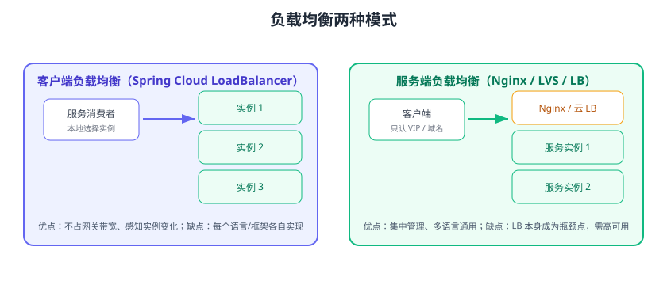

# 负载均衡

负载均衡（Load Balancing）解决的是**“多个服务实例，请求选谁”**的问题。微服务里每个服务都有多个实例，客户端或网关需要按一定策略把流量分摊到各个实例，既提升吞吐，也避免单实例过载。本页覆盖客户端负载均衡（Spring Cloud LoadBalancer）与服务端负载均衡（Nginx/云 LB）两种模式。



## 两种模式对比

| 维度 | 客户端负载均衡 | 服务端负载均衡 |
| --- | --- | --- |
| 位置 | 消费者内部（LoadBalancer） | 独立组件（Nginx/LB） |
| 数据来源 | 从注册中心拉实例列表 | 静态配置或对接注册中心 |
| 多语言 | 每种语言各自实现 | 语言无关 |
| 故障感知 | 实时（注册中心推送） | 依赖健康检查/被动摘除 |
| 瓶颈 | 无中心节点 | LB 自身是高可用要点 |
| 代表 | Spring Cloud LoadBalancer | Nginx、LVS、云 SLB/ALB |

## 常见负载均衡策略

| 策略 | 原理 | 适用 |
| --- | --- | --- |
| 轮询（Round Robin） | 依次轮流 | 实例配置相同、无状态服务 |
| 加权轮询（Weighted） | 按权重分配 | 实例性能不同、灰度放量 |
| 随机（Random） | 随机选择 | 简单场景 |
| 最少连接（Least Connections） | 选当前连接最少的 | 长连接、耗时差异大 |
| 一致性哈希（Consistent Hash） | 按 key 哈希选实例 | 有状态服务、缓存亲和 |
| 响应时间加权 | 快的多分流量 | 高性能场景 |

## Spring Cloud LoadBalancer

Spring Cloud 2020 起用 **LoadBalancer** 取代已停止维护的 Ribbon，默认策略为轮询，支持扩展。

### 基础用法

```java
@Configuration
public class RestConfig {
    @Bean
    @LoadBalanced
    public RestTemplate restTemplate() {
        return new RestTemplate();
    }
}
```

调用时用服务名：

```java
String result = restTemplate.getForObject(
    "http://inventory-service/inventory/1", String.class);
```

### OpenFeign 声明式调用

```java
@FeignClient(name = "inventory-service")
public interface InventoryClient {
    @GetMapping("/inventory/{id}")
    String getInventory(@PathVariable("id") Long id);
}
```

Feign 底层也走 LoadBalancer 选择实例。

### 自定义负载均衡策略

```java
public class WeightedRandomServiceInstanceListSupplier
        implements ServiceInstanceListSupplier {
    private final ServiceInstanceListSupplier delegate;
    // 按实例权重随机选择，权重来自注册中心元数据
    @Override
    public Flux<List<ServiceInstance>> get() {
        return delegate.get().map(instances -> pick(instances));
    }
}

@Configuration
public class LoadBalancerConfig {
    @Bean
    public ServiceInstanceListSupplier discoveryClientSupplier(
            ConfigurableApplicationContext context) {
        return ServiceInstanceListSupplier.builder()
                .withDiscoveryClient()
                .withHints()      // 配合 hints 做区域亲和
                .build(context);
    }
}
```

### 按服务定制策略

```yaml
spring:
  cloud:
    loadbalancer:
      configurations:
        order-service:    # 仅对 order-service 生效
          - Weighted
```

## 服务端负载均衡（Nginx）

微服务入口层常用 Nginx 做服务端负载均衡，配置示例：

```nginx [nginx.conf]
upstream order_cluster {
    least_conn;                        # 最少连接
    server 10.0.0.11:8081 weight=2;    # 权重 2
    server 10.0.0.12:8081 weight=1;
    server 10.0.0.13:8081 backup;      # 备用节点
}

server {
    listen 80;
    location /api/order/ {
        proxy_pass http://order_cluster;
        proxy_set_header Host $host;
        proxy_set_header X-Real-IP $remote_addr;
    }
}
```

更完整的 Nginx 负载均衡与反向代理配置见 [Nginx 负载均衡](../../../Ops/Nginx/LoadBalance/index.md)。

## 网关 + 负载均衡的协作

```text
客户端 → Nginx（服务端 LB，多网关实例）→ Spring Cloud Gateway（lb:// 客户端 LB）→ 业务实例
```

一层负责入口高可用，一层负责业务服务发现，各司其职。

## 易错点与最佳实践

::: danger 常见错误
1. **Ribbon 与 LoadBalancer 混用**：Spring Cloud 2020+ 默认 LoadBalancer，旧 Ribbon 依赖会造成冲突。
2. **有状态服务用轮询**：Session 或本地缓存场景轮询会丢状态；应一致性哈希或把状态外置（Redis）。
3. **实例权重不校验**：权重配错导致流量倾斜，压垮某个实例。
4. **健康检查缺失**：Nginx 只按配置转发，后端挂掉仍会转发，需 `proxy_next_upstream` 或主动健康检查。
5. **本地缓存过期不更新**：客户端 LB 缓存实例列表，注册中心变更后要能刷新（Nacos 推送机制）。
6. **重试导致重复请求**：开启重试要评估接口幂等性，否则下单/支付被重复执行。
:::

::: tip 最佳实践
1. 无状态服务优先轮询/加权轮询；有状态服务用一致性哈希。
2. 实例启动后延迟几秒再放流量（预热），避免刚启动就扛高并发。
3. 客户端 LB 场景，注册中心必须配置多个节点，避免单点。
4. 监控每个实例的 QPS、错误率、响应时间，及时调整权重。
5. 幂等接口才开自动重试，重试间隔用指数退避。
:::

## 验证方式

1. 启动 order-service 两个实例（不同端口），从消费者连续调用 10 次，观察两个实例的访问日志数量接近（轮询）。
2. 停掉一个实例，注册中心摘除后，新请求全部打到存活实例。
3. 修改权重（如 2:1），压测确认流量比例约 2:1。
4. Nginx 场景：停掉一个后端，确认 `backup` 或健康检查自动兜底。

## 参考资料

- Spring Cloud LoadBalancer 文档：https://docs.spring.io/spring-cloud-commons/reference/spring-cloud-commons/loadbalancer.html
- OpenFeign 文档：https://docs.spring.io/spring-cloud-openfeign/reference/
- Nginx 负载均衡文档：https://nginx.org/en/docs/http/load_balancing.html
- 负载均衡模式（microservices.io）：https://microservices.io/patterns/server-side-discovery.html
