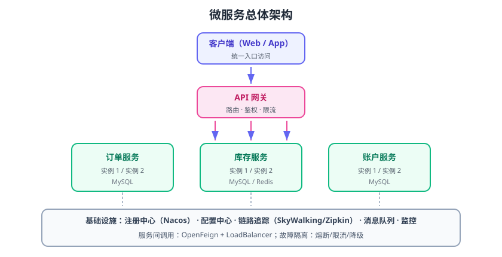

# 实战：订单-库存-账户微服务

本实战把前面几页的组件串起来，搭建一个最小的电商下单微服务系统：**网关 + 注册中心 + 配置中心 + 三个业务服务 + 分布式事务**，并用 Docker Compose 一键启动。按步骤做完，你就有了一套可复用的微服务骨架。



## 架构总览

```text
客户端 → Spring Cloud Gateway (8080)
            ├── /api/order/**     → order-service (8081)
            ├── /api/inventory/** → inventory-service (8082)
            └── /api/account/**   → account-service (8083)
基础设施：Nacos (8848, 注册+配置) + Seata Server (8091) + MySQL (3306)
```

## 环境要求

::: info 当前使用的版本
- JDK 17+（Nacos 3.x 客户端要求 Java 8+，服务端要求 17）
- Maven 3.8+
- Docker + Docker Compose
- Spring Boot 3.5.x + Spring Cloud 2025.0.x + Spring Cloud Alibaba 2025.0.0.0
- Nacos 3.2.x + Seata 2.6.x
:::

## 第一步：启动基础设施

```yaml [docker-compose.yml]
services:
  mysql:
    image: mysql:8.4
    container_name: ms-mysql
    ports: ["3306:3306"]
    environment:
      MYSQL_ROOT_PASSWORD: root123
      MYSQL_DATABASE: shop
    command: --default-authentication-plugin=mysql_native_password
    volumes: [mysql-data:/var/lib/mysql]
  nacos:
    image: nacos/nacos-server:v3.2.4
    container_name: ms-nacos
    ports: ["8848:8848", "9848:9848"]
    environment:
      MODE: standalone
  seata-server:
    image: apache/seata-server:2.6.0
    container_name: ms-seata
    ports: ["8091:8091"]
    environment:
      SEATA_IP: 127.0.0.1
      SEATA_PORT: 8091
      STORE_MODE: file
volumes:
  mysql-data:
```

```shell
docker compose up -d
```

访问 http://localhost:8848/nacos（`nacos/nacos`）确认 Nacos 正常。

## 第二步：初始化数据库

三个服务各自建库建表，演示“数据库按服务拆分”：

```sql [init.sql]
CREATE DATABASE IF NOT EXISTS order_db;
CREATE DATABASE IF NOT EXISTS inventory_db;
CREATE DATABASE IF NOT EXISTS account_db;

-- 订单库
USE order_db;
CREATE TABLE orders (
    id BIGINT AUTO_INCREMENT PRIMARY KEY,
    order_no VARCHAR(64) UNIQUE NOT NULL,
    user_id BIGINT NOT NULL,
    amount DECIMAL(10,2) NOT NULL,
    status VARCHAR(16) NOT NULL DEFAULT 'CREATED'
);
-- 分布式事务回滚日志（Seata AT 模式必需）
CREATE TABLE undo_log (
    id BIGINT AUTO_INCREMENT PRIMARY KEY,
    branch_id BIGINT NOT NULL,
    xid VARCHAR(128) NOT NULL,
    context VARCHAR(128),
    rollback_info LONGBLOB,
    log_status INT,
    log_created DATETIME,
    log_modified DATETIME,
    UNIQUE KEY ux_undo_log (xid, branch_id)
);

-- 库存库
USE inventory_db;
CREATE TABLE inventory (
    id BIGINT AUTO_INCREMENT PRIMARY KEY,
    product_id BIGINT NOT NULL,
    stock INT NOT NULL
);
INSERT INTO inventory (product_id, stock) VALUES (1, 100);
CREATE TABLE undo_log LIKE order_db.undo_log;

-- 账户库
USE account_db;
CREATE TABLE account (
    id BIGINT AUTO_INCREMENT PRIMARY KEY,
    user_id BIGINT NOT NULL,
    balance DECIMAL(10,2) NOT NULL
);
INSERT INTO account (user_id, balance) VALUES (1, 1000.00);
CREATE TABLE undo_log LIKE order_db.undo_log;
```

## 第三步：公共依赖与父 POM

```xml [pom.xml]
<parent>
    <groupId>org.springframework.boot</groupId>
    <artifactId>spring-boot-starter-parent</artifactId>
    <version>3.5.4</version>
</parent>
<properties>
    <spring-cloud.version>2025.0.0</spring-cloud.version>
    <spring-cloud-alibaba.version>2025.0.0.0</spring-cloud-alibaba.version>
</properties>
<dependencyManagement>
    <dependencies>
        <dependency>
            <groupId>org.springframework.cloud</groupId>
            <artifactId>spring-cloud-dependencies</artifactId>
            <version>${spring-cloud.version}</version>
            <type>pom</type>
            <scope>import</scope>
        </dependency>
        <dependency>
            <groupId>com.alibaba.cloud</groupId>
            <artifactId>spring-cloud-alibaba-dependencies</artifactId>
            <version>${spring-cloud-alibaba.version}</version>
            <type>pom</type>
            <scope>import</scope>
        </dependency>
    </dependencies>
</dependencyManagement>
```

## 第四步：order-service

```xml [order-service/pom.xml 关键依赖]
<dependency>
    <groupId>org.springframework.boot</groupId>
    <artifactId>spring-boot-starter-web</artifactId>
</dependency>
<dependency>
    <groupId>com.alibaba.cloud</groupId>
    <artifactId>spring-cloud-starter-alibaba-nacos-discovery</artifactId>
</dependency>
<dependency>
    <groupId>com.alibaba.cloud</groupId>
    <artifactId>spring-cloud-starter-alibaba-nacos-config</artifactId>
</dependency>
<dependency>
    <groupId>io.seata</groupId>
    <artifactId>seata-spring-boot-starter</artifactId>
    <version>2.6.0</version>
</dependency>
<dependency>
    <groupId>org.springframework.cloud</groupId>
    <artifactId>spring-cloud-starter-openfeign</artifactId>
</dependency>
```

```yaml [order-service/application.yml]
server:
  port: 8081
spring:
  application:
    name: order-service
  config:
    import: optional:nacos:order-service.yaml
  cloud:
    nacos:
      discovery:
        server-addr: localhost:8848
seata:
  tx-service-group: default_tx_group
```

核心代码：

```java [OrderService.java]
@Service
public class OrderService {
    @Autowired private OrderDao orderDao;
    @Autowired private InventoryClient inventoryClient;
    @Autowired private AccountClient accountClient;

    @GlobalTransactional(name = "create-order", rollbackFor = Exception.class)
    public void createOrder(Long userId, Long productId, BigDecimal amount) {
        String orderNo = "ORD-" + System.currentTimeMillis();
        orderDao.insert(new Order(orderNo, userId, amount, "CREATED"));
        inventoryClient.deduct(productId, 1);          // 扣库存（远程）
        accountClient.deduct(userId, amount);          // 扣余额（远程）
    }
}

@FeignClient(name = "inventory-service")
public interface InventoryClient {
    @PostMapping("/inventory/deduct")
    void deduct(@RequestParam Long productId, @RequestParam int count);
}

@FeignClient(name = "account-service")
public interface AccountClient {
    @PostMapping("/account/deduct")
    void deduct(@RequestParam Long userId, @RequestParam BigDecimal amount);
}
```

inventory-service 与 account-service 结构相同（各自端口 8082/8083、各自的表与 Feign 接口），本地方法加 `@Transactional` 即可被 Seata 接管。

## 第五步：网关

```yaml [gateway/application.yml]
server:
  port: 8080
spring:
  application:
    name: gateway
  cloud:
    nacos:
      discovery:
        server-addr: localhost:8848
    gateway:
      routes:
        - id: order-route
          uri: lb://order-service
          predicates: [Path=/api/order/**]
          filters: [StripPrefix=2]
        - id: inventory-route
          uri: lb://inventory-service
          predicates: [Path=/api/inventory/**]
          filters: [StripPrefix=2]
        - id: account-route
          uri: lb://account-service
          predicates: [Path=/api/account/**]
          filters: [StripPrefix=2]
```

## 第六步：验证全流程

### 1. 服务注册

```shell
docker compose ps          # 4 个基础设施容器 Running
```

Nacos 控制台「服务列表」应显示 `order-service`、`inventory-service`、`account-service`、`gateway` 四个服务。

### 2. 发起下单

```shell
curl -X POST http://localhost:8080/api/order/create \
  -H "Content-Type: application/json" \
  -d '{"userId":1,"productId":1,"amount":100}'
```

检查三张表：

```sql
SELECT * FROM order_db.orders;      -- 1 条 CREATED
SELECT * FROM inventory_db.inventory;  -- stock 100 → 99
SELECT * FROM account_db.account;   -- balance 1000 → 900
```

### 3. 故障回滚演练

把库存设为 0 再下单：`UPDATE inventory SET stock = 0;` 调用接口后确认：

- 接口返回异常；
- `orders` 表**没有新增**记录；
- `account` 表余额**没有扣减**。

说明 Seata AT 模式把跨服务事务全部回滚了。

### 4. 多实例与负载均衡

```shell
java -jar order-service.jar --server.port=8084
```

启动第二个订单实例后，Nacos 显示 2 个实例；通过网关连续调用，观察两个实例日志均有请求（轮询）。

## 进阶收尾

1. 给接口加 [熔断降级](../CircuitBreaker/index.md)：库存服务故障时返回降级 JSON。
2. 接入 [链路追踪](../Tracing/index.md)：SkyWalking Agent 无侵入接入四个服务。
3. 接入 [配置中心](../ConfigCenter/index.md)：把下单超时、限流阈值放到 Nacos 动态调整。
4. 把下单事件发到 [消息队列](../../MessageQueue/index.md)，实现异步扣库存与消费幂等。

## 参考资料

- Spring Cloud Alibaba 版本说明：https://sca.aliyun.com/docs/2025.x/overview/version-explain/
- Seata AT 模式文档：https://seata.apache.org/docs/user/mode/at/
- Nacos Docker 部署：https://nacos.io/en/docs/latest/quickstart/quick-start-docker/
- 本专题其余章节：回到 [微服务目录](../index.md)
