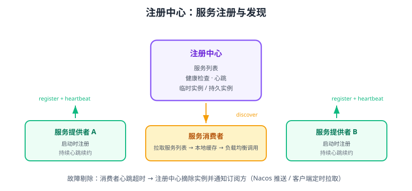

# 注册中心

注册中心（Registry / Service Registry）是微服务的**“通讯录”**：服务提供者启动时把地址（IP + 端口）登记上去，服务消费者从这里拿到可用的实例列表并调用。它解决的核心问题是：**在实例动态伸缩、随时可能宕机的情况下，客户端如何找到健康的目标服务**。



## 为什么需要注册中心

微服务实例是动态的：弹性扩容会新增实例、发布重启会更换实例、故障会被摘除。如果客户端把地址写死：

- 实例扩容后新地址没人知道；
- 实例宕机后调用还在打旧地址，接口直接失败；
- 无法做流量分配与故障剔除。

注册中心提供三种能力：**注册（Register）、发现（Discover）、健康检查（Health Check）**。

## 核心概念

| 概念 | 说明 |
| --- | --- |
| 服务名 | 逻辑名称，如 `order-service`，客户端按名字找服务，不关心具体地址 |
| 实例 | 一个运行中的服务进程，注册项包含 IP、端口、元数据（版本、权重） |
| 临时实例 | 心跳续约，超时自动摘除（如 Nacos 的 `ephemeral=true`） |
| 持久实例 | 不依赖心跳，由服务端健康检查判定（如 Nacos 的 `ephemeral=false`） |
| 心跳/续约 | 实例周期性上报存活状态 |
| 订阅/推送 | 服务列表变化时通知消费者（Nacos 推送 / 客户端轮询） |
| 负载均衡数据源 | 消费者拿到实例列表后交给 LoadBalancer 选择目标 |

## 主流实现对比

| 组件 | 最新版本 | 一致性 | 特性 |
| --- | --- | --- | --- |
| Nacos | 3.2.x（2026-08） | AP，临时实例注册即最终一致 | 注册中心 + 配置中心一体，支持 gRPC 长连接、服务分级、双写迁移 |
| Eureka | 2.x（已停止开发） | AP | 经典 Netflix 组件，**已停止维护**，不建议新项目使用 |
| Consul | 1.x | CP | HashiCorp 出品，强一致，天然支持多数据中心 |
| ZooKeeper | 3.9.x | CP | 分布式协调器，可作注册中心，但临时节点机制与心跳模型较原始 |

::: info 版本说明
Nacos 3.x 于 2025 年发布，重新设计了内核（Java 17+，gRPC 长连接），Spring Cloud Alibaba 2025.x 默认对接 Nacos 3.x；Nacos 2.5.x 仍供存量环境使用。Eureka 已停止维护，仅存量项目保留。
:::

## 服务发现两种模型

### 客户端发现

消费者自己从注册中心拉取实例列表，本地缓存，用 LoadBalancer 选择实例直连：

```text
消费者 → 注册中心（拉列表）→ 本地缓存 → 选实例 → 直接调用
```

代表：Nacos + Spring Cloud LoadBalancer、Eureka + Ribbon。优点是去中心化、少一跳；缺点是每个语言/框架都要实现。

### 服务端发现

消费者只访问负载均衡器（如 K8s Service、云 LB），由它查询注册信息并转发：

```text
消费者 → LB（查询注册中心）→ 转发到实例
```

代表：Kubernetes Service + kube-proxy、AWS ALB。优点是客户端无感知；缺点是 LB 是中心节点，需高可用。

## Nacos 快速上手

### 启动 Nacos

```shell [docker-compose.yml]
services:
  nacos:
    image: nacos/nacos-server:v3.2.4
    container_name: nacos
    ports:
      - "8848:8848"   # HTTP/gRPC 服务端口
      - "9848:9848"   # gRPC 客户端端口（3.x 必需）
    environment:
      MODE: standalone
```

```shell
docker compose up -d
```

启动后访问 http://localhost:8848/nacos，默认账号 `nacos / nacos`，服务列表页应能看到已注册的服务。

### Spring Boot 服务接入

```xml [pom.xml]
<dependency>
    <groupId>com.alibaba.cloud</groupId>
    <artifactId>spring-cloud-starter-alibaba-nacos-discovery</artifactId>
</dependency>
```

```yaml [application.yml]
spring:
  application:
    name: order-service
  cloud:
    nacos:
      discovery:
        server-addr: localhost:8848
```

启动两个不同端口的 `order-service` 实例（`--server.port=8081` / `--server.port=8082`），在 Nacos 控制台「服务管理 → 服务列表」中应看到 `order-service` 下有两个健康实例。

### 消费者调用

```java
@RestController
public class OrderController {
    // 服务名调用：LoadBalancer 自动选一个健康实例
    @Autowired
    private RestTemplate restTemplate;

    @GetMapping("/order/inventory")
    public String getInventory() {
        return restTemplate.getForObject(
            "http://inventory-service/inventory/1", String.class);
    }
}
```

`RestTemplate` 需要加 `@LoadBalanced` 注解：

```java
@Configuration
public class RestConfig {
    @Bean
    @LoadBalanced
    public RestTemplate restTemplate() {
        return new RestTemplate();
    }
}
```

## 健康检查与故障剔除

| 机制 | 说明 |
| --- | --- |
| 心跳续约 | 临时实例默认每 5 秒发一次心跳，15 秒无心跳标记不健康，30 秒剔除 |
| 服务端探测 | 持久实例由 Nacos 定期 HTTP 探测健康接口 |
| 下线通知 | 实例变化通过 gRPC 长连接推送给订阅方，客户端本地缓存同步更新 |
| 自我保护 | 网络分区时避免误删大量实例（类似 Eureka 的自我保护模式） |

## 集群部署

生产环境 Nacos 至少 3 节点，使用内置 Raft（3.x 默认）或对接 MySQL 持久化：

```yaml [docker-compose-nacos-cluster.yml]
services:
  nacos1:
    image: nacos/nacos-server:v3.2.4
    ports: ["8848:8848", "9848:9848"]
    environment:
      NACOS_SERVERS: "nacos1:8848,nacos2:8848,nacos3:8848"
  nacos2:
    image: nacos/nacos-server:v3.2.4
    ports: ["8849:8848", "9849:9848"]
    environment:
      NACOS_SERVERS: "nacos1:8848,nacos2:8848,nacos3:8848"
  nacos3:
    image: nacos/nacos-server:v3.2.4
    ports: ["8850:8848", "9850:9848"]
    environment:
      NACOS_SERVERS: "nacos1:8848,nacos2:8848,nacos3:8848"
```

客户端 `server-addr` 配置多个地址逗号分隔：

```yaml
server-addr: nacos1:8848,nacos2:8848,nacos3:8848
```

## 易错点与最佳实践

::: danger 常见错误
1. **客户端地址写死 IP**：没有走注册中心，实例变化即断链。
2. **服务名不一致**：消费者写 `orderService`，提供者注册 `order-service`，永远发现不了。
3. **忽略 gRPC 端口**：Nacos 3.x 客户端要用 9848 端口通信，防火墙只放行 8848 会连接失败。
4. **临时实例误配为持久实例**：普通服务应默认临时实例，持久实例适合固定基础设施。
5. **注册中心单点**：Nacos 只有 1 个节点，注册中心一挂，新实例无法注册、旧实例无法续约。
6. **自我保护被误关闭**：极端网络抖动时批量摘除健康实例，引发雪崩。
:::

::: tip 最佳实践
1. 客户端配置**全部节点地址**，故障自动切换。
2. 给实例打元数据（版本、环境、权重），配合灰度发布。
3. 服务名统一规范：`业务域-服务名`，如 `order-service`。
4. 监控注册中心节点健康、实例数异常波动与服务列表变更。
:::

## 验证方式

1. Nacos 控制台确认两个 `order-service` 实例均为健康。
2. 手动停掉一个实例，30 秒内观察控制台实例被摘除，消费者调用自动切到存活实例。
3. 启动第三个实例，观察消费者新请求是否被路由到新实例（配合 LoadBalancer）。

## 参考资料

- Nacos 官方文档：https://nacos.io/en/docs/latest/overview/
- Nacos 3.x 发布说明：https://github.com/alibaba/nacos/releases
- Spring Cloud Alibaba 文档：https://sca.aliyun.com/
- 服务发现模式（microservices.io）：https://microservices.io/patterns/service-discovery.html
- Eureka 停止维护说明：https://github.com/Netflix/eureka/wiki

::: tip 相关文档
注册中心的 Spring Cloud 落地细节（Nacos 命名空间/分组/权重、Eureka/Consul 对照、健康检查坑位）见 [Spring Cloud 专题：服务注册与发现](../SpringCloud/Discovery/index.md)。
:::
