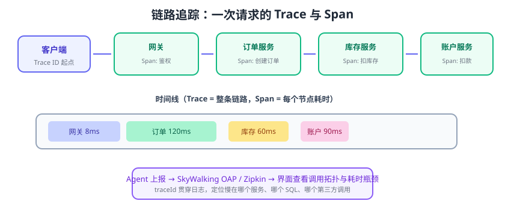

# 链路追踪

链路追踪（Distributed Tracing）解决微服务排障的“**黑盒问题**”：一次请求要经过网关、订单、库存、账户等多个服务，任何一个环节变慢，传统日志都看不出慢在哪。链路追踪给每个请求一个 **traceId**，把跨服务的调用串成一条完整的“时间线”，一眼定位瓶颈服务、慢 SQL、慢第三方调用。



## 核心概念

| 概念 | 说明 |
| --- | --- |
| Trace | 一次业务请求贯穿所有服务的完整调用链 |
| Span | 调用链上的一个节点（一个服务调用/一次 SQL），记录开始结束时间 |
| traceId | 整条链路的唯一 ID，贯穿所有服务与日志 |
| spanId | 单个 Span 的 ID，通过 parentId 形成父子关系 |
| 采样 | 按比例只上报部分链路（如 10%），控制存储成本 |
| Baggage | 随链路传递的业务上下文（如用户 ID），注意滥用会放大流量 |

## 为什么需要链路追踪

```text
用户反馈：下单很慢（5 秒）
单体时代：看这一个应用日志即可
微服务时代：网关 200ms + 订单 800ms + 库存 3s + 账户 500ms + 数据库 400ms
没有 traceId：每台机器日志各查各的，拼不出完整链路
```

链路追踪把散落在各服务的日志用 traceId 关联，并可视化展示每段耗时。

## 技术选型

| 方案 | 特点 |
| --- | --- |
| Micrometer Tracing + Zipkin | Spring Cloud 官方方案，Java 生态集成最顺，轻量 |
| SkyWalking | 国产开源 APM，Java Agent 无侵入接入，含拓扑、告警，功能全 |
| Jaeger | CNCF 项目，云原生，与 Prometheus/Grafana 生态结合好 |
| OpenTelemetry | 标准化的埋点与导出规范，各方案均可接入（OTLP） |

::: info 版本说明
截至 2026 年 8 月，Apache SkyWalking 最新稳定版为 **11.0.0**（2026-08 发布）；Zipkin 仍为 Java 生态常用选择；OpenTelemetry 作为统一埋点标准被主流 APM 支持。
:::

## 方案一：Micrometer Tracing + Zipkin

### 依赖

```xml [pom.xml]
<dependency>
    <groupId>io.micrometer</groupId>
    <artifactId>micrometer-tracing-bridge-brave</artifactId>
</dependency>
<dependency>
    <groupId>io.zipkin.reporter2</groupId>
    <artifactId>zipkin-reporter-brave</artifactId>
</dependency>
<dependency>
    <groupId>org.springframework.boot</groupId>
    <artifactId>spring-boot-starter-actuator</artifactId>
</dependency>
```

### 配置

```yaml [application.yml]
management:
  tracing:
    sampling:
      probability: 1.0          # 采样率：生产建议 0.1（10%）
  zipkin:
    tracing:
      endpoint: http://localhost:9411/api/v2/spans
```

### 启动 Zipkin

```shell
docker run -d -p 9411:9411 openzipkin/zipkin
```

所有接入的服务共用同一个 Zipkin 地址，请求跨服务时 traceId 自动透传，控制台（http://localhost:9411）即可看到调用链。

### 在日志中打印 traceId

```yaml
logging:
  pattern:
    level: "%5p [${spring.application.name:},%X{traceId:-},%X{spanId:-}]"
```

日志输出示例：

```text
INFO [order-service,abc1234567890,abc1234567890] 创建订单成功
```

这样同一 traceId 的日志可以用 `grep abc1234567890` 跨服务聚合排查。

## 方案二：SkyWalking

SkyWalking 通过 **Java Agent 无侵入接入**：不改代码，Java 启动参数加一行即可。

```shell
java -javaagent:/path/to/skywalking-agent.jar \
     -Dskywalking.agent.service_name=order-service \
     -jar order-service.jar
```

```yaml [docker-compose-skywalking.yml]
services:
  oap:
    image: apache/skywalking-oap-server:11.0.0
    ports: ["11800:11800", "12800:12800"]
  ui:
    image: apache/skywalking-ui:11.0.0
    ports: ["8080:8080"]
    environment:
      SW_OAP_ADDRESS: http://oap:12800
```

访问 http://localhost:8080 可看到：服务拓扑图、调用链路、慢 SQL、端点耗时排行。

## 采样策略

| 策略 | 说明 | 适用 |
| --- | --- | --- |
| 全量采样 | 每条链路都上报 | 测试环境、问题排查期 |
| 固定比例 | 如 10% 随机采样 | 生产默认，控制成本 |
| 动态采样 | 慢请求全采、正常请求降采样 | 大流量场景 |
| 错误全采 | 失败链路 100% 采样 | 排障兜底 |

::: tip 生产建议
生产环境 100% 采样会带来可观存储与带宽成本；常用「10% 采样 + 错误/慢请求全采」组合，既能保证问题可查，成本可控。
:::

## traceId 与日志、告警联动

1. **日志聚合**：日志系统按 traceId 索引，点击 traceId 跳转完整调用链。
2. **告警联动**：链路中某 Span 错误率超阈值 → 告警 → 从告警直接打开该 traceId 链路。
3. **压测分析**：压测报告里挑慢请求看 Span，定位是网关、服务还是 DB。

## 易错点与最佳实践

::: danger 常见错误
1. **只接入部分服务**：链路断在半路，看不到全貌；所有入口与核心服务必须统一接入。
2. **traceId 不透传**：用线程池/异步调用时上下文丢失，链路断裂；要使用 TraceContext 透传（如 `ExecutorService` 包装）。
3. **采样率 100% 且无保留策略**：存储暴涨，随后被迫删数据，历史链路查不到。
4. **跨系统不传递 traceId**：调用第三方/MQ 时也应在 Header/消息属性里透传 traceId。
5. **把链路追踪当监控全部**：还需要 Metrics（Prometheus）与 Logs（ELK/Loki），三者配合才是完整可观测性。
6. **Baggage 滥用**：在 Span 里塞大对象，跨服务传递放大带宽。
:::

::: tip 最佳实践
1. 统一接入 OpenTelemetry SDK 或 Agent，避免各服务埋点方式不一致。
2. 入口（网关/Controller）显式生成或透传 traceId，日志输出带上 traceId。
3. 给核心 Span 打标签：SQL、HTTP URL、Redis key，方便定位。
4. 异步线程池场景用包装线程池保留上下文。
5. 定期演练：用压测制造慢请求，验证链路图与瓶颈定位是否准确。
:::

## 验证方式

1. 启动 Zipkin/SkyWalking，依次调用下单接口，控制台应出现包含网关、订单、库存、账户的完整链路。
2. 人为在库存服务加 2 秒延迟，观察链路图中该 Span 耗时突出。
3. 用日志中的 traceId 反查，确认跨服务日志可按 traceId 聚合。
4. 修改采样率为 10%，确认上报量下降且链路仍可抽样。

## 相关专题

- [监控告警专题](../../../Ops/Monitoring/index.md)：指标、日志、链路三大支柱的完整可观测性体系
- [日志监控](../../../Ops/Monitoring/LogMonitoring/index.md)：日志与链路通过 traceId 关联的实践

## 参考资料

- Micrometer Tracing 文档：https://micrometer.io/docs/tracing
- Zipkin 文档：https://zipkin.io/
- Apache SkyWalking 文档：https://skywalking.apache.org/docs/
- OpenTelemetry 文档：https://opentelemetry.io/docs/
- 可观测性三大支柱（Metrics/Logs/Traces）：https://opentelemetry.io/docs/concepts/observability-primer/

::: tip 相关文档
Micrometer Tracing 的 Spring Cloud 接入（依赖、采样率、日志 traceId、跨线程上下文丢失坑位）见 [Spring Cloud 专题：链路追踪与可观测性](../SpringCloud/Tracing/index.md)。
:::
