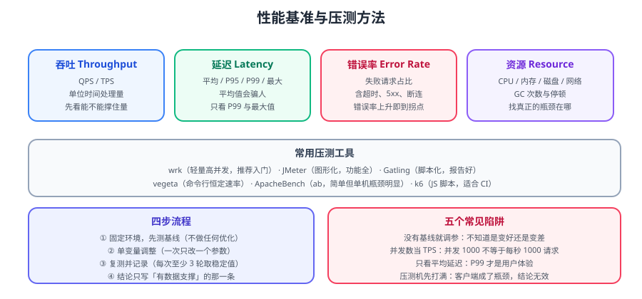

# 性能基准与压测

「我优化了代码，性能提升了 30%」——**没有基线的性能结论都是猜测**。本篇给出网络服务压测的完整方法：指标定义、工具选型、四步流程、常见陷阱，以及一份可复制的压测脚本。



::: tip 一句话理解
压测的本质是**「控制变量 + 可重复」**：
固定环境测出基线，一次只改一个变量，每轮至少跑三次取稳定值，结论只写有数据支撑的部分。
:::

## 一、指标：先定义，再测量

| 指标 | 定义 | 为什么重要 |
| --- | --- | --- |
| **吞吐（Throughput）** | 单位时间成功处理的请求数（QPS/TPS） | 决定系统能承载多少业务量 |
| **延迟（Latency）** | 请求从发出到收到响应的耗时 | 决定用户体验 |
| **错误率** | 失败请求 / 总请求 | 超过阈值说明已到容量拐点 |
| **资源占用** | CPU、内存、磁盘 IO、网络带宽、GC | 定位真正的瓶颈 |

### 1.1 延迟必须看分位数，不能只看平均

```text
示例：100 个请求，99 个 10ms，1 个 3000ms
  平均延迟 = (99×10 + 3000) / 100 = 39.9ms   ← 看起来还行
  P99     = 3000ms                            ← 每 100 个用户有 1 个等 3 秒
```

::: danger 平均延迟是最有欺骗性的指标
- 平均值会被**极小值拉低**，掩盖长尾。
- 用户体验由**长尾**决定：P95、P99、P999、最大值。
- **报告延迟必须同时给出 P50 / P95 / P99 / Max**，只给平均值等于没说。
:::

### 1.2 吞吐与延迟的关系：拐点

```text
低并发阶段：吞吐随并发线性上升，延迟平稳
   ↓
拐点（饱和点）：吞吐不再上升，延迟开始陡增，错误率上升
   ↓
过载阶段：吞吐下降（排队/超时），延迟爆炸
```

**压测的目标就是找到这个拐点**，并确认业务量在拐点之下留有余量。

::: info 并发数 ≠ TPS
很多人把「并发 1000」当成「每秒 1000 请求」，这是错的。
- **并发数**：同时在处理的请求数（如 1000 个连接）；
- **吞吐**：单位时间完成数。
若每个请求耗时 100ms，1000 并发最多 ≈ 10000 QPS。
**关系**：`吞吐 ≈ 并发 / 平均响应时间`（利特尔法则）。
:::

## 二、工具选型

| 工具 | 优点 | 缺点 | 适用 |
| --- | --- | --- | --- |
| **wrk** | 轻量、高并发、脚本灵活 | 报告简单 | 快速基线测试 |
| **JMeter** | 图形化、协议支持全 | 重、单机并发有上限 | 复杂场景、团队协作 |
| **Gatling** | 脚本化、报告漂亮 | 需学 Scala/DSL | 持续压测 |
| **vegeta** | 命令行、恒定速率 | 功能较基础 | CI 集成、简单验证 |
| **k6** | JS 脚本、易进 CI | 生态较新 | 自动化压测 |
| **ab（ApacheBench）** | 最简单 | 单机瓶颈明显 | 单接口粗测 |

::: warning 压测机常常先成为瓶颈
单机 `wrk` 在几万 QPS 下可能自己先打满 CPU/端口。
**判断方法**：压测机的 CPU 与网络是否接近饱和？若是，结论不可信。
**对策**：多台压测机、或使用云压测服务。
:::

## 三、四步流程

### 3.1 第一步：固定环境，测基线

```bash
# 记录环境（写进报告，否则结论不可复现）
uname -a
nproc
free -h
java -version        # 若是 Java 服务
```

```bash
# wrk 基线：4 线程、200 连接、持续 60 秒
wrk -t4 -c200 -d60s --latency http://127.0.0.1:8080/api/ping
```

预期输出解读：

```text
Running 1m test @ http://127.0.0.1:8080/api/ping
  4 threads and 200 connections
  Thread Stats   Avg      Stdev     Max   +/- Stdev
    Latency     1.85ms    1.20ms  45.20ms   92.31%
    Req/Sec    27.31k     2.10k   34.56k    75.00%
  Latency Distribution
     50%    1.62ms
     75%    2.10ms
     90%    2.85ms
     99%    6.40ms          ← 关注这里
  6523121 requests in 1.00m, 1.02GB read
Requests/sec: 108718.69     ← 吞吐
Transfer/sec:     17.35MB
```

::: tip 基线必须「什么都没优化」
基线的作用是**参照物**。若基线本身就叠加了若干优化，后续无法判断每项优化的真实收益。
**做法**：先把代码恢复到未优化状态（或使用 main 分支的版本）测一次。
:::

### 3.2 第二步：单变量调整

```text
待验证的变量示例：
- worker 线程数：8 → 16
- TCP_NODELAY：关 → 开
- 启用 epoll 原生传输
- 连接池大小：50 → 100
- 序列化：JSON → Protobuf
```

**铁律**：**一次只改一个**。同时改两个，无法归因。

```bash
# 每轮跑 3 次，取中位数，避免单次抖动
for i in 1 2 3; do
  wrk -t4 -c200 -d60s --latency http://127.0.0.1:8080/api/ping | tail -3
  echo "--- round $i done ---"
done
```

### 3.3 第三步：记录结果

| 轮次 | 变量 | QPS | P99 | 错误率 | CPU |
| --- | --- | --- | --- | --- | --- |
| 基线 | — | 108718 | 6.4ms | 0% | 62% |
| A | 线程 8→16 | 121300 | 6.1ms | 0% | 81% |
| B | 开 TCP_NODELAY | 112400 | 5.2ms | 0% | 63% |
| C | Protobuf | 140500 | 4.8ms | 0% | 65% |

::: warning 表格里必须留「CPU」
没有资源数据的压测结果无法解释。
**「QPS 提升了」但 CPU 也涨到 95%**——这不是优化，只是把余量用掉了。
:::

### 3.4 第四步：得出结论

**结论只写有数据支撑的那一条**：

```text
结论：在 200 并发下，将序列化从 JSON 换为 Protobuf 使 QPS 从 108.7k 提升到 140.5k（+29%），
      P99 从 6.4ms 降到 4.8ms，CPU 从 62% 升到 65%，资源代价可接受。
      worker 线程从 8 提到 16 收益有限（+11.6%）且 CPU 升至 81%，暂不采纳。
```

::: danger 不要写「性能大幅提升」
「大幅」「显著」「明显」都是**无信息量的词**。
必须写：**基线值 → 优化后值 → 变化幅度 → 代价**。
:::

## 四、不同层次的压测

| 层次 | 目的 | 工具 | 特点 |
| --- | --- | --- | --- |
| **微基准** | 测一个方法/算法的性能 | JMH | 精确，需处理 JIT 预热 |
| **接口压测** | 测单个 API 的容量 | wrk / vegeta | 快，易重复 |
| **链路压测** | 测整条调用链 | JMeter / k6 | 贴近真实 |
| **全链路压测** | 生产环境影子流量 | 云压测 + 流量染色 | 最真实，成本高 |

### 4.1 微基准必须用 JMH

```java
@BenchmarkMode(Mode.AverageTime)
@OutputTimeUnit(TimeUnit.NANOSECONDS)
@Warmup(iterations = 5, time = 1)      // JIT 预热
@Measurement(iterations = 10, time = 1)
@Fork(2)                                // 多 JVM 进程，避免串扰
@State(Scope.Thread)
public class MyBenchmark {
    @Benchmark
    public int testParse() {
        return Integer.parseInt("12345");
    }
}
```

::: danger 手写 `System.nanoTime()` 测微基准的四个坑
1. **无预热** → JIT 还没编译，测到的是解释执行速度。
2. **死代码消除** → JVM 发现结果没用，直接优化掉整段代码。
3. **常量折叠** → 常量表达式被编译期算完。
4. **循环展开/单次运行** → 结果不可靠。
**所以微基准必须用 JMH**，手写的结果基本不可信。
:::

### 4.2 链路压测：别只压一个接口

真实流量有**依赖关系与配比**。链路压测要模拟：

```text
读操作 : 写操作 = 9 : 1
缓存命中 : 未命中 = 8 : 2
平均每用户请求链路深度 = 3

→ 只压一个"最简单"的接口，得到的容量是虚高的
```

## 五、压测环境与数据

| 项目 | 要求 |
| --- | --- |
| **环境一致性** | 与生产尽量同规格（CPU、内存、网络） |
| **数据量级** | 数据库表数据量接近生产（空表压测结果无意义） |
| **数据分布** | 热点数据、冷数据按真实比例 |
| **中间件** | 缓存/消息队列/DB 配置与生产一致 |
| **网络** | 注意跨机房延迟 |

::: warning 「本地压测通过，上线就挂」的三个原因
1. **数据量差异**：本地空表，线上千万行，SQL 走错索引。
2. **中间件差异**：本地单机 Redis，线上集群有网络跳数。
3. **连接池/线程池配置**：本地默认值够用，线上高并发下成为瓶颈。
:::

## 六、常见陷阱清单

::: danger 压测十个高频错误
1. **无基线** → 不知道优化是否有效。
2. **多变量同时改** → 无法归因。
3. **只看平均延迟** → 掩盖长尾（必须看 P99/Max）。
4. **把并发数当 TPS** → 容量估算错误（用利特尔法则换算）。
5. **压测机先打满** → 结论无效（先确认压测机资源）。
6. **单次运行取结果** → 抖动导致误判（至少 3 轮）。
7. **数据量为空** → 结果虚高。
8. **忽略错误率** → QPS 高但大量超时（错误率必须一起看）。
9. **不看资源** → 无法解释结果，也不知道余量。
10. **压测完不记录环境** → 一个月后无法复现。
:::

## 七、可复制的压测报告模板

```markdown
# 压测报告：<服务名> <版本/commit>

## 一、环境
- 服务器：8C16G，Linux <内核版本>，JDK <版本>
- 网络：同机房内网，延迟 < 0.5ms
- 中间件：<DB / Redis / MQ 版本与规格>

## 二、测试方法
- 工具：wrk 4.2.0，4 线程 200 连接，持续 60s，每轮 3 次取中位数
- 目标接口：GET /api/ping
- 数据：表数据量 <N> 行，热点数据占比 <M%>

## 三、结果
| 轮次 | 变量 | QPS | P50 | P95 | P99 | Max | 错误率 | CPU | 内存 |
| --- | --- | --- | --- | --- | --- | --- | --- | --- | --- |
| 基线 | — | | | | | | | | |

## 四、结论
（基线 → 结果 → 幅度 → 代价，只写有数据的结论）

## 五、下一步
（待验证的变量、需要扩容的量）
```

## 相关专题

- Netty 性能调优参数：[Netty 进阶](NettyAdvanced/index.md)
- IO 模型与多路复用（压测关注的底层路径）：[Socket 与 IO 模型](SocketIO/index.md)
- 虚拟线程的吞吐对比：[虚拟线程与高并发模型](VirtualThread/index.md)
- 自定义协议的性能验证：[自定义协议设计](ProtocolDesign/index.md)

## 参考资料

- wrk（GitHub）：https://github.com/wg/wrk
- JMH（Java Microbenchmark Harness）：https://github.com/openjdk/jmh
- k6 官方文档：https://k6.io/docs/
- Google SRE：处理过载（Load Shedding / 容量规划）：https://sre.google/sre-book/handling-overload/
- 本专题其余章节：[网络编程目录](../index.md)
