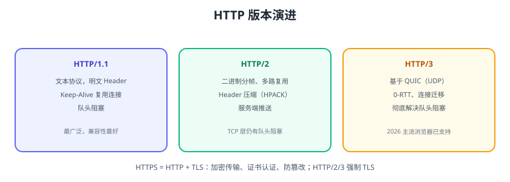

# HTTP 与 HTTPS 协议

HTTP（HyperText Transfer Protocol，超文本传输协议）是 Web 世界的通用语言；HTTPS 是在 HTTP 之上加 TLS 加密。理解请求/响应结构、状态码、缓存与版本演进，是前后端协作与排障的基础。



## HTTP 请求结构

```text
POST /api/orders HTTP/1.1
Host: api.example.com
Content-Type: application/json
Authorization: Bearer xxx

{"userId":1001,"amount":99.9}
```

## HTTP 响应结构

```text
HTTP/1.1 200 OK
Content-Type: application/json
Cache-Control: max-age=60

{"code":0,"data":{"id":1}}
```

## 请求方法

| 方法 | 语义 | 幂等 |
| --- | --- | --- |
| GET | 查询资源 | 是 |
| POST | 创建/提交 | 否 |
| PUT | 整体更新 | 是 |
| PATCH | 部分更新 | 否 |
| DELETE | 删除 | 是 |
| HEAD | 只取响应头 | 是 |
| OPTIONS | 预检/能力查询 | 是 |

## 状态码

| 分类 | 含义 | 常见 |
| --- | --- | --- |
| 1xx | 信息 | 100 Continue |
| 2xx | 成功 | 200、201、204 |
| 3xx | 重定向 | 301、302、304 |
| 4xx | 客户端错误 | 400、401、403、404、429 |
| 5xx | 服务端错误 | 500、502、503、504 |

::: tip 排障
429 限流 → 检查限流策略；502 网关连不上后端；503 服务不可用/维护；504 网关超时。
:::

## HTTP 版本演进

| 版本 | 关键特性 | 问题 |
| --- | --- | --- |
| HTTP/1.1 | Keep-Alive、分块传输、Host 头 | 队头阻塞（一个连接一次一个请求） |
| HTTP/2 | 二进制分帧、多路复用、HPACK、服务端推送 | TCP 层队头阻塞 |
| HTTP/3 | 基于 QUIC（UDP）、0-RTT、连接迁移 | 部署复杂，UDP 穿透 |

::: info 2026 现状
HTTP/3 已获主流浏览器全面支持（超 95% 活跃浏览器）；大流量站点已默认开启 HTTP/3，回退 HTTP/2/1.1。
:::

## HTTPS 与 TLS

HTTPS = HTTP + TLS：

1. **加密**：对称加密（AES）加密数据。
2. **认证**：非对称加密（RSA/ECDSA） + 数字证书验证服务器身份。
3. **完整性**：MAC/签名防止篡改。

### TLS 握手简化流程

```text
客户端 → ClientHello（支持的算法、随机数）
服务端 → ServerHello + 证书
客户端 → 校验证书，生成预主密钥（公钥加密）
双方 → 派生会话密钥，切换加密，完成握手
```

::: danger HTTPS 常见坑
1. 证书过期/不匹配：浏览器拦截；配置证书自动续期。
2. 混合内容：HTTPS 页面加载 HTTP 资源被拦截；全站 HTTPS。
3. 只加密不校验：自签名证书中间人可攻击；生产用受信 CA。
4. TLS 版本过低：禁用 TLS 1.0/1.1，至少 1.2，推荐 1.3。
:::

## HTTP 缓存

```text
强缓存：Cache-Control: max-age / Expires → 不发请求
协商缓存：Last-Modified / ETag → 带条件请求，304 复用
```

```http
Cache-Control: max-age=3600
ETag: "abc123"
```

## WebSocket 与 SSE

| 技术 | 方向 | 场景 |
| --- | --- | --- |
| WebSocket | 全双工 | 聊天、实时协作 |
| SSE（Server-Sent Events） | 服务端→客户端单向 | 通知、流式输出 |

## 易错点与最佳实践

::: danger 常见错误
1. **GET 请求带 body**：语义错误，部分代理/网关会丢弃。
2. **状态码乱用**：业务失败返回 200 + code 字段，排障困难；用真实状态码。
3. **忽略幂等**：POST 重复提交产生重复数据；支付等场景用幂等键。
4. **敏感信息进 URL**：GET 查询串会进日志，密码/Token 放 Header/Body。
5. **缓存策略缺失**：不设 Cache-Control，浏览器行为不可控。
6. **HTTPS 证书链不全**：中间证书缺失导致部分客户端校验失败。
:::

::: tip 最佳实践
1. RESTful 语义：GET 查询、POST 创建、PUT 更新、DELETE 删除。
2. 统一响应结构 + 错误码文档化。
3. 幂等接口加 `Idempotency-Key`。
4. 静态资源长缓存 + 内容 hash；HTML 不缓存。
5. 全站 HTTPS + HSTS，敏感接口加防重放。
:::

## 验证方式

1. `curl -v https://example.com` 观察 TLS 握手与响应头。
2. 用 `curl -I` 查看缓存头，测试 304 协商缓存。
3. 用浏览器 DevTools Network 面板观察 HTTP/2/3 协议标识与加载瀑布。

## 参考资料

- RFC 9110（HTTP 语义）：https://www.rfc-editor.org/rfc/rfc9110
- RFC 9113（HTTP/2）：https://www.rfc-editor.org/rfc/rfc9113
- RFC 9114（HTTP/3）：https://www.rfc-editor.org/rfc/rfc9114
- MDN HTTP：https://developer.mozilla.org/zh-CN/docs/Web/HTTP
