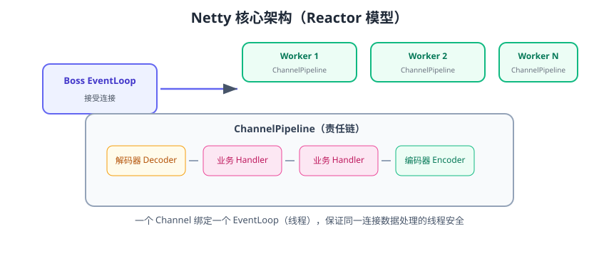

# Netty 入门

Netty 是 Java 生态最成熟的**异步事件驱动网络框架**：它封装了 NIO 的复杂度，提供 Reactor 线程模型、责任链 Pipeline、强大的编解码体系与背压机制。RPC 框架（Dubbo、gRPC）、IM、网关大量基于 Netty。截至 2026 年，稳定版为 **4.2.x**。



## 为什么用 Netty

| 裸 NIO | Netty |
| --- | --- |
| 编码复杂、易错 | 封装 Channel/Buffer/Selector |
| 无编解码支持 | 内置粘包拆包解码器 |
| 线程模型难控制 | EventLoop 模型成熟 |
| 无背压 | 自带水位与背压机制 |
| 无协议支持 | HTTP/WebSocket/gRPC 等协议栈 |

## 核心组件

| 组件 | 作用 |
| --- | --- |
| EventLoopGroup | 线程组：Boss 接受连接、Worker 处理 IO |
| ServerBootstrap / Bootstrap | 服务端/客户端启动器 |
| Channel | 网络连接抽象 |
| ChannelPipeline | 责任链：Inbound/Outbound Handler |
| ChannelHandler | 业务处理器 |
| ByteBuf | 字节容器（比 ByteBuffer 好用） |
| Future / Promise | 异步结果 |

## 快速开始：HTTP 服务

```xml [pom.xml]
<dependency>
    <groupId>io.netty</groupId>
    <artifactId>netty-all</artifactId>
    <version>4.2.15.Final</version>
</dependency>
```

```java [HttpServer.java]
public class HttpServer {
    public static void main(String[] args) throws Exception {
        EventLoopGroup boss = new NioEventLoopGroup(1);
        EventLoopGroup worker = new NioEventLoopGroup();
        try {
            ServerBootstrap bootstrap = new ServerBootstrap();
            bootstrap.group(boss, worker)
                .channel(NioServerSocketChannel.class)
                .childHandler(new ChannelInitializer<SocketChannel>() {
                    @Override
                    protected void initChannel(SocketChannel ch) {
                        ch.pipeline()
                            .addLast(new HttpServerCodec())       // HTTP 编解码
                            .addLast(new HttpServerHandler());    // 业务处理
                    }
                });
            ChannelFuture f = bootstrap.bind(8080).sync();
            System.out.println("server started on 8080");
            f.channel().closeFuture().sync();
        } finally {
            boss.shutdownGracefully();
            worker.shutdownGracefully();
        }
    }
}
```

```java [HttpServerHandler.java]
import io.netty.buffer.Unpooled;
import io.netty.channel.*;
import io.netty.handler.codec.http.*;
import java.nio.charset.StandardCharsets;

public class HttpServerHandler extends SimpleChannelInboundHandler<HttpObject> {
    @Override
    protected void channelRead0(ChannelHandlerContext ctx, HttpObject msg) {
        if (msg instanceof HttpRequest) {
            String body = "Hello Netty!";
            FullHttpResponse response = new DefaultFullHttpResponse(
                HttpVersion.HTTP_1_1, HttpResponseStatus.OK,
                Unpooled.copiedBuffer(body, StandardCharsets.UTF_8));
            response.headers().set(HttpHeaderNames.CONTENT_TYPE, "text/plain");
            response.headers().setInt(HttpHeaderNames.CONTENT_LENGTH, body.length());
            ctx.writeAndFlush(response);
        }
    }

    @Override
    public void exceptionCaught(ChannelHandlerContext ctx, Throwable cause) {
        cause.printStackTrace();
        ctx.close();
    }
}
```

启动后访问 http://localhost:8080，页面显示 `Hello Netty!`。

## 线程模型：一个连接绑定一个 EventLoop

```text
Boss EventLoop（1 个）：accept 连接
  → 把 Channel 注册到 Worker EventLoop（默认 CPU×2）
  → 该连接的所有 IO 事件都在同一 EventLoop 线程处理
  → 同一连接无需加锁（无并发）
```

::: danger EventLoop 的坑
1. **不要在 Handler 里做阻塞操作**（DB、远程调用）：阻塞 EventLoop，拖垮所有连接；用 `ChannelHandlerContext.executor()` 或独立线程池。
2. 不要在多个线程直接操作同一个 Channel 的 write。
3. 共享 Handler 要无状态，或用 `@Sharable` 明确标注。
:::

## ByteBuf 基础

```java
ByteBuf buf = Unpooled.buffer(16);
buf.writeBytes("hello".getBytes());   // 写
byte[] data = new byte[buf.readableBytes()];
buf.readBytes(data);                  // 读
System.out.println(new String(data));
buf.release();                        // 引用计数释放
```

## ChannelPipeline 责任链

```text
入站：Socket → 解码器 → 业务 Handler（顺序）
出站：业务 Handler → 编码器 → Socket（逆序）
```

```java
ch.pipeline()
    .addLast("decoder", new MessageDecoder())     // 入站解码
    .addLast("business", new BusinessHandler())   // 业务
    .addLast("encoder", new MessageEncoder());    // 出站编码
```

## 易错点与最佳实践

::: danger 常见错误
1. **用 `ctx.channel().write()` 而不是 `ctx.write()`**：前者从 Pipeline 尾出站，可能跳过后续出站 Handler；后者从当前节点开始。
2. **忘 release ByteBuf**：内存泄漏；用 `SimpleChannelInboundHandler`（自动释放）或 `ReferenceCountUtil.release`。
3. **业务阻塞 EventLoop**：吞吐骤降；异步化或独立线程池。
4. **共享 Handler 有状态**：多连接并发修改共享状态；Handler 无状态或加锁。
5. **不处理半包**：TCP 字节流必须加解码器（见 [粘包拆包](../StickyHalf/index.md)）。
6. **忽略背压**：写入慢的客户端会内存堆积；配置 write buffer 水位。
:::

::: tip 最佳实践
1. 服务端用主从 Reactor：boss=1，worker=CPU×2。
2. 业务耗时操作放独立业务线程池，结果通过 `channel.eventLoop().execute()` 回到 EventLoop。
3. 编解码用 Netty 内置解码器组合，少手写。
4. 生产开启 `-Dio.netty.leakDetectionLevel=paranoid` 排查泄漏。
5. 压测 + 监控连接数、内存、EventLoop 任务队列。
:::

## 验证方式

1. 运行 HTTP 服务端，浏览器/curl 访问返回 `Hello Netty!`。
2. 用 `jstack` 观察线程：boss 与 worker 线程数量符合配置。
3. 压测 1 万并发连接，观察 EventLoop 数量不变、吞吐稳定。

## 参考资料

- Java IO/NIO 专题：[网络 IO 模型：BIO/NIO/AIO](../../Java/JavaSE/IO/NetworkIO/index.md)、[Selector 与多路复用](../../Java/JavaSE/IO/Selector/index.md)
- Netty 官方文档：https://netty.io/wiki/
- Netty 源码解析：https://netty.io/wiki/related-articles.html
- Netty 实战（Norman Maurer，书籍）
- Netty 版本信息：https://netty.io/news/
