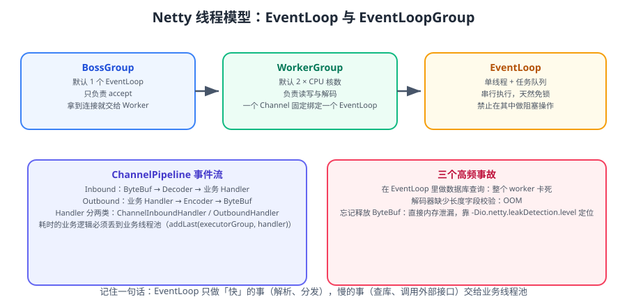
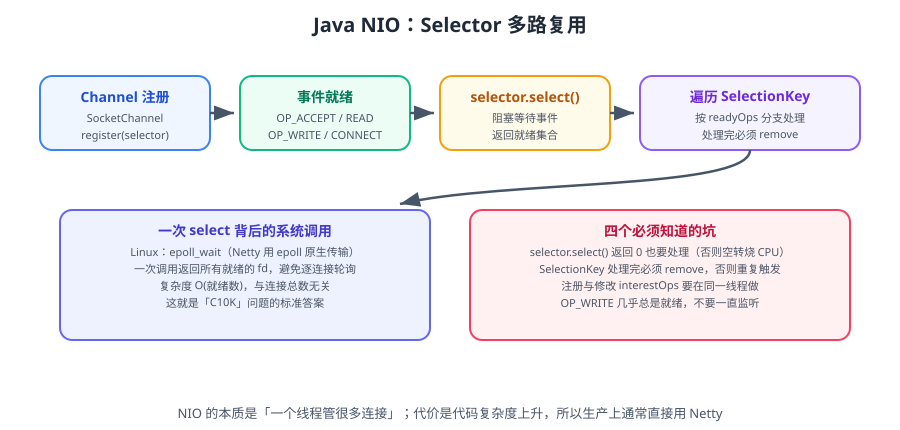

# Netty 进阶：线程模型与性能调优

Netty 入门后，真正拉开差距的是三件事：**理解 EventLoop 的线程模型、管住内存（ByteBuf 引用计数）、做好背压与心跳**。本篇聚焦这三个生产级主题。



::: info 版本说明（2026-09 核对）
- Netty 当前**两条活跃分支**：**4.2.x**（最新 `4.2.18.Final`，2026-09-09）与 **4.1.x**（最新 `4.1.138.Final`，2026-09-09）。
- **Netty 5** 仍处于开发/预览阶段，**生产请用 4.2.x 或 4.1.x**。
- :::danger 安全提示：4.1.136.Final / 4.2.16.Final 之前存在多个安全漏洞（含 SPDY 解码器内存耗尽、DNS 缓存投毒、TLS 主机名校验绕过）。**生产环境务必升级到 ≥ `4.1.138.Final` / `4.2.18.Final`。**
:::

::: tip 一句话理解
Netty 快的原因不是「用了 NIO」，而是**「一个连接固定绑一个线程、串行处理、天然免锁」**。
所有性能问题的根因，几乎都是**破坏了这个假设**（在 EventLoop 里做慢操作）。
:::

## 一、EventLoop 线程模型

```text
BossGroup（默认 1 个 EventLoop）
  └─ 只负责 accept，拿到连接后交给 Worker

WorkerGroup（默认 2 × CPU 核数）
  └─ EventLoop（单线程 + 任务队列）
       ├─ Channel A  ← 固定绑定
       ├─ Channel B  ← 固定绑定
       └─ Channel C  ← 固定绑定
```

三条铁律：

| 铁律 | 原因 |
| --- | --- |
| **一个 Channel 只绑一个 EventLoop** | 保证同一连接的 IO 事件串行执行，无需加锁 |
| **EventLoop 里禁止阻塞** | 一个 EventLoop 管成千上万连接，阻塞会拖死全部 |
| **耗时逻辑丢到业务线程池** | 保持 EventLoop 只做「解析 + 分发」 |

### 1.1 正确的线程池用法

```java
// 耗时业务（查库、调外部接口）必须用独立的业务线程池
EventExecutorGroup bizGroup = new DefaultEventExecutorGroup(
    16,
    new DefaultThreadFactory("biz")
);

ServerBootstrap b = new ServerBootstrap();
b.group(bossGroup, workerGroup)
 .channel(NioServerSocketChannel.class)
 .childHandler(new ChannelInitializer<SocketChannel>() {
     @Override
     protected void initChannel(SocketChannel ch) {
         ch.pipeline()
           .addLast(new LengthFieldBasedFrameDecoder(1024 * 1024, 0, 4, 0, 4))
           .addLast(new MyDecoder())
           // 关键：指定 bizGroup，让这个 Handler 在业务线程池执行
           .addLast(bizGroup, new BusinessHandler())
           .addLast(new MyEncoder());
     }
 });
```

::: danger 三个高频事故
1. **在 EventLoop 里做数据库查询 / HTTP 调用** → 这个 EventLoop 上的所有连接全部卡死。**必须用 `addLast(executorGroup, handler)`**。
2. **解码器没有长度上限** → 恶意超长报文直接 OOM。**必须给 `LengthFieldBasedFrameDecoder` 传 `maxFrameLength`，并设 `ByteBuf` 上限**。
3. **忘记释放 `ByteBuf`** → 直接内存泄漏（`OutOfDirectMemoryError`）。用 `-Dio.netty.leakDetection.level=paranoid` 定位。
:::

### 1.2 底层为什么快：多路复用



Netty 在 Linux 上默认使用 **epoll 原生传输**（`EpollEventLoopGroup`），复杂度是 **O(就绪连接数)**，与连接总数无关——这是 C10K 问题的标准答案。

```java
// 启用 epoll 原生传输（Linux）
EventLoopGroup bossGroup   = new EpollEventLoopGroup(1);
EventLoopGroup workerGroup = new EpollEventLoopGroup();
b.channel(EpollServerSocketChannel.class);
```

::: tip 原生传输的收益
| 维度 | NIO（JDK） | epoll 原生传输 |
| --- | --- | --- |
| 边缘触发 | 需额外封装 | 原生支持 |
| 系统调用次数 | 较多 | 更少 |
| 性能 | 好 | 更好（高并发下明显） |

依赖：`netty-transport-native-epoll`，并按平台带 `classifier`（如 `linux-x86_64`）。
:::

## 二、ByteBuf 与内存管理

### 2.1 ByteBuf 的三种模式

| 模式 | 说明 | 适用 |
| --- | --- | --- |
| **堆缓冲**（Heap） | 分配在 JVM 堆上 | 需要 `array()` 访问，或用 JDK 原生 IO |
| **直接缓冲**（Direct） | 分配在堆外 | **Netty 默认**，更适合网络 IO（少一次拷贝） |
| **复合缓冲**（Composite） | 多个 ByteBuf 逻辑合并 | 零拷贝聚合 |

### 2.2 引用计数：必须成对释放

```java
ByteBuf buf = ctx.alloc().buffer(1024);
try {
    buf.writeBytes(data);
    ctx.writeAndFlush(buf);   // 写出去：Netty 负责释放
} finally {
    // 注意：writeAndFlush 后不要自己 release，会重复释放
}
```

::: danger 引用计数的三个陷阱
1. **继承 `ChannelInboundHandlerAdapter` 时忘记 `release`** → 用 `SimpleChannelInboundHandler`（它会自动释放）。
2. **重复释放**（自己 release 了，又交给 pipeline） → `IllegalReferenceCountException`。
3. **`retain()` 后忘记配对 release** → 泄漏。

**判断方法**：
```java
// 内部类/简单场景用这个，自动 release（推荐）
public class MyHandler extends SimpleChannelInboundHandler<ByteBuf> {
    @Override
    protected void channelRead0(ChannelHandlerContext ctx, ByteBuf msg) {
        // msg 会被自动释放
    }
}
```
:::

### 2.3 检测内存泄漏

```bash
# 泄漏检测级别：DISABLED / SIMPLE（默认，采样 1%）/ ADVANCED / PARANOID
-Dio.netty.leakDetection.level=paranoid

# JVM 参数限制直接内存，避免拖垮整机
-XX:MaxDirectMemorySize=512m
```

预期日志（有泄漏时）：

```text
LEAK: ByteBuf.release() was not called before it's garbage-collected.
Recent access records: ...
	at io.netty.buffer.AdvancedLeakAwareByteBuf.readBytes(...)
```

::: warning 直接内存泄漏很"安静"
堆内存看不出问题（`jmap` 正常），但进程 RSS 持续上涨，最终 `OutOfDirectMemoryError`。
**排查思路**：先开 `paranoid` 定位到 Handler，再按引用计数规则修复。
:::

### 2.4 零拷贝（Zero-Copy）

| 机制 | 作用 |
| --- | --- |
| `CompositeByteBuf` | 逻辑合并多个 buffer，不发生拷贝 |
| `slice()` / `duplicate()` | 共享底层内存，不复制 |
| `FileRegion` | `FileChannel.transferTo`，文件到网络零拷贝 |
| `ByteBuf` 直接缓冲 | 减少堆内到堆外的拷贝 |

```java
// 文件传输零拷贝
FileRegion region = new DefaultFileRegion(file.getChannel(), 0, file.length());
ctx.writeAndFlush(region);
```

## 三、背压与流量控制

### 3.1 写缓冲水位线（Write Buffer Water Mark）

```java
// 高水位 64KB、低水位 32KB：写缓冲超过高水位时 isWritable() 变 false
b.childOption(ChannelOption.WRITE_BUFFER_WATER_MARK,
              new WriteBufferWaterMark(32 * 1024, 64 * 1024));
```

```java
// 生产者据此做背压判断，避免无限堆积导致 OOM
if (ctx.channel().isWritable()) {
    ctx.writeAndFlush(msg);
} else {
    // 对端消费慢：暂停生产 / 丢弃 / 记日志
}
```

::: danger 不回压的后果
慢消费者场景下，如果不管 `isWritable()` 一直写：
**写队列无限增长 → 堆外内存耗尽 → 整个进程 OOM**。
这是 Netty 服务最常见的线上事故之一。
:::

### 3.2 关闭 linger 与合理超时

```java
b.childOption(ChannelOption.SO_KEEPALIVE, true)
 .childOption(ChannelOption.TCP_NODELAY, true)      // 禁用 Nagle，降延迟
 .option(ChannelOption.SO_BACKLOG, 1024);           // accept 队列长度
```

## 四、心跳与断线重连

### 4.1 服务端检测空闲连接

```java
// 读空闲 60s / 写空闲 30s / 读写空闲 0（0 表示忽略）
pipeline.addLast(new IdleStateHandler(60, 30, 0, TimeUnit.SECONDS));
pipeline.addLast(new HeartbeatHandler());

public class HeartbeatHandler extends ChannelInboundHandlerAdapter {
    @Override
    public void userEventTriggered(ChannelHandlerContext ctx, Object evt) {
        if (evt instanceof IdleStateEvent e) {
            if (e.state() == IdleState.READER_IDLE) {
                ctx.close();               // 长时间没读到数据，主动断开
            } else if (e.state() == IdleState.WRITER_IDLE) {
                ctx.writeAndFlush(Heartbeat.PING);  // 主动发心跳
            }
        }
    }
}
```

::: warning 心跳包要设长度
心跳包也要遵循协议帧格式（如 `length = 0` 表示无消息体），
否则解码器无法解析，会当成半包一直等。见 [自定义协议设计](../ProtocolDesign/index.md)。
:::

### 4.2 客户端断线重连

```java
public class ReconnectHandler extends ChannelInboundHandlerAdapter {
    private final ScheduledExecutorService scheduler = Executors.newSingleThreadScheduledExecutor();
    private final Bootstrap bootstrap;
    private int attempts = 0;

    @Override
    public void channelInactive(ChannelHandlerContext ctx) {
        // 指数退避重连：1s, 2s, 4s, ... 上限 30s
        long delay = Math.min(30, 1L << Math.min(attempts, 5));
        attempts++;
        scheduler.schedule(() -> bootstrap.connect().addListener((ChannelFuture f) -> {
            if (f.isSuccess()) attempts = 0;
        }), delay, TimeUnit.SECONDS);
    }
}
```

## 五、性能调优速查表

| 参数 / 做法 | 建议 | 说明 |
| --- | --- | --- |
| `workerGroup` 线程数 | 默认 `2 × CPU`（IO 密集可调大） | 不要盲目调大 |
| `EpollEventLoopGroup` | Linux 上启用 | 减少系统调用 |
| `TCP_NODELAY` | 开启 | 降延迟 |
| `SO_KEEPALIVE` | 开启 | 连接保活 |
| `WRITE_BUFFER_WATER_MARK` | 按业务设置 | 背压基础 |
| `LengthFieldBasedFrameDecoder` | 必设 `maxFrameLength` | 防 OOM |
| `SimpleChannelInboundHandler` | 优先使用 | 自动释放 ByteBuf |
| 业务 Handler | 指定 `EventExecutorGroup` | 避免阻塞 EventLoop |
| `MaxDirectMemorySize` | 显式设置 | 防拖垮整机 |
| 池化分配器 | `PooledByteBufAllocator`（默认） | 减少分配开销 |
| 分配器 arena | `-Dio.netty.allocator.numDirectArenas` | 高并发可调 |

::: tip 调优前先压测
不要凭感觉调参数。**先用压测拿到基线**（吞吐、P99 延迟、CPU、内存），
再单变量调整，每次只改一个参数并复测。方法见 [性能基准与压测](../BenchmarkPractice/index.md)。
:::

## 六、Netty 5 与版本升级

| 分支 | 状态 | 建议 |
| --- | --- | --- |
| **4.2.x** | 活跃，支持原生传输与新特性 | **新项目首选** |
| **4.1.x** | 维护中，长期稳定 | 存量项目使用 |
| 5.x | 开发/预览中 | **不要用于生产** |

::: danger 升级到 4.2.x 的注意点
1. **API 有变化**：部分 4.1 的 API 在 4.2 中调整（如部分 `ByteBuf` 相关方法），需改代码。
2. **安全修复必须跟**：4.2.16 / 4.1.136 之前存在多个 CVE（SPDY 内存耗尽、DNS 缓存投毒、TLS 主机名校验绕过），**升级到 ≥ 4.2.18 / 4.1.138**。
3. **依赖对齐**：Spring Boot、gRPC、Dubbo 等会给 Netty 设版本，注意统一（用 `dependencyManagement` 显式锁定）。
```xml
<dependencyManagement>
  <dependencies>
    <dependency>
      <groupId>io.netty</groupId>
      <artifactId>netty-bom</artifactId>
      <version>4.2.18.Final</version>
      <type>pom</type>
      <scope>import</scope>
    </dependency>
  </dependencies>
</dependencyManagement>
```
:::

## 七、常见问题排查表

| 现象 | 可能原因 | 排查方向 |
| --- | --- | --- |
| 吞吐上不去 | EventLoop 被阻塞 | 检查业务 Handler 是否在 EventLoop 线程 |
| 内存持续上涨 | ByteBuf 未释放 / 写队列堆积 | 开 leakDetection + 看 `isWritable` |
| 连接数上不去 | 文件描述符限制 / backlog 太小 | `ulimit -n`、`SO_BACKLOG` |
| 大量 CLOSE_WAIT | 应用未关闭连接 | 检查 `channelInactive` 与主动 close |
| 延迟抖动 | GC / 锁竞争 | 看 GC 日志、线程 dump |
| 半包/粘包解析错 | 解码器配置错 | 复核 `LengthFieldBasedFrameDecoder` 参数 |

## 相关专题

- Netty 入门： [Netty 入门](../Netty/index.md)
- 自定义协议与粘包拆包：[自定义协议设计](../ProtocolDesign/index.md) · [粘包拆包](../StickyHalf/index.md)
- 虚拟线程（另一种高并发解法）：[虚拟线程与高并发模型](../VirtualThread/index.md)
- 压测方法：[性能基准与压测](../BenchmarkPractice/index.md)

## 参考资料

- Netty 官方文档（4.2）：https://netty.io/wiki/
- Netty GitHub Releases：https://github.com/netty/netty/releases
- Netty 安全公告：https://github.com/netty/netty/security/advisories
- 《Netty 实战》（Norman Maurer）
- 本专题其余章节：[网络编程目录](../index.md)
