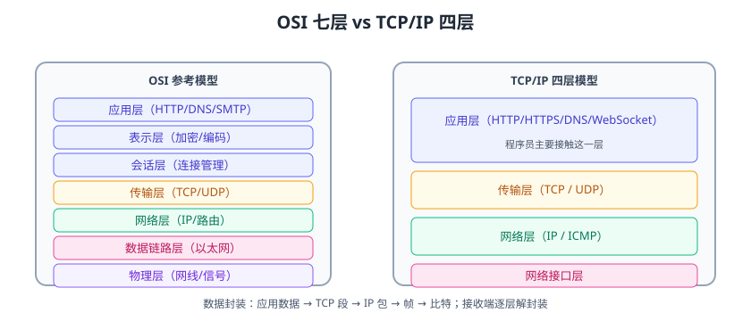

# 网络分层与 TCP/IP 基础

网络编程的第一课是**分层**：把复杂的网络通信拆成若干层，每层只解决自己的问题，层与层之间通过标准接口协作。理解分层模型，才能看懂 TCP 握手、HTTP 报文、Socket 编程中“数据从哪来到哪去”。



## 分层模型

### OSI 七层模型

| 层 | 职责 | 典型协议 |
| --- | --- | --- |
| 应用层 | 为用户提供网络服务 | HTTP、DNS、SMTP、FTP |
| 表示层 | 数据编码、加密、压缩 | TLS、JPEG |
| 会话层 | 建立/管理会话 | RPC 会话 |
| 传输层 | 端到端可靠传输 | TCP、UDP |
| 网络层 | 寻址与路由 | IP、ICMP |
| 数据链路层 | 相邻节点传输 | 以太网、Wi-Fi |
| 物理层 | 比特传输 | 网线、光纤 |

### TCP/IP 四层模型（实际使用）

| 层 | 职责 | 程序员关注点 |
| --- | --- | --- |
| 应用层 | 业务协议 | HTTP/WebSocket/gRPC |
| 传输层 | 端到端传输 | TCP 可靠 / UDP 快 |
| 网络层 | 寻址路由 | IP 地址、子网 |
| 网络接口层 | 物理传输 | 网卡、交换机 |

## 数据封装与解封装

```text
发送方：
应用数据 → 加 TCP 头（段）→ 加 IP 头（包）→ 加以太网头（帧）→ 比特

接收方：
比特 → 去帧头 → 去 IP 头 → 去 TCP 头 → 应用数据
```

每一层只处理自己的头部，这正是“分层解耦”的体现。

## 核心概念

| 概念 | 说明 |
| --- | --- |
| IP 地址 | 网络层定位主机（IPv4/IPv6） |
| 端口 | 传输层定位进程（0~65535） |
| Socket | 应用层与传输层之间的编程接口：IP + 端口 |
| 协议 | 通信双方约定的数据格式与规则 |
| 三次握手 | TCP 建立连接 |
| 四次挥手 | TCP 断开连接 |
| MTU | 网络层最大传输单元（以太网 1500） |
| MSS | TCP 段最大长度（MTU - IP头 - TCP头） |

## 一次 HTTP 请求经过的层

```text
浏览器（应用层 HTTP）
  → 传输层 TCP（三次握手、分段）
  → 网络层 IP（寻址、路由）
  → 网络接口层（以太网帧）
  → 交换机/路由器 → 服务器反向解封装
  → 服务端应用读取请求并响应
```

## 常见端口

| 端口 | 服务 |
| --- | --- |
| 21 | FTP |
| 22 | SSH |
| 80 | HTTP |
| 443 | HTTPS |
| 3306 | MySQL |
| 6379 | Redis |
| 8080 | 常见应用端口 |

## 易错点与最佳实践

::: danger 常见错误
1. **混淆 IP 与端口**：IP 找机器，端口找进程；一个 IP 上多个服务靠端口区分。
2. **忽略四层/七层差异**：四层（TCP/UDP）转发 vs 七层（HTTP）负载均衡，用途不同。
3. **不理解封装**：抓包看到的是“带头的包”，不是原始应用数据。
4. **MTU/MSS 混淆**：MTU 1500，MSS 一般 1460，过大报文会被分片。
5. **把 HTTP 当传输层**：HTTP 是应用层协议，底层仍是 TCP/QUIC。
:::

::: tip 最佳实践
1. 排查网络问题从底层往上：ping（网络层）→ telnet（传输层）→ curl（应用层）。
2. 抓包工具（Wireshark/tcpdump）理解分层与握手。
3. 面试先讲清“数据包如何封装”，再谈具体协议。
:::

## 验证方式

1. `ping 8.8.8.8` 验证网络层连通。
2. `telnet example.com 443` 验证 TCP 连通。
3. `curl -v https://example.com` 观察 TCP 握手、TLS 协商与应用层请求。
4. 用 Wireshark 抓一次访问，对照各层头部。

## 参考资料

- TCP/IP 详解（Richard Stevens，书籍）
- RFC 1180（TCP/IP 教程）：https://www.rfc-editor.org/rfc/rfc1180
- 计算机网络（谢希仁，书籍）
