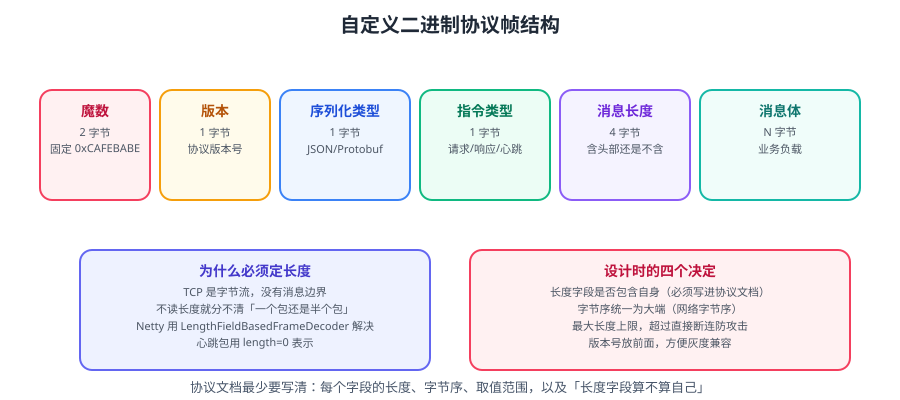

# 自定义协议设计

做中间件、RPC、物联网、游戏服务端时，常常需要**自定义二进制协议**。协议设计一旦上线就很难改——客户端版本无法强制统一。本篇给出协议帧的完整设计方法、编解码实现与向后兼容策略。



::: tip 一句话理解
自定义协议设计只需回答四个问题：
**① 怎么找到一个包的开始？② 一个包有多长？③ 包里的字节怎么解释？④ 老版本客户端怎么共存？**
:::

## 一、什么时候需要自定义协议

| 场景 | 推荐 | 原因 |
| --- | --- | --- |
| 对外 Web API | **HTTP + JSON** | 通用、可调试、生态全 |
| 内部服务互调 | **gRPC（HTTP/2 + Protobuf）** | 强类型、高性能、带流式 |
| 极低延迟 / 高吞吐 | **自定义二进制协议** | 省去 HTTP 头开销、可控 |
| 弱网 / 物联网 | **自定义二进制协议** | 报文极小、省流量与电量 |
| 长连接推送 | 自定义或 **WebSocket** | 双向、服务端主动推 |

::: warning 不要「为了性能」盲目自定义
自定义协议的代价：
- **调试困难**（`tcpdump` 看到的是一堆二进制）；
- **兼容性管理复杂**（客户端升级不可控）；
- **要自己实现心跳、重连、背压、流控**。
**先用 HTTP/gRPC，确认瓶颈确实在协议开销上，再自定义。**
:::

## 二、帧结构设计

### 2.1 一个可用的帧布局

```text
+--------+--------+--------+--------+----------------+----------------+
| 魔数    | 版本    | 序列化  | 指令    | 消息长度(4B)     | 消息体(N 字节)   |
| 2B     | 1B     | 1B     | 1B     | 大端序           | 业务负载        |
| 0xCAFE | v1     | 1=JSON | 见下表  | 含头/不含头要写清   |                |
+--------+--------+--------+--------+----------------+----------------+
```

| 字段 | 长度 | 作用 | 设计要点 |
| --- | --- | --- | --- |
| **魔数** | 2~4B | 快速识别「这是我们的协议」 | 用于协议识别与错误报文丢弃 |
| **版本** | 1B | 便于协议演进 | 从 v1 开始 |
| **序列化类型** | 1B | JSON / Protobuf / Hessian | 便于多格式共存与切换 |
| **指令类型** | 1B~2B | 请求/响应/心跳/鉴权 | 决定如何解析消息体 |
| **消息长度** | 4B | **最关键** | 明确「含头还是不含头」，TCP 靠它切包 |
| **消息体** | N B | 业务数据 | 序列化格式由上面字段决定 |

::: danger 长度字段必须写清三件事
1. **含不含头部**？本示例指「消息体的字节数」。
2. **字节序**？统一用**大端（Big-Endian）**，Java 默认即大端，跨语言更通用。
3. **上限是多少**？必须设 `maxFrameLength`，否则恶意超长报文直接 OOM。
:::

### 2.2 为什么长度字段是必须的

```text
TCP 是字节流，没有消息边界：
  发送方 write("A"=10B) + write("B"=20B)
  接收方可能读到：30B 一次读全（粘包），或 5B + 25B（拆包）

没有长度字段 → 接收方无法知道"A"在哪里结束
有长度字段 → 读满 5B 头 → 读到 length → 再读 length 字节 → 一个完整包
```

这也是 Netty 提供 `LengthFieldBasedFrameDecoder` 的原因。

### 2.3 指令类型设计

```java
public enum Command {
    HEARTBEAT_REQ(0x01),
    HEARTBEAT_RESP(0x02),
    AUTH_REQ(0x10),
    AUTH_RESP(0x11),
    BUSINESS_REQ(0x20),
    BUSINESS_RESP(0x21),
    ERROR(0x7F);

    private final int code;
    Command(int code) { this.code = code; }

    public static Command of(int code) {
        for (Command c : values()) if (c.code == code) return c;
        throw new IllegalArgumentException("未知指令: " + code);
    }
    public int code() { return this.code; }
}
```

::: tip 编码用「区间划分」便于扩展
按高位区间分段：`0x0x` 心跳、`0x1x` 鉴权、`0x2x` 业务、`0x7x` 错误、`0x8x` 预留。
这样新增指令不用重排，也能靠区间快速判断类别。
:::

## 三、Netty 编解码实现

### 3.1 解码：`LengthFieldBasedFrameDecoder`

```java
// 参数含义：maxFrameLength, lengthFieldOffset, lengthFieldLength,
//          lengthAdjustment, initialBytesToStrip
ch.pipeline().addLast(new LengthFieldBasedFrameDecoder(
        1024 * 1024,   // maxFrameLength：最大帧长，必须设
        6,             // lengthFieldOffset：长度字段在偏移 6 处
        4,             // lengthFieldLength：长度字段 4 字节
        0,             // lengthAdjustment：长度值 = 消息体长度，无需调整
        10             // initialBytesToStrip：剥掉前面 10 字节头（2+1+1+1+4=9 → 这里示意）
));
```

::: warning 参数最容易配错
- `lengthFieldOffset`：**从帧头开始算**的偏移，不是从 0 之外。
- `lengthAdjustment`：若 `length` 只表示消息体长度，而头长 10B，则需 `adjustment = -10 + ...`，务必按官方公式核对。
- `initialBytesToStrip`：剥掉头后，后续 Handler 只看到包体。若后续解码器需要读头，就设 0 并自己处理。

**验证方法**：构造一个已知字节数组，断言解码结果。
:::

### 3.2 解码：`ByteToMessageDecoder`（半包处理）

```java
public class MyProtocolDecoder extends ByteToMessageDecoder {
    @Override
    protected void decode(ChannelHandlerContext ctx, ByteBuf in, List<Object> out) {
        // ① 不够一个头，直接返回，等下次数据
        if (in.readableBytes() < HEADER_LENGTH) return;

        in.markReaderIndex();               // ② 标记读指针，便于回滚

        short magic    = in.readShort();
        byte  version  = in.readByte();
        byte  serialize = in.readByte();
        byte  command  = in.readByte();
        int   length   = in.readInt();

        // ③ 魔数校验
        if (magic != (short) 0xCAFE) {
            ctx.close();                    // 非法报文直接断开
            return;
        }
        // ④ 长度上限校验（防 OOM）
        if (length < 0 || length > MAX_FRAME) {
            ctx.close();
            return;
        }
        // ⑤ 包体还没收全，回滚指针，等下次
        if (in.readableBytes() < length) {
            in.resetReaderIndex();
            return;
        }
        // ⑥ 读满一个完整包
        ByteBuf body = in.readBytes(length);
        out.add(new Message(command, serialize, body));
    }
}
```

::: danger 半包处理的四个必备动作
1. **判头够不够** → 不够就 `return`（不是抛异常）；
2. **`markReaderIndex()` + `resetReaderIndex()`** → 数据不全时回滚，否则数据丢失；
3. **长度与魔数校验** → 防 OOM 与脏数据；
4. **读完必须消耗字节** → 否则 `decode` 被反复调用（死循环）。
:::

### 3.3 编码：`MessageToByteEncoder`

```java
public class MyProtocolEncoder extends MessageToByteEncoder<Message> {
    @Override
    protected void encode(ChannelHandlerContext ctx, Message msg, ByteBuf out) {
        byte[] body = msg.serialize();
        out.writeShort(0xCAFE);
        out.writeByte(VERSION);
        out.writeByte(msg.serializeType());
        out.writeByte(msg.command());
        out.writeInt(body.length);        // 长度 = 包体长度
        out.writeBytes(body);
    }
}
```

## 四、序列化选型

| 方案 | 体积 | 速度 | 可读性 | 跨语言 | 适用 |
| --- | --- | --- | --- | --- | --- |
| **JSON** | 大 | 中 | 极好 | 极好 | 调试期 / 低频 |
| **Protobuf** | 小 | 快 | 差（需 schema） | 极好 | 主流选择 |
| **Hessian** | 中 | 快 | 差 | 较好（Java 生态） | Dubbo 默认之一 |
| **Kryo** | 小 | 很快 | 差 | 差（Java） | 内部高性能场景 |
| **自定义二进制** | 最小 | 最快 | 无 | 需自实现 | 极致性能 |

::: tip 在协议头里加「序列化类型」字段
这样可以在不换协议的前提下**平滑迁移**（如新版本用 Protobuf，老版本仍用 JSON），
服务端按字段选择反序列化器。**这是低成本兼容的实用技巧。**
:::

## 五、向后兼容：协议演进

协议一旦发布，就必须考虑「老客户端还在跑」。四条规则：

| 规则 | 做法 |
| --- | --- |
| **只加不改** | 新增字段用「可选」语义，不加必填字段 |
| **保留旧字段编号** | Protobuf 中废弃字段用 `reserved` 占位，禁止复用编号 |
| **版本握手** | 连接建立时先交换版本，服务端据此降级 |
| **未知指令忽略** | 收到不认识的指令，返回错误码而非直接断开 |

```java
// 版本协商示例：客户端连接后先发 AUTH_REQ（带客户端版本）
// 服务端记录该连接的协议版本，后续编码按此版本裁剪字段
public class Session {
    private int protocolVersion = 1;
    public void setProtocolVersion(int v) { this.protocolVersion = v; }
    public int getProtocolVersion() { return protocolVersion; }
}
```

::: danger 兼容性最常犯的错误
1. **把必填字段改成必填 + 新增** → 老客户端解析失败。
2. **直接改字段含义**（复用编号）→ 数据错乱且无感知。
3. **换序列化格式不留开关** → 全量客户端必须同时升级。
4. **版本号不递增** → 无法定位线上兼容问题。
:::

## 六、协议设计检查清单

```text
帧结构
□ 有魔数（能识别脏数据/端口错连）
□ 有版本号（能演进）
□ 有长度字段，且明确"含头/不含头"与字节序
□ 有指令类型（能路由到不同处理器）
□ 有序列化类型（能平滑切换）
□ 有 maxFrameLength 上限（防 OOM）

交互
□ 有心跳（检测死连接）
□ 有请求 ID（能匹配请求与响应，支持异步）
□ 有错误码与错误消息（能定位）
□ 有超时约定（防止请求永远悬着）

兼容性
□ 只加不改，新增字段可选
□ 版本握手与降级策略
□ 未知指令/字段的容错处理
□ 保留字段编号
```

### 6.1 请求 ID：支持异步与并发

```text
+--------+------+------+------+--------+--------+---------+
| 魔数    | 版本  | 序列化 | 指令  | 请求ID  | 长度    | 消息体   |
| 2B     | 1B   | 1B   | 1B   | 8B     | 4B     | N B     |
+--------+------+------+------+--------+--------+---------+
```

有了请求 ID，同一个连接上可以并发发多个请求，响应按 ID 匹配：

```java
// 客户端：请求 ID → Future 的映射
private final Map<Long, CompletableFuture<Message>> pending = new ConcurrentHashMap<>();

public CompletableFuture<Message> send(Message req) {
    long id = nextId();
    CompletableFuture<Message> future = new CompletableFuture<>();
    pending.put(id, future);
    // 发送（req 带 id）...
    // 超时保护，避免 future 永远悬着
    future.orTimeout(5, TimeUnit.SECONDS)
          .whenComplete((r, e) -> pending.remove(id));
    return future;
}

// 收到响应
public void onResponse(long id, Message resp) {
    CompletableFuture<Message> f = pending.remove(id);
    if (f != null) f.complete(resp);
}
```

::: warning 别忘了「超时清理」
`pending` 如果不清理，会随超时请求不断堆积 → 内存泄漏。
**每个请求都必须有超时，并在超时后从 map 中移除。**
:::

## 七、实战：一个最小可运行的协议服务

```java
public class ProtocolServer {
    public static void main(String[] args) throws Exception {
        EventLoopGroup boss = new NioEventLoopGroup(1);
        EventLoopGroup worker = new NioEventLoopGroup();
        try {
            ServerBootstrap b = new ServerBootstrap();
            b.group(boss, worker)
             .channel(NioServerSocketChannel.class)
             .childOption(ChannelOption.TCP_NODELAY, true)
             .childHandler(new ChannelInitializer<SocketChannel>() {
                 @Override
                 protected void initChannel(SocketChannel ch) {
                     ch.pipeline()
                       .addLast(new LengthFieldBasedFrameDecoder(1024 * 1024, 8, 4, 0, 0))
                       .addLast(new MyProtocolDecoder())
                       .addLast(new MyProtocolEncoder())
                       .addLast(new IdleStateHandler(60, 30, 0, TimeUnit.SECONDS))
                       .addLast(new HeartbeatHandler())
                       .addLast(new BusinessHandler());
                 }
             });
            b.bind(9000).sync();
            System.out.println("协议服务已启动：端口 9000");
        } finally {
            boss.shutdownGracefully();
            worker.shutdownGracefully();
        }
    }
}
```

**验证方式**：

```bash
# 用 nc 发一段十六进制报文（示例：魔数 CAFE + 版本 01 + 序列化 01 + 指令 01 + 长度 0000）
printf '\xCA\xFE\x01\x01\x01\x00\x00\x00\x00' | nc 127.0.0.1 9000
```

预期：服务端日志打印「收到心跳请求」，并回发心跳响应。

## 相关专题

- 粘包拆包原理：[粘包拆包与编解码](../StickyHalf/index.md)
- Netty 进阶（线程模型、内存管理）：[Netty 进阶](../NettyAdvanced/index.md)
- HTTP/2 与 gRPC 协议：[HTTP 与 HTTPS 协议](../HttpHttps/index.md)
- 压测验证协议性能：[性能基准与压测](../BenchmarkPractice/index.md)

## 参考资料

- Netty 编解码器文档：https://netty.io/4.2/api/io/netty/handler/codec/package-summary.html
- Protocol Buffers 语言指南（字段编号与兼容性）：https://protobuf.dev/programming-guides/proto3/
- gRPC 概念（HTTP/2 多路复用）：https://grpc.io/docs/what-is-grpc/core-concepts/
- 本专题其余章节：[网络编程目录](../index.md)
