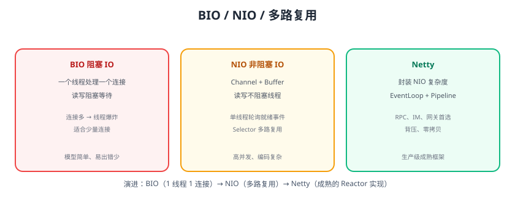

# Socket 与 IO 模型

Socket 是应用层与传输层之间的编程接口（IP + 端口）；IO 模型决定了服务端如何高效处理成千上万个连接。本页覆盖 Java Socket 编程、BIO/NIO/多路复用，以及 IO 模型演进。



## Socket 基础

```text
服务端：ServerSocket 监听 → accept 接受连接 → 读写
客户端：Socket 连接服务端 → 读写 → 关闭
```

### TCP 服务端（BIO）

```java
import java.io.*;
import java.net.*;

public class BioServer {
    public static void main(String[] args) throws IOException {
        ServerSocket server = new ServerSocket(8080);
        System.out.println("server listening on 8080");
        while (true) {
            Socket socket = server.accept();   // 阻塞等待连接
            new Thread(() -> handle(socket)).start();   // 每连接一线程
        }
    }

    static void handle(Socket socket) {
        try (BufferedReader in = new BufferedReader(
                new InputStreamReader(socket.getInputStream()));
             PrintWriter out = new PrintWriter(socket.getOutputStream(), true)) {
            String line = in.readLine();       // 阻塞读
            System.out.println("received: " + line);
            out.println("echo: " + line);
        } catch (IOException e) {
            e.printStackTrace();
        }
    }
}
```

### TCP 客户端

```java
try (Socket socket = new Socket("localhost", 8080);
     PrintWriter out = new PrintWriter(socket.getOutputStream(), true);
     BufferedReader in = new BufferedReader(
         new InputStreamReader(socket.getInputStream()))) {
    out.println("hello");
    System.out.println(in.readLine());   // echo: hello
}
```

## 五种 IO 模型

| 模型 | 说明 | Java 对应 |
| --- | --- | --- |
| 阻塞 IO（BIO） | 读写阻塞线程 | 传统 Socket |
| 非阻塞 IO（NIO） | 读写立即返回，忙轮询 | NIO Channel 非阻塞模式 |
| IO 多路复用 | Selector 监听多连接就绪 | NIO Selector |
| 信号驱动 IO | 数据就绪发信号 | 少见 |
| 异步 IO（AIO） | 内核完成后回调 | Java AIO / Netty 的 Future |

## NIO 核心组件

| 组件 | 作用 |
| --- | --- |
| Channel | 双向通道（SocketChannel、ServerSocketChannel） |
| Buffer | 数据容器（ByteBuffer） |
| Selector | 多路复用器：一个线程监听多个 Channel 事件 |

### NIO Selector 模型

```java
Selector selector = Selector.open();
ServerSocketChannel ssc = ServerSocketChannel.open();
ssc.configureBlocking(false);                    // 非阻塞
ssc.bind(new InetSocketAddress(8080));
ssc.register(selector, SelectionKey.OP_ACCEPT);

while (true) {
    selector.select();                           // 阻塞到有事件
    for (SelectionKey key : selector.selectedKeys()) {
        if (key.isAcceptable()) {
            SocketChannel sc = ssc.accept();
            sc.configureBlocking(false);
            sc.register(selector, SelectionKey.OP_READ);
        } else if (key.isReadable()) {
            // 读取数据
        }
    }
}
```

**一个线程管理成千上万个连接**——这就是高并发 IO 的核心。

## Reactor 模式

Netty 采用的经典模式：

```text
Reactor（事件分发）：负责监听与分发事件
  ├── Acceptor：接受连接
  └── Handler：处理读写业务
```

演进：

1. 单 Reactor 单线程：简单，处理慢会阻塞。
2. 单 Reactor 多线程：IO 与业务线程分离。
3. 主从 Reactor 多线程：Boss 接连接，Worker 处理 IO（Netty 默认）。

## 易错点与最佳实践

::: danger 常见错误
1. **BIO 一连接一线程**：上万连接 = 上万线程，内存/上下文切换爆炸。
2. **NIO 忘记 configureBlocking(false)**：阻塞模式下 Selector 不生效。
3. **ByteBuffer 翻转错误**：写后读要 `flip()`，读完要 `clear()`/`compact()`。
4. **Selector 空转**：selectedKeys 没清空，同一事件反复处理。
5. **业务逻辑放 IO 线程**：阻塞业务拖垮 EventLoop；业务放独立线程池。
6. **半包处理缺失**：TCP 字节流要处理粘包拆包（见 [粘包拆包](../StickyHalf/index.md)）。
:::

::: tip 最佳实践
1. 少量连接用 BIO 简单可靠；高并发用 Netty。
2. 写服务端先画 IO 模型，再选框架。
3. 用 Netty 而非裸 NIO：生产级封装（ByteBuf、编解码、背压）。
4. 压测验证线程数、连接数与吞吐的关系。
:::

## 验证方式

1. 运行 BIO 服务端 + 客户端，确认 echo 正常。
2. 用 NIO Selector 实现一个简易服务，`ss -tn` 观察连接处理。
3. 压测 1 万连接，对比 BIO 与 NIO 的线程数与内存。

## 参考资料

- Java Socket 教程：https://docs.oracle.com/javase/tutorial/networking/sockets/
- Java NIO：https://docs.oracle.com/javase/tutorial/essential/io/fileio.html
- 五种 IO 模型（UNIX 网络编程，Richard Stevens）
- Netty 权威指南（书籍）
