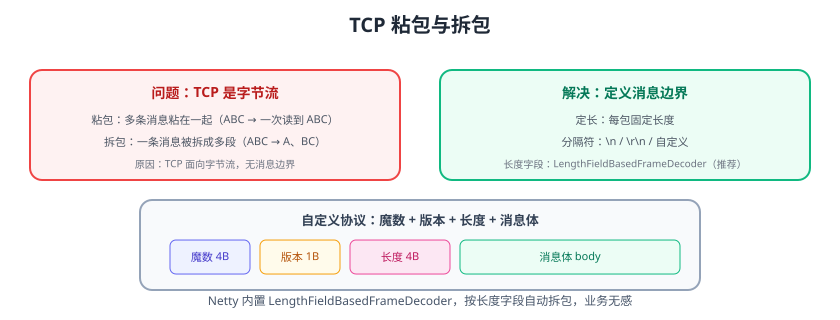

# 粘包拆包与编解码

TCP 是**面向字节流**的协议，没有消息边界：应用层发两次消息，接收方可能一次读到（粘包），或一条消息分多次读到（拆包）。处理粘包拆包是网络编程的必修课，Netty 内置了解码器让业务无感。



## 为什么会出现粘包/拆包

```text
发送方发送：A、B、C 三条消息
接收方可能读到：ABC（粘包）、A、BC（拆包）
```

原因：

1. TCP 按缓冲区批量发送，多次 write 可能合并。
2. 接收缓冲区大小限制，一次 read 可能只读到部分。
3. Nagle 算法与延迟确认的影响。

## 四种解决方案

| 方案 | 原理 | 适用 |
| --- | --- | --- |
| 固定长度 | 每条消息定长，不足补位 | 简单协议 |
| 分隔符 | 用 `\n`、`\r\n` 等分隔 | 文本协议 |
| 长度字段 | 头部携带长度，按长度切分 | 二进制协议（推荐） |
| 消息本身定界 | 业务上自带结束标记 | 特殊场景 |

## Netty 内置解码器

### LineBasedFrameDecoder（换行分隔）

```java
ch.pipeline().addLast(new LineBasedFrameDecoder(1024));
```

### DelimiterBasedFrameDecoder（自定义分隔符）

```java
ByteBuf delimiter = Unpooled.copiedBuffer("|".getBytes());
ch.pipeline().addLast(new DelimiterBasedFrameDecoder(1024, delimiter));
```

### FixedLengthFrameDecoder（定长）

```java
ch.pipeline().addLast(new FixedLengthFrameDecoder(100));
```

### LengthFieldBasedFrameDecoder（长度字段，最推荐）

```java
// maxFrameLength=1024, lengthFieldOffset=0, lengthFieldLength=4
ch.pipeline().addLast(new LengthFieldBasedFrameDecoder(1024, 0, 4, 0, 4));
```

对应协议：`[长度 4B][消息体]`。

## 自定义协议示例

协议设计：

```text
魔数(4B) + 版本(1B) + 类型(1B) + 长度(4B) + 消息体(N)
```

### 编码器

```java [MessageEncoder.java]
public class MessageEncoder extends MessageToByteEncoder<Message> {
    @Override
    protected void encode(ChannelHandlerContext ctx, Message msg, ByteBuf out) {
        byte[] body = msg.getBody().getBytes(StandardCharsets.UTF_8);
        out.writeInt(0x12345678);          // 魔数
        out.writeByte(1);                  // 版本
        out.writeByte(msg.getType());      // 类型
        out.writeInt(body.length);         // 长度
        out.writeBytes(body);              // 消息体
    }
}
```

### 解码器

```java [MessageDecoder.java]
public class MessageDecoder extends ByteToMessageDecoder {
    @Override
    protected void decode(ChannelHandlerContext ctx, ByteBuf in, List<Object> out) {
        if (in.readableBytes() < 10) return;          // 头部不足，等待更多数据
        in.markReaderIndex();
        int magic = in.readInt();
        if (magic != 0x12345678) {                    // 魔数校验失败
            ctx.close();
            return;
        }
        in.readByte();                                // 版本
        byte type = in.readByte();                    // 类型
        int length = in.readInt();                    // 长度
        if (in.readableBytes() < length) {            // 消息体未到齐
            in.resetReaderIndex();
            return;
        }
        byte[] body = new byte[length];
        in.readBytes(body);
        out.add(new Message(type, new String(body, StandardCharsets.UTF_8)));
    }
}
```

::: tip 推荐组合
**LengthFieldBasedFrameDecoder（拆帧）→ 自定义 Decoder（解析协议）→ 业务 Handler**，拆帧与解析职责分离。
:::

## 易错点与最佳实践

::: danger 常见错误
1. **只用一个解码器处理所有**：拆帧（边界）与解析（协议）分开，便于复用与测试。
2. **长度字段无上限**：恶意包长度巨大 → 内存耗尽；maxFrameLength 必须设置。
3. **忽略魔数校验**：错误数据流会污染后续解析；魔数快速识别。
4. **半包时直接丢弃**：解码器必须等待数据到齐（`resetReaderIndex` 或交给框架）。
5. **编码器不在 Pipeline 正确位置**：出站顺序错误导致对端解析失败。
6. **协议版本不兼容**：版本字段 + 升级策略，避免老客户端崩。
:::

::: tip 最佳实践
1. 新协议优先用「魔数 + 版本 + 长度 + 消息体」结构。
2. 长度上限按业务估算并设安全余量。
3. 协议文档化：字段、字节序（大端）、示例报文。
4. 编解码器单独单元测试：构造粘包/拆包数据验证。
5. 灰度兼容：协议升级支持多版本。
:::

## 验证方式

1. 用 LengthFieldBasedFrameDecoder + 自定义编解码器跑通收发。
2. 写测试：一次发送多条消息，确认接收方按条解析。
3. 构造半包（分两次写入），确认解码器等待完整后再输出。
4. 发送魔数错误数据，确认连接被关闭。

## 参考资料

- Netty 编解码：https://netty.io/4.1/api/io/netty/handler/codec/package-summary.html
- LengthFieldBasedFrameDecoder：https://netty.io/4.1/api/io/netty/handler/codec/LengthFieldBasedFrameDecoder.html
- Netty 实战（书籍）编解码章节
