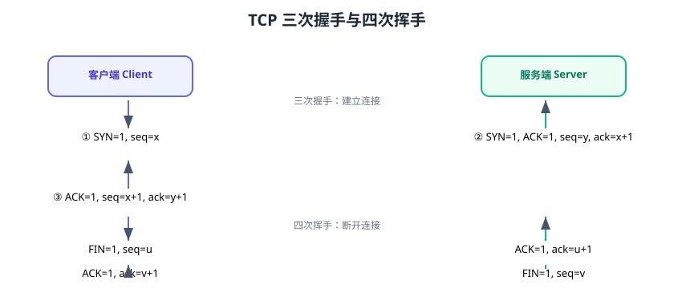

# TCP 与 UDP 详解

TCP（Transmission Control Protocol）与 UDP（User Datagram Protocol）是传输层两大协议：TCP 可靠有序但开销大，UDP 快速轻量但可能丢包。选型的关键是业务能否容忍丢包与乱序。



## TCP vs UDP

| 维度 | TCP | UDP |
| --- | --- | --- |
| 连接 | 面向连接（三次握手） | 无连接 |
| 可靠性 | 可靠：确认、重传、有序 | 不可靠：可能丢包乱序 |
| 传输方式 | 字节流 | 数据报（保留消息边界） |
| 速度 | 慢（开销大） | 快 |
| 流量/拥塞控制 | 有 | 无 |
| 头部 | 20 字节 | 8 字节 |
| 典型应用 | HTTP、数据库、文件传输 | DNS、视频、游戏、实时通信 |

## TCP 三次握手

```text
客户端                      服务端
  |---- SYN=1, seq=x ------->|
  |<--- SYN=1, ACK=1, seq=y, ack=x+1 ----|
  |---- ACK=1, seq=x+1, ack=y+1 -------->|
```

为什么是三次？

1. 确认双方收发能力正常。
2. 防止“已失效的连接请求”突然到达服务端造成资源浪费。
3. 同步双方的初始序列号。

## TCP 四次挥手

```text
客户端                      服务端
  |---- FIN=1 -------->|    客户端不再发数据
  |<--- ACK -----------|    服务端确认
  |<--- FIN=1 ---------|    服务端也不再发数据
  |---- ACK ---------->|    客户端确认，进入 TIME_WAIT
```

为什么是四次？TCP 是全双工，两个方向要**各自关闭**；第二次与第三次不能合并是因为服务端可能还有数据要发。

## TCP 可靠传输机制

| 机制 | 作用 |
| --- | --- |
| 确认应答（ACK） | 接收方确认收到 |
| 超时重传 | 超时未确认则重发 |
| 滑动窗口 | 流量控制，按接收方能力发送 |
| 拥塞控制 | 慢启动、拥塞避免、快重传、快恢复 |
| 序列号 | 保证有序、去重 |
| 校验和 | 检测数据损坏 |

## TCP 状态机

```text
CLOSED → LISTEN → SYN_SENT/SYN_RCVD → ESTABLISHED
→ FIN_WAIT_1 → FIN_WAIT_2 → TIME_WAIT → CLOSED
→ CLOSE_WAIT → LAST_ACK
```

::: danger 高频故障状态
1. **TIME_WAIT 大量**：主动关闭方等待 2MSL；高并发短连接会堆积，调参或复用连接。
2. **CLOSE_WAIT 堆积**：服务端收到 FIN 没关闭 Socket（代码没 close），连接泄漏。
3. **SYN 洪水**：半连接占满队列，可用 SYN Cookie 防护。
:::

## UDP 的特点

UDP 无连接、无状态，直接发送数据报：

- 低延迟：适合实时音视频、游戏。
- 无重传：适合可容忍丢包的场景。
- 保留边界：一次 send 对应一次 recv（数据报）。
- DNS、DHCP、QUIC（HTTP/3）底层都用 UDP。

## 选型决策

| 场景 | 选型 | 理由 |
| --- | --- | --- |
| Web/API/数据库 | TCP | 必须可靠 |
| 文件传输 | TCP | 不能丢 |
| 实时视频/语音 | UDP | 延迟优先，丢包可接受 |
| 游戏位置同步 | UDP | 旧数据无意义 |
| DNS 查询 | UDP | 一次一问一答 |
| HTTP/3 | QUIC（基于 UDP） | 降低握手延迟 |

## 易错点与最佳实践

::: danger 常见错误
1. **用 TCP 做实时音视频**：网络抖动时 TCP 重传造成卡顿；用 UDP + 丢包恢复。
2. **忽视 CLOSE_WAIT**：服务端不关闭连接，句柄耗尽；代码必须正确关闭。
3. **UDP 假设一定送达**：UDP 会丢包，业务要自己做重传/超时（或换 QUIC）。
4. **握手次数误区**：不是“三次=可靠”，可靠靠的是确认与重传机制。
5. **TIME_WAIT 处理错误**：盲目调小 2MSL 有安全风险，先优化连接复用。
:::

::: tip 最佳实践
1. 长连接场景用连接池/复用，减少握手与 TIME_WAIT。
2. 服务端优雅关闭：读尽数据再 close，避免 RST。
3. 实时场景评估 QUIC：兼具 UDP 速度与可靠传输。
4. 监控 TCP 状态：TIME_WAIT、CLOSE_WAIT 数量是健康信号。
:::

## 验证方式

1. 用 `netstat -ant` 观察各连接状态与数量。
2. 抓包（tcpdump）观察一次 HTTP 请求的三次握手与四次挥手。
3. 用 `ss -s` 查看系统 TCP 状态统计，找出 TIME_WAIT/CLOSE_WAIT 异常。

## 参考资料

- RFC 793（TCP）：https://www.rfc-editor.org/rfc/rfc793
- RFC 768（UDP）：https://www.rfc-editor.org/rfc/rfc768
- TCP 拥塞控制（RFC 5681）：https://www.rfc-editor.org/rfc/rfc5681
- 网络调试工具：https://www.man7.org/linux/man-pages/man8/tcpdump.8.html
