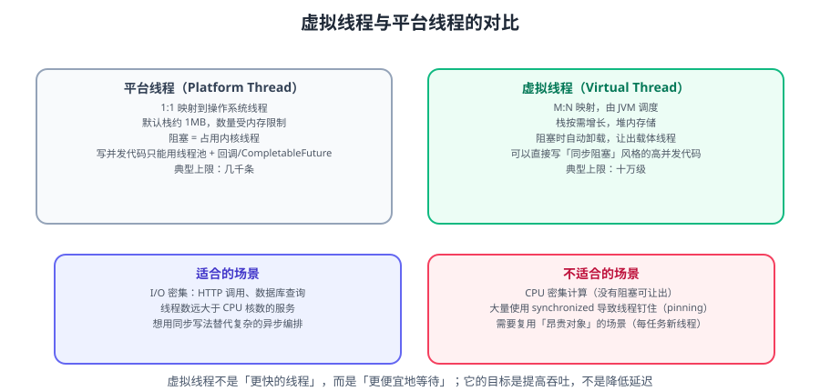

# 虚拟线程与高并发模型

Java 21 正式引入的**虚拟线程（Virtual Thread）**改变了「高并发只能用异步」的默认答案。本篇讲清虚拟线程的原理、与平台线程的取舍、常见陷阱，以及如何把现有线程池代码迁移过来。



::: info 版本说明（2026-09 核对）
- 虚拟线程（JEP 444）在 **JDK 21** 正式发布，**JDK 25（LTS）** 中已稳定可用。
- 配套的 **Scoped Values**（JEP 506）在 **JDK 25** 正式发布；**结构化并发**仍为预览（Preview）。
- 本篇示例按 **JDK 21+** 编写，预览 API 已标注。
:::

::: tip 一句话理解
虚拟线程不是「更快的线程」，而是**「更便宜地等待」**。
它解决的是「阻塞成本高」，不是「CPU 计算慢」——所以它提升的是**吞吐量**，不是单请求延迟。
:::

## 一、为什么需要虚拟线程

传统 Java 的并发模型有一个根本矛盾：

```text
线程 = 操作系统线程（1:1）
  → 创建/切换成本高
  → 栈默认约 1MB，几千个就吃满内存
  → 所以必须"池化"复用，池大小 ≈ 最大并发
  → 但池满了，请求就要排队
```

于是为了用更少的线程支撑更多并发，演化出了异步编程：

```java
// 异步（CompletableFuture）：不占线程，但代码难写、难调、难排错
CompletableFuture.supplyAsync(() -> fetchUser(id))
    .thenCombine(CompletableFuture.supplyAsync(() -> fetchOrder(id)), Result::new)
    .thenAccept(r -> render(r))
    .exceptionally(ex -> { log.error("失败", ex); return null; });
```

虚拟线程给了第三条路：**用同步的写法，拿到异步的吞吐**。

```java
// 虚拟线程：写法是同步的，但阻塞不占内核线程
try (var executor = Executors.newVirtualThreadPerTaskExecutor()) {
    Future<Result> f = executor.submit(() -> {
        User u = fetchUser(id);       // 阻塞时自动卸载，让出载体线程
        Order o = fetchOrder(id);
        return new Result(u, o);
    });
    return f.get();
}
```

## 二、原理：M:N 调度与「卸载」

| 概念 | 说明 |
| --- | --- |
| **虚拟线程** | JVM 层面的轻量线程，栈存在堆上，按需增长 |
| **载体线程（Carrier）** | 真正执行虚拟线程的平台线程，默认数量 = CPU 核数 |
| **挂载 / 卸载** | 虚拟线程运行时挂到载体上，遇到阻塞 IO 时卸载，让载体去跑别的虚拟线程 |
| **调度器** | `ForkJoinPool` 的 work-stealing 实现，无需配置 |

关键机制：**阻塞 IO 不再占用内核线程**。

```text
平台线程模型：
  请求 → 平台线程 → 阻塞等 DB → 内核线程闲置但被占用
  1000 并发 → 需要 1000 个线程 → 内存扛不住

虚拟线程模型：
  请求 → 虚拟线程 → 阻塞等 DB → 自动卸载 → 载体线程去跑别的虚拟线程
  1000 并发 → 只有 8~16 个载体线程 → 内存占用极低
```

::: warning 卸载只在「可识别的阻塞点」发生
以下情况**不会卸载**，会「钉住（pin）」载体线程：
1. 在 `synchronized` 块内阻塞；
2. 调用 **本地方法（native）** 阻塞；
3. 解析类初始化时的阻塞。
钉住会让载体线程被独占，吞吐下降。
:::

## 三、虚拟线程 vs 平台线程：怎么选

| 维度 | 平台线程 | 虚拟线程 |
| --- | --- | --- |
| 映射 | 1:1 到 OS 线程 | M:N，JVM 调度 |
| 栈 | 约 1MB（默认） | 堆内，按需增长 |
| 数量级 | 几千 | 十万级 |
| 创建成本 | 高 | 极低 |
| 适合 | CPU 密集、需长时间占 CPU | I/O 密集、大量等待 |
| 池化 | 需要 | **不需要** |

::: danger 两类场景不要用虚拟线程
1. **CPU 密集型任务**：没有阻塞可让出，虚拟线程只会增加调度开销。用固定大小的平台线程池（大小 ≈ 核数）。
2. **大量 `synchronized` 的代码**：会频繁 pinning，反而更慢——先把锁换成 `ReentrantLock`。
:::

## 四、迁移：从线程池到虚拟线程

### 4.1 不要「池化」虚拟线程

```java
// 反例：把虚拟线程装进线程池
ExecutorService pool = Executors.newFixedThreadPool(200, Thread.ofVirtual().factory());

// 正例一：每任务一个虚拟线程
try (var executor = Executors.newVirtualThreadPerTaskExecutor()) {
    executor.submit(task);
}

// 正例二：直接用 Thread.Builder
Thread t = Thread.ofVirtual().name("req-", 0).start(task);
```

::: danger 为什么不能池化虚拟线程
虚拟线程的设计前提是**「用完即弃、极其廉价」**。
池化会带来两个问题：
1. 失去了「阻塞时卸载」的意义（线程被占用着不能销毁）；
2. 若用队列限流，问题会从「线程不够」变成「队列积压」，反而掩盖了容量问题。
**并发上限应该用信号量（Semaphore）或网关限流来控制，而不是线程池大小。**
:::

### 4.2 用 Semaphore 做并发限流

```java
// 想限制"同时访问下游"的数量 → 用信号量，而不是限制线程数
private static final Semaphore DB_PERMITS = new Semaphore(50);

public Result callDb(String id) throws InterruptedException {
    DB_PERMITS.acquire();
    try {
        return db.query(id);
    } finally {
        DB_PERMITS.release();
    }
}
```

### 4.3 替换 `ThreadLocal` 为 `ScopedValue`（JDK 25 正式）

```java
// 旧写法：ThreadLocal（虚拟线程数量大时有内存风险，且需手动 remove）
private static final ThreadLocal<User> CURRENT = new ThreadLocal<>();
CURRENT.set(user);
try { handle(); } finally { CURRENT.remove(); }

// 新写法：ScopedValue（不可变、作用域结束自动失效、天然支持虚拟线程）
public static final ScopedValue<User> CURRENT_USER = ScopedValue.newInstance();

ScopedValue.where(CURRENT_USER, user).run(() -> handle());
// 作用域外访问 CURRENT_USER.get() 会抛 NoSuchElementException
```

::: info MDC 日志上下文怎么办
日志框架（Logback / Log4j2）依赖 `ThreadLocal` 传递 MDC。
虚拟线程下有两种做法：
1. 检查所用版本是否已支持 `ScopedValue`（Log4j2 / Logback 新版本在跟进）；
2. 退一步：**在业务入口把 traceId 作为参数显式传递**，或每个虚拟线程内单独 set/remove MDC（注意及时清理）。
:::

## 五、框架集成

### 5.1 Spring Boot 3.2+ 一键开启

```properties
# application.properties
spring.threads.virtual.enabled=true
```

开启后 Spring Boot 会把 **Tomcat 的请求处理线程池**换成每请求一个虚拟线程（`VirtualThreadTaskExecutor`）。

::: warning 开启前先确认三件事
1. **依赖是否 pinning 友好**：老版本 JDBC 驱动、老版本连接池可能大量用 `synchronized`。
2. **连接池大小**：虚拟线程能开十万并发，但**数据库连接只有几十个**。真正的瓶颈会从线程转移到连接池——需重新评估 `maximumPoolSize` 与超时。
3. **下游限流**：应用能接住十万并发，但下游（第三方 API）不能。**必须加信号量或熔断**。
:::

### 5.2 数据库连接池是新的瓶颈

```text
开启虚拟线程前：并发 200（受线程池限制）→ 连接池 50 够用
开启虚拟线程后：并发 5000 → 5000 个虚拟线程同时抢 50 个连接
  → 大量线程在等待连接 → 超时 → 反而更差
```

**对策**：给「获取连接」这一步加超时，并显式限制并发（信号量）：

```java
// HikariCP 建议设置合理的 connection-timeout，避免无限等待
// spring.datasource.hikari.connection-timeout=3000
// spring.datasource.hikari.maximum-pool-size=50
```

## 六、结构化并发（预览）

```java
// JDK 21+ 预览 API（需 --enable-preview）
try (var scope = new StructuredTaskScope.ShutdownOnFailure()) {
    Subtask<User>  u = scope.fork(() -> fetchUser(id));
    Subtask<Order> o = scope.fork(() -> fetchOrder(id));

    scope.join();            // 等全部完成
    scope.throwIfFailed();   // 任一失败则传播异常
    return new Result(u.get(), o.get());
}
```

它的价值：**子任务的生命周期被父作用域约束**——父作用域结束，未完成的子任务自动取消，不会「泄漏线程」。

| 对比 | 裸线程池 | 结构化并发 |
| --- | --- | --- |
| 失败传播 | 手动处理 | `throwIfFailed()` |
| 取消语义 | 手动 cancel | 作用域关闭自动取消 |
| 可观测性 | 难（线程散落） | 好（树形结构） |

::: danger 预览特性不要上生产
结构化并发在 JDK 25/26 仍是 **Preview**，API 可能变化。
生产可用替代：虚拟线程 + `CompletableFuture` + 显式 `orTimeout`。
:::

## 七、常见问题

| 现象 | 原因 | 对策 |
| --- | --- | --- |
| 开启后吞吐没提升 | 任务 CPU 密集，或大量 pinning | 用 JFR 检查 pinning 事件 |
| 开启后反而变慢 | 连接池/下游被打满 | 限流 + 调大连接池 + 设置超时 |
| 内存不降反升 | 每任务创建重对象 | 复用对象，别放 ThreadLocal |
| jstack 看不到虚拟线程 | 工具不识别 | 用 `jcmd <pid> Thread.dump_to_file -format=json` |
| `NoSuchElementException` | ScopedValue 作用域外访问 | 检查作用域范围 |

### 7.1 检测 pinning

```bash
# 方式一：JFR 事件（jdk.VirtualThreadPinned）
jcmd <pid> JFR.start name=vt settings=profile duration=30s filename=vt.jfr

# 方式二：系统属性打印 pinning 堆栈（调试用）
-Djdk.tracePinnedThreads=full
```

::: tip 迁移顺序建议
**先在「纯 I/O 密集、无 synchronized、依赖较新」的服务上试点**，
用压测对比吞吐与延迟；确认收益后再推广。
不要一次性把所有服务都开启。
:::

## 相关专题

- IO 模型基础（BIO/NIO/多路复用）：[Socket 与 IO 模型](SocketIO/index.md)
- Netty 线程模型（另一种高并发解法）：[Netty 进阶](NettyAdvanced/index.md)
- 压测与性能基准：[性能基准与压测](BenchmarkPractice/index.md)
- 现代 Java 语言特性（ScopedValue / record）：[现代 Java 与设计模式](../../DesignPatterns/ModernJava/index.md)

## 参考资料

- JEP 444：Virtual Threads：https://openjdk.org/jeps/444
- JEP 506：Scoped Values：https://openjdk.org/jeps/506
- JEP 453 / 480：Structured Concurrency：https://openjdk.org/jeps/480
- Oracle 虚拟线程官方指南：https://docs.oracle.com/en/java/javase/21/core/virtual-threads.html
- 本专题其余章节：[网络编程目录](../index.md)
