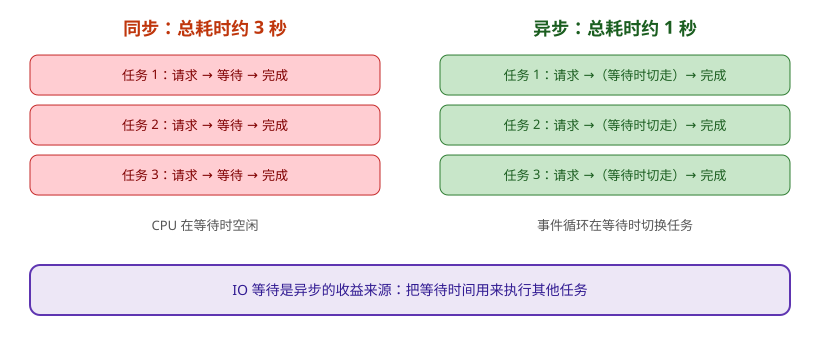

# Python 异步编程（asyncio）

asyncio 是 Python 标准库自带的异步编程框架，核心是 `async / await` 与**事件循环**。它最适合网络请求、文件 IO、数据库访问等 **IO 密集型**任务。

## 同步 vs 异步

- **同步**：一个任务执行完再执行下一个，等待 IO 时 CPU 闲着。
- **异步**：遇到 IO 等待就切换到其他任务，把等待时间利用起来。



## 核心概念

| 概念 | 说明 |
| --- | --- |
| `async def` | 定义协程函数，调用后返回协程对象 |
| `await` | 挂起当前协程，等待结果 |
| `asyncio.run()` | 启动事件循环并运行主协程（推荐的高级入口） |
| `asyncio.create_task()` | 创建任务，让协程并发执行 |
| `asyncio.gather()` | 并发收集多个协程的结果 |

## 基础示例

```python
import asyncio

async def fetch(url):
    print(f"开始请求 {url}")
    await asyncio.sleep(1)   # 模拟网络 IO
    print(f"完成请求 {url}")
    return url

async def main():
    results = await asyncio.gather(
        fetch("a.com"),
        fetch("b.com"),
        fetch("c.com"),
    )
    print(results)

asyncio.run(main())
```

三个请求并发执行，总耗时约 **1 秒**，而不是同步的 3 秒。

## 用 create_task 并发

```python
async def main():
    task1 = asyncio.create_task(fetch("a.com"))
    task2 = asyncio.create_task(fetch("b.com"))
    await task1
    await task2
```

## 阻塞调用不要放进事件循环

::: danger 注意
1. 在协程里直接调用 `time.sleep`、`requests.get` 会阻塞整个事件循环，所有并发任务都会卡住。
2. 阻塞 IO 用 `asyncio.to_thread`（Python 3.9+）丢到线程池执行。
3. CPU 密集型任务考虑进程池（`ProcessPoolExecutor`），不要占用事件循环。
4. 每个线程应有自己的事件循环，不要跨线程共享。
:::

```python
import asyncio

def blocking_work(arg):
    # 这里是同步阻塞操作
    return arg

async def main():
    result = await asyncio.to_thread(blocking_work, "data")
    print(result)
```

## 超时控制

```python
async def main():
    try:
        result = await asyncio.wait_for(fetch("a.com"), timeout=2)
        print(result)
    except TimeoutError:
        print("请求超时")
```

## 验证建议

运行上面的 `gather` 示例，对比同步版本的总耗时：三个 1 秒的请求，同步约 3 秒，异步约 1 秒，就说明事件循环生效了。

## 相关专题

- [消息队列专题](../../MessageQueue/index.md)：异步任务的跨进程解耦——用 Kafka/RabbitMQ 替代进程内 `asyncio.Queue` 实现可靠分发
- [Redis 发布订阅与事务](../../../DB/NoRelational/Redis/PubSubTransaction/index.md)：轻量异步通知与正式 MQ 的边界
