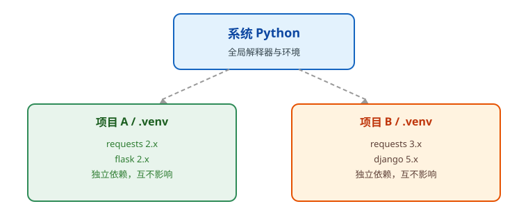

# Python 环境管理

Python 环境管理的目标：**每个项目一个独立环境，依赖可复现**。

## 为什么需要虚拟环境

- 不同项目的依赖版本可能互相冲突：项目 A 需要 `requests 2.x`，项目 B 需要 `requests 3.x`。
- 直接往系统环境装包容易污染全局环境，升级一个包可能弄坏其他项目。
- 虚拟环境是项目目录下的独立环境（通常是 `.venv`），拥有自己的 Python 解释器和依赖目录。



## venv（Python 自带）

创建虚拟环境：

```shell
python -m venv .venv
```

激活：

```shell
# Windows
.venv\Scripts\activate

# macOS / Linux
source .venv/bin/activate
```

退出环境：

```shell
deactivate
```

::: tip
新版 Python 推荐直接使用内置的 `venv`；老旧的 `virtualenv` 只有在特殊兼容场景才需要。
:::

## pip 基础

```shell
pip install requests
pip install -r requirements.txt
pip list
pip show requests
pip uninstall requests
```

生成依赖清单：

```shell
pip freeze > requirements.txt
```

## uv（推荐）

uv 是 Astral 团队用 Rust 写的 Python 包与项目管理工具，可以替代 `pip`、`pip-tools`、`virtualenv`、`poetry`、`pyenv` 等，安装速度通常快 **10~100 倍**。2026 年起新项目普遍推荐直接使用 uv。

安装：

```shell
# pip 安装
pip install uv

# macOS / Linux
curl -LsSf https://astral.sh/uv/install.sh | sh

# Windows PowerShell
irm https://astral.sh/uv/install.ps1 | iex
```

常用命令：

```shell
uv init my-project          # 初始化项目，生成 pyproject.toml
cd my-project
uv add requests             # 添加依赖并安装
uv run python main.py       # 在项目环境中运行
uv sync                     # 按 pyproject.toml 同步依赖
uv python install 3.14      # 安装指定 Python 版本
```

venv + pip 与 uv 的对比：

| 场景 | venv + pip | uv |
| --- | --- | --- |
| 创建环境 | `python -m venv .venv` | `uv venv` |
| 安装依赖 | `pip install requests` | `uv add requests` |
| 锁定依赖 | `pip freeze > requirements.txt` | `uv lock`（自动生成 uv.lock） |
| 管理 Python 版本 | 需要另装 pyenv | `uv python install` |
| 运行脚本 | 先激活再 `python main.py` | `uv run python main.py` |

::: danger 注意
1. 不要用 `sudo pip install` 全局安装项目依赖。
2. `.venv` 目录要加入 `.gitignore`，不要提交到仓库。
3. 依赖锁文件（`requirements.txt` / `uv.lock`）要提交到仓库，保证其他人可以复现环境。
:::
