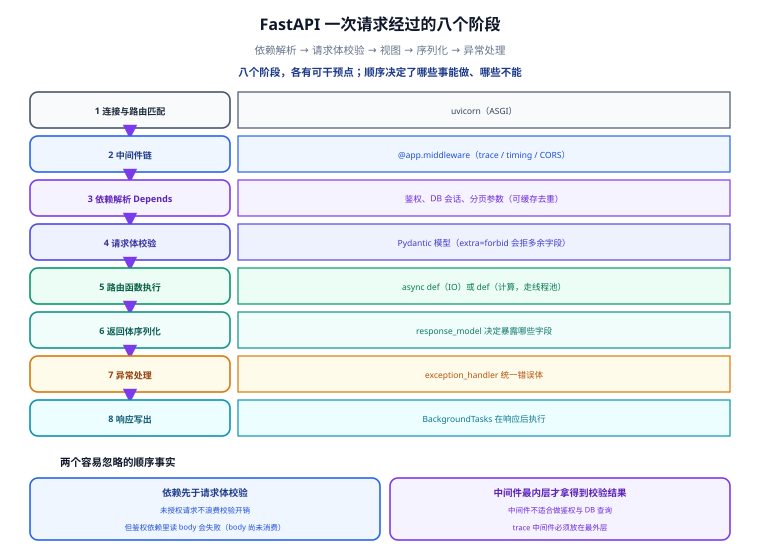

# FastAPI 进阶：类型、异步与依赖注入

一句话定位：FastAPI 的三根支柱是 **Pydantic（把类型变成校验与文档）**、**异步（把等待变成并发）**、**依赖注入（把横切逻辑变成可复用函数）**。三者用对就非常舒服，任一处误解都会写出「看起来一样但性能差十倍」的代码。



## 一、请求生命周期：八个阶段，各有可干预点

| 阶段 | 谁在做 | 可干预点 |
| --- | --- | --- |
| 1. 连接与路由匹配 | ASGI 服务器（uvicorn） | 中间件（在路由匹配前） |
| 2. 中间件链 | `@app.middleware("http")` | 计时、trace_id 注入、CORS |
| 3. 依赖解析 | `Depends` 递归解析 | **鉴权、DB 会话、分页参数** |
| 4. 请求体校验 | Pydantic 模型 | `model_config`、字段校验器 |
| 5. 路由函数执行 | 你的 `async def` / `def` | 业务逻辑 |
| 6. 返回体序列化 | Pydantic `response_model` | 控制暴露哪些字段 |
| 7. 异常处理 | `exception_handler` | 统一错误体 |
| 8. 响应写出 | ASGI send | 后台任务（`BackgroundTasks`）在响应后执行 |

**顺序很关键**：依赖在请求体校验**之前**解析。所以鉴权依赖即使请求体非法也会先跑——这既是优点（未授权请求不浪费校验开销）也是坑（鉴权依赖里读 `request.body()` 会失败，因为 body 还没读完 / 已被消费）。

## 二、Pydantic v2：v1 的写法基本全要改

### v1 → v2 的关键变化

| 场景 | v1 写法 | v2 写法 |
| --- | --- | --- |
| 配置 | `class Config: orm_mode = True` | `model_config = ConfigDict(from_attributes=True)` |
| 校验器 | `@validator("f")` | `@field_validator("f")` |
| 模型级校验 | `@root_validator` | `@model_validator(mode="after")` |
| 序列化 | `.dict()` / `.json()` | `.model_dump()` / `.model_dump_json()` |
| 解析 | `.parse_obj()` | `.model_validate()` |
| 字段定义 | `f: str = Field(...)` | 同（但 `Field` 参数有调整） |
| 可空字段 | `Optional[str] = None` | `str \| None = None`（推荐） |
| 校验性能 | Python 实现 | **Rust 实现的 `pydantic-core`，快数倍** |

::: danger 注意：v1 与 v2 不能在同一项目里混用
`pydantic.v1` 兼容命名空间只是**过渡工具**，不是长期方案。混用会导致：同一个字段在 v1 模型里约束生效、在 v2 模型里不生效；`TypeAdapter` 与 v1 模型互不识别。**升级时把所有模型一次性改完**，不要逐个文件渐进。
:::

### 三层模型分工（最重要的工程约定）

```python
# 输入模型：只包含允许客户端传的字段
class OrderIn(BaseModel):
    model_config = ConfigDict(extra="forbid")     # 多传字段直接报错，防止「静默忽略」
    user_id: int = Field(gt=0)
    sku_id: int = Field(gt=0)
    quantity: int = Field(gt=0, le=100)
    idempotency_key: str = Field(min_length=8, max_length=64)

# 输出模型：只包含允许客户端看的字段（不发价格成本、内部状态）
class OrderOut(BaseModel):
    model_config = ConfigDict(from_attributes=True)
    order_id: int
    amount_cents: int
    status: str
    created_at: datetime

# 内部模型：数据库/领域对象可以用 dataclass 或 SQLAlchemy 模型，不必是 Pydantic
```

::: tip `extra="forbid"` 值得作为默认
不写时 Pydantic 默认 `ignore`——客户端多传的字段会被**静默丢弃**。这看起来宽容，实际会造成「前端以为传了 `coupon_id`，后端从来没用过」这类跨团队误解。**对外接口一律 `forbid`**；只有需要透传未知字段的场景（如开放平台代理）才用 `allow`。
:::

### 字段级与模型级校验

```python
from pydantic import BaseModel, ConfigDict, Field, field_validator, model_validator

class PayIn(BaseModel):
    model_config = ConfigDict(extra="forbid")

    method: str
    amount_cents: int = Field(gt=0)
    coupon_code: str | None = None
    callback_url: str | None = None

    @field_validator("method")
    @classmethod
    def method_must_be_supported(cls, v: str) -> str:
        allowed = {"alipay", "wechat", "balance"}
        if v not in allowed:
            raise ValueError(f"不支持的支付方式: {v}")
        return v

    @model_validator(mode="after")
    def check_combination(self) -> "PayIn":
        # 跨字段约束只能放在模型级校验器里
        if self.method == "balance" and self.coupon_code:
            raise ValueError("余额支付不支持优惠券")
        if self.amount_cents > 100_000_00 and not self.callback_url:
            raise ValueError("大额支付必须提供 callback_url")
        return self
```

::: warning 说明：`mode="after"` 与 `mode="before"` 的区别
- `mode="before"` 拿到的是**原始输入**（dict 或任意类型），适合「先规整数据再校验」。
- `mode="after"` 拿到的是**已通过字段校验的模型实例**，适合跨字段约束。

**跨字段约束一律用 `mode="after"`**：在 `before` 里访问 `self.xxx` 会因为字段还没解析而报错或拿到错值。
:::

### 序列化的两个坑

```python
# 坑 1：model_dump() 默认不递归转换嵌套模型为 dict（v2 会转，但要注意 mode）
out = OrderOut.model_validate(orm_obj)
out.model_dump()            # Python 对象：datetime 还是 datetime，Decimal 还是 Decimal
out.model_dump(mode="json") # JSON 兼容：datetime → ISO 字符串（FastAPI 内部用这个）

# 坑 2：int64 大整数在 JSON 里
# Python 的 int 无上限，但前端 JS 的 Number 只有 2^53。
# 订单号/雪花 ID 超过 9e15 就会在前端精度丢失 → 用 str 传 ID
```

::: danger 注意：大整数 ID 必须用字符串传
Python 与 Go 都有 64 位整数，JS 的 `Number` 只有 53 位精度。`9007199254740993` 传到前端会变成 `9007199254740992`——**这个 bug 只在 ID 增长到一定规模后才出现**，早期测试完全看不到。做法：对外模型里把 ID 字段声明为 `str`，并在模型里加 `@field_serializer` 转换。
:::

## 三、`async def` 还是 `def`：一张判据表

| 视图函数里主要在做什么 | 用哪个 | 原因 |
| --- | --- | --- |
| 调外部 HTTP（`httpx`）、异步 DB、Redis | `async def` + `await` | 等待期间可以让出事件循环 |
| 读本地文件、CPU 计算、调用同步库 | **`def`** | FastAPI 会把它放进线程池，不阻塞事件循环 |
| 混合（一部分异步、一部分必须同步） | `async def` + `run_in_threadpool` | 只有把同步阻塞段挪到线程池 |
| 不确定 | **`def`** | 「慢一点」的代价远小于「阻塞整个事件循环」 |

```python
from fastapi.concurrency import run_in_threadpool

@app.get("/hash")
async def hash_pwd(pwd: str):
    # bcrypt 是 CPU 密集的同步调用，必须在同步视图里跑或显式挪到线程池
    return {"h": await run_in_threadpool(pwd_context.hash, pwd)}
```

### 事件循环被阻塞的典型症状

- 并发压测时**所有**请求一起变慢（而不是只有慢的那个变慢）。
- `/health` 端点也超时（健康检查也要走事件循环）。
- CPU 没打满、连接数也没打满，但 QPS 上不去。

::: tip 用一条命令确认是否被阻塞
在压测期间另开一个终端：

```shell
# 若这个请求要等几秒才返回，说明事件循环被占住了
time curl -s http://127.0.0.1:8000/health
```
:::

## 四、依赖注入：`Depends` 的正确用法

### 用 `Annotated` 声明依赖（推荐写法）

```python
from typing import Annotated
from fastapi import Depends, HTTPException, Header, status

async def get_db() -> AsyncIterator[AsyncSession]:
    async with SessionLocal() as session:
        try:
            yield session
            await session.commit()          # 正常路径提交
        except Exception:
            await session.rollback()        # 异常路径回滚
            raise
        # 退出 async with 时会自动 close（连接归还池）

async def current_user(
    db: Annotated[AsyncSession, Depends(get_db)],
    authorization: Annotated[str | None, Header()] = None,
) -> User:
    if not authorization or not authorization.startswith("Bearer "):
        raise HTTPException(status.HTTP_401_UNAUTHORIZED, "缺少 Bearer Token")
    payload = verify_jwt(authorization.removeprefix("Bearer ").strip())
    user = await db.get(User, payload["sub"])
    if user is None:
        raise HTTPException(status.HTTP_401_UNAUTHORIZED, "用户不存在")
    return user

# 视图里直接用类型别名，签名干净
DbSession = Annotated[AsyncSession, Depends(get_db)]
CurrentUser = Annotated[User, Depends(current_user)]

@app.post("/order/create", response_model=OrderOut)
async def create_order(payload: OrderIn, db: DbSession, user: CurrentUser):
    ...
```

::: tip 依赖树是自动去重的
`create_order` 同时依赖 `DbSession` 与 `CurrentUser`，而 `CurrentUser` 内部也依赖 `DbSession`。FastAPI 默认 `use_cache=True`，**同一次请求内 `get_db` 只执行一次**，`db` 是同一个对象——这正是事务能跨依赖工作的前提。

如果需要每次调用都新建实例（很少见），用 `Depends(get_db, use_cache=False)`。
:::

### 带 `yield` 的依赖：资源生命周期的落点

```text
请求开始 → get_db 执行到 yield（拿到会话）
        → 视图执行（用同一个会话）
        → 视图返回/抛异常
        → get_db 继续执行 yield 之后的代码（提交或回滚）
        → 会话关闭
```

::: danger 注意：三个关于 yield 依赖的坑
1. **不要在里面 `commit` 两次**：视图里如果自己 `await db.commit()`，依赖退出时再 commit 一次就会报 `This session is in 'committed' state` 或产生空事务。**约定「提交只在一处发生」**——推荐统一由依赖负责提交，视图里不 commit。
2. **`HTTPException` 抛出时，yield 依赖的清理代码会执行，但异常会往上抛**：所以 `rollback` 写在 `except` 里是必要的，否则连接会被归还到池里还带着未回滚的事务（`idle in transaction`，会长时间持有锁）。
3. **不要在依赖里做「不可回滚」的操作**（如调用外部支付接口）：依赖可能因为后续校验失败而被回滚，但外部调用已经发生了。外部副作用必须放在事务提交之后。
:::

### 依赖不是万能的：什么时候不该用

| 该用依赖 | 不该用依赖 |
| --- | --- |
| 鉴权、DB 会话、分页参数、租户解析 | 一两个视图里才用到的业务逻辑 |
| 需要被多个视图复用的横切能力 | 需要按条件分支调用不同实现的场景（用普通函数更清楚） |
| 需要出现在 OpenAPI 文档里的安全声明 | 只是为了少写几行 import |

## 五、错误处理：统一响应体

```python
from fastapi import FastAPI, Request
from fastapi.exceptions import RequestValidationError
from fastapi.responses import JSONResponse

app = FastAPI()

@app.exception_handler(RequestValidationError)
async def validation_handler(request: Request, exc: RequestValidationError):
    # 默认返回的 422 结构对前端不够友好，收敛成统一格式
    fields = [
        {"field": ".".join(str(x) for x in e["loc"][1:]), "msg": e["msg"], "type": e["type"]}
        for e in exc.errors()
    ]
    return JSONResponse(
        status_code=422,
        content={"code": 40001, "message": "参数校验失败", "fields": fields},
    )

@app.exception_handler(Exception)
async def unhandled_handler(request: Request, exc: Exception):
    # 未捕获异常：日志里留全栈，响应里只给通用文案
    logger.exception("unhandled error path=%s", request.url.path)
    return JSONResponse(status_code=500, content={"code": 50000, "message": "服务内部错误"})
```

::: danger 注意：`@app.exception_handler(Exception)` 有自己的边界
它**捕获不到**：ASGI 层面的错误、`BaseException`（如 `KeyboardInterrupt`）、响应已经开始写出之后的异常。所以：
- 生产环境仍然需要 uvicorn / Gunicorn 层面的错误日志与进程守护；
- 兜底 handler **不能代替**每个业务点的显式错误处理。

另一个常见错误是把内部错误详情直接返回：`{"message": str(exc)}` 会泄漏 SQL 语句、文件路径甚至凭据。**内部详情只进日志，响应里只给错误码 + 通用文案。**
:::

## 六、lifespan 与中间件

### 用 `lifespan` 替代 `on_event`

```python
from contextlib import asynccontextmanager

@asynccontextmanager
async def lifespan(app: FastAPI):
    # 启动：建连接池、预热、注册到注册中心
    engine = create_async_engine(settings.db_url, pool_size=20, max_overflow=10)
    app.state.engine = engine
    app.state.redis = Redis.from_url(settings.redis_url)
    yield                                  # 服务运行期间
    # 关闭：先摘除注册，再关连接池（顺序同 Go 侧）
    await app.state.redis.aclose()
    await engine.dispose()

app = FastAPI(lifespan=lifespan)
```

`on_event("startup")` / `on_event("shutdown")` 已被标记为废弃（deprecated），统一改用 `lifespan`。理由不只是「更新」，而是 `lifespan` 保证了**启动与关闭逻辑写在同一处**，不会出现「启动加了东西、关闭忘了对应清理」。

### 中间件的顺序

```python
app.add_middleware(CORSMiddleware, ...)      # 最后添加 = 最外层执行
app.add_middleware(TraceIDMiddleware)        # 其次
app.add_middleware(TimingMiddleware)         # 最内层
```

**FastAPI 中间件的执行顺序与添加顺序相反**（后添加的在更外层）。trace_id 中间件要能覆盖到 CORS 之后的全部逻辑，就得放在 `CORSMiddleware` 的**之后**添加。

::: warning 说明：中间件不适合做的事
1. **不要用中间件做鉴权**：中间件拿不到依赖解析结果与 Pydantic 模型，还得手工解析 Token；用依赖更清晰，且会自动出现在 OpenAPI 的安全声明里。
2. **不要在中间件里做 DB 查询**：每个请求（包括 `/health`、静态资源）都会执行，代价被放大。
3. **不要在中间件里读 `request.body()`**：body 是流，读走后下游就拿不到了（除非用 `await request.body()` 缓存，但大 body 会吃内存）。
:::

## 七、常见问题与排错

| 现象 | 高概率原因 | 定位手段 |
| --- | --- | --- |
| 并发上不去，所有请求一起慢 | `async def` 里有同步阻塞调用 | 压测时 `time curl /health`；搜代码里的 `requests.` / `time.sleep` / 同步 DB 调用 |
| `422` 报错但字段看着没问题 | `extra="forbid"` 收到多余字段，或类型不匹配（如 `"1"` 传给 int） | 看响应里的 `fields` 数组，逐项核对 |
| 响应里字段少了 | 用了 `response_model` 且模型里没声明该字段 | 这正是 `response_model` 的作用；要加字段就在输出模型里加 |
| `idle in transaction` 堆积 | yield 依赖里异常路径没 rollback | 查 `pg_stat_activity` / MySQL `PROCESSLIST` |
| 依赖被执行了多次 | 参数里写了 `Depends(f)` 又直接调 `f()` | 统一用 `Annotated[..., Depends(f)]` |
| 大 ID 前端精度丢失 | int64 走 JSON number | 对外模型把 ID 声明为 `str` |

## 八、验证方式

```shell
# 1. 文档自动生成（FastAPI 的核心卖点）
curl -s http://127.0.0.1:8000/openapi.json | python -m json.tool | head -30

# 2. 参数校验确实生效（错误字段应被指出）
curl -s -X POST http://127.0.0.1:8000/order/create \
  -H 'Content-Type: application/json' -d '{"user_id":0,"quantity":9999}'
# 期望：422，且 fields 里列出 user_id 与 quantity

# 3. 多余字段被拒（extra=forbid）
curl -s -X POST http://127.0.0.1:8000/order/create \
  -H 'Content-Type: application/json' -d '{"user_id":1,"sku_id":1,"quantity":1,"idempotency_key":"k-001","hack":1}'
# 期望：422，提示存在额外字段

# 4. 无 Token 被拒
curl -s -o /dev/null -w '%{http_code}\n' -X POST http://127.0.0.1:8000/order/create
# 期望：401

# 5. 事件循环没被阻塞（压测期间另开终端执行）
time curl -s -o /dev/null http://127.0.0.1:8000/health
# 期望：real < 0.05s
```

## 参考资料

- [FastAPI 官方：依赖注入（含 `Annotated` 推荐写法）](https://fastapi.tiangolo.com/tutorial/dependencies/)
- [FastAPI 官方：并发与 `async` / `await`](https://fastapi.tiangolo.com/async/)
- [FastAPI 官方：lifespan 事件](https://fastapi.tiangolo.com/advanced/events/)
- [Pydantic v2 官方文档](https://docs.pydantic.dev/latest/)
- [Pydantic v2 迁移指南](https://docs.pydantic.dev/latest/migration/)
- [Starlette：中间件与执行顺序](https://www.starlette.io/middleware/)

## 相关页面

- [框架选型：FastAPI / Django / Flask](../Overview/index.md) —— 为什么选 FastAPI
- [数据层：SQLAlchemy 2.0 与 Alembic](../DataLayer/index.md) —— `get_db` 依赖背后的异步会话
- [实战：可部署的 API 服务](../Practice/index.md) —— 把本篇的模式组装成工程
- [Python 异步编程](../../Python/Async/index.md) —— 事件循环与协程的语言基础
- [Python 装饰器](../../Python/Decorator/index.md) —— 理解 `@app.get` 与依赖装饰器的前提
