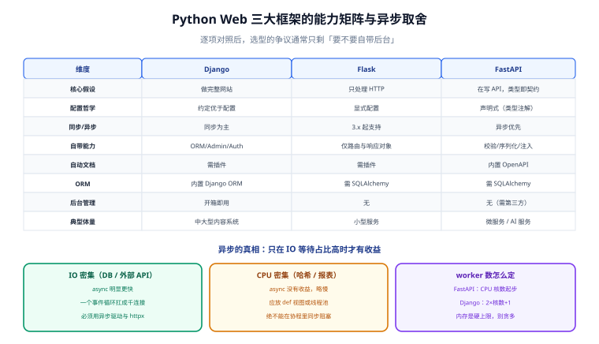
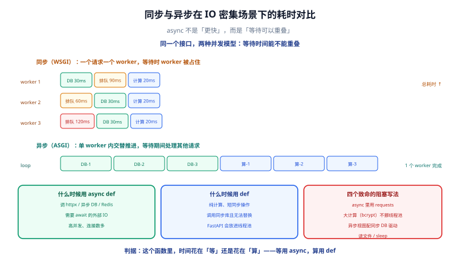

# 框架选型：FastAPI / Django / Flask

一句话定位：这一页帮你**在半小时内做出一个能撑三年的选择**。结论先给：**管理后台和内容型业务选 Django，纯 API 与高并发 IO 密集型选 FastAPI，已有 Flask 项目别急着换，新项目不要再选它**。



## 一、三者的差异不是「功能多少」，而是世界观

| 维度 | Django | Flask | FastAPI |
| --- | --- | --- | --- |
| **核心假设** | 你要做一个完整网站，ORM、后台、认证都该有 | 你只想处理 HTTP，其他自己挑 | 你在写 API，类型就是契约 |
| **配置哲学** | 约定优于配置（`settings.py` + app 注册） | 显式配置，要什么装什么 | 声明式（类型注解 + Pydantic 模型） |
| **同步/异步** | 兼容同步为主，5.x 提供 async 视图 | 3.x 起支持 async 视图 | **异步优先**（`async def` 是一等公民） |
| **自带能力** | ORM / Admin / Auth / 表单 / 迁移 / 缓存 / i18n | 仅路由与请求响应对象 | 校验 / 序列化 / OpenAPI / 依赖注入 |
| **文档产出** | 需第三方（drf-spectacular） | 需第三方 | **自动生成 OpenAPI + Swagger UI** |
| **典型体量** | 中大型、内容/CRM/后台系统 | 小型服务、脚本化接口 | 微服务、API 网关下游、AI 服务 |

::: tip 一句话判据
**问自己「这个项目要不要给别人看后台管理页面」**：要 → 优先 Django（Admin 能省掉整个 CRUD 前端）；不要 → 优先 FastAPI。
:::

## 二、能力矩阵（逐项对照）

| 能力 | Django | Flask | FastAPI |
| --- | --- | --- | --- |
| 路由声明 | `urls.py` 集中 | `@app.route` 装饰器 | `@app.get` + 类型注解 |
| 请求校验 | Form / DRF Serializer | 手写或 marshmallow | **Pydantic 模型，自动校验** |
| ORM | Django ORM（内置，功能全） | 需 SQLAlchemy 等 | 需 SQLAlchemy 等 |
| 数据库迁移 | `manage.py migrate`（内置） | Alembic / Flask-Migrate | Alembic |
| 后台管理 | **Admin（开箱即用）** | 无 | 无（需 sqladmin 等） |
| 认证授权 | Session / DRF + JWT | 需扩展 | 依赖注入 + OAuth2 内置工具 |
| 依赖注入 | 无（用 import 或中间件） | 无 | **`Depends` 原生支持** |
| 自动 API 文档 | 需插件 | 需插件 | **内置** |
| WebSocket | Channels（额外组件） | flask-sock 等 | **原生支持** |
| 后台任务 | Celery / django-q | Celery / RQ | Celery / ARQ / 原生 BackgroundTasks |
| 模板渲染 | Django Template（内置） | Jinja2（内置） | Jinja2（需配置） |
| 学习曲线 | 陡（要先理解它的世界观） | 平缓 | 中等（要懂类型注解与异步） |

## 三、选型决策树

```text [选型流程]
需要自带的运维/运营后台？
├─ 是 → 内容型/CRM/内部系统？
│        ├─ 是 → Django（Admin + ORM + 迁移一套带走）
│        └─ 否 → 若必须自建后台，Django + DRF 仍然最省事
└─ 否 → 接口以 JSON API 为主？
         ├─ 是 → 有大量并发 IO（调外部 API、LLM、DB 密集）？
         │        ├─ 是 → FastAPI + ASGI + async 驱动
         │        └─ 否 → FastAPI（依然推荐，类型安全与文档白送）
         └─ 否 → 存量 Flask 项目？
                  ├─ 是 → 留在 Flask，用 Flask 3 + 类型注解逐步补强
                  └─ 否 → 重新评估需求（脚本化接口考虑更轻的方案）
```

### 三个补充判据

1. **团队类型**：以数据/算法背景为主 → FastAPI（类型注解对熟悉 pandas/类型提示的人很自然）；以传统后端为主 → Django（组件更全，不需要自己拼装）。
2. **接口消费方**：前端团队独立开发 → FastAPI 的自动 OpenAPI 能直接生成 TypeScript 客户端类型，省掉「接口文档不同步」的整类问题。
3. **部署形态**：要跑在 Serverless / 容器自动伸缩上 → FastAPI 冷启动更小（几十 MB 级），Django 更重。

## 四、性能真相：异步不等于快

这是选型阶段被误解最多的一点。



### WSGI 与 ASGI 的区别

| | WSGI（Gunicorn sync worker） | ASGI（uvicorn / Gunicorn + uvicorn worker） |
| --- | --- | --- |
| 并发模型 | 一个请求一个进程/线程，阻塞在 IO | 一个事件循环处理成千上万连接 |
| 适合 | CPU 密集（图像处理、报表计算） | IO 密集（DB 查询、调外部 API、LLM 流式） |
| 并发瓶颈 | 进程/线程数（内存是硬约束） | 事件循环利用率（别写阻塞代码） |
| 单请求延迟 | 稳定，无调度开销 | 低并发时略高（有调度开销），高并发时明显更低 |

### 关键结论

1. **异步只在「IO 等待占比高」时才有收益**。如果每个请求里 90% 时间在算，改成 `async def` 不会有任何提升，反而因为事件循环调度略微变慢。
2. **`async def` 里绝对不能写同步阻塞代码**。一句 `requests.get()` 或 `time.sleep()` 会阻塞**整个事件循环**，所有并发请求一起卡住——此时它比同步框架更糟。
3. **同步框架并发靠进程数**，异步框架并发靠事件循环。所以「异步框架的 worker 数」通常配得**比同步框架少**（常见 `workers = CPU 核数` 就够，而不是 `2 × 核数 + 1`）。

::: danger 注意：四个会让 FastAPI 变慢的写法
1. **在 `async def` 里用 `requests`**：一阻塞全阻塞。改用 `httpx.AsyncClient`；确需同步库就用 `await run_in_threadpool(...)` 包一层。
2. **在 `async def` 里做 `bcrypt` / `hashlib` 大计算**：密码哈希是 CPU 密集操作，应放在线程池里（`await run_in_threadpool(pwd_context.verify, ...)`），或直接用支持异步的库。
3. **忘记给 DB 用 async 驱动**：`SQLAlchemy` 同步引擎配 `async def` 视图，等于在事件循环里做同步 IO。必须配 `asyncmy` / `asyncpg`。
4. **`def` 视图里写 `await`**：语法上就不允许。混淆 `def` 与 `async def` 的取舍：**纯计算、短同步操作写 `def`**（FastAPI 会把它放进线程池）；**涉及网络 IO 写 `async def`**。
:::

### worker 配置速查

| 场景 | 命令 | worker 数 |
| --- | --- | --- |
| FastAPI 生产（IO 密集） | `gunicorn app:app -k uvicorn.workers.UvicornWorker -w 4` | `CPU 核数`（4C 用 4） |
| FastAPI 开发 | `uvicorn app:app --reload` | 1 |
| Django 生产（同步） | `gunicorn project.wsgi:application -w 5` | `2 × 核数 + 1` |
| CPU 密集任务 | **不要放在 Web 进程里** | 抽到 Celery / 独立任务队列 |

::: warning 说明：worker 数不是越大越好
每个 worker 是一份完整的内存占用（Python 进程通常 80~200 MB）。8 个 worker 就是 1.6 GB 常驻，内存一紧就开始 swap，性能断崖。**先按「核数」起步，用压测找到真正的拐点，再决定要不要加。**
:::

## 五、生态与版本现状

| 框架 | 当前主线 | LTS / 支持策略 | 2026 年的关键变化 |
| --- | --- | --- | --- |
| **Django** | 5.2 LTS | 偶数版本为 LTS，支持 3 年 | 支持 Python 3.12+；`async` 视图与 ORM 的异步能力持续补齐 |
| **FastAPI** | 0.11x | 无 LTS，滚动发布 | 全面基于 Pydantic v2；依赖注入与 `Annotated` 语法成为推荐写法 |
| **Flask** | 3.x | 无 LTS，滚动发布 | 原生 `async` 视图支持；`flask run` 的调试体验持续改进 |
| **Pydantic** | v2 | v1 已进入维护末期 | 核心用 Rust 重写，校验速度提升数倍；`model_config` 取代 v1 的 `class Config` |
| **SQLAlchemy** | 2.0 | 2.0 为长期主线 | 统一 `select()` 风格 + 类型化 ORM；`AsyncSession` 成熟 |

::: tip 迁移类升级的判断顺序
**先升依赖再改代码，而不是反过来**。Python Web 生态的升级顺序固定为：`Python 解释器 → Pydantic → FastAPI/Django → SQLAlchemy → 业务代码`。原因是最底层的库决定上层库能升级到什么版本，反过来做会陷入「升了 FastAPI 但 Pydantic 还在 v1」的版本冲突。
:::

## 六、混用的边界：什么时候可以在一个项目里用两个框架

**可以**：

- Django 管后台与内容（Admin 无人能替），FastAPI 管对外高频 API。两者部署为**两个进程**，共享同一套 ORM 模型（把模型放在独立包里）。
- 微服务架构下每个服务各自选型，通过 HTTP/gRPC 通信。

**不可以**：

- 在 Django 进程里挂载 FastAPI 应用做「渐进迁移」。运行时会同时存在两套事件循环/中间件体系，问题极难排查。
- 让两个框架共享 `Session` / 全局状态。

::: danger 注意：别做「渐进式换框架」
迁移框架的正确做法是**在边界处切开**：先把新接口写在新框架的服务里，用网关按路由分流，跑顺后再逐步把老接口挪过去。**不要试图在一个进程里同时跑两个框架**——这类「两套中间件叠加」的架构，问题表现是「偶发 500 且日志里什么都看不到」，排查成本远高于重写。
:::

## 七、验证方式：三行命令感受差异

```shell
# Django：一条命令得到后台
python -m django startproject demo && cd demo && python manage.py migrate && \
python manage.py createsuperuser && python manage.py runserver
# 访问 http://127.0.0.1:8000/admin/ —— 已经能增删用户了

# FastAPI：一条命令得到文档
pip install "fastapi[standard]" && \
printf 'from fastapi import FastAPI\napp = FastAPI()\n\n@app.get("/ping")\ndef p(): return {"ok": True}\n' > main.py && \
fastapi dev main.py
# 访问 http://127.0.0.1:8000/docs —— OpenAPI 文档已自动生成

# Flask：最小可跑
pip install flask && \
printf 'from flask import Flask\napp = Flask(__name__)\n\n@app.get("/ping")\ndef p(): return {"ok": True}\n' > app.py && \
flask --app app run --debug
# 访问 http://127.0.0.1:5000/ping
```

三条命令的产出差异，恰好就对应了三个框架的定位：**Django 给你一个后台，FastAPI 给你一份文档，Flask 给你一个请求处理函数**。

## 参考资料

- [Django 官方：支持的版本与 LTS 策略](https://www.djangoproject.com/download/)
- [FastAPI 官方文档](https://fastapi.tiangolo.com/)
- [Flask 官方文档](https://flask.palletsprojects.com/)
- [Pydantic v2 迁移指南](https://docs.pydantic.dev/latest/migration/)
- [SQLAlchemy 2.0 迁移指南](https://docs.sqlalchemy.org/en/20/changelog/migration_20.html)
- [uvicorn 部署文档（含 Gunicorn 组合）](https://www.uvicorn.org/deployment/)

## 相关页面

- [FastAPI 进阶：类型、异步与依赖注入](../FastAPI/index.md) —— 选了 FastAPI 之后怎么写
- [数据层：SQLAlchemy 2.0 与 Alembic](../DataLayer/index.md) —— 三个框架都要用它
- [实战：可部署的 API 服务](../Practice/index.md) —— 从选型结论到能部署的工程
- [Python 异步编程](../../Python/Async/index.md) —— `async` 的语言基础，本篇「异步不等于快」的前提
- [Go 微服务](../../GoMicroservices/index.md) —— 同场景的另一套技术栈，选型对照
- [Java Spring Boot](../../Java/Frame/SpringBoot/v3/index.md) —— 企业级后端的另一条路线
