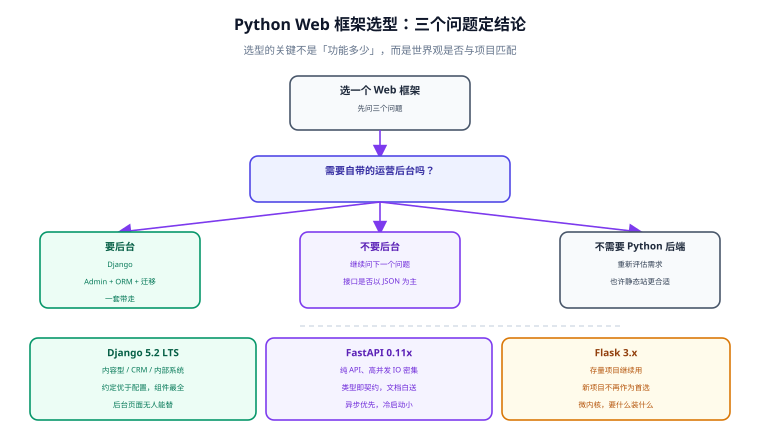

# Python Web 框架

Python 做 Web 后端有一个别处没有的特点：**框架之间的世界观差异极大**。Django 是「全家桶 + 约定优于配置」，Flask 是「微内核 + 自由组合」，FastAPI 是「类型驱动 + 异步优先」。选错了框架，后面每加一个功能都在跟框架的默认假设对抗。本专题讲的是**怎么选**、以及**选定之后每一层怎么写才不踩坑**。

## 目录

### 选型

- [框架选型：FastAPI / Django / Flask](Overview/index.md)

### 核心能力

- [FastAPI 进阶：类型、异步与依赖注入](FastAPI/index.md)
- [数据层：SQLAlchemy 2.0 与 Alembic](DataLayer/index.md)

### 落地

- [实战：可部署的 API 服务](Practice/index.md)

::: info 版本约定
本专题以 **Python 3.14**（当前稳定线）为主线，同时说明 3.12 / 3.13 的差异点。三方库取当前稳定分支：

- **FastAPI 0.11x** + **Pydantic v2**（v1 与 v2 是不兼容的两套 API，本文只讲 v2）
- **Django 5.2 LTS**（上一个 LTS 是 4.2，仍在安全维护期内）
- **Flask 3.x**
- **SQLAlchemy 2.0**（2.0 与 1.4 的差异主要在「统一 `select()` + 类型化 ORM」，本文只讲 2.0 写法）
- **uvicorn 0.3x** + **Gunicorn 23.x**（生产部署组合）
:::

::: tip 阅读前提
本专题假设你已经读过 [Python 语言专题](../Python/index.md)：装饰器、异步编程、环境管理。其中**异步编程**必须先看——FastAPI 的性能优势全靠 `async`，而 `async` 用错（在协程里写同步阻塞代码）会让它比同步框架更慢。
:::

## 各篇定位

| 页面 | 回答什么问题 |
| --- | --- |
| [框架选型：FastAPI / Django / Flask](Overview/index.md) | 三者各自的世界观、能力矩阵、选型判据、以及「同一项目里混用」的边界 |
| [FastAPI 进阶：类型、异步与依赖注入](FastAPI/index.md) | Pydantic v2 怎么写才快、`async def` 与 `def` 什么时候用哪个、依赖注入怎么做鉴权与复用 |
| [数据层：SQLAlchemy 2.0 与 Alembic](DataLayer/index.md) | 2.0 风格的 ORM/Core 写法、async 引擎与 Session 生命周期、Alembic 迁移的工作流 |
| [实战：可部署的 API 服务](Practice/index.md) | 工程布局、配置管理、可观测、容器化与部署矩阵、排错 |

## 与既有专题的分工

- [Python](../Python/index.md)：语言基础（装饰器、异步、常用库），是本专题的地基。
- [Go 微服务](../GoMicroservices/index.md)：**同一件事的另一套技术栈**——Python 侧讲的是「快速迭代与生态丰富」，Go 侧讲的是「部署密度与并发成本」。选型时可以对照着看：面向数据/算法/管理后台倾向 Python，面向高频核心链路倾向 Go。
- [Java Spring Boot](../Java/Frame/SpringBoot/v3/index.md)：企业级后端的主流选择，与 Django 的「全家桶」思路最接近。

::: warning 说明
本专题**不讲 WSGI/ASGI 协议的底层实现**，那部分在 [Python 异步编程](../Python/Async/index.md) 与 [网络编程](../NetworkProgramming/index.md) 里有涉及。这里只讲「工程上怎么选、怎么写」。
:::

## 相关专题

- [Python](../Python/index.md)：语言基础与异步编程
- [Go 微服务](../GoMicroservices/index.md)：同场景的另一套实现，选型时的对照面
- [Java Spring Boot](../Java/Frame/SpringBoot/v3/index.md)：企业级后端的另一条主流路线
- [关系型数据库](../../DB/Relational/index.md)：数据建模与索引，与数据层写法直接相关
- [Docker](../../Ops/Docker/index.md) 与 [Kubernetes](../../Ops/Kubernetes/index.md)：Python 服务的交付形态
- [监控告警](../../Ops/Monitoring/index.md)：指标与告警的接入
