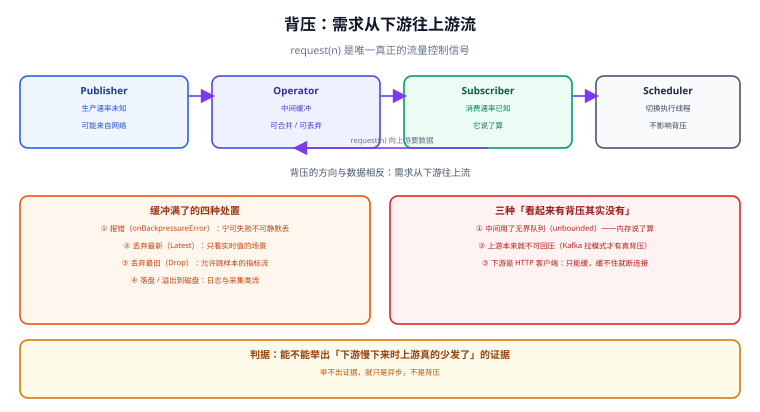

# 背压

背压（Backpressure）是响应式编程里**唯一无法被虚拟线程替代的能力**：当生产数据的速度超过消费速度时，让「慢的那一方」有权决定「快的那一方发多少」。这一页讲清楚三件事：协议层怎么表达、Reactor 给了哪些处置手段、以及**哪些场景根本做不到背压**。

## 一句话定位

背压不是「限流」，也不是「缓冲」。它是**需求信号的逆向流动**：数据从上往下流，`request(n)` 从下往上传。

- 限流：在入口处直接拒绝或排队（不问下游想要多少）。
- 缓冲：先存起来（把问题推迟到内存爆掉那一天）。
- 背压：下游说「我还能收 n 个」，上游据此调整发送节奏。

## 一、没有背压会发生什么

把生产者与消费者的速率差想成水位：

```text
生产者：每秒 5000 条 ──▶ [ 缓冲 ] ──▶ 消费者：每秒 500 条
                              ▲
                        每秒涨 4500 条 → 内存线性上涨 → OOM
```

缓冲只是把「速率不匹配」这个事实推迟暴露。三种典型结局：

| 结局 | 现象 | 根因 |
| --- | --- | --- |
| 内存溢出 | 堆缓慢上涨，GC 变频繁，最后 OOM | 无界队列 |
| 静默丢数据 | 计数器对不上，日志里没有错误 | 丢弃策略没有记账 |
| 拖垮上游 | 上游连接被长时间占住、超时 | 反向压力没有传递，只能靠连接数堆积 |

## 二、协议层怎么表达



Reactive Streams 规范（`org.reactivestreams` 1.0.4）用四个接口把背压写进了契约：

| 接口 | 职责 | 关键方法 |
| --- | --- | --- |
| `Publisher<T>` | 数据源 | `subscribe(Subscriber)` |
| `Subscriber<T>` | 消费方 | `onSubscribe` / `onNext` / `onError` / `onComplete` |
| `Subscription` | **需求通道** | `request(long n)` / `cancel()` |
| `Processor<T,R>` | 既是消费方又是生产方 | 组合上面三者 |

关键约束（规范强制）：**`Publisher` 在收到 `request(n)` 之前不得发送任何元素**，且累计发送数不得超过累计请求数。这条约束就是背压的全部机制。

### 2.1 手动控制需求：`BaseSubscriber`

```java [ManualBackpressure.java]
// BaseSubscriber 是 Reactor 提供的「可控需求」基类
Flux.range(1, 1000)
    .subscribe(new BaseSubscriber<Integer>() {
        @Override
        protected void hookOnSubscribe(Subscription subscription) {
            request(1);                       // 初始只要 1 个，而不是 request(unbounded)
        }

        @Override
        protected void hookOnNext(Integer value) {
            try {
                handleSlowly(value);          // 慢消费：每秒处理几条
            } finally {
                request(1);                   // 处理完再要下一个（拉模式）
            }
        }
    });
```

::: tip 什么时候才需要手写 `BaseSubscriber`
日常业务几乎不需要：框架在你写 `subscribe(consumer)` 时默认发的是**无界需求**（`request(Long.MAX_VALUE)`）。需要手动控制只有两类场景——**消费端速率受外部系统限制**（写库、发通知、调第三方），以及**自己实现 `Publisher`**。
:::

## 三、Reactor 的背压算子

当上游无法被「要求少发一点」（比如它来自网络），只能在中间加一层缓冲并**明确溢出策略**：

| 算子 | 溢出策略 | 适用场景 | 代价 |
| --- | --- | --- | --- |
| `onBackpressureBuffer(capacity)` | 缓冲，满了按 `BufferOverflowStrategy` 处置 | 短时抖动，消费只慢一点 | 内存占用与延迟 |
| `onBackpressureDrop(consumer)` | 丢弃**新到**的元素 | 只看最新值的指标流 | 必须记账，否则静默丢数据 |
| `onBackpressureLatest()` | 只保留**最新一个**元素 | 状态快照、信号灯 | 中间值全部消失 |
| `onBackpressureError()` | 缓冲满直接报错 | **宁可失败不可静默丢**的业务流 | 需要上游能承受失败 |

`BufferOverflowStrategy` 四档（配 `onBackpressureBuffer` 使用）：

| 策略 | 行为 | 一句话判据 |
| --- | --- | --- |
| `ERROR` | 抛 `IllegalStateException` | 数据不许丢 |
| `DROP_OLDEST` | 丢最早的元素 | 允许过期，保留新鲜 |
| `DROP_LATEST` | 丢最新的元素 | 罕见，通常与指标采样有关 |
| `UNBOUNDED` | 不丢，队列无上限 | **生产环境禁用**（等于没有背压） |

```java [MetricStream.java]
// 指标流：允许丢样本，但必须记账（丢弃计数要进指标）
return kafkaFlux
    .onBackpressureBuffer(4096, dropped -> dropCounter.increment(), BufferOverflowStrategy.DROP_OLDEST)
    .publishOn(Schedulers.boundedElastic(), 64)      // 预取 64，控制请求节奏
    .subscribe(this::persist);
```

### 3.1 `limitRate`：让请求变得「整齐」

`onBackpressureBuffer` 管的是「满了怎么办」，`limitRate` 管的是「请求节奏」：

```java
// 每次最多请求 32 个，当已消费 75% 时补发下一批请求
flux.limitRate(32)
    .subscribe(this::handle);

// 严格 1 换 1：每消费一个才请求下一个（吞吐最低，延迟最稳）
flux.limitRate(1, 0)
    .subscribe(this::handle);
```

::: warning `limitRate` 与 `publishOn(prefetch)` 不是一回事
`publishOn(scheduler, prefetch)` 的第二参是**预取量**（内部队列大小），它影响的是跨线程传递的批量；`limitRate` 影响的是**向上游请求的批次**。两者都会出现「一次要一批」的行为，但作用点不同——排查时不要混为一谈。
:::

## 四、三类「做不到真背压」的场景

这是本页最需要记住的部分：**背压需要整条链路都支持它，而现实里链条经常是断的。**

### 4.1 上游天然不可回压

| 数据源 | 能背压吗 | 说明 |
| --- | --- | --- |
| `Flux.range` / `fromIterable` / `fromStream` | **能** | 完全受 `request(n)` 控制 |
| 数据库游标（R2DBC `Flux`） | **能**（部分驱动有预取） | 注意驱动内部的预取窗口 |
| HTTP 响应体（客户端） | **不能** | 服务端已经开始发了，你只能控制读得快慢 |
| 网络 socket 上的推送流 | **不能** | 只能通过 TCP 窗口间接施加压力 |
| Kafka | **能（拉模式）** | 这是 Kafka 消费天然适合响应式的原因 |
| WebSocket / SSE 推送 | **不能** | 只能缓冲或丢弃，或断开连接 |

**判据**：问一句「**我能不能告诉上游『请少发一点』，并且它真的照做了？**」不能，就只能在本地做「缓冲 + 溢出策略」。

### 4.2 中间出现了无界队列

最常见的隐形杀手，`onBackpressureBuffer()` 不传容量参数就是无界的：

```java
// 反例：容量没写，等于给自己埋了一个 OOM
flux.onBackpressureBuffer().subscribe(this::handle);

// 正例：容量 + 溢出策略 + 记账
flux.onBackpressureBuffer(2048, e -> dropped.increment(), BufferOverflowStrategy.DROP_OLDEST)
    .subscribe(this::handle);
```

还有一个更隐蔽的：`Sinks.many().unicast().onBackpressureBuffer()` 也有容量概念，但 `Flux.create(..., FluxSink.OverflowStrategy.BUFFER)` 的队列同样是**无界**的。

### 4.3 出口是外部系统

写库、写文件、发通知这类「终结操作」没有背压通道——`subscribe()` 之后的需求就是无界的。这时正确的做法不是硬凑背压，而是**把背压前移到这一段的入口**：

| 手段 | 做法 | 判据 |
| --- | --- | --- |
| 有界并发 | `flatMap(fn, concurrency)` 显式给并发上限 | 并发数有明确来源（连接池大小 / 对方限流） |
| 批次写 | `bufferTimeout(500, Duration.ofMillis(200))` 攒批 | 单条写成本高、可容忍 200ms 延迟 |
| 限速 | `limitRate` 或 `delayElements` | 对方有明确的 QPS 预算 |
| 落盘兜底 | 溢出写入本地文件，后续补发 | 数据不能丢且允许延迟 |

```java [WritePipeline.java]
// 写库：并发上限取连接池大小，绝不默认无界
return flux
    .bufferTimeout(500, Duration.ofMillis(200))        // 攒批
    .flatMap(batch -> repository.saveAll(batch)         // 批量写
        .timeout(Duration.ofMillis(1500)), 4)           // 并发 4 = 连接池的一半
    .onErrorResume(e -> { deadLetter(batch); return Mono.empty(); });
```

## 五、把背压做成可观测的

背压出问题时，日志里通常什么都没有——**必须有三个指标**：

| 指标 | 采集方式 | 判读 |
| --- | --- | --- |
| 队列深度 / 待处理量 | `doOnEach` 计数、或 `Sinks` 的 `currentSubscriberCount` | 持续上涨 = 消费追不上 |
| 丢弃计数 | `onBackpressureDrop` 的回调里计数 | 非 0 就说明溢出策略在生效，要确认业务能接受 |
| 请求节奏 | 指标化 `limitRate` 批次或 `doOnRequest` | 请求长期停留在 1~2 = 下游每次只敢要一点点 |

```java [Instrumented.java]
// doOnRequest 看需求、doOnNext 看消费、采样看水位
flux.doOnRequest(n -> M.requestBatch.record(n))
    .doOnNext(v -> M.consumed.increment())
    .subscribe(this::handle);

// 每 5 秒打一条水位：待处理量持续上涨就是背压失效的信号
Flux.interval(Duration.ofSeconds(5))
    .doOnNext(t -> log.info("pending={}, dropped={}", pending.get(), dropped.get()))
    .subscribe();
```

## 六、怎么证明背压真的生效

背压最容易被「自以为做了」——中间加个 `onBackpressureBuffer` 就以为万事大吉。可复现的验证方法：

```java [BackpressureTest.java]
@Test
void 下游慢时上游真的少发了() {
    AtomicLong produced = new AtomicLong();

    Flux<Long> source = Flux.range(1, 100_000)
        .doOnNext(v -> produced.incrementAndGet());

    StepVerifier.create(
            source.onBackpressureBuffer(64, BufferOverflowStrategy.ERROR),
            /* 初始需求 */ 1)
        .expectNext(1L)
        .thenRequest(1)
        .expectNext(2L)
        .thenCancel()
        .verify();

    // 判据：只被取了极少量的元素，而不是把 10 万条全推完
    assertThat(produced.get()).isLessThanOrEqualTo(65);
}
```

预期判读：`produced` 数量受控（与缓冲容量同量级），说明 `request(n)` 确实在起作用；若它等于 100000，说明中间某处把需求变成了无界。

```shell
# 生产侧验证：用一个慢消费者接住高并发生产，观察这三样
# 1) 进程 RSS 是否稳定（稳定 = 背压生效；线性上涨 = 无界队列）
# 2) 丢弃计数是否在涨（涨 = 溢出策略在工作，要核对业务容忍度）
# 3) 生产者侧是否被反压到（日志里出现等待或批次变小）
ps -o rss= -p <pid>
```

::: warning 判据不是实测记录
上面的断言与命令是**判据**。本机没有对应的运行环境时，如实标注「未跑」，不要把期望值抄进结论。
:::

## 常见问题

- **`onBackpressureBuffer` 加了还是 OOM？** 检查三处：容量参数有没有写、下游是不是根本没消费（订阅了但 `handle` 里在 `Thread.sleep`）、以及上游是不是 `Flux.create` 且策略选了 `BUFFER`。
- **丢弃了数据却没人知道？** 丢弃回调必须计数并上报，否则「数据丢失」会在对账时才被发现。
- **`limitRate` 一加吞吐就掉了？** 那是它的代价：批次小则往返多。把批次从 1 调到 32 通常能同时拿到稳定的水位与可接受的吞吐。
- **能不能靠调大 TCP 缓冲区解决？** 那只是把缓冲从 JVM 挪到内核，解决了短时抖动，解决不了持续不匹配。

## 参考资料

- Reactive Streams 规范（`request(n)` 的权威定义）：https://www.reactive-streams.org/
- Reactor 官方文档 · 背压：https://projectreactor.io/docs/core/release/reference/#reactive.backpressure
- Reactor 官方文档 · `limitRate` 与预取：https://projectreactor.io/docs/core/release/reference/#_on_backpressure_and_ways_to_reshape_requests
- Reactor `BufferOverflowStrategy` Javadoc：https://projectreactor.io/docs/core/release/api/reactor/util/backpressure/BufferOverflowStrategy.html
- Reactor 官方 · 背压相关算子总览：https://projectreactor.io/docs/core/release/reference/#which-backpressure
