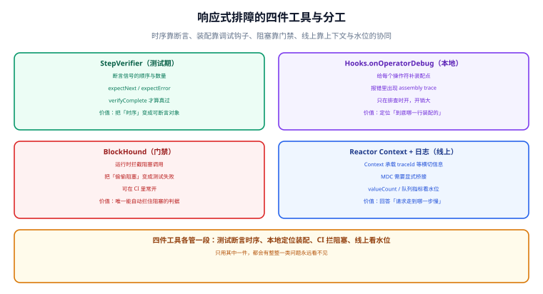

# 调试与排障

响应式代码最难的不是写，是**出事的时候看不见**：堆栈里没有业务行号、日志里没有请求上下文、线程栈里看不出谁在等谁。这一页把四件工具讲清楚，并给出一套线上四步排障法。

## 一句话定位

响应式排障的困难来自同一个原因：**执行是异步的、线程是复用的。** 传统靠「堆栈 + `ThreadLocal`」的定位手段在这里统统失效，必须换成「**装配点断言 + 信号断言 + 阻塞门禁 + 上下文透传**」这一套。

## 一、三类问题要用三种手段

| 问题类型 | 现象 | 首选手段 | 关键点 |
| --- | --- | --- | --- |
| 装配期问题 | 报错堆栈只有 `Flux.map` 这类框架帧，看不到自己写的哪一行 | `Hooks.onOperatorDebug()` / `checkpoint()` | 只用于排查，开销大 |
| 逻辑与时序问题 | 接口返回空、少发/多发元素、错误没被捕获 | `StepVerifier` | 把「时序」变成可断言对象 |
| 性能与阻塞问题 | QPS 上不去、CPU 低、延迟尖刺 | **BlockHound** + `jstack` | 它是唯一能自动拦住阻塞的判据 |
| 上下文丢失 | 日志里 traceId 为空、跨线程串数据 | `Context` + MDC 桥接 | `Context` 不会自动进 MDC |

## 二、`StepVerifier`：把时序变成断言

`reactor-test` 提供的最重要能力不是「测结果」，而是**测信号序列**：发了几个、顺序如何、有没有完成、错误是什么类型。

```java [PipelineTest.java]
@Test
void 信号序列完全符合预期() {
    StepVerifier.create(service.search("reactor"))
        .expectSubscription()                                   // 先有订阅
        .expectNextCount(3)                                     // 恰好 3 个元素
        .expectNextMatches(a -> a.title().contains("Reactor"))
        .verifyComplete();                                       // 必须以完成收尾
}

@Test
void 超时后有兜底且不抛异常() {
    StepVerifier.withVirtualTime(() -> service.searchWithTimeout("slow"))
        .thenAwait(Duration.ofMillis(500))                       // 虚拟时间，不真的等
        .expectNextMatches(a -> "cache".equals(a.source()))
        .verifyComplete();
}
```

::: tip 三个最容易被漏掉的断言
1. **`expectNextCount` 而不是只看第一个**：「多发元素」是响应式里很常见的缺陷（重复订阅、`flatMap` 展开次数错误）。
2. **`verifyComplete()` / `expectError(...)` 必须二选一收尾**：不写就把「链路悬挂」这种问题放过去了。
3. **取消路径也要断言**：`thenCancel().verify()` 用来验证「不订阅就不执行」或「取消后资源被释放」。
:::

| 断言方法 | 用途 | 常见误用 |
| --- | --- | --- |
| `expectNext(v)` | 精确匹配元素 | 用它断言对象时忘了实现 `equals` |
| `expectNextMatches(predicate)` | 条件匹配 | 断言写得太宽，等于没断言 |
| `expectNextCount(n)` | 数量断言 | 用 `expectNextCount(0)` 代替 `verifyComplete()` |
| `expectError(Class)` | 错误类型 | 只写异常类型不看 message，掩盖了错误来源 |
| `expectNoEvent(Duration)` | 一段时间内没有信号 | 没配虚拟时间时会真等，测试变慢 |
| `thenRequest(n)` | 手动控制需求 | 与背压测试配套使用（见背压页） |

## 三、`Hooks.onOperatorDebug()` 与 `checkpoint()`

响应式报错的默认堆栈是「框架帧 + 你的操作符调用」，看不出**是哪一行装配的**：

```text
java.lang.NullPointerException: Cannot invoke "User.name()" because "u" is null
    at com.example.UserService.lambda$find$0(UserService.java:42)     ← 只有这一行是自己的
    at reactor.core.publisher.FluxMap$MapSubscriber.onNext(...)        ← 其余全是框架
```

两种办法补上「装配点」：

```java [AssemblyTrace.java]
// ① 全局开启：为每个操作符生成装配点信息（本地排查用，生产别开）
Hooks.onOperatorDebug();
Mono<User> m = service.findById(1L).map(User::name);   // 报错时会带 assembly trace

// ② 定点开启：只在可疑片段上开，开销小得多，可以长期留在代码里
Mono<User> m = service.findById(1L)
    .checkpoint("load user")                            // 出错时打印这个描述
    .map(User::name)
    .checkpoint("extract name");
```

| 手段 | 开销 | 适用 |
| --- | --- | --- |
| `Hooks.onOperatorDebug()` | **高**（每次装配都要抓堆栈） | 本地复现问题 |
| `checkpoint()` | 低（只标记一处） | 可以长期保留在关键链路上 |
| Reactor 调试代理（Java Agent） | 中 | 预发环境长期开启 |

::: danger 两个常见误用
1. **在生产环境全局开启 `onOperatorDebug`**：它会把装配开销放大到影响吞吐的程度，是「排查手段变成故障源」的典型。
2. **用 `checkpoint()` 代替日志**：它只在出错时输出，正常路径上什么都不打印，不能用来观察数据流。
:::

## 四、`BlockHound`：唯一能自动拦住阻塞的判据

人工评审看不出「`map` 里偷偷调了 JDBC」，但 BlockHound 能——它在运行时拦截阻塞 API，把「偷偷阻塞」变成异常。

```java [TestBase.java]
class ReactiveTestBase {

    @BeforeAll
    static void installBlockHound() {
        BlockHound.builder()
            .allowBlockingCallsInside(Thread.class.getName(), "sleep")   // 测试自身需要
            .allowBlockingCallsInside("io.netty.util.concurrent.DefaultPromise", "await")
            .install();
    }
}
```

```java [BlockingDetectionTest.java]
@Test
void 响应式链路里不应有阻塞调用() {
    // 真到了这一步说明链路里确实有阻塞，BlockHound 会在此处抛 BlockingOperationError
    StepVerifier.create(service.aggregate(1L))
        .expectNextCount(1)
        .verifyComplete();
}
```

::: warning 放行清单要收敛，不要照抄
每个项目都要**显式列出哪些阻塞 API 是允许的**（框架内部、测试工具、日志初始化等），并且定期检查这份清单有没有变成「什么都放行」。放行项越多，门禁的价值越低——这与「一条会误报的门禁很快会被整体跳过」是同一件事。
:::

| 场景 | 建议 |
| --- | --- |
| 集成测试 / CI | **常开**。任何新增阻塞调用都会让流水线失败 |
| 本地开发 | 常开。早发现比晚上线便宜 |
| 生产 | **不建议开**（会拦截并可能改变行为）。生产侧用 `jstack` + 水位指标 |

## 五、`Context` 透传与 MDC 桥接

日志里 traceId 丢了，是响应式排障里最高频的问题。原因是：**MDC 存在 `ThreadLocal` 里，而响应式链路会换线程。**

```java [MdcBridge.java]
// 桥接：把 Context 里的值放进 MDC，并在信号结束时清理（顺序不能反）
public static <T> Function<Context, Context> putMdc() {
    return ctx -> {
        ctx.getOrEmpty("traceId")
           .ifPresent(id -> MDC.put("traceId", String.valueOf(id)));
        return ctx;
    };
}
```

```java [UsageInPipeline.java]
// 正确：在管道内部用 doOnEach 存取（执行时机与订阅链一致）
return chain.filter(exchange)
    .doOnEach(signal -> {
        if (signal.isOnNext() || signal.isOnComplete() || signal.isOnError()) {
            MDC.remove("traceId");
            return;
        }
        signal.getContextView().getOrEmpty("traceId")
              .ifPresent(id -> MDC.put("traceId", String.valueOf(id)));
    })
    .contextWrite(Context.of("traceId", traceId));
```

::: tip 更省事的两种选择
① 使用官方或社区提供的 MDC 上下文适配器（Reactor 生态里有成熟实现），不要自己手写桥接；② 如果响应式只用在少数边界接口，**把 traceId 直接作为参数传递**往往比维护一套 `Context` 桥接更稳。
:::

## 六、日志与水位

```java [LogUsage.java]
// Reactor 内置 log()：看信号序列最快的手段
return repository.findById(id)
    .log("findById")            // 打印 onSubscribe/onNext/onComplete + 上下文
    .switchIfEmpty(Mono.empty());

// 生产：不要开 log()，改成低频采样 + 关键指标
return repository.findById(id)
    .doOnSubscribe(s -> M.calls.increment())
    .doOnError(e -> M.errors.increment())
    .doOnNext(v -> M.hits.increment());
```

| 手段 | 输出内容 | 什么时候用 | 什么时候别用 |
| --- | --- | --- | --- |
| `.log()` | 完整信号序列 + 上下文 | 本地定位「到底发没发」 | 生产高 QPS 链路（日志量爆炸） |
| `onOperatorDebug` | 装配点 | 定位「哪一行装配的」 | 生产 |
| `doOnEach` + 采样 | 部分信号 | 生产按比例采样 | 需要全量时序分析时（用追踪系统） |
| 指标（计数器 / 水位） | 聚合数字 | **生产首选** | — |

## 七、线上四步排障法



按固定顺序做，能覆盖绝大多数线上问题：

| 步骤 | 做什么 | 判据 |
| --- | --- | --- |
| 1. 看水位指标 | 待处理量、丢弃数、连接池排队、超时计数 | 水位持续上涨 = 消费追不上（背压问题），不是「性能问题」 |
| 2. 看线程栈 | `jcmd <pid> Thread.print`，重点看 `reactor-http-nio-*` | 事件循环线程在 `socketRead` / `java.sql` = 有阻塞调用混入 |
| 3. 看上下文 | traceId 是否完整、能否串起一次请求 | 上下文丢失 ⇒ MDC 桥接或 `contextWrite` 位置问题 |
| 4. 才看代码 | 用 `checkpoint()` 或 `log()` 定点复现 | 前三步都无异常时，才回去读代码找逻辑问题 |

::: danger 三条纪律（与上一周期项目一致）
1. **先取证再动手**：不要凭「感觉像阻塞」就去改线程池。
2. **一次只改一个变量**：响应式链路改动的影响面大，同时改两处会让归因失效。
3. **恢复后把判据补成测试**：每一次线上问题的最终产物，应该是一条能在 CI 里跑的断言（`StepVerifier` 用例或 BlockHound 门禁）。
:::

## 八、四个高频误判

| 现象 | 容易被误判为 | 实际常见根因 |
| --- | --- | --- |
| 接口偶发 500，堆栈指向 `NullPointerException` | 空指针 bug | 降级分支返回了 `null`（Reactor 不允许 null 元素）或 `Mono` 忘记返回导致框架序列化了空对象 |
| QPS 上不去、CPU 很低 | 需要扩容 | 链路里有阻塞调用，事件循环线程被占住 |
| 日志里 traceId 为空但偶发有值 | 日志配置问题 | `contextWrite` 位置写反（应靠近订阅端），或某段切换到了新线程而没带 `Context` |
| 改了代码后更慢 | 响应式「本来就慢」 | 线程切换过多（每次 `publishOn` 都是一次跳转），或把 CPU 密集计算放到了 `parallel` 调度器上 |

## 验证方式

```java [DebugToolingTest.java]
@Test
void 四件工具各自可用() {
    // ① StepVerifier：信号序列可断言
    StepVerifier.create(Mono.just("a")).expectNext("a").verifyComplete();

    // ② checkpoint：装配点可定位（这里只验证不抛异常）
    StepVerifier.create(Mono.error(new IllegalStateException("boom"))
            .checkpoint("demo"))
        .expectError(IllegalStateException.class)
        .verify();

    // ③ Context：可以在管道内读到
    StepVerifier.create(Mono.deferContextual(ctx -> Mono.just(ctx.get("traceId")))
            .contextWrite(Context.of("traceId", "t-1")))
        .expectNext("t-1")
        .verifyComplete();

    // ④ BlockHound：阻塞调用会失败（在已安装的测试基类中）
    StepVerifier.create(Mono.fromCallable(() -> { Thread.sleep(10); return "x"; }))
        .expectNext("x")
        .verifyComplete();   // 未指定调度器时会落在调用线程，需按项目实际放行策略调整
}
```

```shell
# 生产侧两条命令
jcmd <pid> Thread.print | grep -c "reactor-http-nio"                 # 线程数应恒定
jcmd <pid> Thread.print | grep -A 15 "reactor-http-nio" | grep -c "socketRead\|java.sql"
# 第二条预期为 0；非 0 即为「非阻塞链路上存在阻塞调用」
```

::: warning 判据不是实测记录
上面的测试与命令是**判据**。第 ④ 条尤其依赖项目的放行清单——照抄别人的清单会让门禁失效。
:::

## 参考资料

- Reactor 官方文档 · 调试与排障：https://projectreactor.io/docs/core/release/reference/#debugging
- Reactor 官方文档 · `StepVerifier`：https://projectreactor.io/docs/core/release/reference/#testing
- BlockHound 项目主页：https://github.com/reactor/BlockHound
- Reactor 官方文档 · 上下文：https://projectreactor.io/docs/core/release/reference/#context
- Reactor 官方文档 · 日志与信号：https://projectreactor.io/docs/core/release/reference/#_logging
