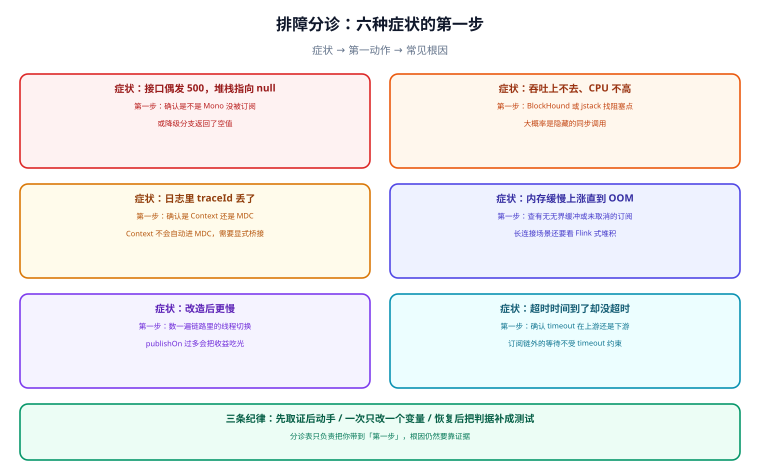

# 常见问题与最佳实践

这一页是三件东西的合集：**排障分诊表**（症状 → 第一步）、**高频十二问**（概念混淆最集中的地方）、**上线自查清单**（发布前逐条过一遍）。

## 一、排障分诊表



| 症状 | 第一步 | 常见根因 | 处置方向 |
| --- | --- | --- | --- |
| 接口偶发 500，堆栈指向 null | 确认是不是 `Mono` 没被订阅，或降级分支返回了空值 | 在方法中间 `subscribe` 导致返回值与结果脱钩；`onErrorResume(e -> null)` | 把副作用串回管道；降级返回空集合而不是 null |
| 吞吐上不去，CPU 却不高 | 跑 BlockHound 或 `jstack` 看事件循环线程 | 链路里藏着 JDBC / 阻塞客户端 / `Thread.sleep` | 换非阻塞驱动，或隔离到 `boundedElastic` |
| 日志里 traceId 丢了 | 确认是 `Context` 还是 MDC | `Context` 不会自动进 MDC；`contextWrite` 位置写反 | 加 MDC 桥接；`contextWrite` 放在靠近订阅端 |
| 内存缓慢上涨直至 OOM | 查无界缓冲与未取消的订阅 | `onBackpressureBuffer()` 没写容量；SSE 断连未释放 | 显式容量 + 溢出策略 + 取消记账 |
| 改造后反而更慢 | 数一遍链路里的线程切换次数 | `publishOn` 太多；CPU 计算放在 `parallel` 上 | 减少切换；重计算交回业务线程池或改回阻塞式 |
| 超时时间到了却没超时 | 确认 `timeout` 在链路内的位置 | 等待发生在订阅链之外；重试把预算放大 | 内层单点超时 + 外层总预算 |

::: tip 三条排查纪律
1. **先取证后动手**：不要因为「感觉像阻塞」就先去调线程池——先拿到线程栈或 BlockHound 的证据。
2. **一次只改一个变量**：响应式链路的影响面大，同时改两处会让归因失效。
3. **恢复后补判据**：每个线上问题的终态，应该是一条能在 CI 里运行的断言。
:::

## 二、高频十二问

**Q1：响应式到底比虚拟线程快吗？**
不是同一维度的比较。响应式的优势出现在**极端连接数**与**流式/背压**场景；普通 CRUD 下两者互相打平，虚拟线程的改造与排障成本低得多。见 [总览](../Overview/index.md) 的边界判断。

**Q2：`concatMap` 和 `flatMap` 用哪个？**
有顺序要求（同一聚合的步骤、需要保序的批量）用 `concatMap`；只关心「都完成」用 `flatMap`；既要并发又要保序用 `flatMapSequential`。

**Q3：为什么我的代码「没执行」？**
因为没订阅。`Mono` 是描述不是容器，没有 `subscribe()`（或框架订阅）就没有任何副作用。

**Q4：为什么日志打了两次？**
多半是同一管道被订阅了两次（例如一边 `subscribe` 一边返回给框架），或用了 `Flux.repeat` / `retry`。用 `cache()` 或把副作用上移一层。

**Q5：`block()` 什么时候能用？**
只有两种场景可接受：**启动初始化**（在事件循环之外的线程），以及**响应式与阻塞式边界上的显式适配**（并且要清楚它占住的是哪个线程）。业务链路里出现 `block()` 一律视为缺陷。

**Q6：`@Transactional` 为什么没生效？**
三处检查：方法是否返回 `Mono`/`Flux`（而不是 `void`/普通类型）、事务管理器是不是响应式的、链路上有没有 `block()` 或独立订阅。

**Q7：大结果集怎么处理？**
不要 `collectList()` 后再序列化——那等于把「流」又变回「集合」。用 `Flux` 直接流式响应（SSE 或分块），或分段查询 + 游标分页。

**Q8：`publishOn` 和 `subscribeOn` 到底差在哪？**
`subscribeOn` 决定**源头**在哪个线程执行（只对订阅生效一次，位置无所谓）；`publishOn` 决定**它之后**的代码在哪个线程执行（位置很重要）。

**Q9：`Context` 为什么读不到值？**
`contextWrite` 在链路上是**向上生效**的：要写在靠近订阅端的位置。写在上面则下面的操作符读不到。

**Q10：响应式里还要不要 `ThreadLocal`？**
不要用于请求级数据（会串）。`ScopedValue`（JDK 25 正式）在虚拟线程路线里可以替代它，但在响应式链路里仍然不行——线程会换。用 `Context`。

**Q11：`retry()` 不传参会怎样？**
**无限重试**。生产代码里 `retry()`、`retryWhen` 都必须带策略（次数上限 + 退避 + 异常过滤）。

**Q12：SSE 连接多了会不会把服务端撑死？**
不会撑死线程（连接不绑线程），但会撑住**内存**与**出口带宽**。必须给每个流设上限（元素数 / 时长），并监控待发队列。

## 三、上线自查清单

发布前逐条过一遍，每条都能在五分钟内确认：

| # | 检查项 | 判据 |
| --- | --- | --- |
| C1 | 链路里没有 `block()` | 全局搜索 `block(` / `blockFirst` / `blockLast` 无业务命中 |
| C2 | 阻塞调用有归处 | 每个阻塞调用要么已换非阻塞，要么在 `boundedElastic` 上并已计入容量 |
| C3 | 每个外部调用都有超时 | 逐个数：数据库、HTTP、缓存、消息，一个都不能漏 |
| C4 | 总预算大于内层之和 | 总超时 ≥ 单次 ×（1 + 重试次数） |
| C5 | 降级路径可区分 | 降级响应里有明确标记（`partial` / `source`），不返回 null |
| C6 | 重试有上限与退避 | 无 `retry()` 裸调用；异常过滤到位 |
| C7 | 缓冲有界 | 所有 `onBackpressureBuffer` 都带容量与溢出策略 |
| C8 | 落库/写外部有并发上限 | 使用 `flatMap(fn, concurrency)` 而非默认无界 |
| C9 | 上下文透传可用 | 压测时日志里 traceId 完整率 100% |
| C10 | 阻塞门禁在 CI 里 | BlockHound 集成测试作为流水线必过项 |
| C11 | 关键指标已接入 | 请求数、错误数、超时数、降级数、待处理水位 |
| C12 | 容量结论有依据 | 压测报告里有连接池与下游容量的测算，而不是「感觉够」 |

::: danger 最容易漏掉的两条
**C8 与 C11**。并发上限缺省时（`flatMap` 不传并发参数）在低流量下看不出任何问题，直到某次下游变慢、内部订阅数量指数级上涨才现形；而**降级计数缺失**会让降级长期存在——页面上「就是没有订单」，没有任何告警。
:::

## 四、最佳实践十二条

1. **类型表达基数**：单个用 `Mono`，多个用 `Flux`，只关心完成用 `Mono<Void>`。
2. **副作用放 `doOn*`**：`map` / `filter` 保持纯函数，方便测试与推理。
3. **`subscribe()` 只在最末端**：业务方法只返回管道，由框架或调用方订阅。
4. **每个下游都有超时**：超时是预算，不是保护网。
5. **降级必须可观测**：降级既要有标记，也要有计数。
6. **宁可失败不可静默丢**：容量不足时优先报错或降级，不要用无界队列拖到 OOM。
7. **阻塞显式隔离**：用专用 `boundedElastic` 并给它独立的容量指标。
8. **上下文用 `Context`**：请求级数据不进 `ThreadLocal`。
9. **发布前跑阻塞门禁**：BlockHound 是唯一能自动发现阻塞的判据。
10. **改造前后契约不变**：先定接口契约再改实现，避免「响应式改造」演变成「接口重设计」。
11. **边界要显式**：一条系统里可以混合响应式与阻塞式，但切换点必须写明（哪一段、在哪个线程）。
12. **不为技术而技术**：如果虚拟线程能解决，就不要为了「架构先进」而引入响应式。

## 五、术语表

| 术语 | 含义 | 常见误用 |
| --- | --- | --- |
| Reactive Streams | 一套规范（`Publisher`/`Subscriber`/`Subscription`/`Processor`），背压的协议来源 | 当成框架名 |
| Reactor | Spring 生态的响应式实现库（`Mono`/`Flux`） | 当成规范 |
| Project Loom / 虚拟线程 | JDK 侧的轻量线程（JDK 21 正式化） | 与响应式混为一谈 |
| 冷流（Cold） | 每次订阅都独立执行 | 当成「懒加载」 |
| 热流（Hot） | 一次执行，多订阅者共享 | 当成「缓存」 |
| 背压（Backpressure） | 下游向上游表达需求的机制 | 与限流、缓冲混用 |
| `request(n)` | 唯一的背压信号 | — |
| 溢出策略 | 缓冲满时的处置（错误 / 丢最新 / 丢最旧 / 无界） | 只配缓冲不配策略 |
| 事件循环（Event Loop） | 少量线程反复取事件执行 | 与「线程池」混用 |
| `boundedElastic` | Reactor 为阻塞调用准备的有界弹性调度器 | 当成无限线程池 |
| `subscribeOn` / `publishOn` | 影响订阅线程 / 影响其后线程 | 互换理解 |
| `Context` | 随订阅链传播的上下文容器 | 当成 `ThreadLocal` |
| StepVerifier | Reactor 的信号断言工具 | 只用来测「结果值」 |
| BlockHound | 运行时阻塞检测工具 | 在生产环境常开 |

## 验证方式

```shell
# 自查清单里可自动化的两条
grep -rn "\.block(\|blockFirst(\|blockLast(" src/main/java | grep -v "// allow-block"
# 预期：无输出（或仅有显式标注的边界适配处）

grep -rn "retry()" src/main/java
# 预期：无输出（裸 retry 即无限重试）
```

```java [SanityTest.java]
@Test
void 关键链路的超时与降级都有断言() {
    StepVerifier.create(service.loadWithSlowDownstream(1L))
        .expectNextMatches(home -> home.partial())          // 降级被标记
        .verifyComplete();

    StepVerifier.create(service.loadWithHardFailure(1L))
        .expectError(UpstreamTimeoutException.class)        // 不可降级路径明确报错
        .verify();
}
```

::: warning 判据不是实测记录
上面两条 grep 与两个断言是**判据**：在自己的工程里跑出来的结果才是结论。本仓 `project/` 只放文档，不提交任何脚本与工程文件。
:::

## 参考资料

- Reactor 官方文档 · FAQ（含「阻塞怎么办」）：https://projectreactor.io/docs/core/release/reference/#faq
- Reactor 官方文档 · 操作符速查：https://projectreactor.io/docs/core/release/reference/#which-operator
- Reactive Streams 规范：https://www.reactive-streams.org/
- Spring Framework 官方文档 · WebFlux：https://docs.spring.io/spring-framework/reference/web/webflux.html
- BlockHound 项目主页：https://github.com/reactor/BlockHound
