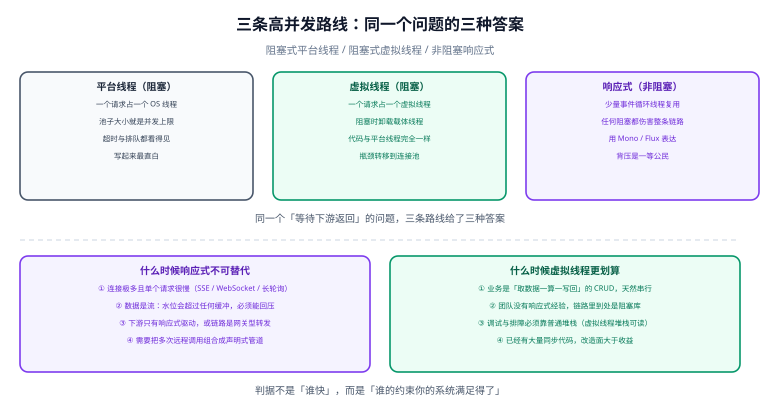
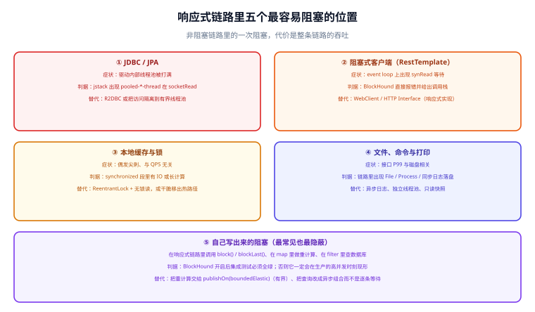

# 总览：响应式的四条边界

这一页只回答一个问题：**我的系统到底该不该用响应式编程。** 结论先给：响应式不是「更先进的那一档」，而是一条**有明确适用边界**的路线——边界之外用它是负债，边界之内用别的方案会更贵。

## 一句话定位

阻塞式编程把「等待」的代价记在一个线程上；响应式把「等待」的代价记在一次回调注册上。

**代价变小了，但代价并没有消失。** 一条响应式链路里只要有一处阻塞，那处阻塞就会占住事件循环线程——而这个线程同时在服务成百上千个请求。所以响应式真正的技术门槛不在于「会不会写 `Mono`」，而在于**你能不能保证整条链路真的没有阻塞**。

## 一、先算清「等待」的成本

### 1.1 一个线程到底有多贵

| 成本项 | 平台线程（默认栈 1 MB） | 虚拟线程（初始约 1 KB 起） | 事件循环线程（固定 N 个） |
| --- | --- | --- | --- |
| 栈内存 | 1 MB 级，`-Xss` 可调 | KB 级，按需增长 | 平台线程栈，数量极少 |
| 创建/销毁 | 微秒~毫秒级 | 纳秒~微秒级 | 进程启动时一次性创建 |
| 上下文切换 | 内核态切换，微秒级 | 用户态调度，成本低得多 | 只在任务边界切换 |
| 数量上限 | 几千个就吃力 | 十万~百万级 | CPU 核数（默认） |

一张常用估算：**每请求 1 MB 栈 + 200 线程上限 = 这台机器最多同时处理 200 个慢请求**。这就是为什么「把 Tomcat 线程数调到 2000」从来不是答案——内存和切换成本会先崩。

### 1.2 请求耗时里有多少是在等

把一个接口的耗时按「占不占 CPU」拆开，是判断路线是否值得改的第一步：

| 耗时构成 | 典型占比 | 占 CPU 吗 | 换成响应式有收益吗 |
| --- | --- | --- | --- |
| 数据库等待 | 30%~70% | 不占 | **有**，这是主要收益来源 |
| 远程调用等待 | 10%~50% | 不占 | **有** |
| 序列化与反序列化 | 5%~20% | 占 | 无（甚至更慢，见下） |
| 业务计算 | 5%~30% | 占 | **无收益**：CPU 时间不会被消灭 |
| 日志与本地 IO | 1%~10% | 不占 | 有，但要先确认它不在热路径 |

::: warning 一个反直觉的结论
**CPU 密集型的接口改成响应式会更慢。** 事件循环线程数默认等于 CPU 核数，业务计算会把这几个线程占满，反而比「200 个线程轮流算」更早排队。响应式优化的是**等待时间**，不是计算时间。
:::

## 二、三条路线摆在一起



同一个「等待下游返回」的问题，三条路线给了三种答案。它们的差别不在速度，而在**你把复杂度放在了哪里**：

| 维度 | 平台线程（阻塞） | 虚拟线程（阻塞） | 响应式（非阻塞） |
| --- | --- | --- | --- |
| 代码形态 | 顺序执行，最直白 | **与平台线程完全一致** | `Mono` / `Flux` 管道 |
| 并发承载单位 | OS 线程 | 虚拟线程 | 事件循环线程 + 回调 |
| 改造成本 | — | 一般只需一行配置 | 全链路重写，含下游驱动 |
| 调试体验 | 普通堆栈，最好 | 普通堆栈，**可读** | 堆栈里看不到业务行号，需要专门工具 |
| 流量控制 | 靠线程池排队 | 靠线程池 / 信号量排队 | **背压是协议级能力** |
| 主要风险 | 线程池打满 | 连接池成为新瓶颈、`synchronized` 钉住载体 | 一处阻塞拖垮全链路 |
| 生态兼容 | 全部同步库 | 全部同步库 | 需要非阻塞驱动与客户端 |

::: info 一个必须知道的实验结论
2026 年 6 月公开的一组基准测试（Amazon Corretto 25.0.3、裸机）把「虚拟线程 + Netty 阻塞写法」与「WebFlux + Reactor」放在同一批场景下对比：**在大多数场景下两者互相打平或虚拟线程略胜**（按逐指标逐场景计数，虚拟线程约 50% 胜、WebFlux 约 26% 胜、约 25% 无明确胜负）。差异出现在极端场景——在 4 万到 6 万并发连接的定速压测里，虚拟线程保持约 100ms 中位延迟，而 WebFlux 在 6 万连接时明显劣化（中位延迟约 1.2 秒、P99 约 3.3 秒、堆接近打满、GC 累计约 108 秒、吞吐少约 31%）。
这组数字的用法不是「WebFlux 不行」，而是：**响应式的收益出现在极端连接数与流式场景，而不是普通 CRUD 的 QPS 对比里。**
:::

## 三、四条边界

这四条是「该不该用」的判据，任何一条不满足，都要先解决它再谈技术选型。

### 3.1 边界一：连接数与线程数是否真的不成正比

如果系统的并发量级是「几百个同时在线的请求」，平台线程池完全够用，换响应式纯属自找麻烦。只有当出现下面两类特征时，路线选择才开始有意义：

- **慢请求占比高**：单个请求有 300ms 以上的等待，200 个线程只能撑几百 QPS。
- **长连接多**：SSE、WebSocket、长轮询会让连接数远超活跃请求数，线程模型直接失效。

判据（可实测）：压测时观察「活跃线程数」与「并发连接数」的比值。若连接数涨到线程数的 3 倍以上而 QPS 不再涨，说明瓶颈是**等待占用线程**，响应式或虚拟线程才有价值。

### 3.2 边界二：下游能不能真的非阻塞

这是最容易被忽略、代价最大的一条。响应式链路里只要有一个环节只有同步驱动，就会出现「非阻塞入口 + 阻塞出口」，结果是：

```text
Netty 事件循环线程 → 调用同步 JDBC → 线程被 socketRead 占住
                                      ↓
                       同一线程上的其他所有请求一起排队
```

判据：**把链路里所有的外部依赖列一遍，逐个确认有没有非阻塞客户端。** 常见情况：

| 依赖 | 有非阻塞客户端吗 | 备注 |
| --- | --- | --- |
| HTTP 服务 | 有：`WebClient` / 响应式 `RestClient` / HTTP Interface | 别用 `RestTemplate` |
| 关系型数据库 | 有：**R2DBC**（MySQL / PostgreSQL / MariaDB / SQL Server 都有驱动） | JDBC 与 JPA 全是阻塞的 |
| Redis | 有：Lettuce（默认）/ Redisson | Jedis 是阻塞的 |
| Elasticsearch | 有：官方反应式客户端 | — |
| MongoDB | 原生支持：官方响应式驱动 | — |
| Kafka | 有：`reactor-kafka` | 原生 `KafkaConsumer` 是阻塞式拉取 |
| 本地文件 / 命令 / 打印 | **没有** | 必须移出热路径或用有界线程池隔离 |

### 3.3 边界三：数据形态是「一次问答」还是「流」

响应式真正无可替代的是**流**：数据长度未知、速率不定、下游还要能回压。

- 适合响应式：日志与指标采集、行情推送、长连接推送、大结果集导出、消息消费。
- 不适合响应式：`根据 ID 查一条记录再返回 JSON`——这类问题虚拟线程解决得更便宜。

判据：**这次的返回，是一次问答，还是「持续不断地来」？** 后者才是响应式的主场。

### 3.4 边界四：团队能不能维护它

响应式的成本大部分不发生在写代码时，而发生在**出事的时候**：

- 堆栈里看不到业务行号，需要 `Hooks.onOperatorDebug` 或 Reactor 调试工具才能定位装配点。
- `ThreadLocal` 不工作，MDC 日志链路要改造成 `Context` 透传。
- 超时与重试的位置错了会静默失效（详见排障页）。
- 新人上手周期更长，代码评审需要新的关注点（有没有阻塞、有没有漏订阅）。

判据（务实版）：**如果团队里没有一个人能在半小时内定位「QPS 上不去、CPU 却不高」这类问题，先不要全量转响应式。** 可以先从网关、SSE 接口这类边界场景切入。

## 四、什么时候不该用：五条情形与替代做法

下图列出响应式链路里最容易藏阻塞的五个位置，详细判据见 [响应式数据访问](../DataAccess/index.md)：



| 情形 | 为什么先别用 | 替代做法 |
| --- | --- | --- |
| CRUD 为主的业务接口 | 等待时间有，但并发量级根本压不满线程池 | Spring MVC + **虚拟线程**（一行配置） |
| 核心链路里有 JPA / MyBatis | 同步驱动会把事件循环占住，比阻塞式更糟 | 保持 MVC；确需响应式时把查询换成 R2DBC |
| 有大量本地计算或文件操作 | CPU 时间不会被消灭，事件循环线程反而更少 | MVC + 更大线程池，或把计算拆出去 |
| 团队缺少响应式经验且无运维观测能力 | 出事时定位成本极高，可用性反而下降 | 先在非核心链路上试点，补 BlockHound 门禁 |
| 只需要「并发调用几个远程接口」 | `CompletableFuture` / 虚拟线程的结构化并发就能解决 | 用结构化并发或 `CompletableFuture.allOf` |

::: danger 三个最容易踩的坑
1. **以为「加了 `Mono` 就是响应式」**：把同步代码包进 `Mono.fromCallable(...)` 却忘了指定 `subscribeOn(boundedElastic())`，代码仍然在订阅线程上跑——如果订阅线程是事件循环线程，等于亲手制造了阻塞。
2. **混用两种栈**：WebFlux 入口配 JDBC 出口，压测时表现为「并发上不去、CPU 很低、线程都在 socketRead」。这个组合比纯阻塞栈更差。
3. **把响应式当作性能优化手段**：它不是加速器。它换来的是**同样资源下能扛更多并发连接**，代价是全链路的复杂度与排障成本。
:::

## 五、响应式不可替代的四个场景

边界之内，有四个场景目前没有更便宜的替代方案：

1. **流式采集与聚合**：指标、日志、事件流，生产速率不确定，必须能回压。
2. **长连接推送**：SSE / WebSocket 推送，连接数与线程数解耦是硬需求。
3. **网关与代理型服务**：几乎不占 CPU、请求量大、绝大多数时间在转发——非阻塞是它的天然形态。
4. **多路远程调用的声明式组合**：把 N 个下游调用组合成一条管道，叠加超时、重试、降级与并发控制，用管道表达比用回调或 `CompletableFuture` 链更清晰、更少出错。

## 六、一次 15 分钟的判断

把下面五个问题按顺序问一遍，答案会直接指向路线：

| # | 问题 | 是 → | 否 → |
| --- | --- | --- | --- |
| 1 | 生产速率会不会超过消费速率（是流吗）？ | **响应式** | 继续问 |
| 2 | 并发连接数会不会远超线程数（长连接 / 慢请求）？ | 继续问 | **保持阻塞式**，最多开虚拟线程 |
| 3 | 链路上所有依赖都有非阻塞客户端吗？ | 继续问 | **先别转**，或只转有非阻塞客户端的那一段 |
| 4 | 团队有能力做 `Context` 透传 + 阻塞门禁 + 水位观测吗？ | 继续问 | **先补观测**，小范围试点 |
| 5 | 极端连接数下的尾延迟是业务指标吗？ | **响应式** | **虚拟线程**往往是性价比更高的答案 |

::: tip 结论可以分阶段给
最务实的落地顺序是：**先用虚拟线程把「等待占用线程」的问题解决掉，把观测补齐；等真的遇到「连接数远超线程数」或「数据流」的场景，再把那一段换成响应式。** 两条路线可以共存——关键在于**边界要显式**（哪一段是响应式、哪一段是阻塞式、在哪里切换线程）。
:::

## 七、术语先对齐

这四个词在中文语境里被混用得最厉害，混用之后讨论一定跑偏：

| 术语 | 准确的含义 | 常被误用成 |
| --- | --- | --- |
| 阻塞 / 非阻塞 | 调用方在等待结果期间**能不能干别的**（线程是否被占住） | 「同步 / 异步」 |
| 同步 / 异步 | **结果怎么拿**：等着拿（返回值）还是稍后拿（回调 / 订阅） | 「阻塞 / 非阻塞」 |
| 并发 | 同时处理多个任务（不要求同时执行） | 「并行」 |
| 并行 | 同一时刻真正在多个核上执行 | 「并发」 |

- 阻塞式 API 也可以异步使用（提交到线程池，拿 `Future`）：这是虚拟线程路线的本质。
- 非阻塞 API 也能写出同步风格的代码：`Mono.block()` 就是这么干的——**而且在响应式链路里它是禁忌**。

## 验证方式

本页的结论可以在一台普通开发机上用 15 分钟自测（不需要容器）：

```shell
# 1. 起一个带 /delay/300ms 端点的桩服务（任意语言），然后用两种方式压测对比
#    阻塞式：200 个线程的线程池，观察 QPS 是否被 300ms 的等待锁死
#    非阻塞式：WebClient + Reactor，观察同样并发下事件循环线程数
curl -s "http://127.0.0.1:8080/delay/300" -o /dev/null -w "%{time_total}\n"

# 2. 用 jstack 观察线程状态：阻塞式会出现大量 WAITING/TIMED_WAITING 在 socketRead
jcmd <pid> Thread.print | grep -c "socketRead"

# 3. 事件循环线程数验证（WebFlux）：线程名带 reactor-http-nio 的数量应等于 CPU 核数
jcmd <pid> Thread.print | grep -c "reactor-http-nio"
```

预期判读：

- 阻塞式：`socketRead` 相关线程数随并发线性增长，到线程池上限后 QPS 不再增长。
- 非阻塞式：`reactor-http-nio` 线程数恒定（等于 CPU 核数），并发提升时 QPS 继续增长。

::: warning 判据不是实测记录
上面三条命令给出的是**判据**：在你这台机器上跑出来的数字才是结论。本仓不提交压测脚本与工程代码，`project/` 目录下也只有文档。
:::

## 参考资料

- Project Reactor 官方文档 · 为什么需要它：https://projectreactor.io/docs/core/release/reference/#intro-reactive
- Project Reactor 官方 FAQ · 阻塞与包装：https://projectreactor.io/docs/core/release/reference/#faq.wrap-blocking
- Spring Framework 官方文档 · Web on Reactive Stack：https://docs.spring.io/spring-framework/reference/web/webflux.html
- 虚拟线程 vs WebFlux 基准测试（2026-06 数据来源）：https://github.com/chrisgleissner/loom-webflux-benchmarks
- JEP 444（虚拟线程正式化）：https://openjdk.org/jeps/444
