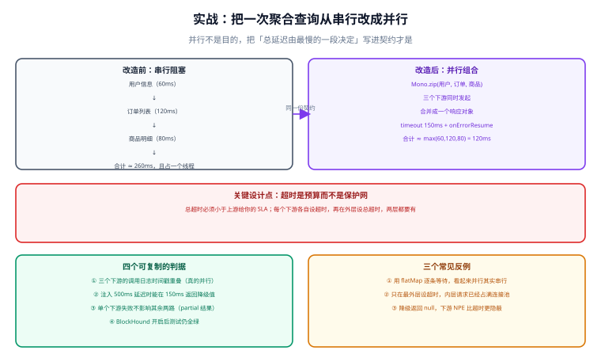

# 实战：一次聚合查询的改造

这一页把前面几页的结论落到一个具体场景上：**一个「打开用户主页」的接口，需要聚合三次远程调用。** 目标不是「用上响应式」，而是把「总延迟由最慢的一段决定」写进契约，并用可复制的判据证明它成立。

## 一句话定位

这是响应式最经典的落地形态：**把 N 次有依赖或无依赖的远程调用组合成一条声明式管道，让超时、降级、并发上限集中在一处表达。**

## 一、需求与约束

| 项 | 现状 | 目标 |
| --- | --- | --- |
| 接口 | `GET /api/v1/users/{id}/home` | 不变（**先定契约再改实现**） |
| 数据来源 | 用户服务、订单服务、商品服务（三个 HTTP 下游） | 不变 |
| 单次耗时 | 用户 60ms / 订单 120ms / 商品 80ms | 不变（下游不优化） |
| 当前实现 | 串行调用，合计约 260ms + 网络开销 | **P95 ≤ 180ms** |
| 可用性要求 | 任一下游失败时，页面主体仍要显示 | 订单/商品**可降级**，用户**不可降级** |
| 并发量 | 峰值 300 QPS | 事件循环线程不被打满 |

::: warning 先确认「不可降级」的那一路
三条数据里**用户信息是页面的主体**：它拿不到，页面就没有意义——所以它不可降级，失败必须返回明确错误。订单与商品可以降级为「暂时无法显示」。**这一步判断不能省**：如果三条都当可降级处理，会做出「用户不存在也返回 200 + 空页面」这种最难排查的行为。
:::

## 二、改造前：串行阻塞

```java [LegacyUserHomeService.java]
// 改造前：三次远程调用串行执行
public UserHome load(long userId) {
    User u = userClient.get(userId);                 // 60ms
    List<Order> orders = orderClient.listByUser(userId);   // 120ms
    List<Product> products = productClient.listByUser(userId);  // 80ms
    return new UserHome(u, orders, products);
}
```

耗时构成：

| 段 | 耗时 | 与前一段的关系 |
| --- | --- | --- |
| 用户 | 60ms | — |
| 订单 | 120ms | **串行等待** |
| 商品 | 80ms | **串行等待** |
| 合计 | ≈ 260ms + 3 次建连开销 | 延迟是**相加**的 |

三条调用之间**没有任何数据依赖**（都以 `userId` 为入参），这是可以并行的前提。

## 三、设计



### 3.1 并行组合

```java [UserHomeService.java]
@Service
public class UserHomeService {

    private static final Duration PER_CALL = Duration.ofMillis(120);   // 单下游预算
    private static final Duration TOTAL    = Duration.ofMillis(180);   // 接口总预算

    public Mono<UserHome> load(long userId) {
        Mono<User> user = userClient.get(userId)
            .timeout(PER_CALL);

        Mono<List<Order>> orders = orderClient.listByUser(userId)
            .timeout(PER_CALL)
            .onErrorResume(e -> degrade(e, "orders", List.of()));      // 可降级

        Mono<List<Product>> products = productClient.listByUser(userId)
            .timeout(PER_CALL)
            .onErrorResume(e -> degrade(e, "products", List.of()));    // 可降级

        return Mono.zip(user, orders, products)                        // 三路并发，等最慢的一路
            .map(t -> new UserHome(t.getT1(), t.getT2(), t.getT3()))
            .timeout(TOTAL)                                            // 总预算兜底
            .onErrorMap(TimeoutException.class,
                e -> new UpstreamTimeoutException("聚合超时"));         // 不可降级时不吞异常
    }

    private <T> Mono<T> degrade(Throwable e, String part, T fallback) {
        log.warn("下游降级 part={} reason={}", part, e.toString());
        metrics.degraded(part);                                        // 降级必须计数
        return Mono.just(fallback);
    }
}
```

| 设计点 | 为什么这样做 |
| --- | --- |
| `Mono.zip` 而不是 `flatMap` 链 | `zip` 会**同时订阅**三条流；`flatMap` 串起来是「上一个完成才发下一个」 |
| 每个下游各自 `timeout` | 单下游预算 = 它自己的 SLA；缺了它，一路卡住会吃掉整个总预算 |
| 外层再设 `TOTAL` | 防止「三个都在 119ms 才超时」的叠加效应把总耗时推到 360ms |
| 降级放在**下游各自的位置** | 降级是数据来源的属性，不是接口的属性；集中处理会丢掉「哪一路失败」的信息 |
| 降级必须计数 | 否则降级会长期存在而没人发现（页面看起来「就是没订单」） |
| 不可降级路径抛**自定义异常** | 让全局处理器返回明确错误码，而不是 500 + 空对象 |

### 3.2 超时预算表

超时不是「保护网」，而是**预算**：上层给你的时间必须大于内层之和。

| 层 | 预算 | 依据 |
| --- | --- | --- |
| 单次下游调用 | 120ms | 下游 P99 约 100ms，留 20% 余量 |
| 聚合总耗时 | 180ms | 并行后约等于最慢一路（120ms）+ 组装与调度开销 |
| 网关 / 上游对本站的超时 | ≥ 300ms | 必须大于本站总预算，否则网关先超时，本站的降级逻辑永远执行不到 |
| 客户端（浏览器）超时 | ≥ 网关超时 | 同上 |

::: danger 一个常见误区
**把最外层超时当成唯一防线。** 只在最外层设 180ms 超时的后果是：三个下游请求都已经发出并**占着连接**，180ms 到点时外层放弃等待，但内层请求还在跑——连接池被占住，下一批请求连发起的机会都没有。正确做法是「内层单次预算 + 外层总预算」两层都要有。
:::

### 3.3 降级矩阵

| 下游 | 可降级 | 降级后的响应 | 前端需要知道吗 |
| --- | --- | --- | --- |
| 用户 | **否** | 返回 404 / 502（按语义定） | 是 |
| 订单 | 是 | 空列表 + `partial=true` | 是（显示「暂时无法加载」） |
| 商品 | 是 | 空列表 + `partial=true` | 是 |

```json [响应示例]
{
  "user": { "id": 1, "name": "alice" },
  "orders": [],
  "products": [],
  "partial": true,
  "degraded": ["orders", "products"]
}
```

::: tip 为什么要在响应里加 `partial` / `degraded`
**「空」和「失败」在客户端是完全不同的两件事。** 不加标记，前端只能把「暂时加载失败」显示成「你没有订单」——用户会以为数据丢了。这两个字段是降级方案的一部分，不是可选的装饰。
:::

## 四、判据清单（可复制）

改完之后要能证明下面每一条，缺一条就不算完成：

| # | 判据 | 验证方式 | 期望 |
| --- | --- | --- | --- |
| P1 | 三路真的并发 | 看下游日志时间戳是否有重叠 | 三次调用的开始时间差 ≤ 20ms |
| P2 | 总耗时 ≈ 最慢一路 | 本地压测 P95 | ≤ 180ms（原 260ms+） |
| P3 | 单下游慢不影响其余两路 | 给订单服务注入 500ms 延迟 | P3 场景下 180ms 内返回，`partial=true` |
| P4 | 用户服务失败时明确报错 | 让用户服务返回 500 | 返回 502/404，**不是** 200 + 空页面 |
| P5 | 降级被计数 | 查指标 `degraded_total{part="orders"}` | 每次降级 +1 |
| P6 | 无阻塞调用 | BlockHound 门禁 | 集成测试全绿 |
| P7 | 连接池不被打满 | 压测时看 `r2dbc/webclient` 连接池排队 | 排队时长 P95 < 20ms |
| P8 | 取消能释放资源 | 客户端提前断开 | 服务端日志出现取消记录，连接数回落 |

```java [UserHomeServiceTest.java]
@Test
void P3_单下游慢时整体仍在预算内并标记降级() {
    wireMock.stubFor(get("/orders").willReturn(aResponse().withFixedDelay(500).withBody("[]")));

    StepVerifier.create(service.load(1L))
        .assertNext(home -> {
            assertThat(home.partial()).isTrue();
            assertThat(home.degraded()).contains("orders");
        })
        .verifyComplete();
}

@Test
void P1_三路并发() {
    CountDownLatch latch = new CountDownLatch(3);   // 三个下游都用同一个 latch 挡住
    // 三个 stub 都在 latch.await() 前不返回；若实现是串行，第二次请求永远发不出去，
    // 测试会在超时后失败 —— 这条断言专门用来抓「看起来并行其实串行」
    assertThat(TestClock.awaitAll(latch, Duration.ofSeconds(2))).isTrue();
}
```

::: danger 三个必须避免的反例
1. **用 `flatMap` 串起来当成并行**：`a.flatMap(x -> b.flatMap(y -> c))` 是**串行**的，因为 `b` 只有在 `a` 完成后才被订阅。判据就是 P1——**只有时间戳重叠才是并行**。
2. **降级返回 `null`**：Reactor 不允许 `null` 元素，会在链路上抛 `NullPointerException`，堆栈指向完全无关的位置。
3. **只在最外层设超时**：见上面的误区说明；内层请求会继续占用连接。
:::

## 五、容量与压测

改造后瓶颈从「线程数」转移到了**连接池与下游容量**，必须重新压：

| 项 | 关注点 | 判据 |
| --- | --- | --- |
| WebClient 连接池 | `maxConnections`、`pendingAcquireTimeout` | 峰值 QPS 下 `pendingAcquireTimeout` 不触发 |
| 下游并发保护 | 对每个下游单独限并发（不是总限） | 单下游并发不超过其承载能力 |
| 事件循环线程 | 是否被业务计算占住 | CPU 使用率与线程数不随并发线性增长 |
| 超时与重试的乘积 | 重试会放大下游压力 | 重试次数 × QPS ≤ 下游容量 |

```java [WebClientConfig.java]
@Bean
WebClient orderClient(WebClient.Builder builder) {
    var connector = new reactor.netty.http.client.HttpClient()
        .option(ChannelOption.CONNECT_TIMEOUT_MILLIS, 200)
        .responseTimeout(Duration.ofMillis(120));      // 传输层超时，与 timeout() 形成双保险

    return builder
        .baseUrl("http://order-service")
        .clientConnector(new ReactorClientHttpConnector(connector))
        .build();
}
```

::: warning 重试与超时要一起算
「单次 120ms 超时 + 重试 2 次」的最坏耗时是 360ms，已经超过接口总预算 180ms——**超时预算必须把重试次数乘进去**。在聚合场景里，通常的正确选择是：**不重试，直接降级**（用户等不起，重试还会放大下游压力）。
:::

## 六、本方案明确不做的四件事

写清「不做什么」比写清「做了什么」更能防止后期蔓延：

| 不做的事 | 理由 | 替代 |
| --- | --- | --- |
| 不做结果缓存 | 主页数据个人化、变更频繁；缓存会引入一致性成本 | 需要时按 [分布式缓存深入](../../DistributedCache/Overview/index.md) 的分级策略单独设计 |
| 不做请求合并（batch loader） | 当前 QPS 下收益不明显，会显著增加复杂度 | 等单接口 QPS 上千再考虑 |
| 不做全链路响应式改造 | 只有这一个聚合接口需要并行组合 | 其余接口保持 MVC（可开虚拟线程） |
| 不引入响应式 ORM 替换 MyBatis | 改造面大于收益 | 该接口的数据来源都是 HTTP，不涉及数据库 |

## 七、验证方式

```shell
# 1. 契约不变：改造前后响应结构一致（只多出 partial / degraded 两个字段）
curl -s http://127.0.0.1:8080/api/v1/users/1/home | jq 'keys'
# 预期：包含 user/orders/products，且可包含 partial/degraded

# 2. P2：本地对接口压测，确认 P95 落在预算内（示例用 k6 或 ab，任选）
#    ab -n 2000 -c 50 http://127.0.0.1:8080/api/v1/users/1/home

# 3. P3：给订单下游注入延迟后重跑，观察 partial 字段
curl -s http://127.0.0.1:8080/api/v1/users/1/home | jq '.partial, .degraded'

# 4. P6：阻塞门禁（CI 里常开）
./gradlew test --tests '*UserHomeServiceTest'

# 5. P8：客户端提前断开（-m 1 表示 1 秒后主动断开）
curl -m 1 -s http://127.0.0.1:8080/api/v1/users/1/home -o /dev/null
# 预期：服务端出现取消记录，紧随其后的连接池活跃数回落
```

::: warning 判据不是实测记录
P1~P8 是**判据**（每条的验证方式与期望），不是实测结果。本机没有可运行工程时，如实写「未跑 + 原因」，**不要把期望值抄进结论**。
:::

## 参考资料

- Reactor 官方文档 · 操作符选择（`zip` 与 `flatMap` 的区别）：https://projectreactor.io/docs/core/release/reference/#which-operator
- Reactor 官方文档 · 超时与重试：https://projectreactor.io/docs/core/release/reference/#_handle_errors
- Reactor Netty 客户端连接池与超时配置：https://projectreactor.io/docs/netty/release/reference/index.html
- Spring Framework 官方文档 · `WebClient`：https://docs.spring.io/spring-framework/reference/web/webflux-webclient.html
- [分布式缓存深入 · 缓存层韧性](../../DistributedCache/Availability/index.md)：降级与可降级性判断的口径来源
