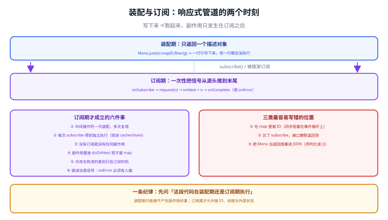

# Reactor 核心

Reactor 是 Spring 生态里的响应式实现（Reactive Streams 规范的一套 Java 落地）。这一页只讲**用好 Reactor 必须建立起来的五个心智模型**：两个类型、两个时刻、调度器、冷热流、上下文。操作符按四类给高频清单，不追求穷举。

## 一句话定位

`Mono` 和 `Flux` **不是容器，是描述**。写下一个 `Mono` 等于写下一份「数据将怎么流动」的说明书；说明书本身不产生任何副作用，只有被订阅时才执行。

::: tip 记住这一句就够
**没有订阅，就没有任何事发生。** 这一条能解释新手遇到的绝大多数「代码没执行」「接口返回空」「日志打了两遍」。
:::

## 一、两个类型：Mono 与 Flux

| 类型 | 语义 | 典型用途 | 不要这样用 |
| --- | --- | --- | --- |
| `Mono<T>` | 0 或 1 个元素 | 单条查询、一次远程调用、一个写入操作 | 明明单值却写成 `Flux<T>` 再 `.next()` |
| `Flux<T>` | 0..N 个元素 | 列表查询、流式读取、事件推送 | 把 `Flux` 当作 `List` 用（它是**流**，不是集合） |
| `Mono<Void>` | 无返回值的完成信号 | 删除、发送、`then()` 之后的操作 | 为了「统一」把所有写操作都包成 `Mono<Boolean>` |

```java [UserService.java]
// 推荐：类型直接表达基数
public Mono<User> findById(long id);              // 0 或 1
public Flux<User> listByTeam(String teamId);      // 0..N
public Mono<Void> delete(long id);                // 只关心完成

// 不推荐：把一切塞进 Flux，调用方被迫 .next() / .collectList()
public Flux<User> findById(long id);              // 语义被稀释了
```

::: warning 关于空值
Reactor 里**不允许 `null` 作为元素**（`Mono.just(null)` 会直接抛 `NullPointerException`）。「查不到」要表达为空信号（`Mono.empty()`），而不是空值；查询结果为空时框架通常自动返回 `empty`，这与「返回 null」是两种不同的语义，直接影响 `switchIfEmpty` 的写法。
:::

## 二、装配期与订阅期



这是 Reactor 里最重要的一条分界线，也是所有「诡异行为」的根源：

```java [Demo.java]
Mono<String> mono = Mono.fromCallable(() -> {
        System.out.println("调用下游");   // 装配期不会打印
        return "ok";
    })
    .map(s -> s.toUpperCase());

System.out.println("装配完成");           // 先打印这一行
mono.subscribe(v -> System.out.println("结果: " + v));  // 此刻才打印「调用下游」
```

### 2.1 由此推出的六条纪律

1. **中间操作符可以一次装配、多次复用**：只要每次 `subscribe()`，就会独立执行一次（冷流）。
2. **副作用必须放在 `doOn*` 里**，而不是 `map` / `filter` 里——后两者的本意是纯转换，把副作用藏进去会让调试与测试都变难。
3. **`Mono` 当作方法返回值时不要顺手 `block()`**：那等于把非阻塞管道又拉回阻塞，位置放在事件循环线程上就是事故。
4. **`subscribe()` 只写在链路的最末端**（或者交给框架）。在业务方法中间调用 `subscribe()` 会让返回值与副作用脱钩，异常也拿不到。
5. **错误也是信号**：`onError` 必须有人接（`onErrorResume` / `onErrorReturn` / 框架的全局异常处理），否则会以 `onErrorDropped` 的形式打到日志里，调用方只看到连接被重置。
6. **装配期做的事不能依赖请求数据**：装配期的代码只执行一次，把「请求级」的变量放在装配期，多个请求会互相串数据。

```java [AntiPattern.java]
// 反面典型：先订阅再返回，异常与结果都脱离了上下文
public Mono<Result> handle(Request req) {
    service.call(req).subscribe(r -> log.info("done: {}", r));
    return Mono.just(new Result());          // 调用方永远拿不到真实结果
}

// 正确：把「返回」和「副作用」串在一条管道里
public Mono<Result> handle(Request req) {
    return service.call(req)
        .doOnNext(r -> log.info("done: {}", r))
        .map(Result::from);
}
```

## 三、高频操作符四类清单

操作符有几百个，实际高频的就四类二十来个。**遇到没见过的先查官方 Javadoc，不要凭名字猜语义**（`concatMap` 与 `flatMap` 就不一样，见下）。

### 3.1 转换与映射

| 操作符 | 作用 | 要点 |
| --- | --- | --- |
| `map` | 一对一同步转换 | **里面不能做 IO**（在订阅线程上执行） |
| `flatMap` | 一对多异步展开（并发） | 内部 `Mono` 会并发订阅，**顺序不保证** |
| `concatMap` | 一对多异步展开（串行） | 保证顺序，吞吐低于 `flatMap`；有顺序要求就用它 |
| `flatMapSequential` | 并发执行 + 按原顺序收集 | 折中方案，代价是内部缓冲 |
| `cast` | 类型转换 | 只在类型确定时用，失败是 `ClassCastException` |
| `then` / `thenReturn` | 丢弃上游元素，只保留完成信号 | 写操作的收尾很常用 |

```java [OrderService.java]
// 顺序敏感：同一个订单的步骤必须串行
return validate(order)
    .concatMap(v -> reserveStock(v))        // 串行，保证先校验后扣减
    .flatMap(v -> saveOrder(v))
    .thenReturn(Ok.INSTANCE);

// 批处理场景：允许并发但要保持结果顺序
return Flux.fromIterable(ids)
    .flatMapSequential(id -> remote.fetch(id), 8)   // 并发 8，结果按输入顺序
    .collectList();
```

### 3.2 过滤与去重

| 操作符 | 作用 | 要点 |
| --- | --- | --- |
| `filter` | 按条件过滤 | 条件里不要查数据库 |
| `distinct` | 全量去重 | 会保留已见元素，**内存随流增长** |
| `take(n)` | 取前 n 个后**取消上游** | 取消是响应式的关键能力（连接会被释放） |
| `takeUntil` / `takeWhile` | 条件取数 | 前者含触发元素，后者不含 |
| `next()` | 取第一个元素转成 `Mono` | 空流会得到 `empty`，不是错误 |

### 3.3 时间相关

| 操作符 | 作用 | 要点 |
| --- | --- | --- |
| `timeout(Duration)` | 超时转 `TimeoutException` | **默认在并行调度器上计时**，不受链路阻塞影响 |
| `delayElements` | 每个元素延迟发出 | 测试与限速用，生产慎用 |
| `interval` | 周期性发信号 | 采样 / 心跳；必须配背压或 `take` |
| `timeout(Duration, fallback)` | 超时直接切到兜底流 | 最常用的写法，见实战页 |

### 3.4 错误与重试

| 操作符 | 作用 | 要点 |
| --- | --- | --- |
| `onErrorReturn(v)` | 出错时返回兜底值 | 兜底值也要能表达「降级」语义 |
| `onErrorResume(fn)` | 出错时切到另一条流 | **可做条件降级**（按异常类型分流） |
| `onErrorMap(fn)` | 异常转换 | 把底层异常翻译成业务异常 |
| `retryWhen(rs -> ...)` | 有策略重试 | 必须配**退避 + 上限 + 只对可重试异常** |
| `doOnError(fn)` | 仅观察，不改变流 | 记日志用；它不会吞掉错误 |

```java [RemoteCall.java]
// 只有「可重试异常 + 指数退避 + 上限 + 总超时」四件都齐了才叫可靠重试
return client.fetch(id)
    .timeout(Duration.ofMillis(800))
    .retryWhen(Retry.backoff(2, Duration.ofMillis(50))
        .filter(e -> e instanceof IOException)          // 只重试网络类异常
        .maxBackoff(Duration.ofMillis(200)))
    .onErrorResume(TimeoutException.class, e -> cache.fallback(id));
```

::: danger 重试最常见的三个错误
1. **不区分异常就重试**：把「参数非法」也重试两遍，等于把确定的失败变成三次无谓调用。
2. **没有上限**：`retry()` 不传参是**无限重试**，会一直打到上游挂掉。
3. **重试位置放错**：把 `retryWhen` 放在 `timeout` **外面**，每次重试都重新计时，总耗时会被放大成 N 倍预算；正确做法是内层单次超时、外层总预算。
:::

## 四、调度器：`publishOn` 与 `subscribeOn`

调度器决定「代码跑在哪个线程上」。它是最容易被用错的一环。

| 调度器 | 线程特征 | 适用 |
| --- | --- | --- |
| `Schedulers.immediate()` | 当前线程 | 默认行为，不切换 |
| `Schedulers.parallel()` | 固定为 CPU 核数 | **CPU 密集或非阻塞**任务 |
| `Schedulers.boundedElastic()` | 弹性、**有上限**（默认 10 × CPU 核数） | **阻塞调用**必须用它，别自己 `newFixedThreadPool` |
| `Schedulers.single()` | 单线程 | 需要串行化的低频任务 |

| 操作符 | 作用范围 | 记忆方式 |
| --- | --- | --- |
| `subscribeOn` | 影响**订阅**发生的线程，也就是**上游**（源头）的执行线程 | 「从哪开始跑」 |
| `publishOn` | 影响**它之后**的所有操作符执行线程 | 「从哪切换跑」 |

```java [SchedulerDemo.java]
// 典型组合：源头用弹性调度器（因为它是阻塞 IO），后续回到并行调度器做计算
return Mono.fromCallable(() -> blockingJdbc.query(sql))     // 阻塞调用
    .subscribeOn(Schedulers.boundedElastic())               // 让它在弹性线程上跑
    .map(this::heavyTransform)                              // 计算
    .publishOn(Schedulers.parallel());                      // 计算切到并行线程

// 链路上多次 publishOn 是合法的，但每多一次就多一次线程切换（见实战页的反例）
```

::: danger 三个调度器错误
1. **在响应式链路里不给阻塞调用指定调度器**：`Mono.fromCallable(阻塞方法)` 会在订阅线程（可能就是事件循环线程）上执行——**必须配 `subscribeOn(boundedElastic())`**。
2. **把 `boundedElastic` 当成无限池**：它有上限（默认 10 × CPU 核数），打满后同样会排队；而且它内部有「每个线程一个队列」的结构，长任务会拖住队列里的短任务。
3. **以为 `publishOn` 能解决阻塞**：它只换线程，不改变「这个线程会被占住」的事实。如果换到事件循环线程上，问题反而更严重。
:::

## 五、冷流与热流

| 形态 | 行为 | 例子 |
| --- | --- | --- |
| 冷流（Cold） | 每次订阅都重新执行一次，各自独立 | `Mono.fromCallable`、HTTP 请求 |
| 热流（Hot） | 一次执行，多个订阅者共享同一份信号 | `Sinks`、`ConnectableFlux` |

| 操作符 | 语义 | 代价 |
| --- | --- | --- |
| `cache()` | 缓存**第一次**订阅的结果，后续订阅直接复用 | 结果常驻内存；错误也会被缓存 |
| `share()` | 多订阅者共享一次订阅（广播） | 订阅者加入时机不同会错过早期元素 |
| `replay(n)` | 重放最近 n 个元素给后加入者 | 占用缓冲 |
| `Sinks.many().multicast()` | 手动创建热流 | 需要自己管背压与终止 |

```java [ConfigService.java]
// 典型用法：启动时读一次的配置，多个调用方各自订阅不应重复读
private final Mono<Config> config = Mono.fromCallable(this::loadFromDb)
    .subscribeOn(Schedulers.boundedElastic())
    .cache();                 // 只有第一次真的查库

// 反面：没有 cache 时，5 个调用方 = 5 次查库
private final Mono<Config> config = Mono.fromCallable(this::loadFromDb);
```

::: warning `cache()` 的两条注意
① 它缓存的是**结果与错误**：一次失败会被后续所有订阅者共享，如果下游有重试逻辑要注意这一点；② 它**没有过期时间**，配置类数据建议设 TTL 或在变更时重建（`cacheInvalidateIf`）。
:::

## 六、Context：`ThreadLocal` 的替代

响应式链路会换线程，`ThreadLocal` 因此不可靠——`Context` 是随订阅链传播的键值容器。

```java [TraceFilter.java]
// ① 写入：只能在「组装链路」时写，不能订阅后随便塞
public Mono<Void> filter(ServerWebExchange exchange, WebFilterChain chain) {
    String traceId = exchange.getRequest().getHeaders().getFirst("X-Trace-Id");
    return chain.filter(exchange)
        .contextWrite(Context.of("traceId", traceId == null ? UUID.randomUUID().toString() : traceId));
}

// ② 读取：在管道内部用 deferContextual 拿，不要用静态变量传
return Mono.deferContextual(ctx -> {
    String traceId = ctx.get("traceId");
    return remote.call(id).doOnNext(r -> log.info("[{}] got {}", traceId, r));
});
```

::: danger `Context` 的三条纪律
1. **`contextWrite` 在链路上是「向上生效」的**：写在下面（靠近订阅端）才能被上面的操作符读到，位置写反会读到空值。
2. **不要用静态变量或 `ThreadLocal` 传请求级数据**：事件循环线程是复用的，串数据是必然事件而不是偶然事件。
3. **MDC 要显式桥接**：日志框架读的是 `ThreadLocal` 里的 MDC，`Context` 不会自动进去，需要 `doOnEach` + `MDC.put/remove` 的钩子，或用 Reactor 官方提供的 MDC 适配（见 [调试与排障](../Debugging/index.md)）。
:::

## 验证方式

Reactor 的所有行为都可以用 `StepVerifier` 断言，`reactor-test` 是测试依赖里最该先加的一个：

```java [ReactorTest.java]
@Test
void 管道按预期发出信号() {
    StepVerifier.create(service.findById(1L))
        .expectNextMatches(u -> u.id() == 1L)
        .verifyComplete();

    // 超时分支也要有断言，否则降级逻辑等于没测
    StepVerifier.create(service.findByIdWithTimeout(2L))
        .expectNextMatches(u -> "fallback".equals(u.source()))
        .verifyComplete();

    // 装配期不执行：不订阅则一个信号都没有
    StepVerifier.create(service.findById(1L), 0)
        .expectSubscription()
        .thenCancel()
        .verify();
}
```

预期判读：全部通过（`verifyComplete` / `thenCancel` 都是可断言终点）；若出现 `expectation failed (expected: onComplete, actual: onError)`，说明链路上有未被捕获的信号。

```shell
# 依赖（Boot 4.1 已统一管理版本，不要手写版本号）
# gradle: testImplementation("io.projectreactor:reactor-test")
mvn -q dependency:tree -Dincludes=io.projectreactor
```

## 参考资料

- Reactor 官方参考文档 · 操作符如何选择：https://projectreactor.io/docs/core/release/reference/#which-operator
- Reactor 官方 Javadoc（`Mono` / `Flux`）：https://projectreactor.io/docs/core/release/api/
- `StepVerifier` 用法（官方测试指南）：https://projectreactor.io/docs/core/release/reference/#testing
- Reactor 调度器文档（线程模型）：https://projectreactor.io/docs/core/release/reference/#schedulers
- Reactor `Context`（上下文传播）：https://projectreactor.io/docs/core/release/reference/#context
