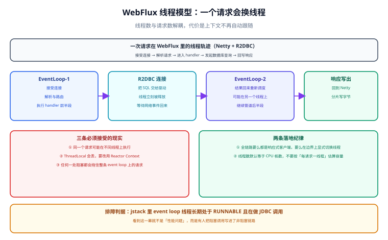

# WebFlux 落地

WebFlux 是 Spring 的响应式 Web 框架。这一页讲四件事：两种端点风格怎么选、返回值类型对应的语义、线程模型带来的三条现实约束、以及**哪些东西应该留在 Spring MVC**。

## 一句话定位

WebFlux 不是「更快的 Spring MVC」，而是**另一套运行时**：没有 Servlet 容器、没有「一个请求一个线程」的假设、也没有 `ThreadLocal` 语境。它的收益来自**用少量线程承载大量连接**，代价是整条链路必须保持非阻塞。

## 一、两种端点风格

| 风格 | 写法 | 适用 | 代价 |
| --- | --- | --- | --- |
| 注解式（`@Controller`） | 与 MVC 几乎同形的注解 | 已有 MVC 经验、接口数量多、以 CRUD 为主 | 无法完全避免「看起来像 MVC、其实语义不同」的误读 |
| 函数式（`RouterFunction`） | 路由 + `HandlerFunction` 组合 | 需要组合路由、动态注册、细粒度过滤 | 需要理解 `ServerRequest` / `ServerResponse` |

```java [UserController.java]
// 注解式：与 MVC 的差异只在返回类型
@RestController
@RequestMapping("/api/v1/users")
public class UserController {

    private final UserService service;

    @GetMapping("/{id}")
    public Mono<User> get(@PathVariable long id) {
        return service.findById(id);                 // 返回 Mono，不要 block
    }

    @GetMapping
    public Flux<User> list(@RequestParam String teamId) {
        return service.listByTeam(teamId);
    }
}
```

```java [UserRouter.java]
// 函数式：路由是数据，可组合、可测试
@Configuration
public class UserRouter {

    @Bean
    RouterFunction<ServerResponse> userRoutes(UserHandler handler) {
        return route()
            .GET("/api/v1/users/{id}", accept(APPLICATION_JSON), handler::get)
            .GET("/api/v1/users", handler::list)
            .POST("/api/v1/users", handler::create)
            .build();
    }
}

@Component
public class UserHandler {
    public Mono<ServerResponse> get(ServerRequest req) {
        long id = Long.parseLong(req.pathVariable("id"));
        return service.findById(id)
            .flatMap(u -> ServerResponse.ok().bodyValue(u))
            .switchIfEmpty(ServerResponse.notFound().build());
    }
}
```

::: tip 怎么选
**接口形态固定、以业务 CRUD 为主，用注解式**；需要按条件动态挂载路由、或者想把「路径 → 处理函数」当成一份可组合的配置，用函数式。两者可以在同一个应用里共存（函数式路由的优先级高于注解式）。
:::

## 二、返回值类型与语义

返回类型不只是类型选择，它决定**框架怎么处理空值与响应头**：

| 返回类型 | 语义 | 空结果时 | 注意 |
| --- | --- | --- | --- |
| `Mono<T>` | 单个对象 | **返回 200 + 空 body** | 想返回 404 要显式用下面的两种 |
| `Flux<T>` | 集合 / 流 | 200 + `[]` | 序列化时按数组处理 |
| `Mono<ResponseEntity<T>>` | 完全控制状态码与响应头 | 自己决定 | **需要 404 / 自定义头时用这个** |
| `Mono<Void>` | 无 body | 200（或按 `@ResponseStatus`） | 写操作收尾常用 |
| `Flux<ServerSentEvent<T>>` | SSE 流 | 连接保持打开 | 见下面第七节 |
| `Mono<ServerResponse>` | 函数式端点专用 | 自己决定 | 只在 `RouterFunction` 里用 |

```java [UserController.java]
// 想返回 404：empty 不会自动变成 404
@GetMapping("/{id}")
public Mono<ResponseEntity<User>> get(@PathVariable long id) {
    return service.findById(id)
        .map(ResponseEntity::ok)
        .defaultIfEmpty(ResponseEntity.notFound().build());
}
```

::: danger 三个「不报错但错」的返回
1. **把 `Mono` 直接返回给客户端**：如果某处误把服务层的 `Mono` 塞进一个普通 DTO 字段，序列化出来是 `{}`，接口看起来 200 正常，字段却是空的。
2. **`Mono<Void>` 却期待有 body**：`then()` 之后没有任何元素，客户端只能拿到空响应体。
3. **在控制器里 `block()`**：编译通过、单测通过，但在真实事件循环线程上执行时会抛 `IllegalStateException: block()/blockFirst()/blockLast() are blocking, which is not supported in thread reactor-http-nio-x`——**上线后才发现**。
:::

## 三、参数与请求体绑定

| 绑定对象 | 响应式写法 | 说明 |
| --- | --- | --- |
| `@RequestBody` | `Mono<User>` / `Flux<User>` | 用流式类型可以边读边处理大请求体 |
| `@RequestParam` / `@PathVariable` | 普通类型即可 | 它们本身不涉及 IO |
| `@RequestHeader` | `String` / `HttpHeaders` | — |
| 校验 | `Mono<User>` + `@Valid` | 需要在链路上显式触发校验（见下） |
| 会话 / 安全上下文 | 由框架注入，**但要注意是否依赖 `ThreadLocal`** | Spring Security 在 WebFlux 里改用 `ReactiveSecurityContextHolder` |

```java [UserValidator.java]
// @Valid 在响应式签名下不会自动抛异常，要显式触发
@PostMapping
public Mono<User> create(@Valid @RequestBody Mono<User> body) {
    return body.flatMap(u -> service.create(u));   // 校验失败会走全局异常处理
}

// 需要「校验失败就返回自定义结构」时，用 validator 显式执行
private final Validator validator;                 // jakarta.validation.Validator

public Mono<User> create(Mono<User> body) {
    return body.doOnNext(u -> {
            var violations = validator.validate(u);
            if (!violations.isEmpty()) {
                throw new ConstraintViolationException(violations);
            }
        })
        .flatMap(service::create);
}
```

## 四、线程模型



| 对比项 | Spring MVC | WebFlux |
| --- | --- | --- |
| 运行时 | Servlet 容器（Tomcat / Jetty）+ 线程池 | Netty / Undertow（非阻塞）+ 事件循环 |
| 默认线程数 | 200（Tomcat `max-threads`） | CPU 核数 × 2（Netty 默认 event loop 组） |
| 一个请求占一个线程吗 | 是 | **不是**，中途会切换 |
| `ThreadLocal` | 可用（MDC、事务、安全上下文都靠它） | **不可靠**，要改为 `Context` |
| 阻塞调用的后果 | 只影响当前请求 | **拖住同一线程上的大批请求** |
| 容量估算方式 | 线程数 / 平均耗时 | 连接数与内存，与线程数无关 |

::: info 关于「默认线程数」
Netty 的 worker 线程数默认是 CPU 核数 × 2，可以通过 `reactor.netty.ioWorkerCount` 调整。**不要为了「扛更多请求」去调大它**——它服务的请求数上限不由线程数决定，调大反而增加上下文切换。
:::

### 4.1 三条必须接受的现实

1. **同一个请求可能在不同线程上执行**，因此任何依赖线程的隐式上下文都会丢（MDC 日志、`ThreadLocal` 缓存、`@Transactional` 的绑定）。
2. **事务要改用 `ReactiveTransactionManager`**：`@Transactional` 在响应式方法上能生效的前提是——**返回的是 `Mono` / `Flux` 而不是中途 `block()`**，且事务管理器必须是响应式的（见 [响应式数据访问](../DataAccess/index.md)）。
3. **任何阻塞都会污染整条链路**：包括 `Thread.sleep`、同步日志落盘、`synchronized` 段里的 IO、以及最隐蔽的 JDBC 调用。

```shell
# 判据：event loop 线程是否在干阻塞的活（生产排障第一条命令）
jcmd <pid> Thread.print | grep -A 12 "reactor-http-nio" | grep -E "socketRead|FileInputStream|java.sql|Thread.sleep"
```

预期判读：**输出为空**才说明事件循环线程是干净的；出现 `java.sql` 或 `socketRead` 基本可以确定为「阻塞调用混进非阻塞链路」。

## 五、异常处理

```java [GlobalExceptionHandler.java]
@RestControllerAdvice
public class GlobalExceptionHandler {

    @ExceptionHandler(NotFoundException.class)
    public Mono<ResponseEntity<ApiError>> notFound(NotFoundException e) {
        return Mono.just(ResponseEntity.status(404)
            .body(new ApiError("NOT_FOUND", e.getMessage())));
    }

    @ExceptionHandler(TimeoutException.class)
    public Mono<ResponseEntity<ApiError>> timeout(TimeoutException e) {
        // 超时是「服务端问题但可重试」：用 504，不要用 500
        return Mono.just(ResponseEntity.status(GATEWAY_TIMEOUT)
            .body(new ApiError("UPSTREAM_TIMEOUT", "依赖服务超时")));
    }
}
```

| 手段 | 适用 | 要点 |
| --- | --- | --- |
| `@ExceptionHandler` | 业务异常、统一的错误结构 | 可以返回 `Mono<ResponseEntity<T>>` |
| `ResponseStatusException` | 临时性、就地抛出 | 不参与统一错误结构，慎用于对外 API |
| `onErrorResume`（服务层） | **可降级**的依赖失败 | 降级后状态码仍应是 200，并在 body 里标注数据来源 |
| `onErrorMap` | 异常翻译 | 不要把底层异常直接暴露给客户端 |
| `doOnError` | 只记日志 | 它不处理错误，链路的错误仍会继续传播 |

::: warning 错误处理的位置决定语义
**「可降级」的失败要在服务层用 `onErrorResume` 处理**（返回兜底数据，业务继续）；**「不可降级」的失败要让它抛到全局处理器**（返回明确错误码）。把两者混在一起，会出现「超时了却返回 200 + 空列表」这种最难排查的问题。
:::

## 六、过滤器与切面

| 需求 | WebFlux 的做法 | 与 MVC 的差别 |
| --- | --- | --- |
| 请求级前置 / 后置处理 | `WebFilter`（有 `chain.filter(exchange)`） | 是响应式链，返回 `Mono<Void>`；**不要在里面做阻塞 IO** |
| 函数式路由的过滤 | `HandlerFilterFunction` | 只作用于被路由命中的请求 |
| 统一的请求日志 | `WebFilter` + `doOnEach` | 要显式把 traceId 写进 `Context` |
| 认证鉴权 | Spring Security WebFlux 的 `SecurityWebFilterChain` | 安全上下文在 `ReactiveSecurityContextHolder`，不是 `SecurityContextHolder` |
| AOP 切面 | 可用，但**切面里不能有阻塞调用** | 切面方法返回 `Mono` 时注意订阅时机 |

```java [TraceWebFilter.java]
@Order(Ordered.HIGHEST_PRECEDENCE)
@Component
public class TraceWebFilter implements WebFilter {

    @Override
    public Mono<Void> filter(ServerWebExchange exchange, WebFilterChain chain) {
        String traceId = exchange.getRequest().getHeaders().getFirst("X-Trace-Id");
        return chain.filter(exchange)
            .contextWrite(Context.of(TraceHolder.KEY,
                traceId == null ? UUID.randomUUID().toString() : traceId));
    }
}
```

## 七、流式响应：SSE 的完整写法

SSE（Server-Sent Events）是 WebFlux 最典型的甜点场景：**长连接、服务端推送、连接数与线程数无关**。

```java [MetricsStreamController.java]
@GetMapping(value = "/api/v1/metrics/stream", produces = MediaType.TEXT_EVENT_STREAM_VALUE)
public Flux<ServerSentEvent<Metric>> stream(@RequestParam String job) {
    return Flux.interval(Duration.ofSeconds(1))
        .flatMap(t -> collector.snapshot(job))
        .map(m -> ServerSentEvent.<Metric>builder()
            .id(m.id())
            .event("metric")
            .data(m)
            .retry(Duration.ofSeconds(5))          // 客户端断线重连的提示间隔
            .build())
        .timeout(Duration.ofMinutes(30))            // 防止连接永久占用
        .doOnCancel(() -> log.info("客户端断开 job={}", job));   // 断连必须记账
}
```

::: danger SSE 的三条硬约束
1. **必须处理客户端断开**：`doOnCancel` / `doFinally` 里释放订阅与资源，否则每次用户关页面都会留下一个泄漏的订阅。
2. **不能有反向代理缓冲**：Nginx 需要关闭该路径的缓冲（`proxy_buffering off`）并调大 `proxy_read_timeout`，否则事件会被攒着一起发。
3. **背压是假的**：SSE 出口没有真正的回压通道，客户端读得慢只会在服务端缓冲里堆积。**必须给流设上限**（元素数量上限或总时长），并监控待发队列。
:::

## 八、什么该留在 Spring MVC

| 场景 | 建议 | 理由 |
| --- | --- | --- |
| 团队已有大量 JPA / MyBatis 代码 | **留在 MVC** | 同步驱动在 WebFlux 里是负收益 |
| 需要成熟的模板渲染与文件上传生态 | 留在 MVC | 响应式生态在这两块更薄 |
| 需要极简迁移就拿到高并发 | **MVC + 虚拟线程** | 一行配置，代码不动 |
| 网关型转发、SSE/WebSocket、多路远程调用组合 | **用 WebFlux** | 见 [总览](../Overview/index.md) 的四个不可替代场景 |

::: warning 不要混用两种栈
同一个应用里既有 `spring-boot-starter-web` 又有 `spring-boot-starter-webflux` 时，Spring Boot **默认按 MVC 启动**（Servlet 栈优先）。如果确实需要两者共存，必须显式指定运行时，并明确哪些路径走哪套——混用带来的最大风险是**你以为在非阻塞运行时上，其实跑在 Servlet 线程池里**。
:::

## 验证方式

```shell
# 1. 端点可用性与响应头
curl -i http://127.0.0.1:8080/api/v1/users/1
# 预期：HTTP/1.1 200，Content-Type: application/json

# 2. SSE 流式验证（-N 关闭 curl 缓冲，能实时看到逐条事件）
curl -N http://127.0.0.1:8080/api/v1/metrics/stream?job=demo
# 预期：每秒出现一条 "event:metric" ＋ data 行；Ctrl+C 后服务端日志出现「客户端断开」

# 3. 阻塞检测（把阻塞调用临时塞进链路，观察是否报错）
#    在响应式线程上调用 block() 会抛 IllegalStateException，这是最省事的自检
# 4. 线程模型确认
jcmd <pid> Thread.print | grep -c "reactor-http-nio"
# 预期：为 CPU 核数 × 2（默认 worker 数），不随并发增长
```

::: warning 判据不是实测记录
以上四步是判据。若本机没有可运行工程，如实标注「未跑 + 原因」，**不要把期望输出抄成实测结果**。
:::

## 参考资料

- Spring Framework 官方文档 · WebFlux：https://docs.spring.io/spring-framework/reference/web/webflux.html
- Spring Framework 官方文档 · WebFlux 与 MVC 的选择：https://docs.spring.io/spring-framework/reference/web/webflux/new-framework.html
- Spring Framework 官方文档 · 函数式端点：https://docs.spring.io/spring-framework/reference/web/webflux-functional.html
- Spring Boot 官方文档 · Web 应用选型与运行时：https://docs.spring.io/spring-boot/reference/web/index.html
- Reactor Netty 线程模型与配置项：https://projectreactor.io/docs/netty/release/reference/index.html
