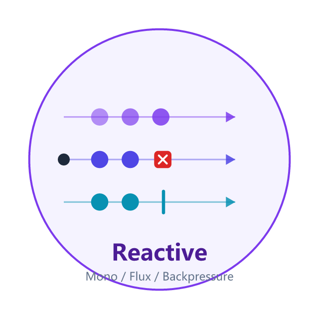
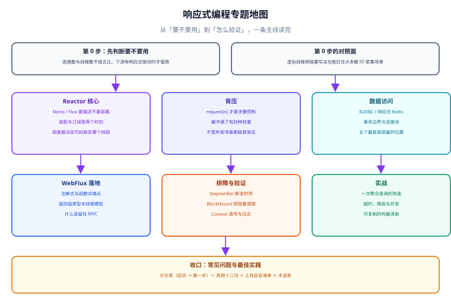

# 响应式编程

响应式编程（Reactive Programming）在本库里指的是**用「数据流 + 非阻塞」的方式处理并发**这一整套做法：用 `Mono` / `Flux` 描述数据怎么流动，用事件循环线程承载大量并发请求，用背压（Backpressure）表达「我能消费多少」。它解决的不是「代码写得更优雅」，而是**线程数与请求数解耦之后，资源怎么不被打满**。

::: tip 一句话定位
阻塞式编程里，「等待」的代价是一个线程；响应式里，「等待」的代价是一次回调注册。**代价变小了，但写错了照样把线程占满**——本专题的重点就是把「什么会占住线程」讲清楚。
:::

## 这个专题回答什么

一句话：**什么时候值得把链路改成响应式，改完怎么证明它真的没被阻塞。**

- 值得：连接极多且单个请求很慢、数据本身是流、下游只提供响应式驱动。
- 不值得：CRUD 为主、团队没有响应式经验、链路里到处是同步库——这时虚拟线程往往更划算。
- 怎么证明：BlockHound 门禁 + StepVerifier 断时序 + 水位指标，三者缺一。

## 与相邻专题的分工

本库已有若干页涉及响应式，**它们是不同层面的问题**，不要互相替代：

| 相邻页面 | 它讲什么 | 本专题讲什么 | 判据（什么时候翻哪一页） |
| --- | --- | --- | --- |
| [虚拟线程与高并发模型](../NetworkProgramming/VirtualThread/index.md) | 阻塞式路线的天花板：M:N 调度、不要再池化、`ScopedValue` 替代 `ThreadLocal` | 非阻塞路线的写法、背压与排障 | 先问「代码能不能不改」——能不改就走虚拟线程那页 |
| [Netty 入门](../NetworkProgramming/Netty/index.md) 与 [Netty 进阶](../NetworkProgramming/NettyAdvanced/index.md) | 事件循环、`ByteBuf`、写缓冲水位线这些**网络层**细节 | 应用层的流抽象与组合 | 问题在「字节怎么发出去」看 Netty；问题在「数据怎么组合」看本专题 |
| [WebClient](../Java/Frame/SpringBoot/v3/Remote/WebClient.md) | 响应式 HTTP 客户端的配置与用法（接入层） | 它在链路里的位置、为什么不能混用阻塞客户端 | 只需要调一个接口看那页；要组合多个调用看本专题 |
| [Spring Cloud Gateway](../SpringCloud/Gateway/index.md) | 网关的路由与过滤器（产品层用法） | 网关为什么必须跑在非阻塞运行时上 | 配路由看那页；解释「为什么网关不能写阻塞代码」看本专题 |
| [消息驱动：Spring Cloud Stream](../SpringCloud/Stream/index.md) | 把消息中间件抽象成函数式绑定 | 消费者速率追不上生产者时怎么办（背压与溢出策略） | 中间件选型与绑定看那页；速率不匹配看本专题的背压页 |
| [熔断、重试与降级](../Microservices/CircuitBreaker/index.md) | 通用的超时、重试、熔断、限流算法 | 这些工具在响应式链路里的参数与组合方式 | 先在那儿学工具形态，再回来看 `timeout` / `onErrorResume` 怎么接线 |
| [性能工程全景：指标口径与优化决策](../HighPerformanceJava/Overview/index.md) | JVM 层的 JIT、内存布局、锁优化、Profiling | 编程模型层的并发形态 | 压测后 CPU 高看性能专题；QPS 上不去而 CPU 低看本专题的排障页 |
| [分布式缓存深入 · 缓存层韧性](../DistributedCache/Availability/index.md) | 缓存不可用时的四种死法与四道闸门 | 响应式链路里对缓存调用的超时与降级写法 | 判据口径那边定，接线方式这里给 |

::: warning 一条边界
本专题**不讲** Java 并发基础（线程池、`CompletableFuture`、`AQS`），也不讲 Reactor 的全部操作符——操作符按「组合 / 过滤 / 转换 / 时间」四类给出高频清单，遇到没见过的一次查官方 Javadoc 比背下来更靠谱。
:::

## 专题地图

## 学习路径

按下面的顺序读，每一页都建立在前一页的判断之上：

1. **[总览：响应式的四条边界](./Overview/index.md)** —— 先判断要不要用。这一页会把「三条高并发路线」摆在一起对照，并给出五条「先别用响应式」的情形。
2. **[Reactor 核心](./Reactor/index.md)** —— 把模型搞清楚：装配期与订阅期的区别、冷流热流、调度器、`Context`。
3. **[背压](./Backpressure/index.md)** —— 响应式唯一无法被虚拟线程替代的能力。
4. **[WebFlux 落地](./WebFlux/index.md)** —— 注解式与函数式端点、返回值类型、和 Spring MVC 的边界。
5. **[响应式数据访问](./DataAccess/index.md)** —— R2DBC、事务边界、连接池，以及五个最容易阻塞的位置。
6. **[调试与排障](./Debugging/index.md)** —— `StepVerifier`、`BlockHound`、`Hooks.onOperatorDebug`、`Context` 透传。
7. **[实战：一次聚合查询的改造](./Practice/index.md)** —— 从串行阻塞到并行组合，附可复制的判据清单。
8. **[常见问题与最佳实践](./FAQ/index.md)** —— 分诊表、高频十二问、上线自查清单、术语表。

::: tip 只想解决一个具体问题
直接翻 [常见问题与最佳实践](./FAQ/index.md) 的分诊表：六种症状各自对应「第一步做什么」，比从头读快。
:::

## 版本状态速览（2026-10 口径）

版本事实按官方来源联网核对，写入时间 2026-10-08：

| 组件 | 当前版本 | 时间 | 说明 |
| --- | --- | --- | --- |
| Reactor（`reactor-core`） | **3.8.7** | 2026-08-20 | 3.8 线首发 2025-11-07，OSS 支持至 **2027-06-30**；企业版至 2028-06-30 |
| Reactor 3.7 | 3.7.19 | 2026-06-08 | **OSS 支持已于 2026-06-30 结束**，新项目不要从这里起步 |
| Reactor Netty | 1.3.x（2025.0 发布列车） | 随 3.8 同步 | 与 `reactor-core` 3.8 同列车，Boot 4.1 默认装配 |
| Spring Boot | **4.1.1** | 2026-08-20 | 4.2.0-M1 已于同日发布；**Boot 3.5 的 OSS 支持已于 2026-06-30 结束** |
| Spring Framework | **7.0.9** | 2026 | WebFlux 与 Web MVC 同版本列车 |
| Reactor BOM | 2025.0.x | 2025-11-07 起 | 由 Boot 依赖管理统一锁定，不要手写单体版本号 |
| R2DBC SPI（规范） | 1.0.0 | — | 驱动实现各自跟随 |
| `r2dbc-mysql` | **1.4.3** | 2026-07-22 | 与 Boot 4.1 配套使用；1.4.x 起需注意 `maxAllowedPacket` 等新选项 |
| `r2dbc-mariadb` | 1.4.2 | 2026-09 | 1.4.x 已修掉「上游取消导致挂起」等三处连接层缺陷 |

::: info 关于 Boot 4.x 的两条提醒
① `spring-boot-starter-webflux` 在 Boot 4.x 里**默认仍然不带 Servlet 容器**，混用 Web MVC 与 WebFlux 需要显式选运行时；② 反应式 HTTP 客户端新增了 **SSRF 防护配置**（可配置 `InetAddressFilter` 拦截出站地址），对外发请求的服务建议开启。
:::

## 大版本组织说明

本专题涉及的大版本主要有两处，按仓库约定**不覆盖旧内容**：

| 版本边界 | 处理方式 |
| --- | --- |
| Reactor 3.7 → 3.8 | **不单独建版本目录**：3.8 与 3.7 在同一套 API 上做演进，破坏性变化集中在少数被废弃的操作符与调度器行为上，页内用 `::: info` 标注「3.8 起」即可 |
| Spring Boot 4.0 → 4.1 | **不单独建版本目录**：WebFlux 的编程模型未变，差异集中在依赖管理、Actuator 端点与安全默认值上，页内标注「Boot 4.1 起」 |
| Spring Boot 3.x 存量项目 | 页面中涉及 3.x 差异的地方以「3.x 存量提示」形式保留，**不删除旧写法**，但明确标注它属于存量 |
| Spring Framework 6 → 7 | 同上。若后续出现**不兼容且影响写法**的大版本（如 WebFlux 编程模型换代），再按 `Spring6/`、`Spring7/` 方式另建版本目录 |

## 参考资料

- Project Reactor 官方文档（核心参考）：https://projectreactor.io/docs/core/release/reference/
- Project Reactor 支持时间线（版本生命周期口径来源）：https://projectreactor.io/support
- Spring Framework 官方文档 · Web on Reactive Stack：https://docs.spring.io/spring-framework/reference/web/webflux.html
- Spring Boot 4.1 发布说明（版本事实来源）：https://spring.io/projects/spring-release-notes
- Reactive Streams 规范（`request(n)` 的出处）：https://www.reactive-streams.org/
- R2DBC 官网（驱动与规范）：https://r2dbc.io/
- Reactor 官方「避免阻塞」指南：https://projectreactor.io/docs/core/release/reference/#faq.wrap-blocking
