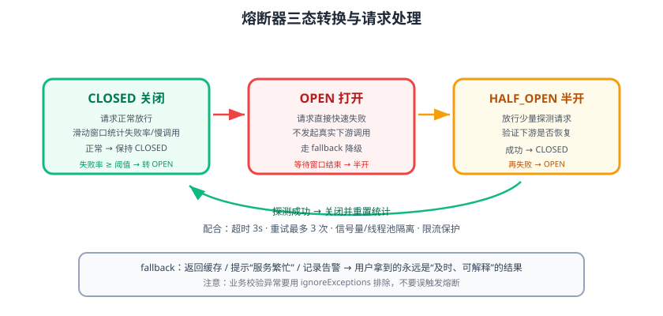

# 熔断限流与降级

微服务之间是网络调用，下游慢、挂、被打爆都不可避免。如果没有防护，一个服务故障会沿着调用链**雪崩式放大**。Spring Cloud 用 **Circuit Breaker（熔断器）抽象 + Resilience4j** 提供熔断、重试、限流、隔离、降级能力，让故障“局部化、可恢复”。



## 雪崩是怎么发生的

```text
订单服务 → 库存服务（变慢）
  → 订单服务的 Tomcat 线程全部阻塞等待库存响应
  → 新请求不断堆积，订单服务自身线程池耗尽
  → 网关也阻塞 → 上游网关雪崩 → 整个系统不可用
```

防护手段的职责：

| 手段 | 解决什么 | 一句话理解 |
| --- | --- | --- |
| 超时 | 下游无响应 | 不无限等待 |
| 熔断 | 下游持续故障 | 快速失败，不再空等 |
| 限流 | 上游/自身超量请求 | 挡住过多流量 |
| 降级 | 故障时提供替代响应 | 给用户“次优但不挂”的结果 |
| 隔离 | 故障在局部扩散 | 线程池/信号量隔离 |
| 重试 | 瞬时抖动 | 有限重试，避免放大流量 |

## 熔断器原理：状态机

Resilience4j CircuitBreaker 维护三个状态：

| 状态 | 行为 | 转换条件 |
| --- | --- | --- |
| CLOSED（关闭） | 正常放行，统计失败率 | 失败率 ≥ 阈值且请求数 ≥ 窗口最小值 → OPEN |
| OPEN（打开） | 直接快速失败（走 fallback） | 等待 `waitDurationInOpenState` 后 → HALF_OPEN |
| HALF_OPEN（半开） | 放行少量探测请求 | 成功 → CLOSED；失败 → OPEN |

核心参数：

| 参数 | 默认值 | 含义 |
| --- | --- | --- |
| `failureRateThreshold` | 50 | 失败率阈值（%） |
| `slidingWindowSize` | 100 | 滑动窗口请求数 |
| `minimumNumberOfCalls` | 100 | 达到该数量才开始统计 |
| `waitDurationInOpenState` | 60s | OPEN 停留时长 |
| `permittedNumberOfCallsInHalfOpenState` | 10 | 半开探测请求数 |
| `slowCallRateThreshold` / `slowCallDurationThreshold` | 100 / 60s | 慢调用判定 |

## 接入步骤（Resilience4j）

### 1. 引入依赖

```xml [pom.xml]
<dependency>
    <groupId>org.springframework.cloud</groupId>
    <artifactId>spring-cloud-starter-circuitbreaker-resilience4j</artifactId>
</dependency>
```

### 2. 注解使用

```java [StockService.java]
import io.github.resilience4j.circuitbreaker.annotation.CircuitBreaker;
import org.springframework.stereotype.Service;

@Service
public class StockService {

    private final StockClient stockClient;

    public StockService(StockClient stockClient) {
        this.stockClient = stockClient;
    }

    @CircuitBreaker(name = "stockCb", fallbackMethod = "stockFallback")
    public StockDTO queryStock(Long skuId) {
        return stockClient.getStock(skuId);
    }

    // fallback 方法签名 = 原方法参数 + 可选异常参数；与 @CircuitBreaker 同 Class
    public StockDTO stockFallback(Long skuId, Throwable t) {
        return new StockDTO(skuId, "unavailable", -1);
    }
}
```

### 3. YAML 配置熔断参数

```yaml [application.yml]
resilience4j:
  circuitbreaker:
    instances:
      stockCb:
        register-health-indicator: true
        sliding-window-size: 20
        minimum-number-of-calls: 10
        failure-rate-threshold: 50
        wait-duration-in-open-state: 10s
        permitted-number-of-calls-in-half-open-state: 5
        automatic-transition-from-open-to-half-open-enabled: true
        slow-call-rate-threshold: 60
        slow-call-duration-threshold: 2s
```

### 4. 组合其他能力

```java [OrderResilienceService.java]
import io.github.resilience4j.bulkhead.annotation.Bulkhead;
import io.github.resilience4j.circuitbreaker.annotation.CircuitBreaker;
import io.github.resilience4j.ratelimiter.annotation.RateLimiter;
import io.github.resilience4j.retry.annotation.Retry;
import io.github.resilience4j.timelimiter.annotation.TimeLimiter;
import org.springframework.stereotype.Service;

@Service
public class OrderResilienceService {

    @Bulkhead(name = "orderBh", type = Bulkhead.Type.THREADPOOL)
    @TimeLimiter(name = "orderTl")
    @CircuitBreaker(name = "orderCb")
    @Retry(name = "orderRt")
    @RateLimiter(name = "orderRl")
    public String callRemote() {
        // 注解顺序即执行顺序：Bulkhead → TimeLimiter → CircuitBreaker → Retry → RateLimiter
        return remoteResult();
    }
}
```

```yaml [application.yml 配套参数]
resilience4j:
  retry:
    instances:
      orderRt:
        max-attempts: 3
        wait-duration: 500ms
  ratelimiter:
    instances:
      orderRl:
        limit-for-period: 100
        limit-refresh-period: 1s
        timeout-duration: 0s
  bulkhead:
    instances:
      orderBh:
        max-concurrent-calls: 20
        max-wait-duration: 0s
  timelimiter:
    instances:
      orderTl:
        timeout-duration: 3s
```

::: danger 注解顺序与执行顺序
Resilience4j 注解组合时，**执行顺序由外层到内层**：`@Bulkhead → @TimeLimiter → @CircuitBreaker → @Retry → @RateLimiter`。把 @Retry 放最外层会导致“熔断打开后还在拼命重试”，反而放大故障。
:::

## 与 OpenFeign 整合

Feign 的熔断由 `CircuitBreakerFactory` 接入，配置后 `fallback` 生效：

```yaml [application.yml]
spring:
  cloud:
    openfeign:
      circuitbreaker:
        enabled: true
```

## Sentinel 作为备选

国内很多团队用 **Sentinel** 代替 Resilience4j，其优势是控制台可视化（实时监控、规则推送）与丰富的流量整形。接入方式同样是 Spring Cloud Alibaba：

```xml [pom.xml]
<dependency>
    <groupId>com.alibaba.cloud</groupId>
    <artifactId>spring-cloud-starter-alibaba-sentinel</artifactId>
</dependency>
```

| 对比项 | Resilience4j | Sentinel |
| --- | --- | --- |
| 归属 | Spring Cloud 官方抽象实现 | Alibaba，国内生态 |
| 控制台 | 无（可接 Prometheus/Grafana） | 自带 Dashboard |
| 规则存储 | 本地配置/动态配置源 | 控制台推送/Nacos |
| 隔离 | 线程池/信号量 | 信号量（线程池模式曾支持） |
| 学习成本 | 中等，贴近 Spring 配置体系 | 需理解规则模型 |

::: tip 选型建议
若团队已用 Nacos/Spring Cloud Alibaba 全家桶，可顺理成章选 Sentinel；若追求组件统一由 Spring 官方维护、与 Prometheus 监控体系天然结合，选 Resilience4j。两者都能满足生产要求，重点是**把规则、阈值、降级策略当成配置资产管理**。
:::

## 易错点与最佳实践

::: danger 高频坑
1. **fallback 方法不在同 Class 或签名不匹配**：导致编译能过、运行时报 fallback 未找到。
2. **把业务异常也算失败**：Resilience4j 默认记录所有异常；业务校验失败（如“库存不足”）应使用 `ignoreExceptions`，否则误触发熔断。
3. **超时/重试/熔断参数凭感觉**：建议先用压测确定 P99 耗时，再反推超时与窗口大小。
4. **熔断器没有健康检查接入**：生产至少把熔断状态接入 `/actuator/health` 与告警，熔断打开要能第一时间看到。
5. **降级返回“假成功”**：fallback 里要能区分真实数据与降级数据（如标记 `available=false`），否则业务会基于错误数据继续处理。
:::

::: tip 落地建议
1. 每个**下游依赖**配独立熔断器实例（按 Feign 客户端或服务粒度），互不影响。
2. 熔断打开时把异常记成告警日志（WARN + 指标），恢复（半开→关闭）也要有事件日志。
3. 先加超时与重试，再逐步开熔断：一次全上，出问题时很难定位是哪一层在生效。
:::

## 验证方式

1. 正常调用：熔断器 CLOSED，`/actuator/health` 显示 `circuitBreakers: UP`。
2. 停掉下游服务后持续调用：达到失败率阈值后熔断 OPEN，请求立即走 fallback，耗时不再累加。
3. 恢复下游：半开探测成功后熔断器自动回到 CLOSED。
4. 观察指标：接入 Micrometer 后，`resilience4j_circuitbreaker_state` 等指标在 Grafana 中呈状态机曲线。

## 参考资料

- Spring Cloud Circuit Breaker：https://docs.spring.io/spring-cloud-circuitbreaker/reference/
- Resilience4j 官方文档：https://resilience4j.readme.io/
- Sentinel 官方文档：https://sentinelguard.io/zh-cn/
- 微服务专题·熔断限流与降级（方法论扩展）：[熔断限流与降级](../../Microservices/CircuitBreaker/index.md)
