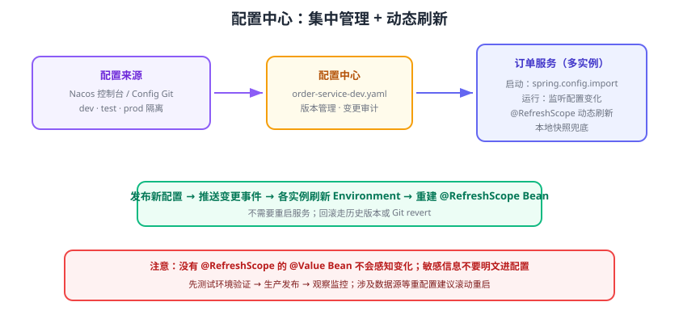

# 配置中心与动态刷新

微服务数量多了以后，配置文件会散落在每个服务里：改一个开关要改十几个服务、重启十几次。**配置中心**把配置集中管理、按环境隔离、支持动态刷新，让“一处修改、处处生效”。Spring Cloud 生态有两种主流方案：官方 **Spring Cloud Config**（Git 后端）与 **Nacos Config**（国内使用更广）。



## 为什么需要配置中心

| 场景 | 手工管理配置的痛点 | 配置中心方案 |
| --- | --- | --- |
| 配置数量多 | 每个服务一份 yml，改一处漏一处 | 集中存放、按服务隔离 |
| 环境差异 | dev/test/prod 靠多个文件切换 | 按环境（namespace/Profile）隔离 |
| 敏感信息 | 数据库密码散落代码库 | 加密存储 + 权限控制 |
| 动态调整 | 改配置必须重启，流量损失 | 动态刷新（RefreshScope） |
| 变更审计 | 不知道谁改了什么 | Git 历史 / 控制台操作记录 |

## Spring Cloud Config（官方方案）

Spring Cloud Config 分**服务端（Config Server）**与**客户端（Config Client）**：服务端把配置文件存在 **Git 仓库**，客户端启动时向服务端拉取对应环境配置。

### Config Server

```xml [config-server/pom.xml]
<dependency>
    <groupId>org.springframework.cloud</groupId>
    <artifactId>spring-cloud-config-server</artifactId>
</dependency>
```

```java [ConfigServerApplication.java]
import org.springframework.boot.SpringApplication;
import org.springframework.boot.autoconfigure.SpringBootApplication;
import org.springframework.cloud.config.server.EnableConfigServer;

@SpringBootApplication
@EnableConfigServer
public class ConfigServerApplication {
    public static void main(String[] args) {
        SpringApplication.run(ConfigServerApplication.class, args);
    }
}
```

```yaml [config-server/application.yml]
server:
  port: 8888
spring:
  cloud:
    config:
      server:
        git:
          uri: https://github.com/your-team/config-repo.git
          default-label: main        # 分支
          search-paths: '{application}'   # 按应用名建目录
```

Git 仓库里约定 `{application}-{profile}.yml`，如 `order-service-dev.yml`。

### Config Client

```xml [client/pom.xml]
<dependency>
    <groupId>org.springframework.cloud</groupId>
    <artifactId>spring-cloud-starter-config</artifactId>
</dependency>
```

```yaml [bootstrap.yml（旧版）或 application.yml（新版）]
spring:
  application:
    name: order-service
  profiles:
    active: dev
  config:
    import: optional:configserver:http://localhost:8888
```

::: danger 版本差异：bootstrap 方式已过时
早期 Spring Cloud 用 `bootstrap.yml` 先拉配置再启动应用；**2021.0 之后推荐 `spring.config.import`**，Config Server 地址直接写在主配置里。若教程里仍让你建 `bootstrap.yml`，先确认是否要引入 `spring-cloud-starter-bootstrap`，新项目建议直接使用 `spring.config.import`。
:::

## Nacos Config（国内主流）

Nacos 同时提供注册中心与配置中心，管理面统一、有可视化控制台、支持**配置发布即刷新**，是国内微服务团队最常用的方案。

### 1. 引入依赖

```xml [pom.xml]
<dependency>
    <groupId>com.alibaba.cloud</groupId>
    <artifactId>spring-cloud-starter-alibaba-nacos-config</artifactId>
</dependency>
<dependency>
    <groupId>com.alibaba.cloud</groupId>
    <artifactId>spring-cloud-starter-alibaba-nacos-discovery</artifactId>
</dependency>
```

### 2. 导入配置（SCA 2025.x 起无 bootstrap）

SCA 2025.x 已移除 bootstrap 支持，统一用 `spring.config.import`：

```yaml [application.yml]
spring:
  application:
    name: order-service
  profiles:
    active: dev
  cloud:
    nacos:
      server-addr: 127.0.0.1:8848
      username: nacos
      password: nacos
    # 导入格式：nacos:{dataId}?group=xxx&refreshEnabled=true
  config:
    import: nacos:order-service-dev.yaml
```

### 3. 在 Nacos 控制台发布配置

在「配置管理 → 配置列表」新建 Data ID `order-service-dev.yaml`（文件后缀要与导入格式一致）：

```yaml [order-service-dev.yaml]
app:
  notice: "订单服务默认公告"
  max-orders: 100
redis:
  host: r-xxxx.redis.rds.aliyuncs.com
```

### 4. 动态刷新

普通 Bean 不会感知配置变化，需要：

```java [OrderConfig.java]
import org.springframework.beans.factory.annotation.Value;
import org.springframework.cloud.context.config.annotation.RefreshScope;
import org.springframework.stereotype.Component;

@RefreshScope
@Component
public class OrderConfig {

    @Value("${app.notice}")
    private String notice;

    public String getNotice() {
        return notice;
    }
}
```

在控制台修改 `app.notice` 并**发布**，调用接口观察值立即变化，无需重启服务。

## 多配置导入与多环境

### 一次导入多个配置文件

```yaml [application.yml]
spring:
  config:
    import:
      - nacos:order-service.yaml
      - nacos:order-service-${spring.profiles.active}.yaml
      - nacos:common-datasource.yaml
```

### 环境隔离推荐

方案一：**命名空间（namespace）按环境分**：dev/prod 各建命名空间，服务配各自的 namespace ID。

方案二：**Data ID 后缀区分环境**：`order-service-dev.yaml`、`order-service-prod.yaml`，再配合共享配置 `order-service.yaml`（通用）+ 环境配置（差异项）。

| 方式 | 优点 | 注意 |
| --- | --- | --- |
| 命名空间隔离 | 权限好控制，环境完全隔离 | 每个环境要多建一套配置 |
| Data ID 后缀 | 简单直观 | 误发布风险高，需配权限 |
| Group 分组 | 细粒度区分（灰度组/正式组） | 调用方 group 必须一致 |

## 敏感配置与安全

::: danger 配置安全要点
1. **不要把数据库密码、Token 明文提交到配置库**：Config Server 可配对称加密（`{cipher}`），Nacos 建议配合 KMS 或环境变量注入。
2. **控制台账号务必修改默认密码**：Nacos 默认 `nacos/nacos`，暴露到公网等于裸奔。
3. **配置删除前先确认引用方**：动态刷新后某些 Bean 拿不到属性会启动失败。
:::

## 易错点与最佳实践

::: danger 高频坑
1. **`@Value` 的 Bean 没加 `@RefreshScope`**：配置改了但对象里还是旧值。
2. **配置文件内容格式不匹配**：Data ID 以 `.yaml` 结尾内容必须是 YAML；用 `.properties` 结尾就写键值对，混用会解析失败。
3. **服务名/环境与 Data ID 对不上**：`spring.application.name` 或 `spring.profiles.active` 改过后，旧的 Data ID 拉不到，应用用默认值启动却不报错，排查困难。
4. **本机配置优先级理解反**：`application.yml` 里的本地值会被远端配置覆盖（远端优先级更高），想强制本地覆盖需要配 `spring.cloud.config.override-none` 等策略。
5. **把配置中心当业务数据库**：大流量热数据不要放配置中心，频繁刷新会放大变更风险。
:::

::: tip 实践建议
1. 约定一个“最小必需本地配置”：注册中心地址、配置中心地址留在 `application.yml`，其余业务配置全部进配置中心。
2. 变更走「测试环境验证 → 生产发布」流程，发布后观察监控，回滚用 Git revert 或 Nacos 历史版本。
3. 动态刷新只用于可接受短暂不一致的开关类配置；数据源连接池等重配置仍建议滚动重启。
:::

## 验证方式

1. 在 Nacos 控制台发布 `order-service-dev.yaml`，应用启动后接口返回配置中心的值。
2. 修改配置并发布，观察 `@RefreshScope` Bean 生效（无需重启）。
3. 停掉配置中心再启动服务：应能使用本地缓存/上次配置启动（Nacos 支持本地快照），避免“配置中心一挂全站起不来”。

## 参考资料

- Spring Cloud Config 官方文档：https://docs.spring.io/spring-cloud-config/reference/
- Nacos 配置管理文档：https://nacos.io/docs/latest/using-nacos/
- Spring Cloud Alibaba Nacos Config：https://sca.aliyun.com/docs/2025.x/user-guide/nacos/config/
- `spring.config.import` 说明：https://docs.spring.io/spring-boot/reference/features/external-config.html
