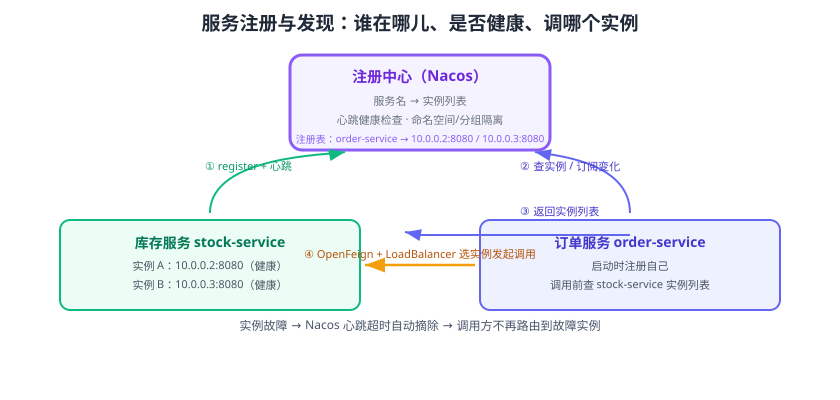

# 服务注册与发现

服务注册与发现解决“**怎么找到对方**”：服务实例动态增删（发布、扩容、宕机），调用方不能写死 IP，而是到注册中心查“某某服务当前有哪些健康实例”。Spring Cloud 通过 `DiscoveryClient` 抽象屏蔽具体实现，主流实现有 **Nacos、Eureka、Consul、Zookeeper**；国内生产环境以 Nacos 最常见。



## 核心概念与原理

### 服务注册（Registration）

每个服务启动时向注册中心登记：**服务名、IP、端口、元数据（权重、版本、区域）**，并周期性发送心跳。

### 服务发现（Discovery）

两种模式：

| 模式 | 代表 | 特点 |
| --- | --- | --- |
| 客户端发现 | Nacos、Eureka | 客户端拉取实例列表并本地负载均衡，实例“挂了”由心跳/健康检查摘除 |
| 服务端发现 | 云 LB / K8s Service | 客户端只连一个 VIP/域名，由服务端转发 |

Spring Cloud 的注册中心属于**客户端发现**：调用方拿到全量实例列表，再由 LoadBalancer 选一个发起请求。

### 健康检查

Nacos 3.x 中客户端通过 gRPC 长连接与 Nacos 服务端通信，服务端心跳超时则把实例标记为不健康并从可调用列表摘除。因此**服务本身要保证网络可达，不能只通 8848 而断 9848**。

## 选型对比

| 注册中心 | 一致性模型 | CAP | 自带控制台 | 配置中心能力 | 生态 |
| --- | --- | --- | --- | --- | --- |
| Nacos | AP（临时实例）/ CP（持久实例） | AP/CP 可切换 | ✅ 好用 | ✅ 原生支持 | Spring Cloud Alibaba 主力 |
| Eureka | 最终一致 | AP | 有（较简陋） | ❌ | Netflix 模块，仅注册发现 |
| Consul | Raft | CP | ✅ | ✅ | HashiCorp，注册+配置+K/V |
| Zookeeper | ZAB | CP | 一般 | 需配合其他 | 传统 RPC 体系 |

::: tip 一句话理解
如果团队“既要注册中心又要配置中心”，Nacos 与 Consul 都满足；选型主要看运维熟悉度和团队技术栈。Eureka 只有注册发现，且项目维护活跃度低，新项目一般不首选。
:::

## Nacos 接入步骤（当前推荐）

### 1. 引入依赖

```xml [pom.xml]
<!-- Spring Cloud Alibaba Nacos Discovery 会自动带入 nacos-client 与 Spring Cloud Commons -->
<dependency>
    <groupId>com.alibaba.cloud</groupId>
    <artifactId>spring-cloud-starter-alibaba-nacos-discovery</artifactId>
</dependency>
```

### 2. 配置注册中心

```yaml [application.yml]
spring:
  application:
    name: order-service
  cloud:
    nacos:
      discovery:
        server-addr: 127.0.0.1:8848
        namespace: prod-v1          # 可选：命名空间隔离
        group: DEFAULT_GROUP        # 可选：服务分组
        cluster-name: SHANGHAI      # 可选：同城集群优先
server:
  port: 8080
```

### 3. 业务代码中获取实例

```java [OrderController.java]
import org.springframework.cloud.client.ServiceInstance;
import org.springframework.cloud.client.discovery.DiscoveryClient;
import org.springframework.web.bind.annotation.GetMapping;
import org.springframework.web.bind.annotation.RestController;

import java.util.List;

@RestController
public class OrderController {

    private final DiscoveryClient discoveryClient;

    public OrderController(DiscoveryClient discoveryClient) {
        this.discoveryClient = discoveryClient;
    }

    // 演示：手动查库存服务的所有实例（生产一般交给 OpenFeign + LoadBalancer）
    @GetMapping("/instances")
    public List<ServiceInstance> instances() {
        return discoveryClient.getInstances("stock-service");
    }
}
```

启动后访问 `GET /instances`，应返回库存服务各实例的 `host`、`port`、`uri` 与元数据。

## Nacos 关键概念

| 概念 | 作用 | 典型用法 |
| --- | --- | --- |
| 服务名（service name） | 服务唯一标识，等于 `spring.application.name` | 发现与调用都按服务名 |
| 命名空间（namespace） | 隔离环境/租户 | `dev`/`prod` 分开 |
| 分组（group） | 命名空间内的再隔离 | 默认 `DEFAULT_GROUP` |
| 集群（cluster） | 地域/机房维度 | 就近调用、同城容灾 |
| 临时/持久实例 | 临时实例宕机自动摘除 | 微服务默认临时实例 |
| 权重 | 负载均衡比例 | 新版本上线先调低权重观察 |
| 保护阈值 | 健康实例比例低于阈值时全量放行 | 防止“全摘除导致雪崩” |

## 常用配置项

| 配置项 | 默认值 | 说明 |
| --- | --- | --- |
| `spring.cloud.nacos.discovery.server-addr` | 无 | Nacos 地址，必填 |
| `spring.cloud.nacos.discovery.service` | `${spring.application.name}` | 注册的服务名 |
| `spring.cloud.nacos.discovery.enabled` | `true` | 是否启用注册发现 |
| `spring.cloud.nacos.discovery.register-enabled` | `true` | 是否注册自己（纯消费方可关） |
| `spring.cloud.nacos.discovery.namespace` | 空 | 命名空间 ID |
| `spring.cloud.nacos.discovery.group` | `DEFAULT_GROUP` | 服务分组 |
| `spring.cloud.nacos.discovery.weight` | `1` | 实例权重 |
| `spring.cloud.nacos.discovery.heart-beat-interval` | `5000` | 心跳间隔（毫秒） |

::: danger 常见坑
1. **服务名不一致**：调用方写的服务名必须与提供方 `spring.application.name` 完全一致，大小写敏感；不一致时列表为空或 404。
2. **命名空间不一致**：提供方在 `prod` 命名空间，调用方在默认空间，两者互不可见。排查时先看控制台两侧 namespace 是否一致。
3. **只映射 8848**：Nacos 2.x/3.x 需要 9848（gRPC）与 9849，只开 HTTP 端口会心跳异常。
4. **注册中心宕机就“全挂”**：客户端有本地缓存/快照（Nacos 会缓存服务列表），宕机后已获取的列表仍可短时使用；**不要**在请求链路上每次都实时查注册中心。
:::

## 其他注册中心快速对照

### Eureka（Netflix 模块）

```xml [pom.xml]
<dependency>
    <groupId>org.springframework.cloud</groupId>
    <artifactId>spring-cloud-starter-netflix-eureka-client</artifactId>
</dependency>
```

```yaml [application.yml]
eureka:
  client:
    service-url:
      defaultZone: http://localhost:8761/eureka/
```

### Consul

```xml [pom.xml]
<dependency>
    <groupId>org.springframework.cloud</groupId>
    <artifactId>spring-cloud-starter-consul-discovery</artifactId>
</dependency>
```

```yaml [application.yml]
spring:
  cloud:
    consul:
      host: localhost
      port: 8500
      discovery:
        service-name: order-service
```

### Zookeeper

```xml [pom.xml]
<dependency>
    <groupId>org.springframework.cloud</groupId>
    <artifactId>spring-cloud-starter-zookeeper-discovery</artifactId>
</dependency>
```

无论换哪种实现，业务代码中的 `DiscoveryClient`、`@EnableDiscoveryClient`（Boot 3 后多数场景可省略）用法保持一致，这就是 Spring Cloud 抽象的价值。

## 验证方式

1. 启动 Nacos 与两个服务实例，控制台“服务列表”显示实例健康。
2. 调用方 `GET /instances` 返回两个实例的地址列表。
3. 停止一个实例，等待心跳超时（默认约 15~20 秒）后，列表自动只剩健康实例。

## 参考资料

- Nacos 官方文档：https://nacos.io/docs/latest/
- Spring Cloud Alibaba 注册发现：https://sca.aliyun.com/docs/2025.x/user-guide/nacos/quick-start/
- Spring Cloud 服务发现抽象：https://docs.spring.io/spring-cloud-commons/reference/spring-cloud-commons/discovery-clients.html
