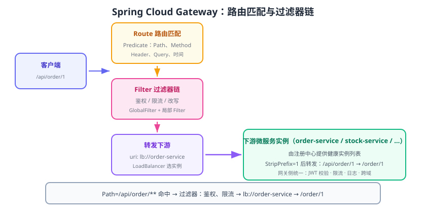

# API 网关：Spring Cloud Gateway

Spring Cloud Gateway 是微服务的**统一入口**：所有外部请求先经过网关，由它完成路由（把 `/order/**` 转发到订单服务）、横切逻辑（鉴权、限流、日志、跨域、请求改写），再把请求转发到下游。它基于 **Spring WebFlux + Reactor Netty**，是响应式、非阻塞的（Reactive），替代了老一代的 Zuul 1.x。



## 为什么需要网关

没有网关时，客户端直接访问多个服务会产生三类问题：

| 问题 | 说明 |
| --- | --- |
| 暴露过多地址 | 每个服务都要对外暴露端口，安全面变大、改造困难 |
| 横切逻辑重复 | 鉴权、限流、日志每个服务各做一份，难以统一 |
| 协议与路由耦合 | 客户端要知道服务拆分细节，服务重构必须改客户端 |

网关把这些收敛到一处。典型职责：**路由转发、鉴权、限流、灰度、跨域、协议转换、日志监控**。

## 核心概念

| 概念 | 英文 | 作用 |
| --- | --- | --- |
| 路由 | Route | 由 ID、目标 URI、断言、过滤器组成的一条转发规则 |
| 断言 | Predicate | 匹配条件（路径、Header、参数、时间等），决定“这条路由是否命中” |
| 过滤器 | Filter | 请求转发前/后执行的逻辑（改写、鉴权、限流） |
| 全局过滤器 | GlobalFilter | 对所有路由生效 |
| WebFlux | Spring WebFlux | 响应式 Web 框架，网关的运行底座 |

匹配顺序为：**请求到达 → 按顺序匹配 Route 的 Predicate → 命中后按序执行 Filter 链 → 转发到下游**。

## 接入步骤

### 1. 引入依赖

```xml [pom.xml]
<dependency>
    <groupId>org.springframework.cloud</groupId>
    <artifactId>spring-cloud-starter-gateway</artifactId>
</dependency>
<!-- 通过注册中心按服务名转发时还需要 -->
<dependency>
    <groupId>com.alibaba.cloud</groupId>
    <artifactId>spring-cloud-starter-alibaba-nacos-discovery</artifactId>
</dependency>
```

::: danger 网关项目不要引入 spring-boot-starter-web
Gateway 运行在 WebFlux（Netty）之上，与 Servlet 容器（Tomcat + `spring-web`）冲突。引入 `spring-boot-starter-web` 后网关可能无法按预期工作（服务模式变成 SERVLET），出现路由不生效等问题。网关项目应使用 `spring-boot-starter-webflux`（由 gateway starter 传递引入）。
:::

### 2. 路由配置

```yaml [application.yml]
spring:
  application:
    name: gateway
  cloud:
    nacos:
      discovery:
        server-addr: 127.0.0.1:8848
    gateway:
      discovery:
        locator:
          enabled: true            # 自动按“服务名/路径”生成路由（简单场景）
      routes:
        - id: order-route
          uri: lb://order-service  # lb:// 表示通过 LoadBalancer 从注册中心选实例
          predicates:
            - Path=/api/order/**
          filters:
            - StripPrefix=1        # 去掉第一段 /api
        - id: stock-route
          uri: lb://stock-service
          predicates:
            - Path=/api/stock/**
          filters:
            - StripPrefix=1
server:
  port: 8080
```

请求 `/api/order/123` 命中 `order-route`，经 `StripPrefix=1` 后转发给 order-service 的 `/order/123`。

### 3. 编程式路由（RouteLocator）

```java [GatewayConfig.java]
import org.springframework.cloud.gateway.route.RouteLocator;
import org.springframework.cloud.gateway.route.builder.RouteLocatorBuilder;
import org.springframework.context.annotation.Bean;
import org.springframework.context.annotation.Configuration;

@Configuration
public class GatewayConfig {

    @Bean
    public RouteLocator routeLocator(RouteLocatorBuilder builder) {
        return builder.routes()
            .route("order-route", r -> r
                .path("/api/order/**")
                .filters(f -> f.stripPrefix(1))
                .uri("lb://order-service"))
            .route("time-route", r -> r
                .path("/time")
                .filters(f -> f.addResponseHeader("X-Gateway", "sc"))
                .uri("https://timeapi.io"))
            .build();
    }
}
```

## 常用断言与过滤器

### 内置断言（Predicate）

| 断言 | 示例 | 作用 |
| --- | --- | --- |
| Path | `Path=/api/order/**` | 按路径匹配 |
| Method | `Method=GET,POST` | 按 HTTP 方法匹配 |
| Header | `Header=X-Token, \d+` | 按请求头匹配 |
| Query | `Query=page` | 按查询参数匹配 |
| Cookie | `Cookie=login, true` | 按 Cookie 匹配 |
| Host | `Host=**.example.com` | 按域名匹配 |
| Weight | `Weight=group1,8` | 按权重灰度（常配合多个路由） |
| After/Before/Between | `After=2026-01-01T00:00:00+08:00` | 按时间匹配 |

### 内置过滤器（Filter）

| 过滤器 | 作用 |
| --- | --- |
| `StripPrefix=1` | 转发前去掉路径前 N 段 |
| `AddRequestHeader=K,V` | 添加请求头 |
| `AddResponseHeader=K,V` | 添加响应头 |
| `RewritePath=/a/(?<s>.*), /b/${s}` | 用正则改写路径 |
| `Retry=3,statuses=SERVER_ERROR` | 失败重试 |
| `RequestRateLimiter` | 令牌桶限流（需 Redis + KeyResolver） |
| `CircuitBreaker=name=cb` | 网关侧熔断（Spring Cloud CircuitBreaker） |
| `SetPath=/fixed/{segment}` | 直接设置转发路径 |
| `RemoveRequestHeader=K` | 移除请求头（防止伪造） |

### 自定义全局过滤器：统一鉴权示例

```java [AuthGlobalFilter.java]
import org.springframework.cloud.gateway.filter.GatewayFilterChain;
import org.springframework.cloud.gateway.filter.GlobalFilter;
import org.springframework.core.Ordered;
import org.springframework.http.HttpStatus;
import org.springframework.stereotype.Component;
import org.springframework.web.server.ServerWebExchange;
import reactor.core.publisher.Mono;

@Component
public class AuthGlobalFilter implements GlobalFilter, Ordered {

    @Override
    public Mono<Void> filter(ServerWebExchange exchange, GatewayFilterChain chain) {
        String token = exchange.getRequest().getHeaders().getFirst("Authorization");
        if (token == null || token.isBlank()) {
            exchange.getResponse().setStatusCode(HttpStatus.UNAUTHORIZED);
            return exchange.getResponse().setComplete();
        }
        // 生产环境：校验 JWT 签名，把用户信息放入请求头传给下游
        ServerWebExchange mutated = exchange.mutate()
            .request(r -> r.header("X-User-Id", "10086"))
            .build();
        return chain.filter(mutated);
    }

    @Override
    public int getOrder() {
        return -100;   // 数值越小越先执行
    }
}
```

## 网关侧限流

Spring Cloud Gateway 内置 `RequestRateLimiter` 过滤器，基于 Redis + Lua 的令牌桶实现，需要 `spring-boot-starter-data-redis-reactive` 与 `KeyResolver`：

```yaml [application.yml]
spring:
  cloud:
    gateway:
      routes:
        - id: order-route
          uri: lb://order-service
          predicates:
            - Path=/api/order/**
          filters:
            - name: RequestRateLimiter
              args:
                redis-rate-limiter.replenishRate: 10   # 每秒补充令牌数
                redis-rate-limiter.burstCapacity: 20   # 桶容量（允许突发）
                key-resolver: "#{@userKeyResolver}"
```

```java [UserKeyResolver.java]
import org.springframework.cloud.gateway.filter.ratelimit.KeyResolver;
import org.springframework.context.annotation.Bean;
import org.springframework.context.annotation.Configuration;
import reactor.core.publisher.Mono;

@Configuration
public class RateLimitConfig {
    @Bean
    public KeyResolver userKeyResolver() {
        return exchange -> {
            String userId = exchange.getRequest().getHeaders().getFirst("X-User-Id");
            return Mono.just(userId == null ? "anonymous" : userId);
        };
    }
}
```

## 易错点与最佳实践

::: danger 网关高频坑
1. **混入 spring-boot-starter-web**：导致网关以 Servlet 模式启动，路由与过滤器不生效；网关只用 WebFlux。
2. **CORS 配置冲突**：网关配了跨域，下游又配一遍，预检请求被双重处理报错；统一在网关处理即可。
3. **超时没有显式设置**：Netty 响应超时默认可能过长，建议配置 `spring.cloud.gateway.httpclient.response-timeout` 与连接超时。
4. **把业务逻辑写进网关**：网关应保持“薄”：只做路由与横切，业务校验放服务内，否则网关改版成本极高。
5. **忽略灰度设计**：上线新版本直接全量切流，出了问题面很大；建议用 `Weight` 断言或按 Header 灰度。
:::

::: tip 最佳实践
1. 网关统一做 **JWT 校验 + 用户上下文透传**，下游不再各自解析 Token。
2. 每个下游服务提供 `/actuator/health`，网关只向健康实例转发。
3. 用 `RewritePath` 统一对外 API 风格（如 `/api/v1/**`），内部服务路径可自由调整。
4. 在网关记录访问日志（TraceId、耗时、状态码），这是全链路排查的第一站。
:::

## 与 Zuul / K8s Ingress 的取舍

| 方案 | 类型 | 适用场景 |
| --- | --- | --- |
| Spring Cloud Gateway | 应用级网关 | 需要业务鉴权、限流、灰度、协议改写 |
| Zuul 1.x | Servlet 网关 | 存量项目；新项目不推荐（阻塞式、维护停滞） |
| K8s Ingress | 流量网关 | 容器平台统一入口，做 TLS/L4/L7 基础转发 |
| 服务网格（如 Istio） | 数据面代理 | 需要更细的流量治理，与 Gateway 可分层共存 |

生产上常见**两层网关**：外层 Ingress/云 LB 负责域名与 TLS，内层 Spring Cloud Gateway 负责业务路由与治理。

## 验证方式

1. 启动 Nacos、两个业务服务与网关。
2. `GET http://localhost:8080/api/order/1` 返回订单服务数据，网关日志记录命中 `order-route`。
3. `GET /actuator/gateway/routes` 输出路由列表；带错误路径访问得到 404，不带 Token 访问受保护路由得到 401。
4. 连续快速请求触发限流时，观察 429 Too Many Requests。

## 相关专题

- [认证与授权专题](../../Auth/index.md)：网关与服务双层鉴权的整体设计
- [服务端落地](../../Auth/Implementation/index.md)：身份头注入、微服务间认证与令牌传递
- [安全最佳实践](../../Auth/Security/index.md)：鉴权失败处理与审计

## 参考资料

- Spring Cloud Gateway 官方文档：https://docs.spring.io/spring-cloud-gateway/reference/
- Gateway 内置断言与过滤器清单：https://docs.spring.io/spring-cloud-gateway/reference/spring-cloud-gateway/
- Spring WebFlux：https://docs.spring.io/spring-framework/reference/web/webflux.html
