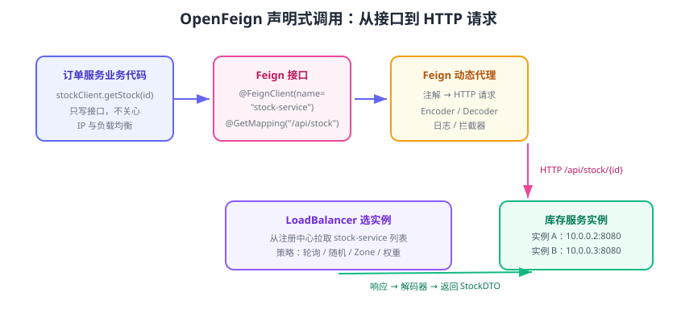

# 服务调用：OpenFeign 与负载均衡

微服务之间的同步调用，Spring Cloud 推荐用 **OpenFeign**：它把 HTTP 调用声明成 Java 接口，开发者只写接口与注解，框架自动生成实现、拼接 URL、做负载均衡与重试。选实例的工作由 **Spring Cloud LoadBalancer** 完成（2020.0 起替代 Ribbon）。



## 为什么用 OpenFeign

对比三种服务间调用方式：

| 方式 | 体验 | 缺点 |
| --- | --- | --- |
| `RestTemplate` + 硬编码 URL | 简单 | URL 写死、无负载均衡、代码重复 |
| `RestTemplate` + `@LoadBalanced` | 能用 | 仍要手写 URL 拼装与错误处理 |
| OpenFeign | 接口即客户端 | 需要理解声明式编程与扩展点 |

OpenFeign 的优势：**接口契约清晰、注解式配置、天然与 Spring MVC 注解兼容**（`@GetMapping`、`@RequestBody`），配合注册中心后按服务名调用。

## 核心原理

调用链如下：

```text
业务代码调用 Feign 接口
  → Feign 动态代理生成请求
  → LoadBalancer 从注册中心拿实例列表并选一个（轮询/随机/权重）
  → 编码器把方法参数转成 HTTP 请求
  → 执行器（JDK HttpClient / OkHttp / HTTPClient）发起调用
  → 解码器把响应转成返回值
  → 可选熔断/重试包装（CircuitBreaker / Retry）
```

OpenFeign 本身不做负载均衡，它委托 `LoadBalancerClient`；所以依赖里必须同时有 **LoadBalancer**，否则无法按服务名解析实例。

## 接入步骤

### 1. 引入依赖

```xml [pom.xml]
<dependency>
    <groupId>org.springframework.cloud</groupId>
    <artifactId>spring-cloud-starter-openfeign</artifactId>
</dependency>
<!-- OpenFeign 按服务名调用的前提：客户端负载均衡 -->
<dependency>
    <groupId>org.springframework.cloud</groupId>
    <artifactId>spring-cloud-starter-loadbalancer</artifactId>
</dependency>
```

### 2. 开启 Feign

```java [OrderApplication.java]
import org.springframework.boot.SpringApplication;
import org.springframework.boot.autoconfigure.SpringBootApplication;
import org.springframework.cloud.openfeign.EnableFeignClients;

@SpringBootApplication
@EnableFeignClients
public class OrderApplication {
    public static void main(String[] args) {
        SpringApplication.run(OrderApplication.class, args);
    }
}
```

### 3. 声明调用接口

```java [StockClient.java]
import org.springframework.cloud.openfeign.FeignClient;
import org.springframework.web.bind.annotation.GetMapping;
import org.springframework.web.bind.annotation.PathVariable;
import org.springframework.web.bind.annotation.PostMapping;
import org.springframework.web.bind.annotation.RequestBody;

// name = 注册中心里的服务名；provider 服务里 http://localhost:8081/api/stock/{id}
@FeignClient(name = "stock-service", path = "/api/stock")
public interface StockClient {

    @GetMapping("/{id}")
    StockDTO getStock(@PathVariable("id") Long id);

    @PostMapping("/deduct")
    void deduct(@RequestBody DeductRequest request);
}
```

```java [DTO 示例：StockDTO.java]
public record StockDTO(Long id, String sku, Integer quantity) {
}
```

### 4. 业务中使用

```java [OrderService.java]
import org.springframework.stereotype.Service;

@Service
public class OrderService {

    private final StockClient stockClient;

    public OrderService(StockClient stockClient) {
        this.stockClient = stockClient;
    }

    public String checkStock(Long skuId) {
        // 这里没有任何 IP/端口，Feign 按服务名到注册中心找实例
        StockDTO stock = stockClient.getStock(skuId);
        return "sku=" + stock.sku() + " 剩余=" + stock.quantity();
    }
}
```

启动 provider（stock-service，两个实例）与 consumer 后，连续调用 `GET /order/check?skuId=1` 多次，观察 provider 日志中两个实例交替收到请求，说明负载均衡生效。

## 常用配置

```yaml [application.yml]
spring:
  cloud:
    openfeign:
      client:
        config:
          default:                       # 对所有 Feign 客户端生效
            connect-timeout: 3000
            read-timeout: 5000
            logger-level: full           # NONE / BASIC / HEADERS / FULL
          stock-service:                 # 只对 stock-service 生效（覆盖默认）
            read-timeout: 10000
      compression:
        request:
          enabled: true
        response:
          enabled: true
```

### 自定义负载均衡策略

LoadBalancer 默认**轮询**；切换为随机等策略需自定义 `ServiceInstanceListSupplier`，最简做法是启用 Zone-Preference：

```yaml [application.yml]
spring:
  cloud:
    loadbalancer:
      configurations: zone-preference
```

若希望按 Nacos 权重调用，可结合 Nacos 元数据与自定义 Supplier 实现；权重调整也可直接在 Nacos 控制台修改实例权重。

## 日志与错误处理

### 开启 Feign 日志

```java [FeignLogConfig.java]
import feign.Logger;
import org.springframework.context.annotation.Bean;

public class FeignLogConfig {
    @Bean
    Logger.Level feignLoggerLevel() {
        return Logger.Level.FULL;   // 开发期输出完整请求/响应
    }
}
```

### 全局降级兜底

OpenFeign 支持 `fallback`（需要开启熔断）：

```java [StockClient.java]
@FeignClient(name = "stock-service", path = "/api/stock", fallback = StockClientFallback.class)
public interface StockClient {
    @GetMapping("/{id}")
    StockDTO getStock(@PathVariable("id") Long id);
}
```

```java [StockClientFallback.java]
import org.springframework.stereotype.Component;

@Component
public class StockClientFallback implements StockClient {
    @Override
    public StockDTO getStock(Long id) {
        return new StockDTO(id, "unknown", -1);   // 降级数据，业务侧据此提示
    }
}
```

::: danger fallback 不生效的常见原因
1. 未引入 CircuitBreaker 依赖或未开启 `spring.cloud.openfeign.circuitbreaker.enabled=true`（不同版本默认值不同）。
2. `fallback` 类没有交给 Spring 管理（缺 `@Component` 或不在扫描路径）。
3. 配置了 `fallbackFactory` 却写成了 `fallback`，两者不要混用。
:::

## 易错点与最佳实践

::: danger 高频坑
1. **只加 OpenFeign 不加 LoadBalancer**：早期 Ribbon 随 Netflix 自动引入，2020.0 后移除；缺失时报 `No instances available` 或 `LoadBalancerClient` 相关错误。
2. **接口路径与服务端不一致**：Feign 接口的类路径注解 + `path` 必须与服务端 Controller 拼接后的完整路径一致，否则 404。
3. **DTO 反序列化失败**：服务端返回字段与客户端 DTO 不匹配（如日期格式、未知字段），配置 `spring.jackson` 或添加忽略策略。
4. **没有超时导致线程堆积**：下游慢，Feign 默认读超时可能偏长（不同客户端不同），务必显式配置 connect/read timeout。
5. **接口定义随意拆**：建议按“领域服务”建 Feign 接口，一个服务一个 Client，避免每个 Controller 都塞一个碎片接口。
:::

::: tip 最佳实践
1. 跨服务传用户身份、Trace ID 用 `RequestInterceptor` 统一添加，不要在每个方法里手工塞参数。
2. 返回结构统一（如 `Result<T>`），Feign 接口只关注业务 DTO，错误码交给全局异常处理。
3. 写接口先与服务端对契约：把 Feign 接口与 DTO 放公共模块或通过契约测试对齐。
4. 同步调用链路要短：A→B→C→D 的同步链既慢又容易雪崩，长链路改用消息异步。
:::

## 验证方式

1. 注册中心服务列表确认 provider 两个实例健康。
2. consumer 连续调用多次，provider 两个实例日志交替出现请求。
3. 停掉一个实例，观察 15~30 秒后请求只落在存活实例；恢复后自动重新加入。
4. 开启 `FULL` 日志，确认请求路径、耗时、响应体符合预期。

## 参考资料

- Spring Cloud OpenFeign 文档：https://docs.spring.io/spring-cloud-openfeign/reference/
- Spring Cloud LoadBalancer 文档：https://docs.spring.io/spring-cloud-commons/reference/spring-cloud-commons/loadbalancer.html
- Feign 官方文档：https://github.com/OpenFeign/feign
