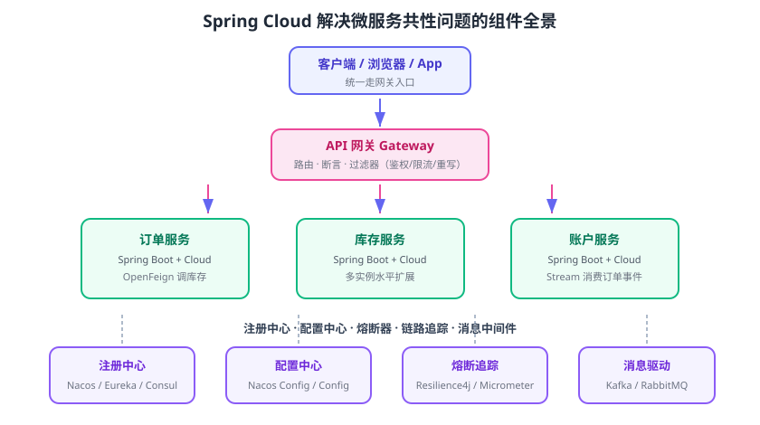

# Spring Cloud 概述

Spring Cloud 是一个基于 **Spring Boot** 的微服务开发套件：它把分布式系统里反复出现的「服务发现、配置管理、路由、负载均衡、熔断、消息驱动、链路追踪」等模式，封装成一组可插拔的起步依赖，用注解和少量配置即可启用。适合用 Java + Spring Boot 搭建微服务、或在已有单体中逐步引入云原生能力的团队。

::: info 适用版本（2026-09 核对）
本文为通用概念，示例基于当前稳定版 Spring Cloud 2025.1.x（Oakwood，Spring Boot 4.0/4.1）。各 Train 的差异见 [版本选择与演进](../Version/index.md)。
:::

## Spring Cloud 解决什么问题

把单体拆成多个服务后，代码层面出现了“重复造轮子”的公共代码，运维层面出现了“服务地址、配置、故障如何管理”的难题：

| 微服务共性问题 | 没有基础设施时的困境 | Spring Cloud 组件 |
| --- | --- | --- |
| 服务地址动态变化 | 把 IP 写死在代码里，一扩缩容就失效 | 服务注册与发现 |
| 配置散落在每个服务 | 改一个开关要发十几个服务 | 配置中心 |
| 统一入口 | 每个服务都要做鉴权、限流、跨域 | API 网关 |
| 服务间调用选哪个实例 | 手动轮询、无法感知故障实例 | 客户端负载均衡 |
| 下游故障拖垮上游 | 无超时无熔断，雪崩 | 熔断、重试、隔离 |
| 跨服务排查慢 | 看不到一次请求经过了哪些服务 | 链路追踪 |
| 服务间异步协作 | 直接耦合 MQ 客户端 | 消息驱动（Stream） |

Spring Cloud 的价值不只是“少写代码”，而是把这些问题**标准化**：组件都通过 Spring Boot 的自动配置（Auto-configuration）装配，业务代码与具体中间件解耦，替换实现（如注册中心从 Eureka 换成 Consul）时大部分代码不用改。



## 核心机制：BOM、Starter 与自动配置

Spring Cloud 是多个独立子项目组成的「发布列车（Release Train）」，通过三件事让使用变得简单：

1. **BOM 统一版本**：`spring-cloud-dependencies` 是一个只含依赖管理的 POM，引入后子组件版本全部对齐，无需手工维护几十个版本号。
2. **Starter 起步依赖**：每个能力一个启动器（如 `spring-cloud-starter-openfeign`），加入 classpath 即启用。
3. **自动配置**：启动时根据 classpath 与配置自动创建 Bean，多数场景零配置或极简配置即可运行。

```xml [pom.xml]
<properties>
    <!-- 只维护一个 Spring Cloud Train 版本，子组件版本由 BOM 对齐 -->
    <spring-cloud.version>2025.1.2</spring-cloud.version>
</properties>

<dependencyManagement>
    <dependencies>
        <dependency>
            <groupId>org.springframework.cloud</groupId>
            <artifactId>spring-cloud-dependencies</artifactId>
            <version>${spring-cloud.version}</version>
            <type>pom</type>
            <scope>import</scope>
        </dependency>
    </dependencies>
</dependencyManagement>
```

::: danger 版本选型常见坑
1. **Spring Cloud 与 Spring Boot 不是“各用最新”**：必须按官方对照表选 Train（如 Spring Boot 4.0 配 2025.1.x），版本错配会在启动或运行时报 `NoSuchMethodError`、自动配置失效。
2. **不要手工指定子项目版本**：`spring-cloud-starter-*` 一律交给 BOM 管理；手工写版本容易盖过 Train 对齐。
3. **把 Spring Cloud 误当成微服务方法论**：Spring Cloud 是“实现工具”；服务该不该拆、拆成多细，要按 [微服务专题](../../Microservices/Overview/index.md) 的方法论决策。
:::

## 主要子项目一览

| 子项目 | 解决的问题 | 关键启动器 |
| --- | --- | --- |
| Spring Cloud Netflix | Eureka 服务注册发现、旧版 Ribbon/Hystrix 支持 | `spring-cloud-starter-netflix-eureka-client` |
| Spring Cloud Alibaba | Nacos 注册/配置、Sentinel 限流、Seata 分布式事务 | `spring-cloud-starter-alibaba-nacos-discovery` |
| Spring Cloud Consul | 基于 Consul 的注册与配置 | `spring-cloud-starter-consul-discovery` |
| Spring Cloud Zookeeper | 基于 Zookeeper 的注册与配置 | `spring-cloud-starter-zookeeper-discovery` |
| Spring Cloud Config | Git 后端集中配置 | `spring-cloud-starter-config` |
| Spring Cloud Gateway | 响应式 API 网关 | `spring-cloud-starter-gateway` |
| Spring Cloud OpenFeign | 声明式 HTTP 客户端 | `spring-cloud-starter-openfeign` |
| Spring Cloud LoadBalancer | 客户端负载均衡（替代 Ribbon） | `spring-cloud-starter-loadbalancer` |
| Spring Cloud Circuit Breaker | 熔断器抽象（Resilience4j 等） | `spring-cloud-starter-circuitbreaker-resilience4j` |
| Spring Cloud Stream | 统一消息编程模型 | `spring-cloud-starter-stream-kafka` 等 |
| Spring Cloud Sleuth / Tracing | 分布式链路追踪（新版本用 Micrometer Tracing） | `spring-cloud-starter-sleuth`（旧）/ `micrometer-tracing-bridge-otel`（新） |
| Spring Cloud Bus | 通过消息广播配置刷新事件 | `spring-cloud-starter-bus-amqp` 等 |
| Spring Cloud Function | 函数式编程模型（Stream 3.x 的基础） | `spring-cloud-function-context` |
| Spring Cloud Kubernetes | 对接 K8s 的 ConfigMap/Service 做注册与配置 | `spring-cloud-starter-kubernetes-*` |

::: tip 一句话理解
Spring Cloud 的子项目并非「必须全上」：按业务需要挑选即可。大多数团队的核心组合是 **注册中心 + 配置中心 + 网关 + OpenFeign + 熔断 + 追踪**，消息驱动只在存在异步链路时引入。
:::

## 与相近概念的关系

### Spring Cloud vs Spring Boot

Spring Boot 提供“单个应用怎么跑”的能力（自动配置、内嵌容器、监控）；Spring Cloud 提供“多个应用怎么协作”的能力（发现、配置、路由）。**每个微服务本质都是一个 Spring Boot 应用**，Spring Cloud 组件以依赖形式加入。

### Spring Cloud vs 微服务方法论

Spring Cloud 是 Netflix/Alibaba 等实践沉淀的**实现**，微服务是**架构风格**。方法论解决“为什么拆、怎么拆”，Spring Cloud 解决“拆完之后基础设施怎么做”。

### Spring Cloud vs Kubernetes

K8s 原生提供 Service（服务发现）、ConfigMap（配置）、Ingress（网关）能力。两者可以互补：Spring Cloud 适合需要**进程级客户端负载均衡、熔断、细粒度路由策略**的团队；若团队已全面容器化且接受 K8s 原生机制，可只保留 OpenFeign/Resilience4j 这类纯客户端组件，其余交给 K8s。

| 能力 | Spring Cloud | Kubernetes 原生 |
| --- | --- | --- |
| 服务发现 | 客户端拉取注册表（Eureka/Nacos/Consul） | Service + DNS / EndpointSlice |
| 配置管理 | 配置中心 + 动态刷新 | ConfigMap / Secret |
| 网关 | Spring Cloud Gateway（业务级路由） | Ingress / Gateway API |
| 负载均衡 | LoadBalancer（客户端侧） | Service ClusterIP / 服务网格 |
| 故障隔离 | Resilience4j / Sentinel | 健康检查 + Pod 重启 |

## 快速体验一个最小链路

最小可用链路只需三样：一个注册中心（本库以 Nacos 为例）、一个服务提供者、一个带 OpenFeign 的调用者。完整可运行代码见 [实战章节](../Practice/index.md)，这里先给“跑通一次”的最小步骤：

```shell [shell]
# 1. 启动 Nacos（单机）
docker run -d --name nacos -e MODE=standalone -p 8848:8848 -p 9848:9848 nacos/nacos-server:v3.1.1

# 2. 用 start.spring.io 创建 provider 项目，依赖勾选：Web、Nacos Service Discovery
# 3. 用 start.spring.io 创建 consumer 项目，依赖勾选：Web、Nacos Service Discovery、OpenFeign
# 4. 两个项目都配置 spring.cloud.nacos.server-addr=127.0.0.1:8848
# 5. provider 暴露 GET /hello，consumer 用 FeignClient 调它
```

验证方式：

1. 访问 `http://127.0.0.1:8848/nacos`，在「服务管理」中同时看到 `provider` 与 `consumer` 两个服务且实例健康。
2. 调用 `GET http://localhost:8081/hello`（consumer 端口），返回 provider 的服务名与实例信息，说明「注册 → 发现 → 调用」链路已打通。
3. 停掉 provider 后再调用，得到连接失败或降级结果，说明实例列表随健康检查动态变化。

::: danger 快速体验常见坑
1. **Nacos 端口只映射了 8848**：Nacos 2.x/3.x 的客户端 gRPC 走 9848，只开 8848 会导致“服务能注册、心跳异常、随机掉线”。
2. **版本错配**：Nacos 服务端 3.x 建议配 SCA 2025.x（nacos-client 3.x）；服务端 2.x 配旧版 SCA 更容易遇到兼容问题。
3. **OpenFeign 没带 LoadBalancer**：从 2020.0 起 Ribbon 被移除，OpenFeign 的负载均衡依赖 `spring-cloud-starter-loadbalancer`，缺失时会出现找不到 `LoadBalancer` Bean 或只能直连 IP。
:::

## 参考资料

- Spring Cloud 官方文档：https://spring.io/projects/spring-cloud
- Spring Cloud Reference：https://docs.spring.io/spring-cloud/reference/
- Spring Cloud 与 Spring Boot 版本对照：https://spring.io/projects/spring-cloud#support
- Spring Cloud Alibaba 文档：https://sca.aliyun.com/docs/2025.x/overview/overview/
