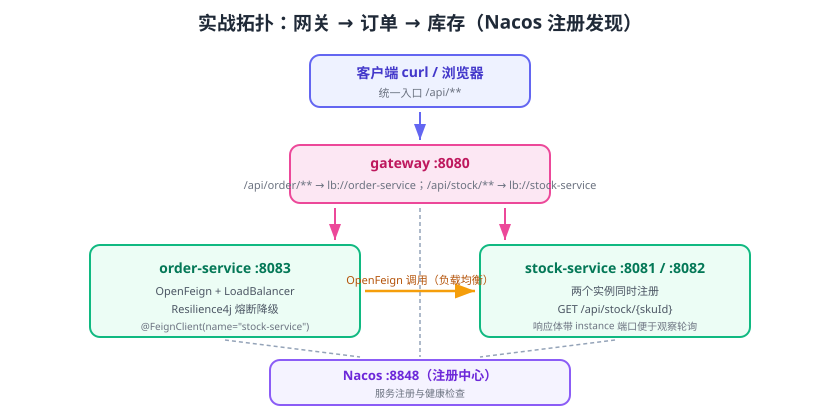

# 实战：Nacos + 网关 + OpenFeign 全链路

本实战把前面各章串成一条完整可运行的链路：**Nacos（注册中心）→ stock-service（库存服务，两个实例）→ order-service（订单服务，OpenFeign 调用库存）→ gateway（统一入口）**，并加入配置中心动态刷新与熔断降级。



::: info 环境清单（本文编写时核对）
| 组件 | 版本 |
| --- | --- |
| JDK | 17+（示例按 21/25 均可运行） |
| Spring Boot | 4.1.0 |
| Spring Cloud | 2025.1.2 |
| Spring Cloud Alibaba | 2025.1.0.0 |
| Nacos Server | 3.1.1（Docker 单机） |
| Maven | 3.9+ |
:::

## 项目结构

```text
sc-practice/
├─ pom.xml                      # 父 POM：统一管理版本
├─ gateway/                     # 网关（端口 8080）
├─ stock-service/               # 库存服务（端口 8081/8082）
├─ order-service/               # 订单服务（端口 8083）
└─ common/                      # 公共 DTO（可选）
```

## 1. 父 POM 与公共依赖

```xml [pom.xml]
<?xml version="1.0" encoding="UTF-8"?>
<project>
    <modelVersion>4.0.0</modelVersion>
    <groupId>com.example</groupId>
    <artifactId>sc-practice</artifactId>
    <version>1.0.0</version>
    <packaging>pom</packaging>

    <parent>
        <groupId>org.springframework.boot</groupId>
        <artifactId>spring-boot-starter-parent</artifactId>
        <version>4.1.0</version>
        <relativePath/>
    </parent>

    <properties>
        <java.version>17</java.version>
        <spring-cloud.version>2025.1.2</spring-cloud.version>
        <spring-cloud-alibaba.version>2025.1.0.0</spring-cloud-alibaba.version>
    </properties>

    <dependencyManagement>
        <dependencies>
            <dependency>
                <groupId>org.springframework.cloud</groupId>
                <artifactId>spring-cloud-dependencies</artifactId>
                <version>${spring-cloud.version}</version>
                <type>pom</type>
                <scope>import</scope>
            </dependency>
            <dependency>
                <groupId>com.alibaba.cloud</groupId>
                <artifactId>spring-cloud-alibaba-dependencies</artifactId>
                <version>${spring-cloud-alibaba.version}</version>
                <type>pom</type>
                <scope>import</scope>
            </dependency>
        </dependencies>
    </dependencyManagement>

    <modules>
        <module>stock-service</module>
        <module>order-service</module>
        <module>gateway</module>
    </modules>
</project>
```

## 2. 启动 Nacos

```shell [shell]
docker run -d --name nacos \
  -p 8848:8848 -p 9848:9848 -p 9849:9849 \
  -e MODE=standalone \
  nacos/nacos-server:v3.1.1
```

验证：浏览器打开 `http://127.0.0.1:8848/nacos`，能进入控制台。

## 3. stock-service（服务提供方）

### 依赖

```xml [stock-service/pom.xml]
<dependencies>
    <dependency>
        <groupId>org.springframework.boot</groupId>
        <artifactId>spring-boot-starter-web</artifactId>
    </dependency>
    <dependency>
        <groupId>com.alibaba.cloud</groupId>
        <artifactId>spring-cloud-starter-alibaba-nacos-discovery</artifactId>
    </dependency>
    <dependency>
        <groupId>org.springframework.boot</groupId>
        <artifactId>spring-boot-starter-actuator</artifactId>
    </dependency>
</dependencies>
```

### 配置

```yaml [stock-service/src/main/resources/application.yml]
spring:
  application:
    name: stock-service
  cloud:
    nacos:
      discovery:
        server-addr: 127.0.0.1:8848
server:
  port: 8081
management:
  endpoints:
    web:
      exposure:
        include: health,info
```

### 接口

```java [StockController.java]
import org.springframework.beans.factory.annotation.Value;
import org.springframework.web.bind.annotation.GetMapping;
import org.springframework.web.bind.annotation.PathVariable;
import org.springframework.web.bind.annotation.RequestMapping;
import org.springframework.web.bind.annotation.RestController;

import java.util.Map;

@RestController
@RequestMapping("/api/stock")
public class StockController {

    @Value("${server.port}")
    private int port;

    // 模拟库存：返回实例端口方便观察负载均衡
    @GetMapping("/{skuId}")
    public Map<String, Object> getStock(@PathVariable Long skuId) {
        return Map.of(
            "skuId", skuId,
            "quantity", 100,
            "instance", "stock-service:" + port
        );
    }
}
```

启动两个实例验证负载均衡：

```shell [shell]
# 实例 A（8081）
mvn -pl stock-service spring-boot:run
# 实例 B（8082）：另开终端
mvn -pl stock-service spring-boot:run -Dspring-boot.run.arguments=--server.port=8082
```

## 4. order-service（服务消费方）

### 依赖

```xml [order-service/pom.xml]
<dependencies>
    <dependency>
        <groupId>org.springframework.boot</groupId>
        <artifactId>spring-boot-starter-web</artifactId>
    </dependency>
    <dependency>
        <groupId>com.alibaba.cloud</groupId>
        <artifactId>spring-cloud-starter-alibaba-nacos-discovery</artifactId>
    </dependency>
    <dependency>
        <groupId>org.springframework.cloud</groupId>
        <artifactId>spring-cloud-starter-openfeign</artifactId>
    </dependency>
    <dependency>
        <groupId>org.springframework.cloud</groupId>
        <artifactId>spring-cloud-starter-loadbalancer</artifactId>
    </dependency>
    <dependency>
        <groupId>org.springframework.cloud</groupId>
        <artifactId>spring-cloud-starter-circuitbreaker-resilience4j</artifactId>
    </dependency>
</dependencies>
```

### 启动类与 Feign 接口

```java [OrderApplication.java]
import org.springframework.boot.SpringApplication;
import org.springframework.boot.autoconfigure.SpringBootApplication;
import org.springframework.cloud.openfeign.EnableFeignClients;

@SpringBootApplication
@EnableFeignClients
public class OrderApplication {
    public static void main(String[] args) {
        SpringApplication.run(OrderApplication.class, args);
    }
}
```

```java [StockClient.java]
import org.springframework.cloud.openfeign.FeignClient;
import org.springframework.web.bind.annotation.GetMapping;
import org.springframework.web.bind.annotation.PathVariable;

import java.util.Map;

@FeignClient(name = "stock-service", path = "/api/stock", fallback = StockFallback.class)
public interface StockClient {

    @GetMapping("/{skuId}")
    Map<String, Object> getStock(@PathVariable("skuId") Long skuId);
}
```

```java [StockFallback.java]
import org.springframework.stereotype.Component;

import java.util.Map;

@Component
public class StockFallback implements StockClient {
    @Override
    public Map<String, Object> getStock(Long skuId) {
        return Map.of("skuId", skuId, "quantity", -1, "instance", "FALLBACK");
    }
}
```

### 配置与控制器

```yaml [order-service/src/main/resources/application.yml]
spring:
  application:
    name: order-service
  cloud:
    nacos:
      discovery:
        server-addr: 127.0.0.1:8848
    openfeign:
      circuitbreaker:
        enabled: true
      client:
        config:
          default:
            connect-timeout: 2000
            read-timeout: 3000
resilience4j:
  circuitbreaker:
    instances:
      stockCb:
        sliding-window-size: 10
        minimum-number-of-calls: 5
        failure-rate-threshold: 50
        wait-duration-in-open-state: 10s
server:
  port: 8083
```

```java [OrderController.java]
import org.springframework.web.bind.annotation.GetMapping;
import org.springframework.web.bind.annotation.PathVariable;
import org.springframework.web.bind.annotation.RestController;

import java.util.Map;

@RestController
public class OrderController {

    private final StockClient stockClient;

    public OrderController(StockClient stockClient) {
        this.stockClient = stockClient;
    }

    @GetMapping("/check/{skuId}")
    public Map<String, Object> check(@PathVariable Long skuId) {
        return Map.of(
            "order", "OK",
            "stock", stockClient.getStock(skuId)
        );
    }
}
```

## 5. gateway（统一入口）

```xml [gateway/pom.xml]
<dependencies>
    <dependency>
        <groupId>org.springframework.cloud</groupId>
        <artifactId>spring-cloud-starter-gateway</artifactId>
    </dependency>
    <dependency>
        <groupId>com.alibaba.cloud</groupId>
        <artifactId>spring-cloud-starter-alibaba-nacos-discovery</artifactId>
    </dependency>
    <dependency>
        <groupId>org.springframework.boot</groupId>
        <artifactId>spring-boot-starter-actuator</artifactId>
    </dependency>
</dependencies>
```

```yaml [gateway/src/main/resources/application.yml]
spring:
  application:
    name: gateway
  cloud:
    nacos:
      discovery:
        server-addr: 127.0.0.1:8848
    gateway:
      routes:
        - id: order-route
          uri: lb://order-service
          predicates:
            - Path=/api/order/**
          filters:
            - StripPrefix=1
        - id: stock-route
          uri: lb://stock-service
          predicates:
            - Path=/api/stock/**
          filters:
            - StripPrefix=1
server:
  port: 8080
```

网关收到 `/api/stock/1` → 转发给 stock-service 的 `/stock/1`（`StripPrefix=1` 去掉 `/api`）。

## 6. 端到端验证

启动顺序：Nacos → stock-service ×2 → order-service → gateway。

### 验证一：注册中心

Nacos 控制台「服务列表」应有三个服务且全部健康：

| 服务名 | 实例数 |
| --- | --- |
| stock-service | 2 |
| order-service | 1 |
| gateway | 1 |

### 验证二：负载均衡

```shell [shell]
for i in 1 2 3 4; do curl http://localhost:8083/check/1; echo; done
```

预期输出中 `stock.instance` 在 `stock-service:8081` 与 `stock-service:8082` 间轮询。

### 验证三：网关路由

```shell [shell]
curl http://localhost:8080/api/order/check/1
curl http://localhost:8080/api/stock/1
```

两条请求都应返回业务 JSON，且网关日志显示命中对应 route。

### 验证四：熔断降级

停掉两个 stock-service 实例，连续调用 `curl http://localhost:8083/check/1`：

1. 前几次可能返回 500/连接错误（CLOSED 统计期）。
2. 达到失败阈值后，返回 `stock.quantity = -1` 与 `instance = FALLBACK`，说明熔断生效。
3. 重启一个 stock-service，等待半开探测成功后恢复真实数据。

## 7. 进阶：把两个方案换成配置中心 + 追踪

1. 给三个服务都引入 Nacos Config 与 `spring.config.import`，把 `resilience4j.*`、`spring.cloud.gateway.*` 搬到配置中心，实现热更新。
2. 引入 Micrometer Tracing + Zipkin（见 [链路追踪](../Tracing/index.md)），通过网关发一次请求，在 Zipkin 中查看完整链路。

## 项目结构提醒

::: danger 常见落地问题
1. **gateway 引入 web starter**：会导致响应式路由失效；网关模块依赖只保留 `spring-cloud-starter-gateway`（自带 WebFlux/Netty）。
2. **Feign 未开熔断**：`fallback` 不生效是因为少了 `spring.cloud.openfeign.circuitbreaker.enabled=true`。
3. **端口与 Nacos 配置不一致**：`spring.application.name` 与路由 `lb://服务名` 必须完全一致，包括大小写。
4. **本地缓存旧实例**：改端口后重启旧实例仍在注册表里，观察一段时间或手动下线，避免请求打到已停止实例。
:::

## 参考资料

- 本专题各章节：[服务发现](../Discovery/index.md)、[服务调用](../OpenFeign/index.md)、[网关](../Gateway/index.md)、[熔断](../CircuitBreaker/index.md)
- 微服务专题实战：[订单库存账户微服务](../../Microservices/Practice/index.md)
- 分布式事务落地：[Seata 事务框架](../../Microservices/DistributedTransaction/Seata/index.md)、[实战：订单-库存-账户一致性](../../Microservices/DistributedTransaction/Practice/index.md)
- Spring Initializr：https://start.spring.io
