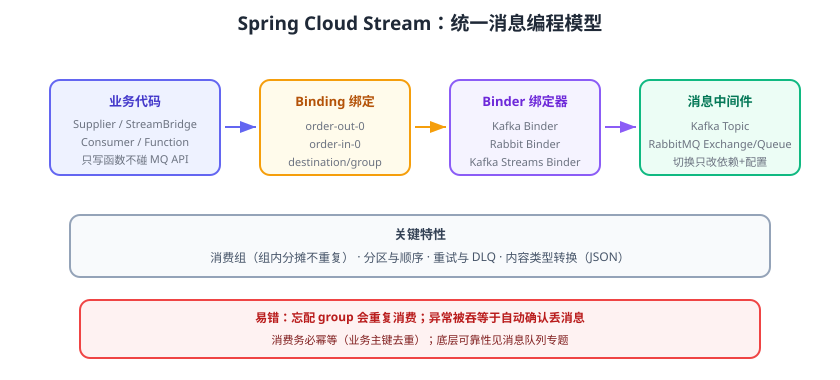

# 消息驱动：Spring Cloud Stream

同步调用不适合长链路与突发流量（下单后同步扣库存，库存服务一慢订单全堵）。**Spring Cloud Stream** 提供统一的**消息驱动编程模型**：业务只写「输入/输出函数」，由 **Binder（绑定器）** 对接 Kafka、RabbitMQ 等中间件，切换 MQ 时业务代码几乎不用改。



## 为什么需要 Stream

| 痛点 | 直接对接 MQ 客户端 | Spring Cloud Stream |
| --- | --- | --- |
| 绑定 MQ 厂商 API | 每个服务写 Kafka/Rabbit 代码 | 只依赖 Binder 抽象 |
| 切换中间件 | 大量重写 | 换依赖 + 配置 |
| 消费组语义 | 各厂商 API 不同 | 统一 `group` 概念 |
| 重试与死信 | 手工实现 | 框架级支持 |
| 测试 | 起真实 MQ | 可用 Test Binder |

一句话：**Stream = “消息版 Spring Data”**，把中间件差异挡在 Binder 层。

## 核心概念

| 概念 | 说明 |
| --- | --- |
| Binder | 连接应用与消息中间件的适配层（Kafka Binder / Rabbit Binder） |
| Binding | 输入/输出通道与 Binder 的绑定关系 |
| Destination | 消息实际去向：Kafka Topic / RabbitMQ Exchange+Queue |
| Group（消费组） | 同一组内消息只被一个实例消费（实现“只消费一次”） |
| Partition | 消息分区/分片，保证顺序与并行消费 |
| 函数式模型 | 用 `Supplier`/`Function`/`Consumer` Bean 表达发/处理消息 |

## 快速接入（Kafka 示例）

### 1. 引入依赖

```xml [pom.xml]
<dependency>
    <groupId>org.springframework.cloud</groupId>
    <artifactId>spring-cloud-starter-stream-kafka</artifactId>
</dependency>
```

### 2. 定义输出（发消息）

Spring Cloud Stream 3.x+ 使用**函数式风格**：声明一个 `Supplier` 就是输出通道，声明 `Consumer` 或 `Function` 就是输入处理。

```java [OrderEventPublisher.java]
import org.springframework.context.annotation.Bean;
import org.springframework.stereotype.Component;
import reactor.core.publisher.Flux;

import java.time.Duration;
import java.util.function.Supplier;

@Component
public class OrderEventPublisher {

    // 输出绑定名 = order-out-0（Supplier Bean 名 + -out- + 索引）
    @Bean
    public Supplier<OrderCreatedEvent> orderOut() {
        return () -> new OrderCreatedEvent(1L, "sku-001", 2, System.currentTimeMillis());
    }

    public record OrderCreatedEvent(Long orderId, String sku, int count, long ts) {
    }
}
```

> 主动按业务事件发消息（非定时轮询）推荐注入 `StreamBridge`：

```java [OrderController.java]
import org.springframework.cloud.stream.function.StreamBridge;
import org.springframework.web.bind.annotation.PostMapping;
import org.springframework.web.bind.annotation.RestController;

@RestController
public class OrderController {

    private final StreamBridge streamBridge;

    public OrderController(StreamBridge streamBridge) {
        this.streamBridge = streamBridge;
    }

    @PostMapping("/orders")
    public String create() {
        // 第一个参数是 binding 名，第二个是消息体
        streamBridge.send("order-out-0", new OrderCreatedEvent(1L, "sku-001", 2));
        return "ok";
    }
}
```

### 3. 定义输入（消费消息）

```java [InventoryConsumer.java]
import org.springframework.context.annotation.Bean;
import org.springframework.stereotype.Component;

import java.util.function.Consumer;

@Component
public class InventoryConsumer {

    // 输入绑定名 = order-in-0
    @Bean
    public Consumer<OrderCreatedEvent> orderIn() {
        return event -> {
            System.out.println("收到订单事件：" + event);
            // 幂等校验 → 扣库存 → 失败抛异常进入重试/死信
        };
    }
}
```

### 4. 配置绑定

```yaml [application.yml]
spring:
  cloud:
    stream:
      bindings:
        order-out-0:
          destination: order-events        # Kafka Topic
          content-type: application/json
        order-in-0:
          destination: order-events
          group: inventory-group           # 关键：多个实例共享消费组
          consumer:
            max-attempts: 3
      kafka:
        binder:
          brokers: localhost:9092
```

## 消费组与分区

### 消费组

同一 Topic 被多个服务监听（订单、通知都想收事件），靠**不同 group** 实现“广播”；同组多实例则**分摊消费、不重复**：

```yaml [application.yml]
spring:
  cloud:
    stream:
      bindings:
        order-in-0:
          destination: order-events
          group: inventory-group      # 两个库存实例同组 → 各消费一半
```

### 分区与顺序

需要“同一订单的事件按顺序处理”时启用分区：

```yaml [application.yml]
spring:
  cloud:
    stream:
      bindings:
        order-out-0:
          destination: order-events
          producer:
            partition-key-expression: headers['orderId']   # 按订单号分区
            partition-count: 4
        order-in-0:
          destination: order-events
          group: inventory-group
          consumer:
            partitioned: true
```

## 重试、死信与幂等

### 消费失败处理

默认行为：`Consumer` 抛异常即消费失败，进入重试（`max-attempts`），重试仍失败：

- Kafka Binder：发送到 **DLQ**（`error.<destination>.<group>`）。
- Rabbit Binder：进入 **DLX/DLQ**。

```yaml [application.yml]
spring:
  cloud:
    stream:
      bindings:
        order-in-0:
          destination: order-events
          group: inventory-group
          consumer:
            max-attempts: 3
      kafka:
        binder:
          brokers: localhost:9092
          consumer-properties:
            enable.auto.commit: false   # 由框架在消费成功后提交 offset
```

### 幂等消费

消息系统“至少一次”语义下，消费端必须幂等：用**业务主键去重**（数据库唯一键、Redis SETNX），不要假设“只会收到一次”。

```java [InventoryConsumer.java]
@Bean
public Consumer<OrderCreatedEvent> orderIn(OrderIdempotentService idempotentService) {
    return event -> {
        boolean first = idempotentService.tryProcess(event.orderId());
        if (!first) {
            System.out.println("重复事件，直接跳过：" + event.orderId());
            return;
        }
        // 扣库存逻辑
    };
}
```

## 与 MQ 专题的衔接

Stream 解决的是“**编程模型统一**”，底层可靠性仍取决于 MQ 本身：

- Topic/Queue、生产者确认、消费者 offset 概念见 [消息队列专题：Kafka 概述](../../MessageQueue/Kafka/index.md) 与 [RabbitMQ](../../MessageQueue/RabbitMQ/index.md)。
- 可靠投递与幂等设计见 [可靠投递](../../MessageQueue/Reliability/index.md) 与 [消费幂等](../../MessageQueue/Idempotency/index.md)。
- Kafka 端的分区副本、消费组协议、事务与集群运维见 [Kafka 深入专题](../../MessageQueue/Kafka/index.md)、[Kafka 分区与副本机制](../../MessageQueue/Kafka/PartitionReplica/index.md)、[Kafka 集群部署、运维与监控](../../MessageQueue/Kafka/Cluster/index.md)。

::: info Kafka 版本提示（2026-09 核对）
Kafka 当前稳定版为 **4.3.1**，4.0 起仅支持 **KRaft** 模式（ZooKeeper 已移除），Broker 与工具需要 Java 17+。Binder 侧需选择与 broker 版本兼容的 Kafka Binder，并注意 4.0 起 `linger.ms` 默认值由 0 变为 5、新版消费组协议（KIP-848）已 GA，详见 [Kafka 版本演进与迁移](../../MessageQueue/Kafka/Version/index.md)。
:::

## 易错点与最佳实践

::: danger 高频坑
1. **忘记配置 group**：多个实例各自成独立组，同一消息被重复消费。
2. **消费异常被静默吞掉**：`try/catch` 后不抛异常 = 自动确认成功，消息丢失。处理不了就抛异常进重试/DLQ。
3. **Binder 与中间件版本错配**：Kafka Binder 对 broker 版本有兼容要求，升级 Kafka 先核对 Binder 版本。
4. **分区顺序理解错**：只有「同 key 同分区」才保证顺序，跨分区不保证；别把“分区数=并行度”想得太简单。
5. **`content-type` 不一致**：发 JSON、消费端配了 `application/json` 才能正确反序列化，否则收到字符串或反序列化失败。
:::

::: tip 实践建议
1. 事件内容用**稳定的业务结构**（版本化字段），不要直接发内部 DTO，避免字段调整破坏消费方。
2. 消费组内实例数 ≤ 分区数，否则多余实例空闲。
3. 把重试、死信、告警串起来：DLQ 有消息要能触发告警，而不是“静默躺着”。
4. 新消费方先以“只记录日志”灰度，确认事件结构后再接业务。
:::

## 验证方式

1. 启动 Kafka（或本地 Docker 单机）与两个实例的服务。
2. 调 `POST /orders`，确认日志 `收到订单事件` 只出现一次（同组不重复）。
3. 停掉一个实例再发消息，另一个实例继续消费，无消息丢失。
4. 让消费逻辑抛异常，观察重试 3 次后进入 DLQ Topic，用 Kafka 工具确认死信消息存在。

## 参考资料

- Spring Cloud Stream 官方文档：https://docs.spring.io/spring-cloud-stream/reference/
- Spring Cloud Function：https://docs.spring.io/spring-cloud-function/reference/
- Spring Cloud Stream Kafka Binder：https://docs.spring.io/spring-cloud-stream-binder-kafka/docs/current/reference/
