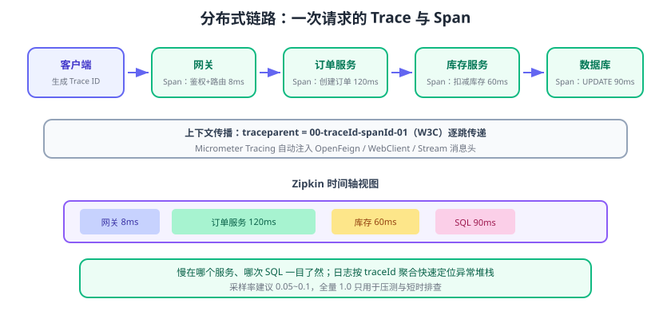

# 链路追踪与可观测性

一次用户请求在微服务里要经过**网关 → 订单服务 → 库存服务 → 数据库/第三方**。出问题时，按普通日志根本看不出“请求到底去了哪、慢在哪一段”。**分布式链路追踪（Distributed Tracing）**给每个请求分配全局唯一 Trace ID，把跨服务的调用串成一条可观测的链路。Spring Cloud 新版本的标准做法是 **Micrometer Tracing + OpenTelemetry 桥接 + Zipkin/OTLP 后端**。



## 核心概念

| 概念 | 英文 | 说明 |
| --- | --- | --- |
| 调用链 | Trace | 一次外部请求对应的整棵调用树，一个 Trace ID |
| 跨度 | Span | 链路中的一段工作单元（一个服务调用、一次 SQL），有开始/结束时间 |
| 父跨度 | Parent Span | 发起调用的上游 Span |
| 上下文传播 | Context Propagation | 通过 HTTP Header 把 Trace ID/Span ID 传给下游 |
| 采样 | Sampling | 按比例决定记录哪些请求，控制存储成本 |
| 可观测性 | Observability | 指标（Metrics）+ 日志（Logs）+ 链路（Traces）三支柱 |

一条 Trace 的结构：

```text
Trace（traceId=abc123）
├── Span A：网关（parent=null，耗时 8ms）
│   └── Span B：订单服务（parent=A，耗时 120ms）
│       ├── Span C：调用库存服务（parent=B，耗时 60ms）
│       └── Span D：查询 MySQL（parent=B，耗时 90ms）
```

## 接入步骤（当前推荐组合）

> 旧版本用 Spring Cloud Sleuth；2024.0 起 Sleuth 退役，以下为官方当前推荐写法（Micrometer Tracing + OTel），适用于 Spring Cloud 2024.0+ / 2025.x。

### 1. 引入依赖

```xml [pom.xml]
<!-- Micrometer Tracing 的 OpenTelemetry 桥接 -->
<dependency>
    <groupId>io.micrometer</groupId>
    <artifactId>micrometer-tracing-bridge-otel</artifactId>
</dependency>
<!-- 把 Span 导出到 Zipkin -->
<dependency>
    <groupId>io.opentelemetry</groupId>
    <artifactId>opentelemetry-exporter-zipkin</artifactId>
</dependency>
```

### 2. 配置导出地址与采样率

```yaml [application.yml]
management:
  tracing:
    sampling:
      probability: 1.0          # 生产建议 0.1（10%），全量会烧存储
    propagation:
      type: w3c                # W3C traceparent，跨框架兼容
  zipkin:
    tracing:
      endpoint: http://localhost:9411/api/v2/spans
```

### 3. 启动 Zipkin（本地验证）

```shell [shell]
docker run -d -p 9411:9411 --name zipkin openzipkin/zipkin
# 访问 http://localhost:9411 查看追踪界面
```

### 4. 给业务方法打点

Micrometer 提供了基于注解的观测门面，可同时产出 Span 与耗时指标：

```java [OrderService.java]
import io.micrometer.observation.annotation.Observed;
import org.springframework.stereotype.Service;

@Service
public class OrderService {

    private final StockClient stockClient;

    public OrderService(StockClient stockClient) {
        this.stockClient = stockClient;
    }

    @Observed(name = "order.create", contextualName = "create-order")
    public String createOrder(Long skuId, int count) {
        stockClient.deduct(new DeductRequest(skuId, count));
        return "created";
    }
}
```

## 自动埋点覆盖哪些环节

| 环节 | 是否自动 | 说明 |
| --- | --- | --- |
| 网关转发 | ✅ | Gateway 的 WebFlux 请求自动带出 Trace |
| OpenFeign 调用 | ✅ | 请求头自动注入 traceparent |
| RestTemplate / WebClient | ✅ | 响应式与阻塞式都支持 |
| JDBC/MyBatis | 部分 | 需要数据源观测适配（Micrometer Observation JDBC） |
| 消息（Kafka/RabbitMQ） | ✅ | Stream/Spring Messaging 头自动传播 |
| 自定义方法 | 手动 | 用 `@Observed` 或 `Observation` API |

跨服务传播靠 HTTP Header：Micrometer 采用 **W3C Trace Context**，网关自动把 `traceparent: 00-<trace-id>-<span-id>-01` 传给下游，下游采样后同样上报，Zipkin 里就能拼成完整链路。

## 常用配置清单

| 配置项 | 默认 | 说明 |
| --- | --- | --- |
| `management.tracing.sampling.probability` | `0.1` | 采样率，调试可设 1.0 |
| `management.zipkin.tracing.endpoint` | `http://localhost:9411/api/v2/spans` | Zipkin 上报地址 |
| `management.tracing.propagation.type` | `w3c` | 传播协议 |
| `logging.pattern.level` | `%5p` | 可改为 `%5p [%X{traceId:-},%X{spanId:-}]` 关联日志 |

### 让日志带上 Trace ID

```yaml [application.yml]
logging:
  pattern:
    level: "%5p [%X{traceId:-},%X{spanId:-}]"
```

效果：每行业务日志自带 traceId，配合日志平台按 Trace ID 聚合，排障时“一条链路从入口日志看到出口”。

## 与 SkyWalking 等其他方案的取舍

| 方案 | 接入方式 | 适合场景 |
| --- | --- | --- |
| Micrometer Tracing + Zipkin | 依赖 + 配置，代码侵入小 | Spring 官方栈、想用标准 OTel 生态 |
| SkyWalking | Java Agent 无侵入 | 不想改代码、需要拓扑自动发现 |
| Jaeger | OTLP 上报 | CNCF 生态、与 Prometheus 配合 |
| 商业 APM（如阿里 ARMS） | Agent/接入 | 需要托管、告警完整的团队 |

::: tip 建议
新项目优先 **Micrometer Tracing + OTel**：它写的是标准 API，后端可从 Zipkin 平滑换 Jaeger/OTLP Collector；想无侵入做拓扑时再加 Agent 辅助，而不是两套都手工埋点。
:::

## 易错点与最佳实践

::: danger 高频坑
1. **采样率误设 1.0 导致存储爆炸**：全链路每个 Span 都落库，高并发下成本极高；生产从 0.05~0.1 起步，按需放大。
2. **只配了 Zipkin 没配采样**：默认概率采样会导致“偶尔没链路”，排查时以为是故障。
3. **自定义线程池丢失上下文**：链路上下文存在 ThreadLocal，跨线程需手动传播（`ObservationThreadLocalAccessor` 或包装 Runnable）。
4. **日志没加 traceId**：链路系统有数据，但日志对不上，排障仍然两头抓瞎。
5. **异步消息链路断裂**：Stream 场景要把上下文放进消息头；新版 Micrometer 自动处理，自定义消费逻辑时要避免手动新建线程绕过。
:::

::: tip 实践建议
1. Trace ID 从**最外层网关或前端入口**生成，贯穿日志、消息、异步任务。
2. 给关键第三方调用与慢 SQL 打独立 Span，比看整条链路更容易定位瓶颈。
3. 把「P95/P99 耗时」「错误率」按服务维度接入 Grafana，链路与指标对照着看。
:::

## 验证方式

1. 启动 Zipkin、Nacos 与至少两个服务，发一次经过网关的请求。
2. 打开 Zipkin，搜索该请求：应看到网关、订单、库存的 Span 串成一条 Trace，时间轴清晰显示每段耗时。
3. 在服务日志中看到相同 traceId；修改采样率为 0.1 后观察上报量明显下降。

## 参考资料

- Micrometer Tracing：https://micrometer.io/docs/tracing
- OpenTelemetry Java：https://opentelemetry.io/docs/languages/java/
- Zipkin：https://zipkin.io/
- 微服务专题·链路追踪（方法论扩展）：[链路追踪](../../Microservices/Tracing/index.md)
