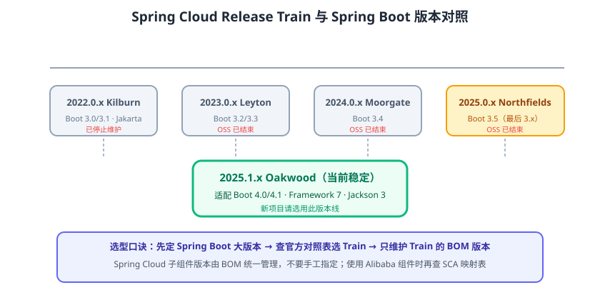

# 版本选择与演进（Train 对照与状态）

Spring Cloud 不像普通软件用 1.0/2.0 这样连续编号，而是按**发布年份 + 发布序号**命名「发布列车（Release Train）」，例如 2025.1.x。每列 Train 与某个 **Spring Boot 大版本**绑定，选版本时**先定 Spring Boot，再查 Spring Cloud 对照表**，而不是各自挑最新。本页同时是各 Train 的**汇总入口与存档**：表格给出全量对照，小节给出每一代的关键变化与升级要点，方便存量项目按版本核对。

::: info 当前结论（2026-09 核对）
新项目推荐 **Spring Boot 4.1.x + Spring Cloud 2025.1.x（Oakwood）**；其余 Train 的 OSS 支持均已结束，仅用于维护存量项目。
:::



## 命名规则

1. Train 名称 = 发布年份 + 当年发布序号（`.0` 为首次发布，`SR`/补丁号递增），并配一个伦敦地铁站代号（如 Oakwood）。
2. Train 是一个 **BOM（物料清单）**：本身没有代码，只把各子项目（Gateway、OpenFeign 等）的兼容版本统一管理。
3. Train 下的组件各自独立发版，因此**组件版本不要手工指定**，交给 BOM 对齐。

| Train | 代号 | 适配 Spring Boot | 状态（2026-09） |
| --- | --- | --- | --- |
| 2025.1.x | Oakwood | 4.0.x、4.1.x（2025.1.2 起） | ✅ 当前稳定，推荐 |
| 2025.0.x | Northfields | 3.5.x | ⛔ OSS 已结束（2026-06-30） |
| 2024.0.x | Moorgate | 3.4.x | ⛔ OSS 已结束 |
| 2023.0.x | Leyton | 3.2.x、3.3.x（2023.0.2 起） | ⛔ OSS 已结束 |
| 2022.0.x | Kilburn | 3.0.x、3.1.x（2022.0.3 起） | ⛔ OSS 已结束 |
| 2021.0.x | Jubilee | 2.6.x、2.7.x | ⛔ OSS 已结束 |
| 2020.0.x | Ilford | 2.4.x、2.5.x | ⛔ OSS 已结束 |
| Hoxton | - | 2.2.x、2.3.x | ⛔ OSS 已结束 |
| Greenwich / Finchley | - | 2.1.x / 2.0.x | ⛔ OSS 已结束 |

## 存量 Train 速查（维护参考）

下表汇总 2022.0.x 以来各 Train 的组件代际与关键注意事项，替换分散的“版本说明页”，避免碎片化：

| Train | 组件代际 | 关键差异 | 对应 SCA 大致配套 | 升级去向 |
| --- | --- | --- | --- | --- |
| 2022.0.x（Kilburn） | Gateway/OpenFeign/Commons 4.x 早期 | 首个 Boot 3 版本线：`javax` → `jakarta`，最低 JDK 17 | SCA 2022.x + Nacos 2.2.x | 2023.0.x → 逐步到 2025.1.x |
| 2023.0.x（Leyton） | 4.x 中期 | Boot 3.2/3.3，`spring.config.import` 普及 | SCA 2023.x + Nacos 2.3.x | 2024.0.x / 2025.0.x |
| 2024.0.x（Moorgate） | 4.x 后期（Gateway 4.2.x） | Boot 3.4；Sleuth 退役，链路追踪改用 Micrometer Tracing | SCA 2023.x/2024.x 视官方映射 | 2025.0.x（同代平滑） |
| 2025.0.x（Northfields） | 4.x 末代 | Boot 3.5，Spring Cloud 3.x 代际收尾 | SCA 2025.0.0.0 + Nacos 3.0.3 | 2025.1.x（跨 Boot 4） |
| 2025.1.x（Oakwood） | 5.0 全量升级 | Boot 4.0/4.1、Framework 7、Jackson 3 | SCA 2025.1.0.0 + Nacos 3.1.1 | 当前基线，持续打 SR |

## 演进中的重大变化

### 2020.0 起：Netflix 组件退场

Spring Cloud Netflix 中的 **Hystrix、Ribbon、Zuul** 进入维护模式并从主依赖中移除：

| 旧组件 | 替代方案 | 说明 |
| --- | --- | --- |
| Hystrix 熔断 | Spring Cloud Circuit Breaker + Resilience4j | 统一抽象，支持多实现 |
| Ribbon 客户端负载均衡 | Spring Cloud LoadBalancer | 新的负载均衡抽象 |
| Zuul 网关 | Spring Cloud Gateway | 响应式、非阻塞 |
| Eureka | 保留（Netflix 模块只维护 Eureka） | 也可选 Nacos/Consul |

### 2022.0 起：Spring Boot 3 / Jakarta EE

- 底层换 Spring Framework 6，**`javax.*` 全部迁移为 `jakarta.*`**。
- 最低 Java 17，需要 JDK 17 才能启动 Train 2022.0+。

### 2024.0 起：Sleuth 正式退役

- 链路追踪改用 **Micrometer Tracing**（OpenTelemetry 桥接），`spring-cloud-starter-sleuth` 不再维护。

### 2025.1 起：Spring Boot 4 / Spring Framework 7

- 配套 Spring Boot 4.0/4.1，组件大版本升级（Gateway 5.0、OpenFeign 5.0、Commons 5.0 等）。
- 仍然保留 LoadBalancer + Circuit Breaker 体系，Netflix/Consul 等模块同步升版。

## 各 Train 存档说明

### 2022.0.x（Kilburn）：Boot 3 的起点

2022-11 发布，适配 Spring Boot 3.0/3.1。它是 Spring Cloud 进入 Jakarta EE 的**分水岭**，之后所有新代码都基于 `jakarta.*`。存量项目若仍停留在该线，OSS 支持早已结束，升级路径为「2022.0.x → 2023.0.x（Boot 3.2/3.3）→ 2024.0.x（Boot 3.4）→ 2025.0.x（Boot 3.5）→ 2025.1.x（Boot 4）」；每步都需回归启动与测试，不建议一次跨多个大版本。

```xml [2022.0.x 参考配置]
<parent>
    <groupId>org.springframework.boot</groupId>
    <artifactId>spring-boot-starter-parent</artifactId>
    <version>3.1.5</version>
</parent>
<properties>
    <spring-cloud.version>2022.0.4</spring-cloud.version>
</properties>
```

### 2023.0.x（Leyton）：主流生产基线

适配 Boot 3.2/3.3（2023.0.2 起）。该线伴随国内 Spring Cloud Alibaba 2023.x 被大量生产使用，典型组合为 Boot 3.2 + Nacos 2.3.x + Sentinel 1.8.6。相比 2022.0.x，它没有破坏性 API 变化，主要是适配新 Boot 与组件微调。

```xml [2023.0.x 参考配置]
<properties>
    <spring-cloud.version>2023.0.3</spring-cloud.version>
</properties>
```

### 2024.0.x（Moorgate）：Sleuth 退役节点

适配 Boot 3.4。**从该线起必须使用 Micrometer Tracing**：`spring-cloud-starter-sleuth` 已不在 Train 依赖中，老项目升到 2024.0.x 时需把 Sleuth 依赖替换为：

```xml [pom.xml 链路追踪依赖替换]
<dependency>
    <groupId>io.micrometer</groupId>
    <artifactId>micrometer-tracing-bridge-otel</artifactId>
</dependency>
<dependency>
    <groupId>io.opentelemetry</groupId>
    <artifactId>opentelemetry-exporter-zipkin</artifactId>
</dependency>
```

### 2025.0.x（Northfields）：Spring Boot 3 代际收尾

适配 Boot 3.5，是 Spring Cloud 在 **Spring Framework 6.2** 上的最后一个版本线；OSS 支持于 2026-06-30 结束。它与 2024.0.x 属于平滑演进，适合「不想立刻升 Boot 4」的存量团队作为过渡终点。

```xml [2025.0.x 参考配置]
<parent>
    <groupId>org.springframework.boot</groupId>
    <artifactId>spring-boot-starter-parent</artifactId>
    <version>3.5.x</version>
</parent>
<properties>
    <spring-cloud.version>2025.0.x</spring-cloud.version>
</properties>
```

### 2025.1.x（Oakwood）：当前稳定版

适配 Boot 4.0/4.1（2025.1.2 起支持 4.1），组件统一升到 5.0。**详细组件版本、SCA 配套与升级清单见 [2025.1.x 版本页](2025-1/index.md)**。

## 历史版本目录说明

早期文档曾按「2022-0/2023-0/2024-0」各建独立版本页。为遵守“不覆盖旧内容、不碎片化维护”的原则，存量 Train 的要点已**合并进本页存档**，原独立目录不再单独成页（避免 30~50 行的“半空版本页”）；需要完整升级操作指引的当前版本仍保留独立页面 [2025.1.x](2025-1/index.md)。

## 如何选择版本

### 新项目

直接选 **Spring Boot 当前稳定版 + 对应最新 Train**。2026 年 9 月即 Spring Boot 4.1.x + Spring Cloud 2025.1.x；若团队生态（第三方库）尚不支持 Boot 4，可退到 Spring Boot 3.5.x + Spring Cloud 2025.0.x，但该线 OSS 已结束，仅适合存量过渡。

### 存量项目

1. 先确认当前 Spring Boot 版本，再到官方对照表找匹配 Train。
2. 升级遵循「先小版本、再大版本、每步跑测试」：Boot 大版本升级前，先看 [Spring Boot 版本说明](../../Java/Frame/SpringBoot/Common/Overview/index.md)。
3. 若使用 Spring Cloud Alibaba，同时核对 SCA 自己的版本映射（Nacos 3.x 与 SCA 2025.x 对应，见 [环境搭建](../Environment/index.md)）。

::: danger 最容易踩的版本坑
1. **不看对照表直接升 Boot**：Boot 3.5 项目把 Boot 升到 4.x 但 Spring Cloud 仍是 2025.0.x，会出现组件不兼容。应先升 Spring Cloud 2025.1.x 再升 Boot 4。
2. **EOL 版本仍在生产裸奔**：2025.0.x 及更早已停止 OSS 支持，安全漏洞不再修复；生产系统应规划升级。
3. **误以为 Train 版本号“越大越新越好”**：2025.0 与 2025.1 面向不同 Boot 代际，不是补丁关系。
:::

## 参考资料

- 官方版本对照表：https://spring.io/projects/spring-cloud#support
- Release Train 说明：https://github.com/spring-cloud/spring-cloud-release/wiki/Spring-Cloud-Release-Trains
- 各版本发布公告：https://spring.io/projects/spring-cloud#support
