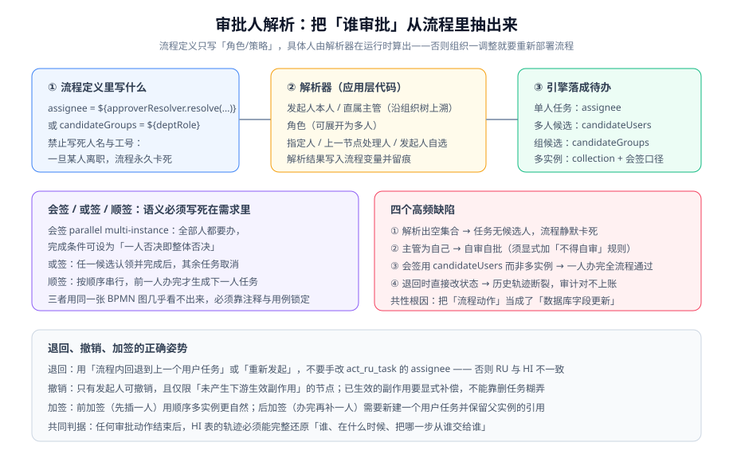

# 审批流设计

审批流是工作流引擎最主流的落地场景，也是需求最容易被写含糊的场景——"需要主管审批"这五个字，在实现层面至少要回答五个问题：**谁是主管、几个人、能不能改、能不能退、多久没办怎么办**。本页把这五个问题拆开逐个定死。



## 审批人解析：四种策略与一条兜底

流程定义里**只写策略，不写具体人**。原因很简单：组织架构调整一次就要重新部署一次流程，是不可接受的维护成本。

| 策略 | 表达 | 解析来源 | 坑 |
| --- | --- | --- | --- |
| 发起人本人 | `assignee = ${initiator}` | 流程变量 | 常用于"确认"节点；但要显式禁止"自审自批" |
| 直属主管 | `${approverResolver.directorOf(initiator)}` | 组织树向上找一级 | 多级组织、兼职、代理任职都会让"上溯一级"有歧义，**必须把口径写死在需求里** |
| 角色/岗位 | `candidateGroups = "finance-approver"` | 角色表 | 角色下无人 → 任务无人可办（不会报错） |
| 指定人 / 上一节点处理人 | `${assigneeOfPrevTask}` | 运行时解析 | 上一节点是多实例会签时有多个处理人，取谁？ |

```java [src/main/java/com/example/flow/ApproverResolver.java]
@Component("approverResolver")
public class ApproverResolver {

    /** 所有解析方法都必须返回「非空且去重后非空」的结果，否则任务会静默卡死 */
    public String directorOf(String initiator) {
        return resolveOrFallback(orgTree.directorOf(initiator), FALLBACK_ROLE);
    }

    public List<String> reviewersOf(int riskLevel) {
        List<String> users = riskLevel >= 3
                ? roleService.usersOf("senior-reviewer")
                : roleService.usersOf("content-reviewer");
        // 关键：解析结果为空时降级到兜底角色，并在留痕里标注"已降级"
        if (users.isEmpty()) {
            auditService.markDegraded(riskLevel, "senior-reviewer");
            return roleService.usersOf(FALLBACK_ROLE);
        }
        return users.stream().filter(Objects::nonNull).distinct().toList();
    }

    private String resolveOrFallback(String user, String fallbackRole) {
        if (user != null && !user.isBlank()) {
            return user;
        }
        List<String> fallback = roleService.usersOf(fallbackRole);
        if (fallback.isEmpty()) {
            // 宁可显式失败，也不要创建一个没人能办的任务
            throw new IllegalStateException("审批人解析失败：组织树无主管且兜底角色为空，请先配置兜底审批人");
        }
        return fallback.get(0);
    }
}
```

::: danger 「解析出空候选人」是最贵的静默故障
引擎创建任务时会**忠实执行**你的表达式：`candidateUsers` 解析成空集合，任务照样创建成功，只是**没有任何人能在待办里看到它**。它不会报错、不会进死信，只会安静地躺到有人发现流程不对为止。

两条强制纪律：
1. **每个审批人解析方法都要有兜底分支**，兜底角色为空时**显式抛异常**（让流程启动失败，而不是创建僵尸任务）。
2. **上线前必须跑一次"空组织"用例**：把解析结果 mock 成空，断言接口返回明确错误而不是 200。
:::

## 会签 / 或签 / 顺签：语义必须写死在需求里

这三个词在口语里经常混用，但它们的实现与业务含义完全不同：

| 名称 | BPMN 实现 | 业务含义 | 完成条件 |
| --- | --- | --- | --- |
| **或签** | `candidateUsers` / `candidateGroups` | 一组人里**任意一人**处理即可 | 一人完成 → 任务结束 |
| **会签** | `multiInstance`（并行） | **所有人**都要处理 | 全部实例完成，或 `completionCondition` 提前结束 |
| **顺签** | `multiInstance`（`isSequential="true"`） | 按**固定顺序**依次处理 | 最后一个实例完成 |

```xml [processes/article-review.bpmn20.xml]
<!-- 或签：初审组任意一人处理 -->
<userTask id="firstReview" name="初审" flowable:candidateGroups="content-reviewer" />

<!-- 会签：所有复审人都要处理；两人否决即整体否决（提前结束） -->
<userTask id="seniorReview" name="复审会签" flowable:assignee="${assignee}">
  <multiInstanceLoopCharacteristics isSequential="false"
        flowable:collection="${reviewers}" flowable:elementVariable="assignee">
    <completionCondition><![CDATA[${nrOfCompletedInstances >= 2 or rejectedCount >= 1}]]></completionCondition>
  </multiInstanceLoopCharacteristics>
</userTask>

<!-- 顺签：三级审核依次进行，前一人办完才生成下一人任务 -->
<userTask id="serialReview" name="逐级审核" flowable:assignee="${assignee}">
  <multiInstanceLoopCharacteristics isSequential="true"
        flowable:collection="${approvers}" flowable:elementVariable="assignee" />
</userTask>
```

| 变量 | 含义 | 什么时候能读到 |
| --- | --- | --- |
| `nrOfInstances` | 实例总数 | 进入多实例后即可 |
| `nrOfActiveInstances` | 未完成实例数 | 过程中 |
| `nrOfCompletedInstances` | 已完成实例数 | 过程中 |
| `loopCounter` | 当前序号（顺签从 0 开始） | 每次实例执行时 |

::: warning 「会签一票否决」必须自己实现
引擎不会帮你判断"否决"，它只认"完成"。想实现一票否决，要么用 `completionCondition` 提前结束多实例（如上例），要么让每个实例完成后由监听器检查否决票数、达到阈值时把流程推向否决分支。**只写"多人审批"而不写清完成条件，验收时一定会被问住。**
:::

## 退回、撤销、加签、转办

审批流里所有"非前进"的动作，都会在历史轨迹上留痕——这既是合规要求，也是排障的第一手资料。

| 动作 | 语义 | 正确实现 | 错误实现及其后果 |
| --- | --- | --- | --- |
| **退回** | 把处理权交还给上一个节点（或发起人） | 流程内回退到上一个用户任务；或终止当前实例、由业务层新建一个实例 | 直接 update `ACT_RU_TASK.ASSIGNEE_` → RU 与 HI 不一致，审计对不上 |
| **撤销** | 发起人在下游生效前收回 | 只有发起人有权限；显式终止实例并标记业务状态；**已生效的下游副作用必须补偿** | 删任务了事 → 下游已发通知/已写数据回不去 |
| **加签** | 在现有节点上再插一个人 | 前加签：顺序多实例（先插的人排前）；后加签：新建用户任务并保留父任务引用 | 用 `candidateUsers` 追加 → 变成"或签"，加签的人可能永远不会办 |
| **转办** | 把任务交给别人办（自己不再处理） | `taskService.setAssignee(taskId, other)` 并记录转办留痕 | 清空 assignee 再设置 → 丢失"谁转给谁"的审计线索 |
| **委派** | 交给别人处理，完成后回到自己 | `taskService.delegateTask()` + `resolveTask()` | 用转办模拟委派 → 办完回不到原办理人 |

::: tip 「退回」到底退到哪：三种都要在需求里问清楚
退回**上一节点**（最常见）、退回**发起人**（打回重写）、退回**指定节点**（跳过多步）。三种的权限、留痕、次数限制都不同——尤其是"退回次数限制"（比如超过 3 次直接终止），**不写清楚就一定会被业务方在验收时提出来**。
:::

## 超时与催办

| 需求 | 建模 | 参数要点 |
| --- | --- | --- |
| 超时催办（任务继续等待） | 用户任务 + **非中断**边界定时事件 | `cancelActivity="false"`；定时器用「持续时间」还是「循环」取决于是否重复催办 |
| 超时自动升级 | 用户任务 + 中断边界定时事件 → 升级任务 | 升级目标人也必须走解析器，也要有兜底 |
| 超时自动通过（慎用） | 中断边界定时 + 服务任务 | 合规风险高，必须写入需求确认单 |
| 工作日计算 | 定时器表达式改为基于业务日历计算 | BPMN 定时器只认绝对时间/时长，**工作日语义要自己算出来再传进去** |

```xml [processes/article-review.bpmn20.xml]
<!-- 非中断边界定时：48 小时后催办一次，任务仍在原办理人手上 -->
<boundaryEvent id="remindTimer" attachedToRef="seniorReview" cancelActivity="false">
  <timerEventDefinition>
    <timeDuration>PT48H</timeDuration>
  </timerEventDefinition>
</boundaryEvent>
<sequenceFlow sourceRef="remindTimer" targetRef="notifyTask" />
```

::: danger 工作日与自然日：一个属性引发的线上事故
`PT48H` 是**自然时长**，跨周末会在周一早上集中爆发"超时升级"。如果业务口径是"两个工作日"，必须在启动定时器前用工时日历算出目标时间点，写进流程变量，再用 `<timeDate>${deadline}</timeDate>` 触发。

**验证方法**：把系统时间调到周五 18:00 启动实例，检查 `ACT_RU_TIMER_JOB.DUEDATE_` 是否落在下周二同一时刻（而不是周日 18:00）。
:::

## 审批留痕：存业务库，不读引擎历史表

| 数据 | 权威源 | 理由 |
| --- | --- | --- |
| 审批动作流水（谁、何时、同意/退回、意见） | **业务库**（如 `review_records`） | 业务查询、报表、导出都要用；引擎历史表结构不稳定、跨版本会变 |
| 流程当前节点与耗时 | 引擎库（`ACT_HI_*`） | 这是"流程的形状"，引擎是最佳来源 |
| 流程实例 id 与业务主键的映射 | 业务库（`business_key` 列） | 业务侧要能反向查到自己的实例 |

::: warning 不要用引擎历史表当业务表
引擎历史表是引擎的内部实现：字段名带下划线、跨大版本可能调整、查询需要走引擎 API。把它当作"业务审计表"来用，等于把业务可查性绑死在引擎升级上。**做法：业务动作自己写一张留痕表，引擎历史只用于排障与流程耗时统计。**
:::

## 需求模板：一张表锁定语义

给业务方评审时，用这张表把每个审批节点问清楚，**空白项就是未定义的需求**：

| 节点 | 审批人策略 | 多人语义 | 可否退回 | 退回到 | 超时动作 | 超时时长 | 意见必填 |
| --- | --- | --- | --- | --- | --- | --- | --- |
| 初审 | 内容审核角色 | 或签 | 可 | 发起人 | 催办 | 24 小时 | 退回必填 |
| 复审 | 高级审核角色（按风险等级） | 会签（一票否决） | 可 | 初审 | 升级至主编 | 48 工作小时 | 退回必填 |
| 发布确认 | 发起人本人 | 单人 | 否 | — | 自动通过 | 72 小时 | 否 |

## 验证方式

```shell
# ① 或签：两个候选人分别认领同一任务，只有一个成功
curl -s -X POST "http://localhost:8080/api/v1/tasks/${TASK_ID}/claim" -H "X-User: u1"
curl -s -X POST "http://localhost:8080/api/v1/tasks/${TASK_ID}/claim" -H "X-User: u2"
# 期望：第一次 200；第二次 409（任务已被认领）

# ② 会签：三个人各办一次，完成任务总数等于 3
curl -s "http://localhost:8080/api/v1/instances/${INSTANCE_ID}/tasks?taskDefKey=seniorReview"
# 期望：returns 3 条（nrOfInstances=3）；办完 3 条后实例才往前走

# ③ 退回：带意见的退回被接受，不带意见的退回被拒绝
curl -s -X POST "http://localhost:8080/api/v1/tasks/${TASK_ID}/complete" \
  -H 'Content-Type: application/json' -d '{"decision":"reject"}'
# 期望：400，提示 "comment is required when rejecting"

# ④ 空组织兜底：把解析器 mock 成空，断言流程无法启动而不是创建僵尸任务
curl -s -X POST "http://localhost:8080/api/v1/submissions" -H 'X-Test-EmptyOrg: true'
# 期望：500/422 + 明确错误信息，且 ACT_RU_TASK 中不产生新记录
```

```sql
-- ⑤ 留痕完整性：任意一个已办任务，都能在业务留痕表里找到对应记录
SELECT t.ID_, t.NAME_, t.ASSIGNEE_, h.actor, h.action, h.comment, h.at
FROM ACT_HI_TASKINST t
JOIN review_records h ON h.instance_id = t.PROC_INST_ID_ AND h.task_id = t.ID_
WHERE t.PROC_INST_ID_ = '流程实例ID';
-- 期望：已完成的用户任务全部有对应留痕；返回行数 = 已办任务数
```

## 参考资料

- Flowable 用户任务与多实例文档：https://www.flowable.com/open-source/docs/bpmn/ch07b-BPMN-Constructs
- Camunda 8 人机任务模式（任务分配与解除参考）：https://docs.camunda.io/docs/components/modeler/bpmn/user-tasks/
- Workflow Patterns（多实例与同步模式归纳）：https://www.workflowpatterns.com/patterns/control/
