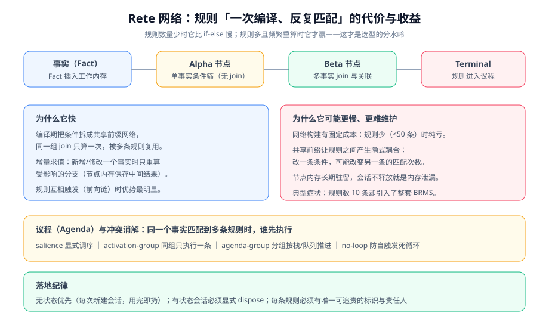

# Drools 规则引擎

Drools 是 JVM 上最成熟的业务规则引擎（BRMS），它把「什么条件得出什么结论」写成独立的规则文件，由引擎在运行时匹配事实（Fact）并执行对应动作。它现在归属 **Apache KIE（Incubating）** 项目——与 jBPM、OptaPlanner、Kogito 同一个伞项目下。

## 版本与工程坐标

::: info 版本与维护状态（2026-10 核对）
- **Apache KIE 10.2.0**（发布于 2026-03-28，发布公告 2026-04）：这是 Apache 阶段的第三个发布，官方称"为毕业铺路，预期下一版毕业"。
- 10.2.0 的关键变化：**移除旧版 GWT 编辑器**（新版 BPMN 编辑器取代）、DMN 支持到 **1.6**、Quarkus 3.27.2、Spring Boot 3.5.10、支持 Java 21。
- 版本谱系：`8.44.0.Final`（kiegroup 时代最后一个特性版，2023-09）→ `10.0.0`（2024-12，Apache 首个发布）→ `10.1.0`（2025-04）→ `10.2.0`。
- 项目仍带 `DISCLAIMER-WIP`，处于 Apache Incubator；许可为 Apache-2.0，商用无碍。
:::

| 依赖 | 用途 | 说明 |
| --- | --- | --- |
| `drools-engine` | 引擎核心（基于可执行模型） | 常规项目的起点 |
| `drools-xml-support` | 支持 `kmodule.xml` 配置 | 用 XML 描述 KieBase 时需要 |
| `drools-decisiontables` | 决策表（Excel/CSV）支持 | 业务人员维护规则时使用 |
| `drools-mvel` | MVEL 方言 | **只在确实要用 `dialect "mvel"` 时才加**；不加会报找不到方言 |
| `kie-api` / `drools-compiler` | API 与编译器 | 通常由上面几个传递引入 |

::: danger 两个依赖相关的典型报错
1. **`Unable to find dialect 'mvel'`**：DRL 里写了 `dialect "mvel"` 但没引 `drools-mvel`。修法要么加依赖，要么把方言改回 `java`。
2. **`org.kie.internal.utils.KieHelper` 找不到**：它在 `kie-internal`（由引擎传递引入），如果被 `exclusions` 排掉了就会缺类。
:::

## Rete 网络：为什么它快，也为什么它可能更慢



Drools 用 **Rete 算法**把规则编译成一张网络：Alpha 节点做单事实筛选，Beta 节点做事实间的 join，匹配结果进入**议程（Agenda）**等待执行。核心优势是**增量求值**——插入或修改一个事实时只重算受影响的分支，而不是把所有规则从头跑一遍。

这也决定了它的成本结构：

| 场景 | Rete 表现 | 说明 |
| --- | --- | --- |
| 规则少（< 50 条）、事实少、跑一次就扔 | **比 if-else 慢** | 网络构建 + 会话管理是固定开销 |
| 规则多、共享条件多 | 明显更快 | 共享前缀只算一次 |
| 事实频繁变化（同一批事实反复重算） | 优势最大 | 增量求值避免全量重匹配 |
| 规则之间有前向链触发（A 改事实 → 触发 B） | 优势最大 | 无需自己写迭代收敛逻辑 |
| 每次请求新建会话、跑完即扔 | 退化为"每次重构网络" | **无状态用法下 Rete 的价值大打折扣** |

::: tip 一句选型判据
**如果规则要在一次请求里反复迭代收敛，或者同一批事实要被几十条规则共享匹配，Drools 才划算。** 如果只是"进来一个对象、判断三五个条件、返回一个等级"，用策略模式 + 决策表反而更好维护。
:::

## DRL 基础语法

```java [src/main/resources/rules/article-review.drl]
package rules.article;

import com.example.blog.domain.Submission;
import com.example.blog.domain.ReviewResult;

global com.example.blog.service.RiskScoreService riskScoreService;

// 规则名是运维排障的第一线索：命中日志里会打印它，必须能一眼看出业务含义
rule "高风险稿件：涉及敏感词且字数过短"
    salience 100                       // 优先级：数值大的先执行
    activation-group "risk-level"      // 同组只执行一条（第一条触发后其余取消）
    no-loop true                       // 本规则内 update 事实时不重新触发自己
    when
        $s : Submission(sensitiveHits >= 1, wordCount < 400)
    then
        modify($s) { setRiskLevel("HIGH"), setRuleHit("敏感词+过短") };
        riskScoreService.record($s.getId(), "敏感词+过短");
end

rule "重复稿件：与已有内容相似度过高"
    salience 90
    when
        $s : Submission(similarity >= 0.85)
    then
        modify($s) { setRiskLevel("HIGH"), setRuleHit("重复度过高") };
end

rule "常规稿件：默认走普通审核"
    salience -100
    when
        $s : Submission(riskLevel == null)
    then
        modify($s) { setRiskLevel("NORMAL"), setRuleHit("默认") };
end
```

语言标注写的是 `java` 而不是 `drl`：VitePress 内置的 shiki **没有 DRL 语法**（已安装的 632 种语言里没有 `drl`），写 `drl` 会在构建日志里留下一行 `The language 'drl' is not loaded, falling back to 'txt'`，页面**失去全部高亮**且构建照样成功。DRL 的 `package` / `import` / `global` 与 `then` 块本身就是 Java 语句，用 `java` 高亮不会标错任何关键字——`rule` / `when` / `then` / `end` 不是 Java 关键字，会保持原色。

| 关键字 | 作用 | 注意 |
| --- | --- | --- |
| `salience` | 规则优先级 | 数值大先执行；**不要用它代替业务顺序设计** |
| `activation-group` | 同组只执行一条 | 实现"多选一"的判定（如等级互斥） |
| `agenda-group` | 分组，按栈/队列推进 | 配合 `setFocus()` 手动聚焦 |
| `no-loop` | 防止规则内 `update` 触发自己 | 只是防自触发，不防 A→B→A 互触发 |
| `lock-on-active` | 更彻底的防重入 | 规则流场景常用 |
| `exists` / `not` / `forall` | 存在性量词 | 表达"存在一条满足…"或"所有都满足…" |
| `accumulate` / `collect` | 聚合 | 求和、计数、收集列表 |
| `from` | 从集合/服务取事实 | 会破坏增量求值优势，**慎用** |

```java [src/main/java/com/example/blog/service/ReviewService.java]
@Service
public class ReviewService {

    private final KieContainer kieContainer;   // 由 kie-spring 或自定义配置注入

    /** 无状态用法：一次请求一个会话，用完即扔 —— 推荐作为默认形态 */
    public ReviewResult judge(Submission submission) {
        StatelessKieSession session = kieContainer.newStatelessKieSession("review-session");
        ReviewResult result = new ReviewResult();
        // 无状态会话的 execute 内部会插入事实、触发规则、然后自动 dispose
        session.execute(List.of(submission, result));
        return result;
    }

    /** 有状态用法：多次交互、事实在会话中累积 —— 用完必须 dispose，否则内存泄漏 */
    public void batchJudge(List<Submission> submissions) {
        KieSession session = kieContainer.newKieSession("review-session");
        try {
            session.setGlobal("riskScoreService", riskScoreService);
            submissions.forEach(session::insert);
            int fired = session.fireAllRules(200);   // 设置上限：防止规则互相触发无限循环
            log.info("批量判定完成：facts={} fired={}", submissions.size(), fired);
        } finally {
            session.dispose();                       // 必须放在 finally
        }
    }
}
```

::: danger 三个会让规则"看起来不生效"的原因
1. **事实没 insert**：规则条件依赖的事实不在工作内存里，条件永远为假，规则一条都不触发，且**不报错**。
2. **`modify` 后规则不再触发**：用了 `no-loop` 或 `lock-on-active`，改了事实却指望同一条规则再跑一次——它不会。
3. **规则没编译进 KieBase**：DRL 放在 `src/main/resources` 之外的目录、或 `kmodule.xml` 没配、或打包时被过滤掉。**验证方法是启动后打印 KieBase 里的规则条数**。
:::

## 可执行模型、决策表与 DMN

| 形态 | 谁维护 | 何时用 |
| --- | --- | --- |
| **DRL 文本** | 开发 | 逻辑复杂、需要写代码的动作 |
| **决策表**（Excel/CSV） | 业务人员 | 规则是"条件组合 → 结论"的矩阵，且频繁调整 |
| **DMN 决策表** | 业务 + 建模工具 | 需要标准化交换格式；10.2.0 起支持 DMN 1.6 |
| **可执行模型**（Executable Model） | 引擎在编译期生成 | 10.x 的默认形态：编译期把 DRL 转成 Java 代码，启动更快、可静态检查 |

**可执行模型是 10.x 的默认与推荐路径**，它的好处是规则错误在**编译期**暴露，而不是等到第一次请求才抛异常。代价是需要 `drools-model-compiler` 参与构建，构建脚本要对齐。

::: warning 决策表不是"给业务人员随便改"的许可
决策表必须配三样东西才敢交给业务：**版本管理**（谁改的、改了什么）、**评审**（改完谁看）、**回归**（改完怎么证明没改坏别的）。缺一样，"业务自助维护规则"就会变成"业务改动引发线上事故且无人可追溯"。
:::

## 测试与验证

规则代码最容易出现"改了规则没测到"的问题，因为规则是数据，不写测试就没有任何保障。

```java [src/test/java/com/example/blog/RuleTest.java]
class RuleTest {
    private KieSession session;

    @BeforeEach
    void setUp() {
        session = KieHelper.create()                       // 规则内容直接写在测试里，避免依赖打包路径
                .addContent(Files.readString(Path.of("src/main/resources/rules/article-review.drl")), ResourceType.DRL)
                .build()
                .newKieSession();
    }

    @AfterEach
    void tearDown() {
        session.dispose();
    }

    @Test
    void 敏感词且过短应为高风险() {
        Submission s = new Submission("测试标题", "敏感词xx", 120);   // 120 字
        ReviewResult r = new ReviewResult();
        session.insert(s);
        session.insert(r);
        session.fireAllRules();

        assertEquals("HIGH", s.getRiskLevel());
        assertEquals("敏感词+过短", s.getRuleHit());          // 命中规则名可回溯
    }
}
```

```shell
# 用会话统计确认"哪些规则真的被触发了"（排障利器）
# 打开规则匹配日志，可以看到每条 rule 的匹配与触发次数
# log4j2.xml:
#   <Logger name="org.drools" level="debug"/>
# 期望输出：形如 "Rule '高风险稿件：涉及敏感词且字数过短' fired" 以及匹配统计
```

```sql
-- 有状态会话的内存与事实数（生产观测口径）
SELECT COUNT(*) AS sessions FROM ACT_RU_EXECUTION;   -- 示例：若规则也接引擎作业，可用作业表观测
```

## 常见问题

| 现象 | 原因 | 定位手段 |
| --- | --- | --- |
| 规则一条都不触发 | 事实没 insert / 条件写错 / 规则没编译进 KieBase | 打开 `org.drools` debug 日志看匹配统计 |
| 只触发了一条（本该多条） | 用了 `activation-group`（同组只执行一条） | 检查该组是否被误用 |
| 无限循环 / `fireAllRules` 不返回 | 规则互相触发（A 改 B、B 改 A） | `fireAllRules(max)` 设上限 + 检查 `update` 路径 |
| 内存持续增长 | 有状态会话没 `dispose()` | 用 `finally` 包住；监控会话数 |
| 改了 DRL 要重启才生效 | 规则在编译期进 KieBase | 需要热更就改为从数据库/配置中心加载并重建 KieContainer |
| 启动报方言错误 | 用了 `dialect "mvel"` 未加 `drools-mvel` | 见上文依赖说明 |

## 验证方式

```shell
# ① 确认规则已编译进 KieBase（最基础也最容易被跳过的一步）
mvn -q exec:java -Dexec.mainClass=com.example.blog.RuleSmoke
# 期望：打印 "KieBase rules = 3"（与你的 DRL 条数一致）

# ② 跑规则单元测试（每条规则至少一个正例 + 一个反例）
mvn test -Dtest=RuleTest
# 期望：Tests run: N, Failures: 0, Errors: 0

# ③ 一次批量判定，确认无内存泄漏（连续跑 1000 次后看堆）
mvn test -Dtest=BatchJudgeTest
# 期望：完成 1000 次判定；jmap 观察 KieSession 实例数不随次数线性增长
```

## 参考资料

- Apache KIE 官网（Drools / jBPM / Kogito 统一入口）：https://kie.apache.org/
- Apache KIE 10.2.0 发布说明：https://kie.apache.org/blog/kie_10_2_0_release/
- Drools 官方仓库：https://github.com/apache/incubator-kie-drools
- Drools 文档（DRL 语法与规则语言参考）：https://kie.apache.org/docs/
