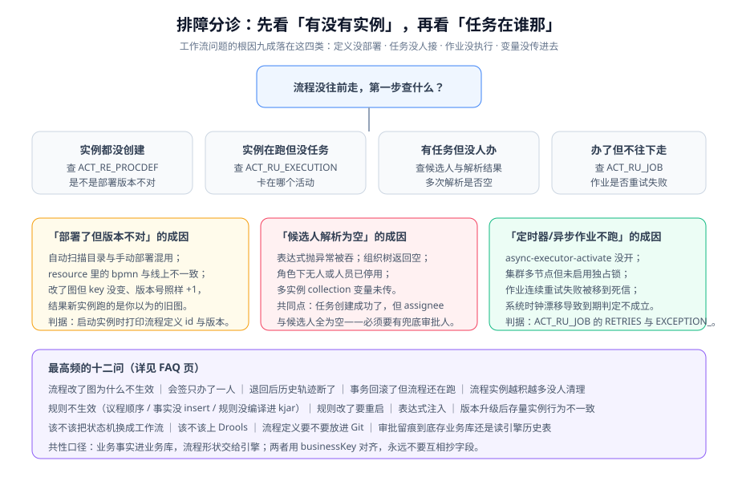

# 常见问题与最佳实践

本页按「先分诊、再解答、最后自查」的顺序组织：遇到问题先按现象定位到类别，再看对应问答；上线前对照自查清单逐条打勾。

## 排障分诊

| 现象 | 第一步看什么 | 大概率原因 |
| --- | --- | --- |
| 流程根本没启动 | `ACT_RE_PROCDEF` 有没有你的 key | 流程定义没部署 / key 写错 / 部署的版本不是你改的那份 |
| 实例创建了但不往下走 | `ACT_RU_EXECUTION.ACTIVITY_ID_` | 网关无出口 / 服务任务抛异常 / 停在等待事件上 |
| 有任务但没人能办 | `ACT_RU_TASK.ASSIGNEE_` 与候选人表 | 审批人解析结果为空；查询漏了候选人（只查了 assignee） |
| 办了但流程不动 | `ACT_RU_JOB` / `ACT_RU_TIMER_JOB` | 异步执行器未开；定时器未到期；作业连续失败 |
| 流程"假结束" | `ACT_RU_EXECUTION` 是否还有该实例 | 并行分支用了普通结束事件而非终止结束事件 |
| 规则一条都不触发 | 打开 `org.drools` debug 日志看匹配数 | 事实没 insert / 条件写错 / 规则没编译进 KieBase |
| 只触发一条（本该多条） | 规则的 `activation-group` | 同组只执行一条被误用 |

::: tip 分诊的第一原则
**区分「业务等待」与「流程卡死」**。一个停在"总监审批"三天没动的实例，如果总监确实还没批，那是业务等待，不是故障。判断方法：看 `ACT_RU_TASK` 是否有行、`CREATE_TIME_` 距今多久、以及是否有对应的待办展示。

**只有"任务存在但无人可见"或"没有任务且没有等待事件"才是真卡死。**
:::

## 高频十二问

**Q1：改了流程图，为什么线上不生效？**

默认行为是「新实例走新版本，存量实例走启动时的旧版本」。先确认三件事：流程定义确实重新部署了（`ACT_RE_PROCDEF.VERSION_` 递增）；你观察的实例是启动在新版本之后的；启动用的 key 没变（key 变了就是另一个流程）。

**Q2：会签只办了一个人就通过了？**

几乎一定是用了 `candidateUsers` / `candidateGroups`——它们的语义是「多人可办、一人办完即完成」，不是会签。会签必须用 `multiInstanceLoopCharacteristics`，并用 `nrOfInstances` 验证实例数是否等于人数。

**Q3：退回之后历史轨迹断了？**

退回被实现成了"直接改 `ACT_RU_TASK.ASSIGNEE_`"。正确做法是走流程回退（或终止实例后重新发起），让引擎记录一条新的活动轨迹。判据：`ACT_HI_ACTINST` 应当能看到"退回"这个动作产生的活动记录。

**Q4：事务回滚了，但流程还在跑？**

业务库与引擎库不在同一数据源，且不在同一事务里。两种修法：把引擎表与业务表放同库同事务（嵌入式引擎的默认优势）；或改用「本地事件表 + 异步」的最终一致方案，并给消费端做幂等。

**Q5：流程实例越积越多，能直接删吗？**

不能直接删 `ACT_RU_*` 的行——RU 与 HI 会不一致。正确做法是先定性：业务等待（正常，纳入时长监控）、任务无人认领（补兜底审批人并人工处理）、分支永不到期（修流程定义 + 终止实例）。终止实例要走引擎 API（`runtimeService.deleteProcessInstance`），并写明原因。

**Q6：审批人怎么配才不会因为离职卡死？**

流程定义里**永远不写具体人**：用角色或解析器表达式。同时每个解析方法都要有兜底分支，兜底也为空时**显式抛异常**（让流程启动失败，而不是创建一个没人能办的僵尸任务）。

**Q7：该不该把状态机换成工作流？**

看两点：参与人是否多于两个且有等待；流程走向是否经常变。都不满足就别换——状态机 + 转移矩阵 + 单元测试更简单、更快、更好测。两者可以共存：业务状态留在状态机，审批流转交给引擎。

**Q8：什么情况下才值得上 Drools？**

规则要在一次请求里反复迭代收敛，或同一批事实被几十条规则共享匹配。只是"进来一个对象、判三五个条件、返回等级"的话，策略模式 + 决策表更好维护。**规则数少于 50 条时，Rete 网络基本是纯开销。**

**Q9：规则改了要不要重启？**

取决于规则从哪来。DRL 放在 classpath 里 → 编译期进 KieBase，必须重启（或重建 KieContainer）；规则放数据库 / 配置中心 / LiteFlow Rule-DB → 可以热更。**无论哪种，都必须有版本号与回滚手段。**

**Q10：表达式引擎能直接给业务人员开放吗？**

能，但必须同时具备三样：**白名单校验 + 沙箱 + 超时**。MVEL 没有内置沙箱，面向不可信输入时应直接排除。上线前必须有一条注入用例进回归套件（尝试访问 `java.lang.Runtime`，断言被拒绝）。

**Q11：流程定义要不要放进 Git？**

要，但这只是一半。还需要：部署与服务发布解耦、发布前 diff 图、以及回滚预案（新版本有问题时怎么让新实例回到旧定义）。

**Q12：审批留痕存业务库还是读引擎历史表？**

**存业务库。** 引擎历史表结构跨版本可能变、字段命名是内部风格、查询要走引擎 API——把业务可查性绑死在引擎升级上是不可接受的。引擎历史只用于排障与耗时统计。

## 上线自查清单（12 项）

| # | 检查项 | 判据 |
| --- | --- | --- |
| 1 | 流程定义已正确部署 | `ACT_RE_PROCDEF` 中的 key 与版本符合预期 |
| 2 | 所有排他/包含网关都有默认出口 | 逐个网关核对 `default` 属性存在 |
| 3 | 审批人解析有兜底且兜底非空 | 空组织用例断言返回明确错误 |
| 4 | 会签/或签语义与需求表一致 | 需求表每行都有对应的 BPMN 实现 |
| 5 | 退回/撤销有留痕且不覆盖历史 | 留痕表条数 = 已办任务数 |
| 6 | 超时定时器按工作日口径计算 | 周五 18:00 启动，`DUEDATE_` 落在下周二 |
| 7 | 异步执行器已开启且集群有独占保护 | `ACT_RU_TIMER_JOB` 有行且只被一个节点执行 |
| 8 | 死信作业有监控告警 | `ACT_RU_DEADLETTER_JOB > 0` 触发告警 |
| 9 | 活跃实例与停留时长有监控 | 两个指标均接入面板与告警 |
| 10 | 业务状态与流程状态一致性有巡检 | 一致性 SQL 定时执行且返回 0 行 |
| 11 | 规则命中可解释 | 接口返回 `ruleId` 与 `ruleSetVersion` |
| 12 | 表达式入口有白名单+沙箱+超时 | 注入用例与死循环用例均在回归套件中 |

## 最佳实践（12 条）

1. **先判断要不要引擎**：流程固定、参与人固定、规则由开发维护的场景，用代码 + 单元测试更省心。
2. **流程定义里不写具体人**：只写角色或解析表达式，且解析必须有兜底。
3. **业务状态与流程状态分离**：业务库权威业务事实，引擎权威流程形状，用 `businessKey` 对齐。
4. **流程变量只放标量与小对象**：正文、附件、列表一律放业务库，变量里只存 id。
5. **监听器只投递事件，不写主业务逻辑**：重逻辑放事务外异步消费，并保证幂等。
6. **每个"非前进"动作都要有断言**：退回、撤销、加签、超时、并发认领，这些才是故障集中区。
7. **异步作业必须有死信告警**：默认重试策略会让故障延迟可见，不监控就等于没有。
8. **单个实例生命周期要有上限意识**：长期停留的实例要能被查出并定性。
9. **规则必须有 id、责任人、版本**：没有这三样，规则系统会退化成"藏得更深的 if-else"。
10. **规则集必须有默认规则**：条件全不命中时不能返回空值。
11. **表达式入口默认不可信**：白名单 + 沙箱 + 超时，三样缺一不可。
12. **选型记录要写下"不指望它做什么"**：这一条最容易省，也最容易在半年后被问到。

::: danger 上线前最该问自己的一句话
**「这个流程如果永远停在第 3 步，我多久能发现？」**

答不上来，就说明第 9 项（活跃实例与停留时长监控）没做好——而这是所有工作流系统线上事故的共同起点。
:::

## 术语表

| 术语 | 含义 |
| --- | --- |
| **BPMN** | Business Process Model and Notation，OMG 的流程建模标准，也是引擎的执行格式 |
| **流程定义 / 流程实例** | 定义是"模板"（带版本号），实例是"按模板跑起来的一次具体流程" |
| **令牌（Token）** | 流程虚拟机推进的抽象指针；并行网关会产生多个令牌 |
| **网关（Gateway）** | 控制流向的节点：排他（走一条）、并行（全走）、包含（条件全走）、事件（等信号） |
| **边界事件** | 挂在活动边缘的事件，分中断型（取消宿主活动）与非中断型（并行分支） |
| **多实例（Multi-instance）** | 一个活动实例化成多条：并行（会签）或顺序（顺签） |
| **会签 / 或签 / 顺签** | 全部人办 / 任一人办 / 按序办 |
| **businessKey** | 流程实例与业务对象的关联键，通常就是业务主键 |
| **作业（Job）** | 引擎的延迟或异步执行单元：异步任务、定时器；重试耗尽后进死信 |
| **死信作业** | 连续重试失败后进入 `ACT_RU_DEADLETTER_JOB` 的作业，必须告警 |
| **Rete 算法** | Drools 的规则匹配算法，通过共享节点网络实现增量求值 |
| **议程（Agenda）** | 匹配到的规则排队等待执行的地方，由 salience / group 决定顺序 |
| **事实（Fact）** | 插入到规则引擎工作内存、参与规则匹配的对象 |
| **DSL** | 领域特定语言；本页语境下指业务侧表达的规则/流程语法 |

## 参考资料

- Flowable 官方文档与 FAQ：https://www.flowable.com/open-source/docs/
- Camunda 7 流程实例迁移与运维文档：https://docs.camunda.org/manual/latest/
- Apache KIE / Drools 文档：https://kie.apache.org/docs/
- LiteFlow 官方文档：https://liteflow.cc/
- Workflow Patterns（流程模式与反模式归纳）：https://www.workflowpatterns.com/
