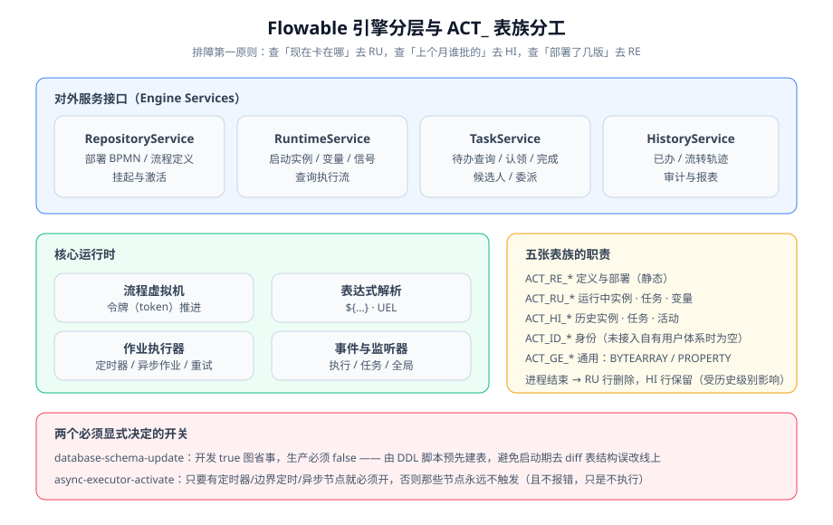

# Flowable 引擎深入

Flowable 是 Java 生态里使用最广的 BPMN 引擎之一：它把一张 BPMN 图编译成可执行的流程定义，用流程虚拟机（Process Virtual Machine）推进令牌，用关系数据库保存实例状态——因此它天然支持**长事务**（一个流程可以跨越几天甚至几个月）。本页讲它的架构、表族、API 与生产上最容易踩的坑。

## 版本选择：6.x / 7.x / 8.x 三条线

::: info 版本与维护状态（2026-10 核对）
| 版本线 | 末版 / 当前版 | 运行基线 | 状态 |
| --- | --- | --- | --- |
| **6.x** | 6.8.1（2024-02） | JDK 8+、Spring Boot 2.x、`javax.*` 命名空间 | **仅存量项目使用**：只有维护性更新，新项目不建议 |
| **7.x** | 7.2.0（2025-08-21，7.x 末版） | JDK 17+、Spring Boot 3.x、**Jakarta 命名空间** | 稳定，资料最多；本页主口径 |
| **8.x** | 8.0.0（2026-02-27） | Spring Framework 7 / Spring Boot 4、Jackson 3、JDK 17+ | 引擎 API 与 7.x 基本兼容，主要差异在依赖基线（坐标与 Boot 版本矩阵以官方发布说明为准） |

7.0 起开源发行版的三个重要变化：① 命名空间从 `javax.*` 切到 `jakarta.*`（与 Spring Boot 3 对齐）；② **不再随发行版提供 Modeler / Task / Admin / IDM 等 Web 应用**，身份数据要接入自有用户体系；③ 移除异步历史写入，历史数据一律随业务事务同步落库（更简单，也更吃事务开销）。
:::

::: warning 6.x 与 7.x 不能混装
`javax.servlet` 与 `jakarta.servlet` 不兼容。把 Flowable 6.x 塞进 Spring Boot 3 项目，启动阶段就会 `ClassNotFoundException` / `NoSuchMethodError`。反过来说，**还在 JDK 8 + Spring Boot 2.7 的项目，也只能停在 6.x**——升级路径是先把 Boot 升到 3.x，再换 Flowable 7/8，两件事不要一起做。
:::

## 依赖与最小配置

```xml [pom.xml]
<!-- 完整发行版：含 BPMN/CMMN/DMN/Form/Event Registry，适合绝大多数项目 -->
<dependency>
  <groupId>org.flowable</groupId>
  <artifactId>flowable-spring-boot-starter</artifactId>
  <version>7.2.0</version>
</dependency>

<!-- 只要 BPMN 流程引擎时可用精简版，依赖体积更小 -->
<!-- <artifactId>flowable-spring-boot-starter-process</artifactId> -->
```

```yaml [src/main/resources/application.yml]
spring:
  datasource:
    # 注意：MySQL 必须加 nullCatalogMeansCurrent=true
    url: jdbc:mysql://127.0.0.1:3306/flowable_demo?useSSL=false&serverTimezone=Asia/Shanghai&nullCatalogMeansCurrent=true
    username: root
    password: root

flowable:
  database-schema-update: true        # 开发期 true 自动建表；生产必须 false，用 DDL 脚本预先建
  async-executor-activate: true       # 只要有定时器 / 边界定时 / 异步节点就必须开
  history-level: audit                # none / activity / audit / full
  # process-definition-location-prefix 默认 classpath*:/processes/
  # check-process-definitions 默认 true：启动时自动扫描并部署 bpmn 文件
```

::: danger 三个必须记住的配置项
1. **`nullCatalogMeansCurrent=true` 不能漏**：MySQL 驱动做"表是否存在"检查时会扫描整个实例下的同名库，Flowable 误判表结构已变更 → 启动时执行 ALTER → 报"字段已存在"。这是 Flowable + MySQL 最高频的启动失败原因。
2. **`database-schema-update` 生产必须 `false`**：生产环境让引擎在每次启动时 diff 表结构，等于让它在线上改表。生产应把建表 DDL 纳入数据库迁移脚本，与应用发布解耦。
3. **`async-executor-activate` 为 false 时，定时器节点"不报错也不执行"**——没有异常、没有日志，流程就静静停在那里。流程里只要有边界定时或定时捕获事件，这个开关必须是 `true`。
:::

## 架构分层与 ACT_ 表族



引擎对外只暴露一组服务接口，全部通过 `ProcessEngine` 获取：

| 服务 | 职责 | 最常用方法 |
| --- | --- | --- |
| `RepositoryService` | 流程定义的部署、查询、挂起 | `createDeployment()`、`createProcessDefinitionQuery()` |
| `RuntimeService` | 启动实例、管理变量、发信号 | `startProcessInstanceByKey()`、`setVariable()`、`trigger()` |
| `TaskService` | 待办查询、认领、完成、委派 | `createTaskQuery()`、`claim()`、`complete()` |
| `HistoryService` | 历史实例/活动/任务查询 | `createHistoricProcessInstanceQuery()` |
| `ManagementService` | 作业管理、表结构、引擎属性 | `createJobQuery()`、`executeJob()` |
| `DynamicBpmnService` | 运行期微调流程定义属性 | 慎用，见下文"流程版本" |

表族按前缀分工，排障时按前缀定位是最快的路径：

| 前缀 | 含义 | 排障用途 |
| --- | --- | --- |
| `ACT_RE_*` | 仓库（静态定义） | 「我部署的流程是第几版」→ `ACT_RE_PROCDEF.VERSION_` |
| `ACT_RU_*` | 运行时 | 「现在卡在哪」→ `ACT_RU_EXECUTION.ACTIVITY_ID_`、`ACT_RU_TASK` |
| `ACT_HI_*` | 历史 | 「上个月那单谁批的」→ `ACT_HI_TASKINST`、`ACT_HI_ACTINST` |
| `ACT_ID_*` | 身份 | 未接入 `IdentityService` 时为空；实际项目通常不用它 |
| `ACT_GE_*` | 通用 | `ACT_GE_BYTEARRAY` 存 BPMN XML 与流程图；`ACT_GE_PROPERTY` 存引擎内部属性 |

```sql
-- 一条 SQL 同时回答「实例停在哪、卡在谁的待办上」
SELECT e.PROC_INST_ID_, e.PROC_DEF_ID_, e.ACTIVITY_ID_, t.NAME_, t.ASSIGNEE_, t.CREATE_TIME_
FROM ACT_RU_EXECUTION e
LEFT JOIN ACT_RU_TASK t ON t.PROC_INST_ID_ = e.PROC_INST_ID_
WHERE e.PROC_INST_ID_ = '流程实例ID';
-- 期望：能看到当前活动节点；若 ACTIVITY_ID_ 是一个用户任务节点而 ASSIGNEE_ 为空，即为「任务无人认领」
```

## 核心 API 与三个作用域

```java [src/main/java/com/example/flow/LeaveService.java]
@Service
public class LeaveService {

    private final RuntimeService runtimeService;
    private final TaskService taskService;

    public LeaveService(RuntimeService runtimeService, TaskService taskService) {
        this.runtimeService = runtimeService;
        this.taskService = taskService;
    }

    /** 启动流程：businessKey 用业务主键，把它当成引擎与业务库之间的唯一桥梁 */
    public String submit(Long leaveId, String applicant, int days) {
        Map<String, Object> vars = new HashMap<>();
        vars.put("applicant", applicant);
        vars.put("days", days);
        return runtimeService.startProcessInstanceByKey("leave", String.valueOf(leaveId), vars).getId();
    }

    /** 我的待办：候选人任务与指派任务要一起查，否则会漏 */
    public List<Task> myTodo(String userId, int page, int size) {
        return taskService.createTaskQuery()
                .taskCandidateOrAssigned(userId)          // 关键：候选 + 指派
                .includeProcessVariables()                // 需要列表展示变量时一次查出来
                .orderByTaskCreateTime().desc()
                .listPage(page, size);
    }

    /** 认领 + 完成：认领是并发安全的唯一入口，不要自己用 update 改 assignee */
    public void approve(String taskId, String userId, boolean pass, String comment) {
        Task task = taskService.createTaskQuery().taskId(taskId).singleResult();
        if (task == null) {
            throw new IllegalStateException("任务不存在或已被处理");
        }
        if (task.getAssignee() == null) {
            taskService.claim(taskId, userId);           // 并发认领：只有一个线程成功
        } else if (!userId.equals(task.getAssignee())) {
            throw new IllegalStateException("任务已被 " + task.getAssignee() + " 认领");
        }
        taskService.complete(taskId, Map.of("pass", pass, "comment", comment));
    }
}
```

**变量作用域**是 Flowable 里最容易出错的机制：

| 作用域 | 写入方式 | 可见范围 | 生命周期 |
| --- | --- | --- | --- |
| 流程实例级（全局） | `runtimeService.setVariable()` / 启动时传 vars | 该实例所有执行流可见 | 随实例，实例结束即消失（历史级别够高才留痕） |
| 执行流局部 | `runtimeService.setVariableLocal(executionId, ...)` | 仅该执行流及其子执行流 | 同上；并行分支里可隔离同名变量 |
| 任务局部 | `taskService.setVariableLocal(taskId, ...)` | 仅该任务 | **任务完成即删除**（这是它与前两者的根本差别） |
| 瞬态变量 | `transientVariables` / `setVariableTransient()` | 同作用域但不落库 | 只在内存中，**不适合跨等待节点传递** |

::: danger 三个变量相关的经典故障
1. **并行分支用全局变量互相覆盖**：并行了两条分支，都写 `result`，后写的覆盖先写的。修法：用 `setVariableLocal` 或在变量名里带分支标识。
2. **任务局部变量当全局用**：任务完成后再读，返回 `null`，因为任务局部变量已随任务删除。
3. **瞬态变量跨等待传递**：定时器节点等 24 小时后需要这个变量，但它根本没落库，读到 `null`。凡是要"跨等待"的数据，必须是持久化变量。
:::

## 表达式、委托与监听器

```java [src/main/java/com/example/flow/LeaveDelegate.java]
/** JavaDelegate：服务任务的强类型实现，比脚本更易测试与重构 */
@Component("leaveDelegate")
public class LeaveDelegate implements JavaDelegate {
    @Override
    public void execute(DelegateExecution execution) {
        Long leaveId = Long.valueOf(execution.getProcessInstanceBusinessKey());
        int days = (int) execution.getVariable("days");
        // 真实业务逻辑：更新业务库、调用外部系统……
        execution.setVariable("leaveId", leaveId);
        execution.setVariable("syncedAt", Instant.now().toString());
    }
}
```

```xml [processes/leave.bpmn20.xml]
<serviceTask id="syncHr" name="同步 HR 系统"
             flowable:delegateExpression="${leaveDelegate}" />

<!-- 监听器：事件 = 在关键时刻插一段代码，不要用它承载主业务逻辑 -->
<userTask id="taskDirector" name="总监审批" flowable:assignee="${approverResolver.directorOf(applicant)}">
  <extensionElements>
    <flowable:taskListener event="create" delegateExpression="${notifyListener}" />
    <flowable:taskListener event="complete" delegateExpression="${auditListener}" />
  </extensionElements>
</userTask>

<!-- 执行监听器：流程开始、活动开始/结束、流程结束 -->
<extensionElements>
  <flowable:executionListener event="end" delegateExpression="${statListener}" />
</extensionElements>
```

| 机制 | 适用 | 注意 |
| --- | --- | --- |
| `delegateExpression` 引用 Spring Bean | 首选：可注入依赖、可单元测试 | Bean 名与表达式一致 |
| `flowable:class` 指定类名 | 简单场景 | 不走 Spring 容器，无法注入 |
| `flowable:expression` 直接写表达式 | 一行赋值 | 逻辑一多变不可维护 |
| 脚本任务（Groovy/JS） | 频繁调整的轻量逻辑 | 需要额外脚本引擎依赖；生产慎用 |

::: tip 监听器里不要写主业务逻辑
监听器执行在引擎事务内，抛异常会回滚流程推进；写得太重会让"完成任务"变成一个动辄几百毫秒的操作。**推荐做法：监听器只做"投递事件"（写本地事件表），真正的业务处理放到事务外异步消费。**
:::

## 异步作业：定时器与重试

| 作业类型 | 表 | 说明 |
| --- | --- | --- |
| 异步作业（async job） | `ACT_RU_JOB` | `flowable:async="true"` 或异步延续触发 |
| 定时器作业 | `ACT_RU_TIMER_JOB` | 定时器到期时间 `DUEDATE_` |
| 挂起作业 | `ACT_RU_SUSPENDED_JOB` | 实例被挂起时转入 |
| 死信作业 | `ACT_RU_DEADLETTER_JOB` | **连续重试失败后的归宿——这里才是真正需要告警的地方** |

```sql
-- 生产必看的三个查询
SELECT ID_, TYPE_, RETRIES_, DUEDATE_, EXCEPTION_MSG_ FROM ACT_RU_JOB WHERE RETRIES_ <= 1;
-- 期望：为空。非空说明有作业即将放弃重试
SELECT ID_, TYPE_, RETRIES_, EXCEPTION_MSG_ FROM ACT_RU_DEADLETTER_JOB;
-- 期望：为空或极少。持续增长说明某个服务任务在稳定失败
SELECT ID_, PROC_DEF_ID_, START_TIME_ FROM ACT_HI_PROCINST WHERE END_TIME_ IS NULL AND START_TIME_ < DATE_SUB(NOW(), INTERVAL 30 DAY);
-- 期望：为空。非空即为「僵尸实例」，需要逐个定性：业务确实等待中，还是流程卡死
```

::: danger 默认重试策略会掩盖故障
引擎对失败作业默认重试若干次、间隔递增；重试耗尽后才进死信。这意味着**故障从发生到可见有一段延迟**。生产上必须对 `ACT_RU_DEADLETTER_JOB` 的数量和 `RETRIES_` 的分布加监控告警，否则一个稳定失败的调用会安静地攒上几百个死信。
:::

## 历史级别：拿存储换可查性

| 级别 | 记录内容 | 适用 |
| --- | --- | --- |
| `none` | 不记录历史（仅保留运行中） | 纯流程驱动、不需要任何追溯的场景；**审计场景绝不能用** |
| `activity` | 实例 + 活动轨迹 | 需要"流程走到哪、走过哪些节点" |
| `audit`（推荐） | 再加上任务（谁办、何时办、用了多久） | 绝大多数业务系统 |
| `full` | 再再加上变量快照 | 需要回放当时数据；**存储增长最快** |

**验证方式**：改历史级别后跑一遍完整实例，然后查 `ACT_HI_TASKINST` 是否记录了办理人与结束时间：

```sql
SELECT PROC_INST_ID_, TASK_DEF_KEY_, ASSIGNEE_, START_TIME_, END_TIME_, DURATION_
FROM ACT_HI_TASKINST WHERE PROC_INST_ID_ = '流程实例ID' ORDER BY START_TIME_;
-- 期望：每个用户任务一行，ASSIGNEE_ 与 DURATION_ 齐全（audit 级别）
```

## 常见问题

| 现象 | 大概率原因 | 定位起点 |
| --- | --- | --- |
| 启动报 `already exists` / `duplicate column` | MySQL 连接串缺 `nullCatalogMeansCurrent=true` | 查错误里的表名与 DDL 语句 |
| 定时器节点不触发 | `async-executor-activate=false` | 查 `ACT_RU_TIMER_JOB` 是否有行 |
| 待办列表查不到候选人任务 | 查询只用了 `taskAssignee`，漏了候选 | 改用 `taskCandidateOrAssigned` |
| 流程定义改了不生效 | 新实例走新版本、存量实例走旧版本（默认行为） | 查 `ACT_RE_PROCDEF.VERSION_` 与实例的 `PROC_DEF_ID_` |
| 流程实例越积越多 | 定时器分支永远等待 / 任务无人认领 / 死信未处理 | 上面"僵尸实例"SQL |

## 验证方式

```shell
# ① 启动应用后确认表已建好
mysql -uroot -p -e "select count(*) from information_schema.tables \
  where table_schema='flowable_demo' and table_name like 'ACT\_%';"
# 期望：60 左右（Flowable 7.x 完整发行版的 ACT_ 表数量）

# ② 跑通一个完整实例（本地 profile、内存库，无需 MySQL）
curl -s -X POST 'http://localhost:8080/api/v1/leaves' -H 'Content-Type: application/json' \
  -d '{"days":5,"reason":"trip"}'
# 期望：201/200，返回实例 id

# ③ 查待办、办结、再查历史
curl -s 'http://localhost:8080/api/v1/tasks?assignee=director'
curl -s -X POST 'http://localhost:8080/api/v1/tasks/{taskId}/complete' \
  -H 'Content-Type: application/json' -d '{"pass":true,"comment":"同意"}'
curl -s 'http://localhost:8080/api/v1/leaves/{leaveId}/trace'
# 期望：trace 返回从发起到结束的完整节点序列，且与 ACT_HI_ACTINST 一致
```

## 参考资料

- Flowable 官方文档（含 BPMN 用户指南与 Spring Boot 集成）：https://www.flowable.com/open-source/docs/
- Flowable 开源版下载与版本说明：https://www.flowable.com/open-source/downloads
- Flowable GitHub（Issue 与发布记录）：https://github.com/flowable/flowable-engine
- Camunda 7 支持公告（版本维护截止日期对照参考）：https://docs.camunda.org/enterprise/announcement/
