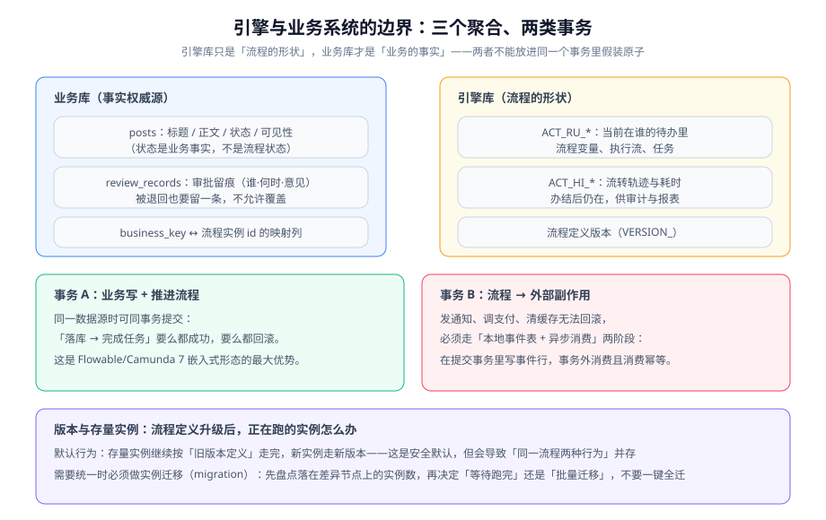

# 与业务系统集成

引擎跑起来不难，难的是让它与业务系统**长期共处**：业务库和引擎库谁是权威、事务边界划在哪里、流程定义升级后存量实例怎么办、出了问题怎么定位。这一页讲的都是集成期才会暴露的问题。



## 状态机还是工作流：先划清这条线

很多团队引入引擎的真实痛点，是原本用状态机实现的 `status` 字段撑不住了。但**状态机不是被替代，而是被分工**：

| 维度 | 状态机（业务状态） | 工作流（审批流转） |
| --- | --- | --- |
| 权威源 | 业务库（`posts.status`） | 引擎库（`ACT_RU_*` / `ACT_HI_*`） |
| 关心什么 | 这个业务对象的生命周期阶段 | 这一步该谁办、办到哪了 |
| 粒度 | 少量、稳定（DRAFT / PUBLISHED / OFFLINE / DELETED） | 多而细（初审 / 复审 / 发布确认） |
| 谁改它 | 业务动作（提交、发布、下线） | 引擎推进（完成任务、触发定时器） |
| 变更成本 | 改状态要改代码 + 回归全部转移路径 | 改流程只要发布新版本定义 |

::: tip 两者的交界只有一句话
**业务状态由业务动作改变，审批流转触发业务动作。** 审批全部通过 → 引擎调用一个业务服务 → 该服务执行"发布"这个领域动作 → 业务状态变成 `PUBLISHED`。

反过来（审批通过 → 引擎直接 update `posts.status`）就把业务规则搬进了流程监听器，从此业务状态变更有了两个入口，迟早会不一致。
:::

::: danger 不要把「审核中」当成流程状态
`reviewing` 是**业务状态**（业务库里的一个枚举值），不是流程状态。理由：业务查询、列表筛选、报表都需要 `WHERE status = 'reviewing'`，而流程状态要读引擎库才能知道、且跨版本会变。

正确做法：业务表存 `status`，另存 `instance_id`（可空）；`status='reviewing'` 时能通过 `instance_id` 反查流程走到哪一步。
:::

## businessKey 与字段归属

```sql
-- 业务表：只加"指向流程"的最小信息，不复制流程字段
ALTER TABLE posts
  ADD COLUMN review_status VARCHAR(16) NOT NULL DEFAULT 'NONE',  -- NONE/REVIEWING/PASSED/REJECTED
  ADD COLUMN review_instance_id VARCHAR(64) NULL,                -- 流程实例 id（businessKey 的反向索引）
  ADD COLUMN review_submitted_at DATETIME NULL;

CREATE UNIQUE INDEX uk_posts_review_instance ON posts (review_instance_id);
```

```java [src/main/java/com/example/blog/review/ReviewGateway.java]
@Service
public class ReviewGateway {

    /** businessKey 用业务主键：既方便反查，也天然实现"同一单据只有一个活跃实例" */
    public ReviewStartResult submit(Post post) {
        if (post.getReviewStatus() == ReviewStatus.REVIEWING) {
            throw new ConflictException("该稿件已在审核中");        // 幂等：重复提交返回 409
        }
        Map<String, Object> vars = Map.of(
                "postId", post.getId(),
                "authorId", post.getAuthorId(),
                "riskLevel", riskService.evaluate(post)          // 规则引擎的结论进流程变量
        );
        ProcessInstance pi = runtimeService.startProcessInstanceByKey(
                "article-review", String.valueOf(post.getId()), vars);
        post.markReviewing(pi.getId());
        postRepository.save(post);
        return new ReviewStartResult(pi.getId());
    }
}
```

| 数据 | 放哪 | 理由 |
| --- | --- | --- |
| 业务状态、可见性、作者 | **业务库** | 业务查询的必备字段 |
| 流程实例 id（可空） | **业务库** | 反向索引，避免每次都去引擎库反查 |
| 审批级别、风险等级等"这次流程的参数" | **流程变量** | 只对本次流转有意义，不需要业务查询 |
| 审批动作留痕（谁/何时/意见） | **业务库** | 报表与导出要用，见 [审批流设计](../ApprovalFlow/index.md) |
| 当前节点、节点耗时 | 引擎库（读 `ACT_HI_*`） | 流程的形状由引擎权威 |

::: warning 把大对象塞进流程变量的代价
流程变量会被序列化进 `ACT_RU_VARIABLE` / `ACT_HI_VARINST`，且**audit/full 历史级别下每次写入都会留痕**。把一个 200KB 的正文 HTML 塞进变量，会让引擎库的表膨胀数倍，并显著拖慢流转。

**纪律：流程变量只放"标量 + 小对象"（id、枚举、数值、短字符串）；正文、附件、列表一律放业务库，变量里只存 id。**
:::

## 两类事务：能同库的别拆，拆了的必须补偿

### 事务 A：业务写 + 推进流程（同库同事务）

```java
/** 前提：引擎表与业务表在同一个数据源。嵌入式引擎形态下这是默认能力，也是它最大的优势 */
@Transactional
public void approveAndPublish(Long postId, String taskId, boolean pass, String comment) {
    // ① 业务动作：写留痕 + 改业务状态
    postService.applyReviewDecision(postId, pass, comment);
    // ② 引擎动作：完成任务 —— 两步在同一事务，任一失败整体回滚
    taskService.complete(taskId, Map.of("pass", pass, "comment", comment));
}
```

### 事务 B：流程 → 外部副作用（不能同事务，必须最终一致）

发通知、调支付、清 CDN 缓存这类动作**无法回滚**，绝不能塞进引擎事务里。

```java
/** 在提交事务内只写"事件行"，真正的副作用在事务外异步消费 */
@Transactional
public void approveAndPublish(Long postId, String taskId, boolean pass, String comment) {
    postService.applyReviewDecision(postId, pass, comment);
    taskService.complete(taskId, Map.of("pass", pass, "comment", comment));

    // 副作用只落一行事件，不在这里发通知
    outboxEventRepository.save(new OutboxEvent("PostReviewDecided",
            Map.of("postId", postId, "pass", pass), postId + ":" + taskId));  // 幂等键
}
```

```java [src/main/java/com/example/blog/review/ReviewEventConsumer.java]
/** 消费者必须幂等：同一个事件重复消费不能产生第二个副作用 */
@Component
public class ReviewEventConsumer {

    @Transactional
    public void on(OutboxEvent event, String messageId) {
        if (processedRepository.existsById(messageId)) {
            log.info("事件已处理，跳过：{}", messageId);
            return;
        }
        if ("PostReviewDecided".equals(event.getType())) {
            notifyService.notifyAuthor((Long) event.getPayload().get("postId"),
                    (Boolean) event.getPayload().get("pass"));
            cacheService.evictPost((Long) event.getPayload().get("postId"));
        }
        processedRepository.mark(messageId);     // 与副作用在同一事务
    }
}
```

::: danger 「补偿」不是「重试」
跨库不一致只能靠补偿，而补偿的前提是**业务动作本身可幂等重放或可反向撤销**：

- **可重放**（幂等）：`evictPost`、`markPublished` —— 重复执行结果一致，直接重试即可。
- **需反向**（不可重放）：已经发给用户的通知、已经扣掉的库存 —— 必须设计反向动作（撤回通知 / 恢复库存），而不是"再发一次"。

**做不到这两点的动作，一开始就不应该放进异步链路**。判断方法：问「这个动作跑两次会发生什么」——答不出来就别异步。
:::

## 流程版本与存量实例

流程定义每次部署都会生成新版本（`VERSION_` 递增），但**默认行为是：已启动的实例继续按启动时的版本定义跑完**。

| 场景 | 默认行为 | 需要人工干预的条件 |
| --- | --- | --- |
| 只加了新节点，存量实例不受影响 | 无需干预 | —— |
| 删了/重命名了存量实例正在等待的节点 | 存量实例卡死 | 必须做实例迁移（migration） |
| 改了网关条件 | 存量实例仍按旧逻辑分支 | 若业务要求统一口径，需迁移 |
| 只改了表单/文案 | 无需干预 | —— |

**迁移的标准动作**：

1. **盘点**：查出所有落在差异节点上的实例数（按 `PROC_DEF_ID_` + `ACTIVITY_ID_` 分组统计）。
2. **决策**：等待跑完 / 强制迁移 / 人工干预。**不要一键全迁**。
3. **先在影子环境演练**：用一份生产数据快照跑一遍迁移。
4. **留痕**：迁移动作本身要记录（谁、何时、迁了多少个实例、从哪个版本到哪个版本）。

```sql
-- 盘点：存量实例分布（迁移前必做）
SELECT PROC_DEF_ID_, ACTIVITY_ID_, COUNT(*) AS cnt
FROM ACT_RU_EXECUTION
WHERE IS_ACTIVE_ = 1 AND PROC_INST_ID_ IS NOT NULL
GROUP BY PROC_DEF_ID_, ACTIVITY_ID_
ORDER BY cnt DESC;
-- 期望：能看清每个版本的实例当前停在哪些节点；迁移前必须逐条确认这些节点在新版本里是否还存在
```

::: warning 「流程定义放 Git」是对的方向，但不够
把 BPMN 文件放进 Git 只解决了"变更可追溯"。还需要：**流程定义的部署与服务发布解耦**（不要每次发版都重新部署一遍未变化的定义）、**发布前 diff 图**（节点增删一目了然）、**回滚预案**（新版本有问题时，怎么让新实例回到旧版本）。

`DynamicBpmnService` 支持运行期微调流程定义，但它改的是"定义"，对存量实例的影响需要单独评估——不建议作为常规手段。
:::

## 可观测：四个必看指标

| 指标 | 口径 | 异常含义 |
| --- | --- | --- |
| 活跃实例数 | `count(ACT_RU_EXECUTION where IS_ACTIVE_=1)` | 持续单调增长 → 有分支永远等待，或任务无人认领 |
| 停留时长 P95 | 按 `ACT_RU_TASK.CREATE_TIME_` 算 | 不断上升 → 某个审批环节成为瓶颈 |
| 死信作业数 | `count(ACT_RU_DEADLETTER_JOB)` | > 0 且增长 → 有服务任务稳定失败（**最容易漏掉的告警**） |
| 实例完成率 | 完成数 / 启动数（按天） | 下降 → 流程有分支走不通 |

```sql
-- 四个指标一条 SQL 全打出来（接到监控里即可）
SELECT
  (SELECT COUNT(*) FROM ACT_RU_EXECUTION WHERE IS_ACTIVE_ = 1)                    AS active_instances,
  (SELECT COUNT(*) FROM ACT_RU_DEADLETTER_JOB)                                    AS deadletter_jobs,
  (SELECT MAX(TIMESTAMPDIFF(HOUR, CREATE_TIME_, NOW())) FROM ACT_RU_TASK)          AS oldest_pending_hours,
  (SELECT COUNT(*) FROM ACT_HI_PROCINST WHERE END_TIME_ IS NOT NULL
     AND DATE(END_TIME_) = CURDATE())                                             AS finished_today;
-- 期望：deadletter_jobs = 0；oldest_pending_hours 处于业务可接受范围（如 < 72）
```

## 灰度与回滚

| 阶段 | 做法 | 判据 |
| --- | --- | --- |
| 影子期 | 新流程只记录不生效（走老链路，同时跑一遍新链路记录差异） | 差异率为 0 或逐条解释清楚 |
| 灰度 | 按比例（如 5% 的业务对象）走新流程 | 完成率不低于老链路，死信为 0 |
| 全量 | 全量切新流程 | 上述指标持续达标 |
| 回滚 | 新定义保持可用，但把流量切回旧 key / 旧版本 | 存量实例不被强迁，跑完为止 |

## 验证方式

```shell
# ① 同一事务：业务写失败时流程不得推进
curl -s -X POST 'http://localhost:8080/api/v1/reviews/1/complete' \
  -H 'Content-Type: application/json' -d '{"pass":true,"comment":"ok","simulateBizFailure":true}'
# 期望：500；随后查 ACT_RU_TASK 该任务仍在（未被完成）

# ② 幂等消费：同一条事件投递两次，只产生一次副作用
curl -s -X POST 'http://localhost:8080/api/v1/test/redeliver-event' -d '{"messageId":"m-1"}'
curl -s -X POST 'http://localhost:8080/api/v1/test/redeliver-event' -d '{"messageId":"m-1"}'
# 期望：第二次返回"已处理，跳过"，且通知条数仍为 1

# ③ 重复提交：同一 postId 只能有一个活跃实例
curl -s -X POST 'http://localhost:8080/api/v1/submissions' -d '{"postId":1}'
curl -s -X POST 'http://localhost:8080/api/v1/submissions' -d '{"postId":1}'
# 期望：第二次 409；且 ACT_RU_EXECUTION 中 businessKey=1 的行数仍为 1
```

```sql
-- ④ 事务边界核对：业务状态与流程状态必须一致（不允许"已发布但流程还在跑"）
SELECT p.id, p.review_status, e.PROC_INST_ID_
FROM posts p
LEFT JOIN ACT_RU_EXECUTION e ON e.BUSINESS_KEY_ = CAST(p.id AS CHAR) AND e.IS_ACTIVE_ = 1
WHERE p.review_status = 'PASSED' AND e.PROC_INST_ID_ IS NOT NULL;
-- 期望：0 行（已发布就不该再有活跃实例）
```

## 参考资料

- Flowable 事务与 Spring 集成说明：https://www.flowable.com/open-source/docs/
- Camunda 7 流程实例迁移文档（迁移能力的参考实现）：https://docs.camunda.org/manual/latest/user-guide/process-engine/process-instance-migration/
- 本地消息表与 Outbox 模式（microservices.io）：https://microservices.io/patterns/data/transactional-outbox.html
- Workflow Patterns（同步与取消模式的语义参考）：https://www.workflowpatterns.com/patterns/control/
