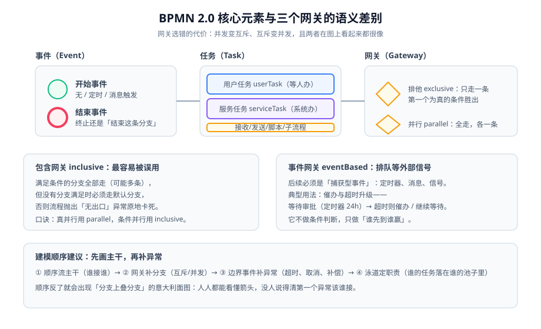

# BPMN 2.0 建模

BPMN 2.0（Business Process Model and Notation）是 OMG 维护的流程建模标准，也是主流工作流引擎（Flowable、Camunda、jBPM）的**执行格式**——它不只是画给业务看的图，`XML` 里的每个元素都会被引擎真实执行。这意味着**建模错误不是文档问题，是线上故障**。

## 四种基础构件

| 构件 | 作用 | 关键点 |
| --- | --- | --- |
| **流对象** | 事件（Event）、活动（Activity）、网关（Gateway） | 流程的"名词"，构成图的节点 |
| **连接对象** | 顺序流（Sequence Flow）、消息流（Message Flow）、关联（Association） | 顺序流在同一池内推进令牌；消息流只表达通信，不推进令牌 |
| **泳道** | 池（Pool）、道（Lane） | 表达职责归属；**跨池不加消息流是建模错误** |
| **制品** | 注释、组 | 纯文档用途，不影响执行 |

::: warning 顺序流 vs 消息流，最容易搞混的一对
- **顺序流**（实线箭头）：在同一个池内传递**令牌（token）**，流程会往前走。
- **消息流**（虚线箭头）：在池与池之间传递**消息**，接收方要有对应的捕获事件才会被触发，否则消息到了也没人接。

把消息流当顺序流用，图看上去通顺，实际执行时流程永远停在原地——因为根本没人推进令牌。
:::

## 事件：用什么触发、在哪里等



| 事件类型 | 符号 | 执行语义 | 典型用法 |
| --- | --- | --- | --- |
| 开始事件 | 细圆圈 | 流程入口，可带触发（无/定时/消息） | 用户提交、定时批处理、外部回调 |
| 结束事件 | 粗圆圈 | 结束**当前这条分支** | 分支正常收束 |
| 终止结束事件 | 实心粗圆 | 结束**整个流程实例**（含其他并行分支） | 撤回、一票否决后整体终止 |
| 中间捕获事件 | 双圆 | 停下等某个信号（消息/定时/信号） | 等待外部系统回调 |
| 中间抛出事件 | 双圆实心 | 发出信号（消息/信号/补偿） | 通知下游、触发补偿 |
| 边界事件 | 贴在活动边缘 | 宿主活动执行期间监听 | 超时取消任务、异常中止任务 |
| 事件子流程 | 虚线框 | 事件触发时才启动 | 全局异常兜底 |

::: danger 结束事件用错会导致并行分支"假结束"
并行网关分出三条分支，其中一条走到**普通结束事件**——这条分支结束，但**另外两条还在跑，流程实例没有结束**。如果你想要的是"任一条走完就整体结束"，必须用**终止结束事件**。

验证方法：并行分支跑完后查 `ACT_RU_EXECUTION`，应当查不到该流程实例的任何执行流；如果还查得到，说明你用了普通结束事件。
:::

## 三个网关的语义差别

这是 BPMN 建模里错误率最高的地方。

| 网关 | 语义 | 出口判定 | 常见误用 |
| --- | --- | --- | --- |
| **排他网关**（XOR） | 只走**一条**分支 | 按顺序评估条件，**第一个为真**的胜出 | 忘记配默认分支 → 全不满足时抛异常 |
| **并行网关**（AND） | **全部**分支各走一条 | 无条件，全部触发 | 当成"或"用（想并发却全走） |
| **包含网关**（OR） | 满足条件的**全部**走（可能多条） | 逐条评估条件，真则触发 | 忘记默认分支 → 无出口异常卡死 |
| **事件网关** | 后续必须是捕获事件，**谁先到谁赢** | 不做条件判断 | 后面接了任务 → 建模非法 |

```xml [processes/leave.bpmn20.xml]
<!-- 排他网关：请假天数决定审批层级，必须有默认分支兜底 -->
<exclusiveGateway id="gwDays" default="flowToManager" />
<sequenceFlow id="flowToDirector" sourceRef="gwDays" targetRef="taskDirector">
  <conditionExpression xsi:type="tFormalExpression"><![CDATA[${days > 3}]]></conditionExpression>
</sequenceFlow>
<sequenceFlow id="flowToManager" sourceRef="gwDays" targetRef="taskManager" />

<!-- 包含网关：满足条件的分支全部触发（如"抄送"可以同时给多个人），同样必须有默认出口 -->
<inclusiveGateway id="gwNotify" default="flowDone" />
<sequenceFlow id="flowToHr" sourceRef="gwNotify" targetRef="taskHr">
  <conditionExpression xsi:type="tFormalExpression"><![CDATA[${needHrNotify}]]></conditionExpression>
</sequenceFlow>
<sequenceFlow id="flowToIt" sourceRef="gwNotify" targetRef="taskIt">
  <conditionExpression xsi:type="tFormalExpression"><![CDATA[${needItNotify}]]></conditionExpression>
</sequenceFlow>
<sequenceFlow id="flowDone" sourceRef="gwNotify" targetRef="endEvent" />
```

::: tip 口诀
**真并发用 parallel，条件并发用 inclusive，条件互斥用 exclusive，等外部信号用 eventBased。** 只要用了 inclusive，就必须配默认出口——这是唯一的强制要求，也是唯一被忘记的要求。
:::

## 用户任务的两个维度：谁来做 + 谁能做

```xml [processes/leave.bpmn20.xml]
<!-- 单人任务：直接指定办理人（推荐用表达式，不写死人名） -->
<userTask id="taskDirector" name="总监审批"
          flowable:assignee="${approverResolver.directorOf(initiator)}" />

<!-- 候选组任务：一组人里任一人认领并办理（"或签"的最简形态） -->
<userTask id="taskReview" name="内容复审"
          flowable:candidateGroups="content-reviewer" />

<!-- 多实例会签：每个人都要办一遍；completionCondition 决定何时提前结束 -->
<userTask id="taskCountersign" name="会签"
          flowable:assignee="${assignee}">
  <multiInstanceLoopCharacteristics isSequential="false"
        flowable:collection="${reviewers}" flowable:elementVariable="assignee">
    <completionCondition><![CDATA[${nrOfCompletedInstances >= 2}]]></completionCondition>
  </multiInstanceLoopCharacteristics>
</userTask>
```

| 写法 | 语义 | 用错后的症状 |
| --- | --- | --- |
| `assignee` = 单人 | 指定唯一办理人 | 该人离职 → 任务永久卡死 |
| `candidateUsers` / `candidateGroups` | 多人可办，**一人办完即完成** | 想会签却用了它 → 只办一人就算通过 |
| `multiInstance` + `collection` | 每人一条任务，全部完成才通过 | 想"或签"却用了它 → 要等所有人办完 |

## 边界事件与子流程：异常路径的正确落点

| 需求 | 正确建模 | 错误建模 |
| --- | --- | --- |
| 审批超时 24 小时自动升级 | 用户任务上挂**边界定时事件** → 升级任务 | 在监听器里起一个定时线程（应用重启即丢） |
| 审批超时只催办、不升级 | 边界定时事件（非中断）→ 通知，任务继续等待 | 中断型边界事件（会把任务取消掉） |
| 一段逻辑要能复用 | 调用活动（Call Activity）引用另一个流程 | 复制粘贴同一张子图，改一处漏三处 |
| 局部事务要能回滚 | 事务子流程 + 补偿事件 | 靠业务代码 try/catch（引擎侧不知情） |

::: danger 中断与非中断边界事件，差一个属性差一个业务
`cancelActivity="true"`（默认）会**取消宿主任务**，`cancelActivity="false"` 只是并行分出一条路。做"催办"用了中断型边界事件，结果是**任务被取消、流程直接往下走**——审批人打开待办发现什么都没有。

判据：需要"任务还在"就用 `cancelActivity="false"`；需要"任务作废"才用默认值。
:::

## 建模顺序与四条反模式

**推荐顺序**：① 主干顺序流 → ② 网关补分支 → ③ 边界事件补异常 → ④ 泳道定职责。

顺序反了就会得到"分支上叠分支"的意大利面图。

| 反模式 | 症状 | 修法 |
| --- | --- | --- |
| 一张图讲三个业务 | 50+ 个节点，没人敢改 | 拆成主流程 + 调用活动 |
| 用网关做数据校验 | 每个校验一个网关，图变成流程图的流程图 | 校验放进服务任务/监听器，网关只做**分支决策** |
| 节点名写代号 | `task1`、`step2` 满天飞 | 写业务动词 + 对象：`总监审批请假单` |
| 条件表达式里写复杂逻辑 | `${a != null && a.b != null && a.b.c > 0 && ...}` | 抽成一个解析方法 `${ruleService.needDirector(leave)}`，表达式只留可读的调用 |

## 验证方式

BPMN 文件是 XML，工程上必做的三步验证：

```shell
# ① 文件本身是合法 XML（语法错误引擎会直接部署失败）
xmllint --noout processes/leave.bpmn20.xml && echo "XML OK"

# ② 部署后确认流程定义已就位、版本号符合预期
curl -s -u admin:test 'http://localhost:8080/flowable-rest/service/repository/process-definitions' \
  | grep -o '"key":"leave","version":[0-9]*'
# 期望：看到 key=leave、version 为你本次部署后的版本号

# ③ 启动一个实例，确认流程停在预期的第一个任务上
curl -s -u admin:test -H 'Content-Type: application/json' \
  -d '{"processDefinitionKey":"leave","variables":[{"name":"days","value":5}]}' \
  'http://localhost:8080/flowable-rest/service/runtime/process-instances' | grep -o '"id":"[^"]*"'
```

```sql
-- ④ 用 SQL 直接核对"实例停在哪个节点"，这是排障最快的一条路
SELECT ID_, PROC_DEF_ID_, BUSINESS_KEY_, ACTIVITY_ID_
FROM ACT_RU_EXECUTION
WHERE PROC_INST_ID_ = '你的流程实例ID' AND IS_ACTIVE_ = 1;
-- 期望：ACTIVITY_ID_ 正是你在图里预期的那个任务节点
```

## 参考资料

- OMG BPMN 2.0 规范：https://www.omg.org/spec/BPMN/2.0/
- Flowable BPMN 用户指南（元素逐一说明）：https://www.flowable.com/open-source/docs/bpmn/ch07b-BPMN-Constructs
- Camunda BPMN 参考（网关语义对比表）：https://docs.camunda.io/docs/components/modeler/bpmn/bpmn/
- Workflow Patterns（网关与分支模式的学术归纳）：https://www.workflowpatterns.com/patterns/control/
