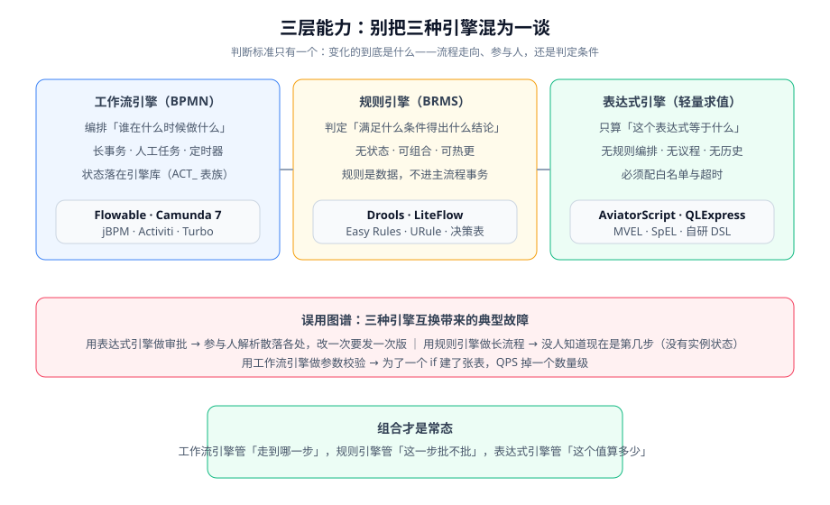

# 工作流与规则引擎总览

工作流引擎（Workflow Engine）与规则引擎（Rule Engine）常被放在一张选型表里比较，但它们解决的是**两个不同的问题**：前者回答「这件事接下来该谁做」，后者回答「这件事满足什么条件才算数」。把两者混为一谈，是这类系统后期最难维护的根因。

## 三类能力，三个判断标准



判断该用哪一类，只需要问一句：**变化的到底是什么**。

| 变化的东西 | 该用的能力 | 判断依据 | 典型症状（用错时） |
| --- | --- | --- | --- |
| **流程走向**（下一步谁做） | 工作流引擎（BPMN） | 流程有多个参与人、有等待、有超时、需要「现在走到哪一步」这个状态 | 用状态机硬编码：加一个审批人就要改代码 + 发版 |
| **判定条件**（什么算通过） | 规则引擎 | 条件是组合式的、经常调整、需要能解释「为什么判成这样」 | 用 if-else 堆叠：改一条阈值要重新走全量回归 |
| **一个值算多少** | 表达式引擎 | 无编排、无状态、只是把一个公式算出来 | 用规则引擎算提成：为一行公式建了一套 BRMS |

::: tip 一个不会错的判据
问「**这句话能不能用一个句子说清楚**」。「金额大于 5000 的报销需要总监审批」——这是规则。「报销超过 5000 先给直属主管，主管通过后给总监，总监超时 48 小时自动升级给财务总监」——这是流程。**流程有先后、有等待、有责任人；规则只有真和假。**
:::

## 什么时候不该上引擎

引擎是有成本的：多一个数据库（引擎库）、多一套概念（流程定义 / 实例 / 任务 / 变量）、多一层排障路径。以下场景**不建议**引入：

| 场景 | 建议做法 |
| --- | --- |
| 流程固定、参与人固定，一年改不了一次 | 用状态机（枚举 + 转移矩阵）写在代码里，配单元测试覆盖所有非法转移 |
| 只有 1~2 个审批人，没有会签、没有超时 | 一张 `status` 字段 + 一张审批记录表就够了，别为一次 if 建 60 张表 |
| 规则条件只有 2~3 个、且由开发维护 | 策略模式 + 规格模式（Specification），可读性远好于 DRL |
| 团队里没人愿意为「流程版本治理」负责 | 先建治理流程（谁能改、怎么评审、怎么回滚）再谈引擎——否则规则只是换个地方腐烂 |
| 需要的是「跨服务长事务编排」 | 看 [Temporal](https://temporal.io/) 这类持久执行框架，它与 BPMN 引擎解决的问题不完全相同 |

::: danger 最常见的三个误判
1. **「有了引擎就不用写业务代码了」**——引擎管的是流转，业务规则、数据校验、权限判断依然要写代码，只是搬到了监听器或服务任务里。
2. **「规则引擎能让业务人员直接改规则」**——只有当规则被做成决策表且配好了审批与回滚，业务人员才敢改；DRL 文件对业务人员来说比 Java 更难读。
3. **「上了引擎就有审计了」**——引擎的历史表记录的是「流程动作」，业务语义（批的是哪一版内容、依据是什么）仍要落在业务库里。
:::

## 一套完整的引擎系统由什么组成

| 层次 | 组成 | 本专题对应章节 |
| --- | --- | --- |
| 建模层 | BPMN 2.0 流程图、DMN 决策表、DRL 规则文件 | [BPMN 建模](../Modeling/index.md)、[Drools](../Drools/index.md) |
| 引擎层 | 流程虚拟机、作业执行器、规则议程 | [Flowable](../Flowable/index.md) |
| 业务设计层 | 审批人解析、会签规则、退回与撤销 | [审批流设计](../ApprovalFlow/index.md) |
| 集成层 | 业务库与引擎库的边界、事务、幂等、版本迁移 | [与业务系统集成](../Integration/index.md) |
| 治理层 | 流程定义版本、规则版本、评审与回滚、审计 | [集成](../Integration/index.md)、[FAQ](../FAQ/index.md) |

## 最小起步路径

如果你确认要用，建议按下面的顺序推进，**每一步都要有可验证的产出**，不要一次上全套：

1. **画出主干流程**：只画正常路径（发起 → 审批 → 结束），异常路径先空着。产出：一张 BPMN 文件 + 能找到它的流程定义 key。
2. **跑通一个最小实例**：本地启动引擎（内存库或 H2），启动实例、查出待办、完成任务，确认流程能走到结束。产出：能重复执行的最小验证命令。
3. **确定业务库与引擎库的边界**：列出哪些字段进业务库、哪些进流程变量；明确 `businessKey` 用什么。产出：一张字段归属表。
4. **补异常路径**：退回、撤销、超时、候选人解析为空。产出：每个异常的断言（不只是"应该没问题"）。
5. **再加规则**：只有当判定条件确实开始频繁变化时，才引入规则引擎；先试 Mini 方案（策略模式 / 决策表），撑不住了再上 Drools。

::: warning 关于「先上引擎再补治理」
第 5 步之前的所有步骤都可以用代码 + 数据库完成；把它们做扎实之后，再引入引擎只是换了个执行者，而不是换了一套思维方式。反过来，先上引擎再补治理，几乎一定会得到「一个跑着 500 个僵尸实例、没人敢改流程定义的引擎」。
:::

## 常见误区速查

| 误区 | 事实 |
| --- | --- |
| 「Flowable 是 Activiti 的升级版」 | 两者同源（Flowable 核心团队 2016 年从 Activiti fork），但 Flowable 7/8 已独立演进，API 与表结构不保证兼容 |
| 「Camunda 8 也能免费商用」 | Camunda 8 的 Zeebe 引擎是 source-available 许可，不是 Apache 2.0；免费额度与商用边界见官方许可条款 |
| 「规则引擎性能一定比 if-else 好」 | 规则数少时 Rete 网络构建成本远高于收益；Rete 的优势在规则多、事实频繁变化、规则互相触发的场景 |
| 「流程实例就是业务单据」 | 流程实例是「流程的形状」，业务单据是「业务的事实」，两者生命周期不同（业务单据可能在流程结束后被修改） |

## 验证方式

本页是概念页，不做实际操作；但下面这条命令能验证一个引擎是否真的装对了（以 Flowable + MySQL 为例，具体见 [Flowable 引擎深入](../Flowable/index.md)）：

```shell
# 启动应用后，确认引擎已建表且流程定义已部署
mysql -uroot -p -e "select count(*) as tables_cnt from information_schema.tables where table_schema='flowable_demo' and table_name like 'ACT\_%';"
# 期望：得到 60 左右的数字（Flowable 7.x/8.x 完整发行版）

mysql -uroot -p -e "select KEY_, NAME_, VERSION_ from flowable_demo.ACT_RE_PROCDEF;"
# 期望：能看到你部署的流程定义 key 与版本号（VERSION_ 从 1 开始）
```

## 参考资料

- Martin Fowler, BPMN 简介：https://martinfowler.com/bliki/BPMN.html
- van der Aalst 等, Workflow Patterns（流程模式权威站点）：https://www.workflowpatterns.com/
- Flowable 官方文档（BPMN 用户指南）：https://www.flowable.com/open-source/docs/bpmn/ch02-GettingStarted
- Camunda 7 与 Camunda 8 的架构差异（官方迁移指南）：https://docs.camunda.io/docs/guides/migrating-from-camunda-7/
