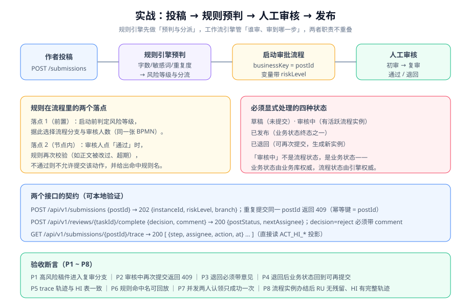

# 实战：投稿—审核—发布

本页把前面的方法落到一个完整场景上：**作者投稿 → 规则引擎预判风险 → 审批流按风险分级审核 → 通过后发布**。选这个场景是因为它同时用到了三层能力：规则决定分流、流程决定谁审、业务状态机决定发布与否。



## 第一步：把需求写成可判定的表

用 [审批流设计](../ApprovalFlow/index.md) 的需求模板，先把每个节点的语义定死。**空白项即未定义需求**。

| 节点 | 审批人策略 | 多人语义 | 可否退回 | 退回到 | 超时动作 | 超时时长 | 意见必填 |
| --- | --- | --- | --- | --- | --- | --- | --- |
| 初审 | 角色 `content-reviewer` | 或签 | 可 | 发起人 | 催办 | 24 小时 | 退回必填 |
| 复审 | 规则输出复审人列表 | 会签（一人否决即整体否决） | 可 | 初审 | 升级至 `editor-in-chief` | 48 工作小时 | 退回必填 |
| 发布确认 | 发起人本人 | 单人 | 否 | — | 自动通过 | 72 小时 | 否 |

同时明确**非功能口径**（否则验收时一定会争议）：

| 口径 | 取值 | 理由 |
| --- | --- | --- |
| 重复提交 | 同一 `postId` 只允许一个活跃实例，重复提交返回 **409** | businessKey 天然唯一 |
| 并发认领 | 两个审核人同时认领同一任务，**只有一个成功**，另一个 409 | 引擎的 claim 保证 |
| 退回次数 | 最多 3 次，超过直接终止并置为 `REJECTED` | 防无限打回 |
| 留痕 | 任何审批动作（含退回）都写一条业务留痕，**不覆盖历史** | 审计要求 |

## 第二步：规则预判（规则引擎）

先用一组互不依赖的规则算出**风险等级**与**复审人列表**。

```yaml [rules/article-risk.yml]
# 用 YAML 表达规则，业务侧只认这套字段名；换引擎只改适配器
version: 2
rules:
  - id: R001
    owner: content-team
    when: "sensitiveHits >= 3"
    then: { riskLevel: HIGH, reason: "敏感词命中过多" }
  - id: R002
    owner: content-team
    when: "wordCount < 400"
    then: { riskLevel: HIGH, reason: "字数过短" }
  - id: R003
    owner: content-team
    when: "similarity >= 0.85"
    then: { riskLevel: HIGH, reason: "与已有内容高度重复" }
  - id: R004
    owner: content-team
    when: "externalLinks > 5"
    then: { riskLevel: MEDIUM, reason: "外链过多" }
  - id: R005
    owner: content-team
    when: "true"
    then: { riskLevel: NORMAL, reason: "默认" }
```

```java [src/main/java/com/example/blog/review/RiskEvaluator.java]
@Component
public class RiskEvaluator {

    /** 规则按 id 升序执行，第一条命中即返回（等价于 activation-group 语义） */
    public RiskResult evaluate(Post post) {
        RuleSet ruleSet = ruleLoader.current();            // 规则集带版本号，可追溯
        for (Rule rule : ruleSet.getRules()) {
            if (rule.matcher().test(post)) {
                return new RiskResult(rule.riskLevel(), rule.id(), rule.reason(), ruleSet.getVersion());
            }
        }
        throw new IllegalStateException("规则集缺少默认规则（R005）");
    }
}
```

::: danger 三条容易被忽略的规则纪律
1. **必须有默认规则**：所有条件都不命中时不能返回 `null`，否则风险等级为空会一路传到流程分支条件里，导致网关无出口。
2. **规则命中要留规则 id 与规则集版本**：排障时最常被问的是"这条稿子为什么被判高风险"，答案是"命中了 R003"，而不是"系统判的"。
3. **规则集版本要写进审批留痕**：这样一个月后能回答"当时用的是哪版规则"。
:::

## 第三步：流程设计（BPMN）

```xml [processes/article-review.bpmn20.xml]
<process id="article-review" name="文章审核" isExecutable="true">

  <startEvent id="start" />
  <sequenceFlow sourceRef="start" targetRef="firstReview" />

  <!-- 初审：或签 -->
  <userTask id="firstReview" name="初审" flowable:candidateGroups="content-reviewer">
    <extensionElements>
      <flowable:taskListener event="complete" delegateExpression="${reviewRecordListener}" />
    </extensionElements>
    <boundaryEvent id="firstRemind" attachedToRef="firstReview" cancelActivity="false">
      <timerEventDefinition><timeDuration>PT24H</timeDuration></timerEventDefinition>
    </boundaryEvent>
  </userTask>

  <!-- 规则决定是否进入复审：HIGH/MEDIUM 需要，NORMAL 直接发布确认 -->
  <exclusiveGateway id="gwRisk" default="flowToConfirm" />
  <sequenceFlow sourceRef="gwRisk" targetRef="seniorReview">
    <conditionExpression xsi:type="tFormalExpression"><![CDATA[${riskLevel != 'NORMAL'}]]></conditionExpression>
  </sequenceFlow>
  <sequenceFlow id="flowToConfirm" sourceRef="gwRisk" targetRef="publishConfirm" />

  <!-- 复审会签：一人否决即整体否决（rejectedCount 由监听器维护） -->
  <userTask id="seniorReview" name="复审会签" flowable:assignee="${assignee}">
    <multiInstanceLoopCharacteristics isSequential="false"
          flowable:collection="${reviewers}" flowable:elementVariable="assignee">
      <completionCondition><![CDATA[${rejectedCount >= 1 or nrOfCompletedInstances >= nrOfInstances}]]></completionCondition>
    </multiInstanceLoopCharacteristics>
    <boundaryEvent id="seniorEscalate" attachedToRef="seniorReview" cancelActivity="true">
      <timerEventDefinition><timeDuration>PT48H</timeDuration></timerEventDefinition>
    </boundaryEvent>
  </userTask>

  <!-- 一票否决后直接终止，不再走发布确认 -->
  <exclusiveGateway id="gwVeto" default="flowToVetoEnd" />
  <sequenceFlow sourceRef="gwVeto" targetRef="publishConfirm">
    <conditionExpression xsi:type="tFormalExpression"><![CDATA[${rejectedCount == 0}]]></conditionExpression>
  </sequenceFlow>
  <sequenceFlow id="flowToVetoEnd" sourceRef="gwVeto" targetRef="rejectedEnd" />
  <endEvent id="rejectedEnd" />

  <userTask id="publishConfirm" name="发布确认" flowable:assignee="${authorId}" />
  <endEvent id="publishedEnd" />
</process>
```

::: warning 用了 `exclusiveGateway` 就必须配 `default` 分支
上例两处网关都写了 `default`。漏掉时，条件全不满足会抛"没有可用的出口"异常，**流程实例停在网关不动**，且这次异常在业务日志里只出现一次，很容易被忽略。
:::

## 第四步：接口契约

```text
# 三个接口，契约写死
POST /api/v1/submissions
  body: { "postId": 1 }
  200:  { "instanceId": "abc-123", "riskLevel": "HIGH", "ruleId": "R003", "branch": "seniorReview" }
  409:  { "code": "ALREADY_REVIEWING", "message": "该稿件已在审核中", "instanceId": "abc-123" }
  422:  { "code": "RISK_UNRESOLVED", "message": "规则集未命中任何规则" }

POST /api/v1/reviews/{taskId}/complete
  body: { "decision": "approve" | "reject", "comment": "..." }
  200:  { "postStatus": "REVIEWING" | "PUBLISHED" | "REJECTED", "nextAssignee": "u9" | null,
          "ruleSetVersion": 2 }
  400:  { "code": "COMMENT_REQUIRED", "message": "退回必须填写意见" }
  409:  { "code": "TASK_NOT_ASSIGNED_TO_YOU" }

GET /api/v1/submissions/{postId}/trace
  200:  [ { "step": "初审", "assignee": "u3", "action": "approve", "at": "2026-10-07T10:02:11Z",
            "comment": "内容合规" } ]
```

::: tip 契约里必须有的两个字段
`ruleId`（命中了哪条规则）与 `ruleSetVersion`（用的哪版规则）。没有这两个字段，"为什么判成这样"就无法回答，规则系统也就失去了可解释性——而这恰恰是引入它的主要理由之一。
:::

## 第五步：验收断言 P1~P10

| 编号 | 断言 | 判据（可观测） | 类型 |
| --- | --- | --- | --- |
| P1 | 高风险稿件进入复审分支 | 启动返回 `branch=seniorReview`，且 `ACT_RU_TASK` 有 `seniorReview` 任务 | 分支正确性 |
| P2 | 普通稿件跳过复审 | 返回 `branch=publishConfirm`，任务列表无 `seniorReview` | 分支正确性 |
| P3 | 同一稿件重复提交返回 409 | 第二次调用返回 409，且活跃实例数仍为 1 | 幂等 |
| P4 | 并发认领只有一个成功 | 两个用户同时 claim，第二次 409 | 并发安全 |
| P5 | 退回必须带意见 | 不带 comment 返回 400；带 comment 成功且留痕一条 | 契约校验 |
| P6 | 会签一人否决即整体否决 | 三人会签中一人 reject → 实例进入 `rejectedEnd`，其余任务被取消 | 语义正确性 |
| P7 | 退回 3 次后自动终止 | 第 4 次退回请求被拒绝，业务状态置 `REJECTED` | 边界约束 |
| P8 | 规则命中可回放 | trace 与留痕里含 `ruleId`、`ruleSetVersion` | 可解释性 |
| P9 | 办结后引擎无残留 | 实例结束后 `ACT_RU_EXECUTION` 无该实例，`ACT_HI_*` 轨迹完整 | 生命周期 |
| P10 | 业务状态与流程状态一致 | "已发布但仍有活跃实例"的查询返回 0 行 | 一致性 |

## 第六步：本地验证

```shell
# 0. 准备：MySQL 需按 Flowable 要求配好连接串（nullCatalogMeansCurrent=true），启动应用
export BASE=http://localhost:8080

# 1. 高风险稿件 → 走复审分支（P1）
curl -s -X POST "$BASE/api/v1/submissions" -H 'Content-Type: application/json' \
  -d '{"postId":101}'
# 期望：{"instanceId":"...","riskLevel":"HIGH","ruleId":"R003","branch":"seniorReview"}

# 2. 重复提交 → 409（P3）
curl -s -o /dev/null -w '%{http_code}\n' -X POST "$BASE/api/v1/submissions" \
  -H 'Content-Type: application/json' -d '{"postId":101}'
# 期望：409

# 3. 查待办并认领（P4）
curl -s "$BASE/api/v1/tasks?candidateGroup=content-reviewer" | grep -o '"id":"[^"]*"' | head -1
TASK_ID=$(curl -s "$BASE/api/v1/tasks?candidateGroup=content-reviewer" | grep -o '"id":"[^"]*"' | head -1 | cut -d'"' -f4)
curl -s -o /dev/null -w 'u1=%{http_code}\n' -X POST "$BASE/api/v1/tasks/$TASK_ID/claim" -H 'X-User: u1'
curl -s -o /dev/null -w 'u2=%{http_code}\n' -X POST "$BASE/api/v1/tasks/$TASK_ID/claim" -H 'X-User: u2'
# 期望：u1=200；u2=409

# 4. 退回不带意见 → 400（P5）
curl -s -o /dev/null -w '%{http_code}\n' -X POST "$BASE/api/v1/reviews/$TASK_ID/complete" \
  -H 'Content-Type: application/json' -d '{"decision":"reject"}'
# 期望：400

# 5. 正常通过 → 进入复审会签
curl -s -X POST "$BASE/api/v1/reviews/$TASK_ID/complete" \
  -H 'Content-Type: application/json' -d '{"decision":"approve","comment":"内容合规"}'
# 期望：{"postStatus":"REVIEWING","nextAssignee":"u9","ruleSetVersion":2}

# 6. 轨迹可查（P8）
curl -s "$BASE/api/v1/submissions/101/trace"
# 期望：返回节点序列，含 ruleId=R003、ruleSetVersion=2、assignedUser、action、at
```

```sql
-- 7. 办结后引擎无残留（P9）
SELECT COUNT(*) AS active FROM ACT_RU_EXECUTION
WHERE BUSINESS_KEY_ = '101' AND IS_ACTIVE_ = 1;
-- 期望：0

SELECT TASK_DEF_KEY_, ASSIGNEE_, DURATION_ FROM ACT_HI_TASKINST
WHERE PROC_INST_ID_ = (SELECT PROC_INST_ID_ FROM ACT_HI_PROCINST WHERE BUSINESS_KEY_ = '101')
ORDER BY START_TIME_;
-- 期望：初审 → 复审会签 → 发布确认 全部有行，且 DURATION_ 齐全

-- 8. 状态一致性（P10）
SELECT p.id FROM posts p
LEFT JOIN ACT_RU_EXECUTION e ON e.BUSINESS_KEY_ = CAST(p.id AS CHAR) AND e.IS_ACTIVE_ = 1
WHERE p.review_status = 'PASSED' AND e.PROC_INST_ID_ IS NOT NULL;
-- 期望：0 行
```

## 从这一页带走什么

| 结论 | 说明 |
| --- | --- |
| 规则与流程的边界要画在「分支条件」上 | 规则只输出**风险等级**，流程只根据等级**选分支**，两侧互不知道对方的实现 |
| 业务状态永远不进引擎 | `PASSED`/`REJECTED` 由业务动作改变，引擎只负责把动作串起来 |
| 每个"非前进"动作都要有断言 | 退回、撤销、超时、并发认领——这些才是线上真正出问题的地方 |
| 可解释性靠两个字段 | `ruleId` + `ruleSetVersion`，缺了它们这套系统就只是"一个更复杂的 if-else" |

## 参考资料

- Flowable 用户任务与多实例示例：https://www.flowable.com/open-source/docs/bpmn/ch07b-BPMN-Constructs
- LiteFlow 官方示例（编排场景对照）：https://liteflow.cc/
- 项目实战对照：[核心业务流](/project/Complete/BlogPlatform/CoreFlow/index.md)（状态机侧）、[评论 AI 预审](/project/Complete/BlogPlatform/AiModeration/index.md)（LLM 打标侧）
- Workflow Patterns（会签与一票否决的模式定义）：https://www.workflowpatterns.com/patterns/control/
