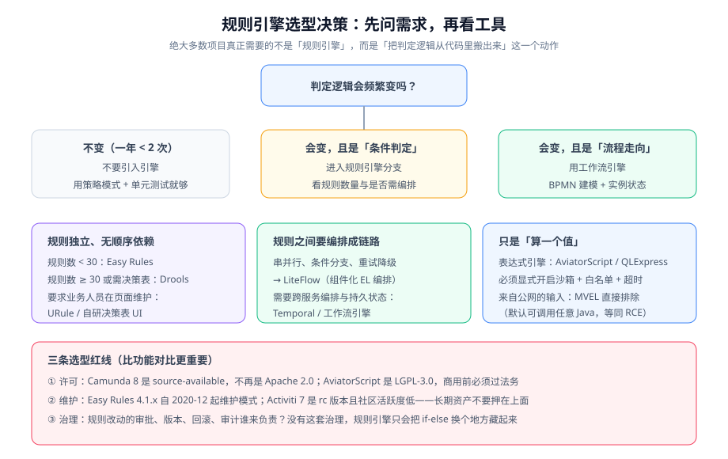

# 规则引擎选型与轻量替代

「规则引擎」这个词覆盖了从「一行表达式求值」到「整套 BRMS」的巨大范围。选型失败通常不是因为选了弱的工具，而是因为**用重工具解决轻问题**——最后得到一套没人敢改、也没人真正用得上的规则系统。



## 先做一个判断：你到底需要什么

| 你的需求 | 该用的东西 | 不该用的东西 |
| --- | --- | --- |
| 判定逻辑一年变不到两次 | 策略模式 + 单元测试 | 任何引擎 |
| 规则是「条件组合 → 结论」的矩阵，规则之间互不依赖 | 决策表（可自研：一张表 + 一个求值器） | Drools（Rete 网络对独立规则没有优势） |
| 规则之间要按链路编排（串行/并行/条件分支/重试） | **LiteFlow** | Drools（它不是编排框架） |
| 规则要反复迭代收敛（A 的结论会影响 B 的判定） | **Drools** | 自研循环（收敛条件极难写对） |
| 只是把一个公式算出来 | 表达式引擎（QLExpress / AviatorScript） | 规则引擎 |
| 用户能在页面上自定义公式（面向公网） | 表达式引擎 + **沙箱 + 白名单 + 超时** | MVEL（默认可调用任意 Java） |

## 轻量替代：LiteFlow 与 Easy Rules

### LiteFlow：组件化编排

LiteFlow 的定位是「流程编排引擎」——把业务逻辑拆成组件，用 EL 表达式描述它们怎么串起来，规则本身可热更。

```java [src/main/java/com/example/blog/flow/RiskCheckCmp.java]
@LiteflowComponent("riskCheck")
public class RiskCheckCmp extends NodeComponent {
    @Override
    public void process() {
        SubmissionCtx ctx = this.getContextBean(SubmissionCtx.class);
        ctx.setRiskLevel(riskService.evaluate(ctx.getSubmission()));
        // 数据在上下文里流动，组件之间不直接依赖
    }
}
```

```text
# 规则文件（可放 classpath，也可放数据库/Nacos，支持热更新）
# chain 名 = reviewFlow；IF 做条件分支，THEN 串行，WHEN 并行
reviewFlow: IF(riskCheck, highRisk, THEN(firstReview, seniorReview), normalReview);
# 高风险走"一审 + 会签"，普通稿件只走一道审核
```

```java [src/main/java/com/example/blog/flow/ReviewFlowService.java]
@Service
public class ReviewFlowService {
    private final FlowExecutor flowExecutor;

    public ReviewFlowService(FlowExecutor flowExecutor) {
        this.flowExecutor = flowExecutor;
    }

    public SubmissionCtx run(Submission submission) {
        SubmissionCtx ctx = new SubmissionCtx(submission);
        LiteflowResponse<SubmissionCtx> resp = flowExecutor.execute2Resp("reviewFlow", null, ctx);
        if (!resp.isSuccess()) {
            throw new IllegalStateException("编排失败，节点=" + resp.getCause().getNodeId(), resp.getCause());
        }
        return resp.getContextBean(SubmissionCtx.class);
    }
}
```

| 能力 | 说明 |
| --- | --- |
| EL 编排 | `THEN` 串行、`WHEN` 并行、`IF` 条件、`SWITCH` 多路、`FOR` 循环、`RETRY` 重试 |
| 上下文隔离 | 每个请求一个上下文对象，组件之间通过它传递数据 |
| 热更 | 规则与组件都可不重启更新；2.16 起提供 Rule-DB 模式（存储为权威源，七种后端：MySQL/PG/Mongo/Redis/ZK/Etcd/Nacos） |
| 可观测 | 2.16 起内置 Micrometer 埋点，chain 与组件的 QPS/耗时/错误率可接 Prometheus |
| 版本基线 | **2.16.1**（2026-07-28）；JDK 8~25、Spring Boot 2.x~4.x |

::: tip LiteFlow 与工作流引擎的分工
LiteFlow 是**进程内的逻辑编排**：一次调用内跑完，上下文不落库，没有"实例状态"与"待办"。BPMN 引擎是**跨天跨人的长流程**：状态落库、有任务列表、有超时。

判断方法：**问「这个流程会不会有人在三天后才处理它」**。会，就必须用 BPMN 引擎；不会，LiteFlow 更轻更合适。
:::

### Easy Rules：极简，但已进入维护模式

```java [src/main/java/com/example/blog/rule/SensitiveWordRule.java]
@Rule(name = "敏感词规则", description = "命中敏感词库即拒绝", priority = 1)
public class SensitiveWordRule {

    @Condition
    public boolean when(@Fact("content") String content) {
        return sensitiveWordService.contains(content);
    }

    @Action
    public void then(@Fact("content") String content, Facts facts) {
        facts.put("decision", "REJECT");
        facts.put("reason", "命中敏感词");
    }
}
```

```java [src/main/java/com/example/blog/rule/RuleRunner.java]
Rules rules = new Rules();
rules.register(new SensitiveWordRule(), new LengthRule(), new DefaultPassRule());

Facts facts = new Facts();
facts.put("content", content);
facts.put("decision", null);

RulesEngine engine = new DefaultRulesEngine();
engine.fire(rules, facts);

String decision = facts.get("decision");
```

::: danger Easy Rules 的维护状态必须写进选型结论
**Easy Rules 4.1.0 是 2021-12 的版本，项目自 2020-12 起进入维护模式**：没有新特性、没有明确的安全补丁责任人、GitHub 上有几十个未处理 Issue。它适合的状态是：**规则极少、逻辑极简、跑在不关键的路径上**。把它作为长期核心资产（比如风控判定），等于把一个只增不减的依赖锁死在冻结版本上。
:::

## 表达式引擎：性能最好，风险也最集中

| 引擎 | 版本（2026-10） | 许可 | 沙箱 | 适用与注意 |
| --- | --- | --- | --- | --- |
| **QLExpress** | 4.1.x（4.1.3，2026-08） | Apache-2.0 | 需白名单 + 沙箱 + 超时 | 阿里维护，支持中文别名，解释执行；4.1.2 起移除 ANTLR4 依赖，常驻内存大幅下降 |
| **AviatorScript** | 5.4.4（2026-07） | **LGPL-3.0** | `enableSandboxMode()` 一行开启 | 编译成字节码，性能最强；**单维护者风险 + LGPL 许可需过法务** |
| **MVEL** | 2.5.2.Final | Apache-2.0 | **无内置沙箱** | 默认可调用任意 Java，等同代码执行；**面向不可信输入时直接排除** |
| **SpEL** | 随 Spring | Apache-2.0 | 有限 | Spring 项目最省事，但同样要限制可调用的类与方法 |

```java [src/main/java/com/example/blog/rule/FormulaService.java]
@Service
public class FormulaService {

    private static final Pattern ALLOWED = Pattern.compile("^[0-9+\\-*/().\\sA-Za-z_]+$");

    /** 三条防线缺一不可：白名单字符 → 沙箱 → 超时 */
    public Object eval(String expr, Map<String, Object> env) {
        if (!ALLOWED.matcher(expr).matches()) {
            throw new IllegalArgumentException("表达式含非法字符");
        }
        if (expr.length() > 500) {
            throw new IllegalArgumentException("表达式过长");
        }
        ExecutorService pool = Executors.newSingleThreadExecutor();
        Future<Object> future = pool.submit(() -> AviatorEvaluator.execute(expr, env));
        try {
            return future.get(50, TimeUnit.MILLISECONDS);     // 超时：防死循环拖垮线程
        } catch (TimeoutException e) {
            future.cancel(true);
            throw new IllegalStateException("表达式执行超时");
        } catch (Exception e) {
            throw new IllegalStateException("表达式执行失败：" + e.getMessage(), e);
        } finally {
            pool.shutdownNow();
        }
    }
}
```

::: danger 表达式注入不是"配置问题"，是「远程代码执行」
把用户输入直接交给表达式引擎求值，等价于把服务器交给用户。三个必做动作：

1. **白名单而非黑名单**：只允许数字、运算符与已知变量名（黑名单永远会漏）。
2. **开启沙箱**：AviatorScript 要显式调用 `enableSandboxMode()`，QLExpress 4.x 要配安全级别；**MVEL 没有沙箱可用**。
3. **超时 + 长度限制**：`while(true){}` 这类表达式能直接挂死线程。

**验证方法**：写一条注入用例进回归套件——尝试在表达式里访问 `java.lang.Runtime` 或调用 `getClass()`，断言被拒绝（详见 [实战](../Practice/index.md) 的规则安全断言）。
:::

## 许可与维护：比功能对比更重要的三条红线

| 红线 | 具体事实 | 影响 |
| --- | --- | --- |
| **许可陷阱** | Camunda 8 的 Zeebe 是 source-available，不再 Apache-2.0；AviatorScript 是 LGPL-3.0 | 商用前必须过法务；LGPL 在闭源产品里需要谨慎评估链接方式 |
| **维护状态** | Easy Rules 4.1.x 自 2020-12 维护模式；Activiti 7 仍是 rc 且社区活跃度低 | 长期核心资产不要押在冻结或半停滞的项目上 |
| **治理成本** | 规则改动的审批、版本、回滚、审计由谁负责 | 没有治理的规则引擎只会把 if-else 换一个地方藏起来 |

::: warning 用一张表把选型结论写进决策记录
选型文档至少要包含：**引擎名 / 版本 / 许可 / 维护状态 / 我们用它做什么 / 我们不指望它做什么 / 什么时候会重新评估**。最后两项最容易被省略，也最容易被后期的人问到。
:::

## 规则 DSL 设计：为将来换引擎留退路

三种引擎的语法互不兼容，且**没有自动转换工具**。因此从第一天起就应该把「规则表达」与「引擎语法」隔开：

| 做法 | 好处 |
| --- | --- |
| 业务侧只认自己的 DSL（决策表的列名、固定字段名） | 换引擎时业务无感 |
| 引擎语法由一层适配器翻译 | 替换只影响适配器 |
| 每条规则有唯一业务 ID 与责任人 | 排障能定位到人，改动能追溯 |
| 规则集有版本号，与发布关联 | 出问题能回滚到具体版本 |

## 常见问题

| 现象 | 原因 | 修法 |
| --- | --- | --- |
| 规则改了不生效 | 规则在 classpath 里，需要重启 | 改为 Rule-DB / 数据库规则源，或接受"规则随发布走"并写清版本 |
| 表达式报语法错但看不懂 | 引擎语法与业务预期不一致 | 提供语法校验接口，保存规则时先校验 |
| 规则数量增长后没人敢改 | 没有唯一 ID 与责任人 | 每条规则补 ID + 责任人 + 变更记录 |
| 规则执行偶发变慢 | 表达式触发长循环 / 大集合操作 | 加超时与长度限制，并记录执行耗时 |

## 验证方式

```shell
# ① 规则编排：跑通正常与异常两条链路
curl -s -X POST 'http://localhost:8080/api/v1/rules/evaluate' \
  -H 'Content-Type: application/json' -d '{"content":"正常内容","wordCount":800}'
# 期望：{"decision":"PASS","ruleHit":"默认"}

curl -s -X POST 'http://localhost:8080/api/v1/rules/evaluate' \
  -H 'Content-Type: application/json' -d '{"content":"含敏感词","wordCount":100}'
# 期望：{"decision":"REJECT","ruleHit":"敏感词+过短"}

# ② 表达式沙箱：注入用例必须被拒绝
curl -s -X POST 'http://localhost:8080/api/v1/rules/eval-expr' \
  -H 'Content-Type: application/json' -d '{"expr":"\"\".getClass().forName(\"java.lang.Runtime\")"}'
# 期望：400（非法字符或沙箱拒绝），且不得出现任何类加载成功迹象

# ③ 超时防线：死循环表达式必须被中断
curl -s -X POST 'http://localhost:8080/api/v1/rules/eval-expr' \
  -H 'Content-Type: application/json' -d '{"expr":"a=1; while(true){a=a+1}; a"}'
# 期望：50ms 内返回错误（表达式执行超时），服务仍可正常响应后续请求
```

```text
# ④ 规则覆盖自查（文档级判据）：规则清单与测试用例是否一一对应
规则清单（5 条）：敏感词+过短 / 重复度过高 / 超长标题 / 默认通过 / 高相似度
测试用例（10 个）：每条规则 1 正例 + 1 反例
判据：规则数 × 2 = 用例数；缺一即为未覆盖
```

## 参考资料

- LiteFlow 官方文档：https://liteflow.cc/
- Apache KIE / Drools 文档：https://kie.apache.org/
- Easy Rules 仓库与发布记录（含维护状态）：https://github.com/j-easy/easy-rules/releases
- QLExpress 仓库与发布记录：https://github.com/alibaba/QLExpress/releases
- AviatorScript 文档：https://aviatorohana.github.io/aviator/
- Camunda 8 许可与版本说明：https://camunda.com/legal/
