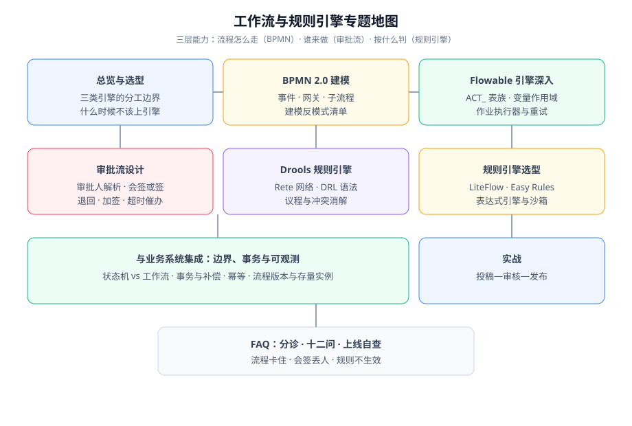

# 工作流与规则引擎

工作流与规则引擎解决的是同一类问题：**把「流程怎么走」和「按什么条件判定」从业务代码里搬出来，变成可以独立修改、独立验证、独立审计的东西**。本专题讲三层能力——用 BPMN 建模流程走向、用审批流设计解决「谁来做」、用规则引擎解决「按什么判」，并说清楚它们各自的边界在哪里。

::: tip 一句话理解
业务代码里最怕的不是逻辑复杂，而是**逻辑藏在看不见的地方**：一个 if 里夹着状态、状态里夹着权限、权限里夹着一张表。工作流与规则引擎做的事，就是把这些藏在代码里的规则，变成有名字、有版本、有责任人、可回溯的显式资产。
:::

## 与相邻专题的分工

| 专题 | 讲什么 | 与本专题的关系 |
| --- | --- | --- |
| 本专题 | **工作流引擎（BPMN）+ 审批流设计 + 规则引擎**三层能力的方法论与落地 | —— |
| [领域驱动设计](../DDD/index.md) | 聚合、不变量、领域事件的方法论 | 审批状态是业务事实，应落在聚合里；本专题讲「流程怎么驱动它变化」 |
| [消息队列](../MessageQueue/index.md) | 异步解耦、投递语义、幂等消费 | 引擎产生的外部副作用靠消息落地；本专题只讲「为什么不能同事务」 |
| [分布式事务](../Microservices/DistributedTransaction/index.md) | 两阶段、本地消息表、Saga 补偿 | 流程推进与业务写入的跨库一致性问题在此展开 |
| [微服务](../Microservices/index.md) | 服务拆分与运行时治理 | 引擎集群部署、作业执行器独占、跨服务编排的注意点 |
| [Spring Boot](../Java/Frame/SpringBoot/index.md) | 自动配置、依赖注入、事务管理 | Flowable/Drools 的集成载体，本专题不重复讲框架细节 |
| [项目实战 · 核心业务流](/project/Complete/BlogPlatform/CoreFlow/index.md) | 博客平台的状态机与转移矩阵 | 本专题实战一章与之衔接：状态机管业务状态，引擎管审批流转 |
| [项目实战 · 评论 AI 预审](/project/Complete/BlogPlatform/AiModeration/index.md) | LLM 打标与人审闭环 | 「AI 打标 + 人审定终值」是规则预判的一种形态，本项目里用规则引擎做同一件事 |

## 专题地图

| 页面 | 内容 | 适合谁读 |
| --- | --- | --- |
| [总览：三层能力与选型边界](./Overview/index.md) | 三类引擎的分工、什么时候不该上引擎、最小起步路径 | 所有人，先读 |
| [BPMN 2.0 建模](./Modeling/index.md) | 事件、任务、三个网关的语义差别、建模顺序与反模式 | 画流程图的人 |
| [Flowable 引擎深入](./Flowable/index.md) | 架构分层、ACT_ 表族、变量作用域、作业执行器与重试 | 写后端的人，**重点读** |
| [审批流设计](./ApprovalFlow/index.md) | 审批人解析、会签/或签/顺签、退回撤销加签、超时催办 | 做 OA / 审批业务的人 |
| [Drools 规则引擎](./Drools/index.md) | Rete 网络、DRL 语法、议程与冲突消解、kjar 与热更 | 写规则的人 |
| [规则引擎选型与轻量替代](./RuleEngine/index.md) | LiteFlow、Easy Rules、表达式引擎与沙箱、许可与维护状态 | 做技术选型的人 |
| [与业务系统集成](./Integration/index.md) | 状态机 vs 工作流、两类事务、幂等、流程版本与存量实例 | 写后端的人，**重点读** |
| [实战：投稿—审核—发布](./Practice/index.md) | 规则预判 + 审批流程的完整落地与断言清单 | 想看完整过程的人 |
| [常见问题与最佳实践](./FAQ/index.md) | 排障分诊、十二问、上线自查清单、术语表 | 所有人 |

## 版本状态速览

按 **2026-10** 口径联网核对，本专题涉及的引擎版本如下（**选型前请复核，引擎迭代快**）：

| 引擎 | 当前版本 | 关键约束 |
| --- | --- | --- |
| Flowable（开源） | **8.0.0**（2026-02-27）；**7.2.0**（2025-08-21）为 7.x 末版；**6.8.1** 为 6.x 末版 | 8.x 基于 Spring Framework 7 / Spring Boot 4、Jackson 3，JDK 17+；7.x 起为 Jakarta 命名空间并移除开源 Web 应用（Modeler/Task/Admin/IDM） |
| Camunda | **7.24 LTS**（最后一个小版本，维护至 2030-04-13，扩展支持到 2032-04）；**8.9**（2026-04 GA） | **Camunda 8 是 source-available，不再是 Apache 2.0**——商用许可必须先过法务 |
| Apache KIE / Drools | **10.2.0**（2026-03-28 发布，发布公告 2026-04） | 仍处 Apache **Incubating**，官方称下一版预期毕业；10.2 起移除旧版 GWT 编辑器，DMN 支持到 1.6 |
| Activiti | 7.21.0-rc（rc 版本） | 核心开发者已转投 Flowable，社区活跃度低；不建议新项目选型 |
| LiteFlow | **2.16.1**（2026-07-28） | 2.16 起引入 Rule-DB 规则存储与 AI Agent 编排模块；JDK 8~25、Spring Boot 2.x~4.x |
| Easy Rules | **4.1.0**（2021-12） | **自 2020-12 起进入维护模式**：无新特性、无安全补丁负责人，只适合边缘小场景 |
| 表达式引擎 | AviatorScript 5.4.4（LGPL-3.0）；QLExpress 4.1.x（Apache-2.0）；MVEL 2.5.2.Final | 面向不可信输入时，MVEL 默认可调用任意 Java，**直接排除** |

::: info 版本核对说明
以上版本按官方发布公告、Maven 中央仓库与 Apache 邮件列表核对（2026-10 口径）。**大版本差异写在各页的版本说明块里，不覆盖旧版本内容**：比如 Flowable 6.x 的用法在页内以「6.x 兼容提示」形式保留，便于存量项目对照；需要长期维护的旧版本组合（如 JDK 8 + Spring Boot 2.x 的 Flowable 6.8.x）建议单独建版本目录，与本专题的 7.x/8.x 内容并存。
:::

## 学习路径

1. **先读 [总览](./Overview/index.md)**：先判断你的项目需不需要引擎——大多数项目不需要，这比学会用引擎更重要。
2. **需要建流程的先读 [BPMN 2.0 建模](./Modeling/index.md)**：图里选错一个网关，代码里要填十个坑。
3. **再读 [Flowable 引擎深入](./Flowable/index.md) 与 [审批流设计](./ApprovalFlow/index.md)**：一个讲引擎怎么运转，一个讲业务流程怎么设计得让人不骂。
4. **需要动态判定的读 [Drools](./Drools/index.md)**，选型摇摆的读 [规则引擎选型](./RuleEngine/index.md)。
5. **动手前必读 [与业务系统集成](./Integration/index.md)**：事务、幂等、版本迁移的坑都在这里。
6. **走一遍 [实战](./Practice/index.md)**，再对照项目里的 [核心业务流](/project/Complete/BlogPlatform/CoreFlow/index.md) 看状态机与工作流如何分工。

## 参考资料

- OMG BPMN 2.0 规范：https://www.omg.org/spec/BPMN/2.0/
- OMG DMN 规范（决策模型与记法）：https://www.omg.org/spec/DMN/
- Flowable 官方文档：https://www.flowable.com/open-source/docs/
- Apache KIE（Drools / jBPM / Kogito）文档：https://kie.apache.org/
- Camunda 7 支持公告（含各版本维护截止日期）：https://docs.camunda.org/enterprise/announcement/
- LiteFlow 官方文档：https://liteflow.cc/
- 工作流建模模式（van der Aalst 等，workflow patterns）：https://www.workflowpatterns.com/
