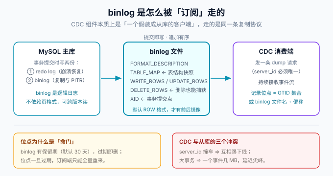
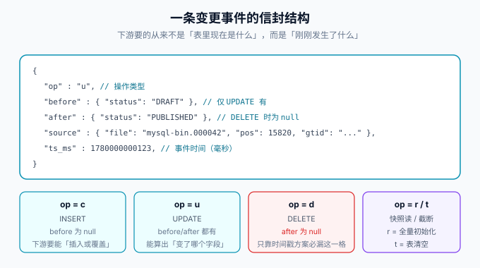

# binlog 与 CDC 原理

所有基于 MySQL 的 CDC 工具（Debezium、Canal、Maxwell、Flink CDC 的 MySQL 连接器）共享同一块地基：**binlog 与复制协议**。这一页不讲工具，只讲这块地基——理解了 ROW 事件、GTID 和位点，后面每个工具的配置项都会从「需要背的参数」变成「可以推出来的结论」。



## 一、binlog 是什么、为什么 CDC 都用它

binlog（binary log，二进制日志）是 MySQL **服务层**的逻辑日志：事务提交时，把「这个事务做了什么改动」追加写进 binlog 文件。它和 InnoDB 的 redo log 分工明确——redo log 是物理日志、服务崩溃恢复用；binlog 是逻辑日志、复制与时间点恢复（PITR）用。

CDC 青睐 binlog 的三个理由：

1. **逻辑日志、与存储引擎解耦**：不依赖页格式，跨小版本解析稳定，工具实现有统一协议可依。
2. **提交即写入、追加有序**：日志顺序即提交顺序，天然携带「事务边界」信息。
3. **有成熟的订阅协议**：MySQL 复制协议是公开且稳定的，CDC 组件伪装成一个从库就能拿到完整事件流。

## 二、三种 binlog 格式：只有 ROW 能做 CDC

| 格式 | 记录内容 | 复制 | CDC |
| --- | --- | --- | --- |
| `STATEMENT` | 原始 SQL 语句 | 可能因 `NOW()`、`UUID()`、`LIMIT` 无序导致主从不一致 | **不可用**：拿不到行数据 |
| `ROW`（默认） | 每一行的前后镜像 | 最安全，数据量较大 | **唯一可用**：事件里直接带 before/after |
| `MIXED` | 默认 STATEMENT，危险语句自动切 ROW | 折中 | 理论可用但不稳定，不建议 |

MySQL 8.0 起 `binlog_format` 默认值就是 `ROW`，但存量库与部分云产品默认值不同，**接入 CDC 前必须实测确认**，不能看文档想当然。

::: danger `binlog_row_image` 决定镜像的完整度
`ROW` 格式下还有一层开关：`binlog_row_image` 可取 `FULL`（前后镜像都记全字段）、`MINIMAL`（只记主键与被改字段）、`NOBLOB`。CDC 工具普遍要求 **`FULL`**——Debezium 明确要求该值为 `FULL`；`MINIMAL` 下 UPDATE 事件的 before 镜像只有主键，下游将无法判断「这条数据原来是什么」，做不了 `deleted` 推导与字段级 diff。
:::

## 三、一条 ROW 事件长什么样

一个事务在 binlog 里由一组事件构成，CDC 关心的是其中四类：

| 事件 | 作用 | CDC 用它做什么 |
| --- | --- | --- |
| `TABLE_MAP` | 声明后续行事件用的表 id 与列类型 | 把行事件还原成「哪张表、什么列型」 |
| `WRITE_ROWS` | INSERT 的行集合 | 生成 op = c 事件 |
| `UPDATE_ROWS` | 每行的 before + after 镜像 | 生成 op = u 事件 |
| `DELETE_ROWS` | 被删行的镜像 | 生成 op = d 事件（**只有日志方案能拿到**） |
| `XID` / `QUERY(COMMIT)` | 事务提交点 | 划定事务边界，保证下游按事务消费 |

事件信封的标准结构（Debezium 风格，其余工具大同小异）见下图：



四个字段各司其职，下游消费时的判据都从这里来：

- `op`：`c` / `u` / `d` 是增量，`r` 是快照读，`t` 是 TRUNCATE；
- `before` / `after`：UPDATE 拿 before 才能做字段级 diff；DELETE 只有 before；
- `source`：**位点信息**（文件名 + 偏移 + GTID），幂等与对账都靠它；
- `ts_ms`：事件时间，**同步延迟指标就是「处理时间 − ts_ms」**。

## 四、位点：file+pos 与 GTID 两种口径

订阅端必须记住「读到哪了」，这就是位点。两种记法：

| 口径 | 形式 | 优点 | 弱点 |
| --- | --- | --- | --- |
| 文件 + 偏移 | `mysql-bin.000042:15820` | 直观、所有版本支持 | **主从切换后无效**——新主库的文件名完全不同 |
| GTID（全局事务标识） | `gtid_mode=ON` 后的 `UUID:序号` 集合 | 与具体文件无关，**切换后可自动对齐** | 要求 8.0+ 与全链路开启 GTID |

生产建议：**源库开启 GTID**（`gtid_mode=ON`、`enforce_gtid_consistency=ON`），CDC 端优先用 GTID 记位点。位点的持有方有两种：工具自己存（Canal 的 meta、Debezium 的 offset topic / Flink 的 checkpoint），或下游消费者存（手动提交的场景）。**位点存在哪，故障恢复就要从哪恢复——这一条必须写进运维文档。**

## 五、CDC 必需参数清单

接入 CDC 前，源库按这张表逐项确认：

| 参数 | 要求值 | 原因 | 不满足的后果 |
| --- | --- | --- | --- |
| `log_bin` | `ON` | binlog 总开关 | 无法订阅 |
| `binlog_format` | `ROW` | 见第二节 | 拿不到行数据 |
| `binlog_row_image` | `FULL` | 完整前后镜像 | UPDATE/DELETE 事件残缺 |
| `server_id` | 唯一且 ≠ 从库 id | 复制协议身份标识 | 与从库互相踢下线 |
| `gtid_mode` / `enforce_gtid_consistency` | `ON` | 切换后位点可对齐 | 主从切换后位点失效 |
| `binlog_expire_logs_seconds` | ≥ 7 天（默认 2592000 即 30 天） | 位点回退的余地 | 位点过期 ⇒ 只能全量重灌 |
| `binlog_row_metadata` | `FULL` | 事件携带列名与类型元数据 | 默认 `MINIMAL` 时列名信息不足，工具需要额外元数据 |

账号权限最小集：

```sql
CREATE USER 'cdc_user'@'%' IDENTIFIED BY '复杂口令';
GRANT SELECT ON blog.* TO 'cdc_user'@'%';              -- 快照读存量
GRANT REPLICATION SLAVE, REPLICATION CLIENT ON *.* TO 'cdc_user'@'%';  -- 订阅 binlog
FLUSH PRIVILEGES;
```

::: warning 权限只给到「能干活的范围」
`REPLICATION SLAVE` / `REPLICATION CLIENT` 是全局权限（无法限定到库），所以 CDC 账号天然能读**整个实例**的 binlog。如果实例上有其他敏感库，要么接受这个事实并收紧网络层，要么把 CDC 需要的库迁移到独立实例——**不要用 root 跑 CDC，也不要给这个账号额外业务权限。**
:::

## 六、三个必须提前知道的行为

1. **大事务 = 延迟尖峰**。一个改动 50 万行的事务会生成一个巨大的行事件组，订阅端解析与下游写入都要消化很久。判据：把批量更新拆小（例如每批 5 千行），并对「单事务影响行数」建立评审习惯。
2. **DDL 事件是特殊事件**。`QUERY` 事件携带 DDL 文本，工具要么解析并更新内部表结构缓存（Debezium / Canal 的 TableMetaTSDB），要么忽略后用元数据查询补。**未处理的 DDL 是 CDC 管道最常见的中断原因**——变更流程里要给 CDC 留一个检查项。
3. **binlog 有保留期**。默认 30 天（`binlog_expire_logs_seconds=2592000`），到期自动清理。**位点停在保留期之外，唯一出路是重新全量快照**——这不是故障，是设计，但很多团队第一次遇到时会当成事故。

## 七、验证方式

按下面的顺序自检，全部通过才算「地基打好了」：

```shell
# ① 参数七项逐一核对
mysql -uroot -p -e "
  SHOW VARIABLES WHERE Variable_name IN
  ('log_bin','binlog_format','binlog_row_image','server_id',
   'gtid_mode','enforce_gtid_consistency','binlog_expire_logs_seconds',
   'binlog_row_metadata');"
# 期望：log_bin=ON、ROW、FULL、gtid_mode=ON、binlog_row_metadata=FULL

# ② CDC 账号权限核对
mysql -uroot -p -e "SHOW GRANTS FOR 'cdc_user'@'%';"
# 期望：SELECT（业务库）+ REPLICATION SLAVE + REPLICATION CLIENT，且仅此三项

# ③ 用一条真实事务确认事件可见
mysql -uroot -p blog -e "
  BEGIN;
  UPDATE posts SET updated_at = NOW() WHERE id = 1;
  COMMIT;"
# 期望：CDC 端（任一工具的日志/消费者）收到一条该表的 UPDATE 事件
```

## 参考资料

- MySQL 8.4 · The Binary Log：https://dev.mysql.com/doc/refman/8.4/en/binary-log.html
- MySQL 8.4 · Replication 与 GTID：https://dev.mysql.com/doc/refman/8.4/en/replication-gtids.html
- Debezium · MySQL connector 要求：https://debezium.io/documentation/reference/stable/connectors/mysql.html
- 下一页：[Debezium](../Debezium/index.md)
