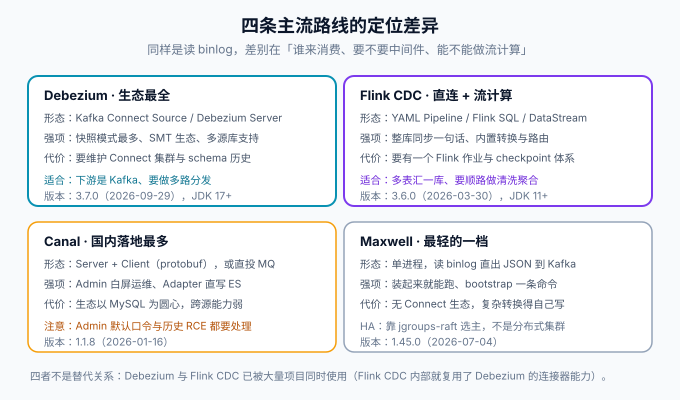

# Canal 与 Maxwell

Canal 与 Maxwell 代表 CDC 的「轻量路线」：不依赖 Kafka Connect 生态，一个进程读 binlog、把事件投给 MQ 或客户端。Canal 在国内落地最广，自带 Admin 白屏运维与 ES Adapter；Maxwell 最轻，装完就能把 MySQL 变更变成 Kafka 上的 JSON。本页讲两者的架构与取舍，并给出与 Debezium 的对照结论。



## 一、Canal：伪装从库的订阅服务

Canal 的原理与所有 CDC 工具同源：**伪装成 MySQL 的从库，向主库发送 dump 协议请求，接收并解析 binlog**。它的组件划分是理解配置的关键：

| 组件 | 职责 | 对应配置 |
| --- | --- | --- |
| canal-server（deployer） | 订阅与解析 binlog，维护 instance | `canal.properties` + `instance.properties` |
| instance | 一个库的订阅单元，独立的位点与队列 | `conf/blog/instance.properties` |
| canal-client / adapter | 消费事件：直连 TCP（protobuf）或写入 MQ | client 端自行实现，adapter 覆盖 ES / ClickHouse 等 |
| canal-admin | 白屏运维：配置、日志、实例管理 | 独立部署，端口 8089 |
| meta 管理 | 位点与 ack 记录（内存 / ZooKeeper / 文件） | `canal.zkServers` 与 instance 的 `meta` 配置 |

版本事实（2026-10 口径，按 GitHub Releases 核对）：最新正式版 **1.1.8（2026-01-16）**，适配 **MySQL 8.4 / MariaDB 11 / Percona 8.0 / PolarDB-X 2.0**，新增 ClickHouse adapter 与 Helm Chart，支持 `caching_sha2_password` 与源库 SSL。1.1.8 发布后仓库仍有安全修复（如 Canal Admin 的认证绕过），**使用 Admin 时务必不暴露公网、修改默认口令、并跟踪仓库的安全分支**。

## 二、Canal 的两条消费路径

1. **client 直连**：业务进程作为 canal-client 拉取 Entry，位点 ack 由 client 控制。适合消费者少、想自己写逻辑的场景；缺点是消费者与 server 强耦合，扩容要考虑位点归属。
2. **投递 MQ（Kafka / RocketMQ / RabbitMQ / Pulsar）**：server 直接把解析结果投到 topic，位点由 server 统一管理，消费者天然解耦。**分区策略要指定主键**，否则同一行的更新可能落到不同分区、顺序被打乱——这是 Canal + MQ 组合最高频的错误。

::: danger Canal + MQ 的顺序性必须显式配置
MQ 投递默认可能按库表哈希，这能保证「表级有序」但不能保证「行级有序」。同一行的 UPDATE 打到两个分区、被两个消费者并发处理时，旧值可能覆盖新值。判据：**投递配置里把分区按主键哈希（如 `partitionHash = .*\\..*:$pk$`）**，下游再按 key 串行消费，顺序性才闭合。
:::

## 三、Maxwell：最小可用的 JSON 流

Maxwell 的定位是「MySQL → JSON → Kafka」的单进程管道：不需要 Connect 集群，不需要自己写解析，启动即可用。

```shell
bin/maxwell --user=cdc_user --password=*** --host=mysql \
  --producer=kafka --kafka.bootstrap.servers=kafka:9092 \
  --kafka_topic=binlog-events --replication_name=blog
```

它的三个实用能力：

1. **bootstrap**：`bin/maxwell-bootstrap --config=config.properties --database=blog --table=posts` 把存量行以普通事件的形式补发一遍，**与增量走同一条输出路径**——下游不需要「导入专用逻辑」。
2. **事件结构简洁**：直接输出 `{"database":"blog","table":"posts","type":"update","data":{...},"old":{...},"ts":...}`，消费端解析成本极低。
3. **HA 靠选主**：通过 jgroups-raft 在多实例间选主，**是「单活」不是分布式集群**——吞吐上限就是单实例的解析能力。

## 四、三条路线怎么选

| 维度 | Debezium | Canal | Maxwell |
| --- | --- | --- | --- |
| 生态 | Connect SMT 生态、多源库 | 国内落地多、Adapter 直写 ES | 几乎没有生态，胜在简单 |
| 源库 | MySQL / PG / Mongo / Oracle 等 | 以 MySQL 为圆心 | MySQL（含 8.4） |
| 运维界面 | Connect REST + 第三方 UI | **Admin 白屏**（注意安全基线） | 无 |
| 事件规范 | 信封 + schema 演进完整 | 自有 Entry 协议 | 简洁 JSON |
| 增量快照 | 内置（信号表驱动） | 无（重灌靠重启 instance） | bootstrap 一条命令 |
| 维护活跃度 | 高（季度 minor） | 中（大版本间隔长） | 中低（功能稳定、改动少） |

**判据**：下游是 Kafka、未来要接更多源库或要严格的事件语义 ⇒ Debezium；团队熟悉 Canal 运维体系、只需要 MySQL → ES / MQ ⇒ Canal；最小可用、能接受自己写消费端 ⇒ Maxwell。**不要为了「先进」把一个 Maxwell 能解决的事上成 Connect 集群，也不要为了省事用 Maxwell 承接需要一个团队维护的同步体系。**

## 五、验证方式

```shell
# ① Canal：instance 日志确认订阅建立，client 收到 Entry
docker logs canal-server 2>&1 | grep -i "destination.*blog"
# 期望：出现 instance blog 的启动与 dump 成功日志

# ② Maxwell：启动后观察 Kafka topic
kafka-console-consumer.sh --bootstrap-server kafka:9092 --topic binlog-events --from-beginning
# 期望：能看到 bootstrap 输出的存量行（type=insert）与后续增量（type=update/delete）

# ③ 源库做一次真实变更并核对事件
mysql -uroot -p blog -e "UPDATE posts SET title='canal-probe' WHERE id=1;"
# 期望：①或②中出现对应的 UPDATE 事件，且 after 里 title 字段已更新
```

## 参考资料

- Canal 仓库与 Wiki：https://github.com/alibaba/canal
- Canal Admin 指南：https://github.com/alibaba/canal/wiki/CanalAdmin-Guide
- Maxwell 官网：https://maxwells-daemon.io/
- Maxwell Releases：https://github.com/zendesk/maxwell/releases
- 下一页：[Flink CDC](../FlinkCDC/index.md)
