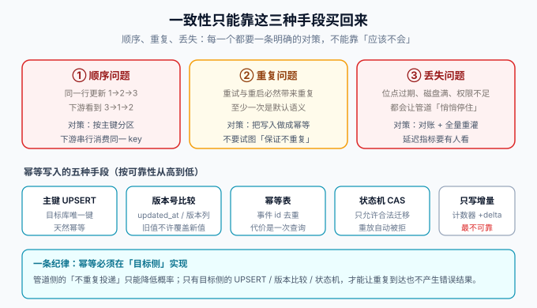

# 一致性保障

同步管道的可靠性不取决于选了哪个工具，而取决于**顺序、重复、丢失**这三个问题是否都有明确的对策。这一页把三种问题的成因、判据与对策写全——这是整个专题里最值得反复读的一页。



## 一、先把语义说清：管道是「至少一次」

binlog 订阅天然是**至少一次（at-least-once）**语义：位点在「处理完成」之后才推进，任何一次崩溃重试都会导致最近一段事件被**重新投递**。想做到「不重复投递」在工程上不可达（两阶段提交覆盖不了所有目标存储）。

**结论只有一句话：不要试图消灭重复，要把下游做成「重复到达也不出错」——这就是幂等。**

## 二、顺序问题

### 成因

- 同一行的更新 `1→2→3`，在多分区、多消费者下可能以 `3→1→2` 的顺序到达下游；
- 快照回填与增量流的衔接处（见[快照四阶段](../FlinkCDC/index.md)），回填顺序错误会让旧数据覆盖新数据。

### 对策（按层）

| 层 | 做法 | 判据 |
| --- | --- | --- |
| 投递层 | 按**主键**分区（而不是按表哈希） | 同一行的事件永远落同一分区 |
| 消费层 | 同一 key 串行消费；多线程只跨 key 并行 | 线程池按 key 路由，不是按消息路由 |
| 写入层 | **版本比较**：`updated_at` 或版本号新的事件才允许覆盖 | 旧事件晚到，写入被拒（affected rows = 0） |
| 校验层 | 对账抽样：同一行比对源库与下游 | 抽样不一致即触发修复 |

::: danger 最常见的翻车点：按表分区而不是按主键分区
按表分区的分区数 = 表数，热点表（如 `posts`）写入集中在一个分区，顺序有保障但吞吐上不去；把并行度调高后，同一行的事件就乱了。**正确的做法是按主键哈希分区**——Canal 的 `partitionHash` 配置、Debezium 的默认主键路由、Flink CDC 的 keyBy 主键，本质都是这一条。
:::

## 三、重复问题：幂等的五种手段

| 手段 | 做法 | 可靠性 | 代价 |
| --- | --- | --- | --- |
| 主键 UPSERT | 目标库对同一主键覆盖写（`INSERT ... ON DUPLICATE KEY UPDATE` / ES 按 `_id` 索引） | 高（天然幂等） | 要求目标有唯一键 |
| 版本比较 | 只接受「更新时间/版本号 ≥ 当前」的写入 | 高 | 需要源表有可信的版本列 |
| 幂等表 | 记录已处理的事件唯一 id，处理前查重 | 高 | 每条事件多一次查询与一次写入 |
| 状态机 CAS | 目标状态只允许合法迁移，重复事件迁移失败被忽略 | 高（适合状态型数据） | 建模成本 |
| 增量累加 | 计数器 `+delta` | **低（重复即多加）** | 仅可用于可重算的派生数据 |

前四种的公共特征是**幂等实现在目标侧**——管道侧的重试、去重都只能降低概率，只有目标侧的写法能保证「重复到达也不产生错误结果」。第五种只适合「下游随时可以全量重算」的场景。

## 四、丢失问题

丢失的三个入口与对策：

1. **位点过期**（binlog 被清理）：唯一出路是全量重灌。对策：延长 `binlog_expire_logs_seconds`、增加**位点老化告警**（位点距今超过保留期的 50% 即预警）。
2. **下游写失败但位点已推进**：手滑「先提交位点后写库」会造成静默丢失。对策：**先写下游、成功后提交位点**；宁可重复，不可丢失（重复有幂等兜底，丢失没有）。
3. **管道停了没人发现**：CDC 不会因为「没有变更」报错，「没数据」与「停了」在外部看一样。对策：**同步延迟指标 + 延迟阈值告警**（详见[生产运维](../Ops/index.md)）。

## 五、对账与修复：最后的兜底

幂等与监控把「经常不一致」变成「偶尔不一致」，对账把「偶尔不一致」变成「可发现、可修复」。

| 校验 | 做法 | 频率 | 成本 |
| --- | --- | --- | --- |
| 行数对账 | `SELECT COUNT(*)` 两侧比对（带相同过滤条件） | 每小时/每天 | 低 |
| 校验和对账 | 按主键排序对关键列做哈希聚合，比对摘要值 | 每天 | 中 |
| 抽样对账 | 随机抽 N 行逐字段比对 | 每天 | 低 |
| 定向对账 | 对「发生过故障的时间窗」内的行全量比对 | 事件驱动 | 中 |

修复的两条路，**按代价从小到大**：

1. **单行修复**：从源库读该行，幂等写回下游（走正常消费路径的 UPSERT，不要绕过）。
2. **全量重灌**：清空下游（或写入新索引/新表）→ 重置位点 → 重新快照。**前提是下游允许清空重建**——这个前提要在选型阶段就确认（见[概述](../Overview/index.md)的三个问题）。

::: tip 对账脚本必须是「幂等写回」，不是「直接 UPDATE」
对账发现不一致后，正确动作是「从源库读出该行 → 走与消费相同的幂等写入路径」。如果对账脚本直接 UPDATE 下游，就绕过了幂等与版本比较，等于在管道之外开了第二写入入口——这类「旁路写入」是很多不一致问题的根源。
:::

## 六、验证方式

把三条纪律各变成一个可执行断言：

```shell
# ① 幂等：同一条事件手工重放两次，下游终态不变
#    （从 MQ 重发同一条消息，或把位点回拨一条）
# 期望：目标行内容不变， affected rows = 0（UPSERT 未生效或被版本比较拒绝）

# ② 顺序：把位点点位回拨到 1 小时前，重放历史
# 期望：重放结束后，下游与源库的数据一致（旧事件没有覆盖新值）

# ③ 对账：行数与抽样比对
# 期望：COUNT 差值 = 0；抽样 100 行逐字段一致
```

三项全绿，管道才敢挂到生产流量上。

## 参考资料

- Debezium · 至少一次与幂等消费：https://debezium.io/documentation/reference/stable/development/engine.html
- Kafka · Consumer 位点与提交语义：https://kafka.apache.org/documentation/#semantics
- 本专题：[生产运维](../Ops/index.md)、[实战](../Practice/index.md)
